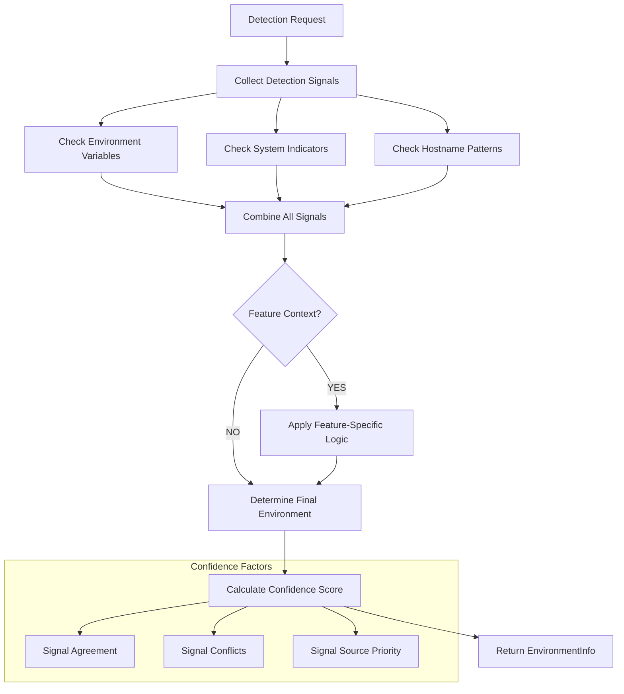

# Core Environment Detection Service

This directory provides a comprehensive environment detection infrastructure for FastAPI applications, implementing centralized environment classification with confidence scoring, feature-aware detection, and multi-source signal collection. The environment detection service serves as the foundation for environment-aware configuration across all backend infrastructure services.

## Directory Structure

```
environment/
├── __init__.py                     # Module exports and convenience functions
├── enums.py                        # Environment and FeatureContext enumerations
├── models.py                       # Data models (EnvironmentInfo, EnvironmentSignal, DetectionConfig)
├── detector.py                     # Core EnvironmentDetector class
├── patterns.py                     # Signal collection and pattern matching
├── feature_contexts.py             # Feature-specific detection logic
├── api.py                          # Global detector instance and convenience functions
└── README.md                       # This documentation file
```

## Core Architecture

### Unified Detection System

The environment detection service follows a **centralized detection architecture** with multi-source signal collection:

1. **Signal Collection Layer**: Gathers environment signals from variables, patterns, and system indicators
2. **Confidence Scoring Layer**: Applies weighted confidence scoring with conflict resolution
3. **Feature Context Layer**: Enables feature-aware detection with specialized logic
4. **API Layer**: Provides convenient access patterns for infrastructure services

### Detection Flow



## Core Components Comparison

### Environment Classifications (`enums.py`)

**Purpose:** Standard environment classifications with string enum behavior for consistent configuration across infrastructure services.

**Key Features:**
- ✅ **String Enum Behavior**: Compatible with configuration systems and string operations
- ✅ **Standard Classifications**: DEVELOPMENT, TESTING, STAGING, PRODUCTION, UNKNOWN
- ✅ **Configuration Integration**: Works seamlessly with environment variables and config files
- ✅ **Comparison Support**: Direct comparison and hashing for configuration logic

**Available Environments:**
```python
class Environment(str, Enum):
    DEVELOPMENT = "development"    # Local development and testing environments
    TESTING = "testing"           # Automated testing and CI environments
    STAGING = "staging"           # Pre-production integration testing environments
    PRODUCTION = "production"     # Live production environments serving real users
    UNKNOWN = "unknown"           # Fallback when environment cannot be determined
```

**Usage Examples:**
```python
# String-like behavior for configuration
env = Environment.PRODUCTION
assert env.value == "production"
assert str(env) == "production"

# Comparison in configuration logic
if env == Environment.PRODUCTION:
    use_redis_cache = True
```

**Best For:**
- Infrastructure service configuration decisions
- Cache preset selection and resilience strategy choice
- Security policy determination and monitoring configuration
- Environment-aware feature flag management

### Feature Contexts (`enums.py`)

**Purpose:** Feature-specific detection contexts that enable specialized environment detection based on infrastructure requirements.

**Key Features:**
- ✅ **Context-Aware Detection**: Specialized logic for AI, security, cache, and resilience needs
- ✅ **Environment Overrides**: May override standard detection based on feature requirements
- ✅ **Metadata Generation**: Provides feature-specific configuration hints
- ✅ **String Enum Behavior**: Consistent with Environment enum for configuration

**Available Contexts:**
```python
class FeatureContext(str, Enum):
    AI_ENABLED = "ai_enabled"                    # AI-powered features requiring model access
    SECURITY_ENFORCEMENT = "security_enforcement" # Security-critical features with stricter requirements
    CACHE_OPTIMIZATION = "cache_optimization"    # Cache-intensive operations with performance tuning
    RESILIENCE_STRATEGY = "resilience_strategy"  # Resilience pattern selection and configuration
    DEFAULT = "default"                          # Standard environment detection without feature context
```

**Context Behavior:**
- **AI_ENABLED**: Checks `ENABLE_AI_CACHE`, may add `ai-` prefix metadata
- **SECURITY_ENFORCEMENT**: May override to production if `ENFORCE_AUTH=true`
- **CACHE_OPTIMIZATION**: Optimizes detection for cache performance tuning
- **RESILIENCE_STRATEGY**: Tailors detection for resilience pattern selection
- **DEFAULT**: Standard detection without feature-specific overrides

**Best For:**
- Infrastructure services requiring specialized detection logic
- Feature-specific configuration optimization
- Security contexts that may need stricter environment requirements
- AI services that need cache prefix optimization

### EnvironmentInfo Model (`models.py`)

**Purpose:** Comprehensive detection results with confidence scoring, reasoning, and supporting evidence.

**Key Features:**
- ✅ **Confidence Scoring**: 0.0-1.0 confidence levels for reliable decision making
- ✅ **Human Reasoning**: Clear explanations of detection decisions for debugging
- ✅ **Signal Evidence**: Complete collection of all detection signals
- ✅ **Feature Metadata**: Context-specific configuration hints and overrides
- ✅ **String Representation**: Human-readable output for logging and monitoring

**Data Structure:**
```python
@dataclass
class EnvironmentInfo:
    environment: Environment              # Final determined environment classification
    confidence: float                    # Overall confidence score (0.0-1.0) for the detection
    reasoning: str                       # Human-readable explanation of the detection decision
    detected_by: str                     # Primary detection mechanism that determined the environment
    feature_context: FeatureContext      # Feature-specific context used in detection
    additional_signals: List[EnvironmentSignal]  # All environment signals collected during detection
    metadata: Dict[str, Any]             # Feature-specific metadata and configuration hints
```

**Usage Examples:**
```python
# Basic environment checking
env_info = detector.detect_environment()
if env_info.environment == Environment.PRODUCTION and env_info.confidence > 0.8:
    enable_production_features()

# Feature-aware detection
ai_env = detector.detect_with_context(FeatureContext.AI_ENABLED)
if 'ai_prefix' in ai_env.metadata:
    cache_key_prefix = ai_env.metadata['ai_prefix']

# Debugging detection issues
print(f"Environment: {env_info}")
print(f"Reasoning: {env_info.reasoning}")
for signal in env_info.additional_signals:
    print(f"  - {signal.source}: {signal.reasoning}")
```

**Best For:**
- Infrastructure service configuration decisions
- Debugging environment detection issues
- Audit logging and compliance requirements
- Feature-specific configuration optimization

### EnvironmentSignal Model (`models.py`)

**Purpose:** Individual detection evidence with NamedTuple structure for performance and clarity.

**Key Features:**
- ✅ **NamedTuple Performance**: Optimized for high-frequency signal collection
- ✅ **Confidence Scoring**: Individual confidence levels for weighted decision making
- ✅ **Source Tracking**: Clear identification of detection mechanisms
- ✅ **Human Reasoning**: Explanations for debugging and monitoring

**Signal Structure:**
```python
class EnvironmentSignal(NamedTuple):
    source: str                          # Detection mechanism (e.g., "env_var", "hostname_pattern")
    value: str                           # Raw value that triggered detection (e.g., "production")
    environment: Environment             # Environment classification this signal indicates
    confidence: float                    # Confidence score from 0.0-1.0 for this detection
    reasoning: str                       # Human-readable explanation of detection logic
```

**Signal Sources and Confidence Levels:**
- **Environment Variables**: 0.85-0.95 confidence (highest priority)
- **System Indicators**: 0.70-0.75 confidence (moderate priority)
- **Hostname Patterns**: 0.60-0.70 confidence (lower priority)

**Example Signal:**
```python
signal = EnvironmentSignal(
    source="ENVIRONMENT",
    value="production",
    environment=Environment.PRODUCTION,
    confidence=0.95,
    reasoning="Explicit environment from ENVIRONMENT=production"
)
```

**Best For:**
- Detailed debugging of detection decisions
- Custom confidence scoring algorithms
- Signal source analysis and optimization
- Compliance auditing and troubleshooting

### EnvironmentDetector Class (`detector.py`)

**Purpose:** Core detection engine with thread-safe operation, signal caching, and feature-aware detection.

**Key Features:**
- ✅ **Thread-Safe Operation**: Safe for concurrent access across infrastructure services
- ✅ **Signal Caching**: Performance optimization with cached detection results
- ✅ **Feature-Aware Detection**: Specialized logic for different infrastructure needs
- ✅ **Confidence Scoring**: Weighted decision making with conflict resolution
- ✅ **Comprehensive API**: Multiple detection methods for different use cases

**Public Methods:**
```python
class EnvironmentDetector:
    def __init__(self, config: Optional[DetectionConfig] = None):
        """Initialize detector with optional custom configuration."""

    def detect_environment(self, feature_context: FeatureContext = FeatureContext.DEFAULT) -> EnvironmentInfo:
        """Primary detection method with optional feature context."""

    def detect_with_context(self, feature_context: FeatureContext) -> EnvironmentInfo:
        """Feature-aware detection with specialized logic."""

    def get_environment_summary(self) -> Dict[str, Any]:
        """Comprehensive detection summary for debugging and monitoring."""
```

**State Management:**
- **Signal Cache**: Optimized performance for repeated detection calls
- **Immutable Configuration**: Thread-safe configuration after initialization
- **Global Instance**: Shared detector for consistent results across services

**Behavior Characteristics:**
- **Fallback Detection**: Returns DEVELOPMENT when no signals found
- **Conflict Resolution**: Uses confidence scoring to resolve conflicting signals
- **Feature Overrides**: Applies context-specific environment overrides
- **Debugging Support**: Comprehensive logging and signal analysis

**Best For:**
- Infrastructure services requiring reliable environment detection
- Applications needing feature-aware configuration
- Systems with custom deployment patterns
- Debugging complex environment configuration issues

### DetectionConfig Model (`models.py`)

**Purpose:** Customizable detection configuration for specialized deployment scenarios and pattern matching.

**Key Features:**
- ✅ **Pattern Customization**: Configurable regex patterns for hostname matching
- ✅ **Environment Variable Priority**: Custom precedence order for env var detection
- ✅ **Feature Context Configuration**: Context-specific detection rules
- ✅ **System Indicator Customization**: Configurable development and production indicators

**Configuration Options:**
```python
@dataclass
class DetectionConfig:
    env_var_precedence: List[str]           # Environment variables in priority order
    development_patterns: List[str]         # Regex patterns for development environments
    staging_patterns: List[str]             # Regex patterns for staging environments
    production_patterns: List[str]          # Regex patterns for production environments
    development_indicators: List[str]       # System indicators suggesting development
    production_indicators: List[str]        # System indicators suggesting production
    feature_contexts: Dict[FeatureContext, Dict[str, Any]]  # Feature-specific configurations
```

**Default Configuration:**
```python
DEFAULT_ENV_VAR_PRECEDENCE = [
    'ENVIRONMENT',          # 0.95 confidence
    'NODE_ENV',            # 0.85 confidence
    'FLASK_ENV',           # 0.85 confidence
    'APP_ENV',             # 0.85 confidence
    'ENV',                 # 0.85 confidence
    'DEPLOYMENT_ENV',      # 0.85 confidence
    'DJANGO_SETTINGS_MODULE', # 0.85 confidence
    'RAILS_ENV'            # 0.85 confidence
]

DEFAULT_PATTERNS = {
    'development': [r'.*dev.*', r'.*local.*', r'.*test.*'],
    'staging': [r'.*stag.*', r'.*pre-?prod.*', r'.*uat.*'],
    'production': [r'.*prod.*', r'.*live.*', r'.*release.*']
}
```

**Custom Configuration Example:**
```python
config = DetectionConfig(
    env_var_precedence=['CUSTOM_ENV', 'ENVIRONMENT'],
    production_patterns=[r'.*live.*', r'.*prod.*'],
    feature_contexts={
        FeatureContext.SECURITY_ENFORCEMENT: {
            'environment_var': 'FORCE_SECURE_MODE',
            'production_override': True
        }
    }
)
```

**Best For:**
- Organizations with custom deployment naming conventions
- Applications requiring specialized detection logic
- Multi-tenant environments with unique patterns
- Compliance requirements with specific environment identification

### Global API (`api.py`)

**Purpose:** Module-level convenience functions and global detector instance for easy access without instance management.

**Key Features:**
- ✅ **Global Detector Instance**: Shared detector for consistent results across the application
- ✅ **Convenience Functions**: Simple functions for common detection tasks
- ✅ **Feature Context Support**: All functions support feature-aware detection
- ✅ **Thread Safety**: Safe for concurrent access across services

**Convenience Functions:**
```python
def get_environment_info(feature_context: FeatureContext = FeatureContext.DEFAULT) -> EnvironmentInfo:
    """Get comprehensive environment detection using global detector."""

def is_production_environment(feature_context: FeatureContext = FeatureContext.DEFAULT) -> bool:
    """Check if running in production with confidence > 0.60."""

def is_development_environment(feature_context: FeatureContext = FeatureContext.DEFAULT) -> bool:
    """Check if running in development with confidence > 0.60."""
```

**Confidence Thresholds:**
- **Production Check**: Requires confidence > 0.60 for reliable production detection
- **Development Check**: Requires confidence > 0.60 for reliable development detection
- **Balanced Approach**: Thresholds balance reliability with sensitivity

**Usage Examples:**
```python
# Basic environment detection
env_info = get_environment_info()
if env_info.environment == Environment.PRODUCTION:
    configure_production_logging()

# Feature-aware detection
if is_production_environment(FeatureContext.SECURITY_ENFORCEMENT):
    enforce_authentication_requirements()

# Quick development check
if is_development_environment():
    enable_debug_logging()
```

**Best For:**
- Quick environment checks without detector instance management
- Applications using dependency injection with global state
- Simple integration with existing codebases
- Development and debugging scenarios

## Quick Start Guide

### Basic Usage

```python
from app.core.environment import get_environment_info, is_production_environment, FeatureContext

# Quick production check
if is_production_environment():
    configure_production_logging()
    enable_performance_monitoring()

# Detailed environment information
env_info = get_environment_info()
print(f"Environment: {env_info.environment} (confidence: {env_info.confidence})")
print(f"Reasoning: {env_info.reasoning}")
```

### Feature-Aware Detection

```python
from app.core.environment import get_environment_info, FeatureContext

# AI context for cache optimization
ai_env = get_environment_info(FeatureContext.AI_ENABLED)
if ai_env.metadata.get('ai_prefix'):
    cache_prefix = ai_env.metadata['ai_prefix']
    cache_key = f"{cache_prefix}summarize:{text_hash}"

# Security context may override to production
security_env = get_environment_info(FeatureContext.SECURITY_ENFORCEMENT)
if security_env.environment == Environment.PRODUCTION:
    enforce_authentication_requirements()
```

### Infrastructure Service Integration

```python
from app.core.environment import EnvironmentDetector, get_environment_info

# Custom detector for specialized deployment
detector = EnvironmentDetector()
env_info = detector.detect_environment()

# Integration with infrastructure services
cache_preset = cache_manager.recommend_preset(env_info.environment)
resilience_preset = resilience_manager.recommend_preset(env_info.environment)
auth_config = security_auth.configure_for_environment(env_info)

# Debugging detection issues
summary = detector.get_environment_summary()
for signal in summary['all_signals']:
    print(f"  - {signal['source']}: {signal['reasoning']}")
```

## Configuration Management

### Environment Variables

Set up environment variables for highest confidence detection:

```bash
# Primary environment variable (highest confidence)
export ENVIRONMENT=production

# Secondary environment variables (high confidence)
export NODE_ENV=production
export FLASK_ENV=production
export APP_ENV=production

# Feature-specific configuration
export ENABLE_AI_CACHE=true      # AI context metadata
export ENFORCE_AUTH=true         # Security context override
```

### Custom Detection Configuration

```python
from app.core.environment import DetectionConfig, EnvironmentDetector

# Custom configuration for specialized deployment
config = DetectionConfig(
    env_var_precedence=['CUSTOM_ENV', 'ENVIRONMENT'],
    production_patterns=[r'.*live.*', r'.*prod.*', r'.*release.*'],
    development_patterns=[r'.*local.*', r'.*dev-.*', r'.*sandbox.*'],
    feature_contexts={
        FeatureContext.SECURITY_ENFORCEMENT: {
            'environment_var': 'FORCE_SECURE_MODE',
            'production_override': True
        }
    }
)

detector = EnvironmentDetector(config)
env_info = detector.detect_environment()
```

## Integration Patterns

### Infrastructure Service Integration

```python
# Cache Infrastructure Integration
def get_cache_config():
    env_info = get_environment_info(FeatureContext.CACHE_OPTIMIZATION)

    if env_info.environment == Environment.PRODUCTION:
        return ProductionCacheConfig()
    elif env_info.environment == Environment.DEVELOPMENT:
        return DevelopmentCacheConfig()
    else:
        return DefaultCacheConfig()

# Resilience Infrastructure Integration
def get_resilience_strategy():
    env_info = get_environment_info(FeatureContext.RESILIENCE_STRATEGY)

    strategies = {
        Environment.DEVELOPMENT: 'aggressive',  # Fast fail for development
        Environment.TESTING: 'balanced',        # Moderate resilience for testing
        Environment.PRODUCTION: 'conservative'  # High reliability for production
    }

    return strategies.get(env_info.environment, 'balanced')

# Security Infrastructure Integration
def configure_auth_mode():
    env_info = get_environment_info(FeatureContext.SECURITY_ENFORCEMENT)

    # Security enforcement may override to production
    if env_info.environment == Environment.PRODUCTION or env_info.metadata.get('enforce_auth_enabled'):
        return AuthMode.PRODUCTION
    elif env_info.environment == Environment.DEVELOPMENT:
        return AuthMode.DEVELOPMENT
    else:
        return AuthMode.SIMPLE
```

### Application Configuration

```python
# Configuration management based on environment
class AppConfig:
    def __init__(self):
        env_info = get_environment_info()

        # Database configuration
        if env_info.environment == Environment.PRODUCTION:
            self.database_url = os.getenv('PROD_DATABASE_URL')
            self.pool_size = 20
        elif env_info.environment == Environment.DEVELOPMENT:
            self.database_url = os.getenv('DEV_DATABASE_URL')
            self.pool_size = 5
        else:
            self.database_url = "sqlite:///app.db"
            self.pool_size = 1

        # Logging configuration
        if env_info.environment == Environment.PRODUCTION:
            self.log_level = "INFO"
            self.log_format = "json"
        else:
            self.log_level = "DEBUG"
            self.log_format = "detailed"
```

## Performance Characteristics

### Detection Performance

| Operation | Typical Performance | Memory Impact | Key Optimizations |
|-----------|-------------------|--------------|-------------------|
| **Basic Detection** | < 2ms | < 50KB | Signal caching, optimized regex |
| **Feature-Aware Detection** | < 3ms | < 100KB | Context-specific caching |
| **Custom Configuration** | < 5ms | < 200KB | Pattern pre-compilation |
| **Environment Summary** | < 10ms | < 500KB | Signal collection and formatting |

### Scalability Characteristics

#### Concurrent Request Handling
- **Thread Safety**: All detection operations are thread-safe
- **Signal Caching**: Shared cache reduces redundant operations
- **Immutable Configuration**: No configuration mutation after initialization
- **Memory Efficiency**: Minimal memory footprint with garbage collection

#### Performance Optimization
1. **Signal Caching**: Cached detection results for repeated operations
2. **Pattern Pre-compilation**: Regex patterns compiled at initialization
3. **Efficient Signal Collection**: Optimized environment variable access
4. **Minimal Object Creation**: Reuse objects where possible

### Resource Management

#### Memory Usage
- **Base Detector**: ~1MB including configuration and cache
- **Signal Cache**: ~100KB for typical deployment scenarios
- **Custom Configuration**: Additional memory for complex patterns
- **Feature Contexts**: Minimal overhead per context

#### CPU Usage
- **Detection Operations**: < 1% CPU utilization under normal load
- **Pattern Matching**: Optimized regex for hostname patterns
- **Signal Processing**: Efficient string operations and comparisons
- **Cache Operations**: O(1) cache access for repeated detections

## Security Considerations

### Environment Detection Security

The environment detection service implements several security measures:

#### Input Validation
- **Pattern Validation**: All regex patterns validated during initialization
- **Environment Variable Sanitization**: Safe handling of environment variable values
- **Signal Source Verification**: Trusted sources for environment signals

#### Information Disclosure Prevention
- **No Secret Logging**: Environment variables with sensitive values are filtered
- **Sanitized Error Messages**: Error responses don't expose system information
- **Debug Information Control**: Detailed debug information only in development contexts

#### Secure Configuration
- **Default Secure Patterns**: Production patterns require explicit configuration
- **Validation Required**: Invalid patterns prevent detector initialization
- **Override Protection**: Feature context overrides are explicitly configured

### Security Best Practices

```bash
# Use explicit environment variables
export ENVIRONMENT=production
export NODE_ENV=production

# Feature-specific security configuration
export ENFORCE_AUTH=true         # Enable security enforcement
export ENABLE_AI_CACHE=true      # Control AI features

# Avoid sensitive information in hostnames
# Use environment variables instead of hostname-based detection
```

### Threat Mitigation

| Threat | Mitigation | Detection Component |
|--------|------------|-------------------|
| **Environment Spoofing** | Multiple signal sources, confidence scoring | Signal Collection |
| **Configuration Injection** | Input validation, pattern validation | DetectionConfig |
| **Information Disclosure** | Sanitized logging, secure defaults | All Components |
| **Unauthorized Access** | Feature context overrides, security enforcement | Feature Contexts |

## Monitoring & Observability

### Detection Monitoring

The environment detection service provides comprehensive monitoring capabilities:

```python
# Get comprehensive detection summary
summary = detector.get_environment_summary()

print(f"Environment: {summary['detected_environment']}")
print(f"Confidence: {summary['confidence']:.2f}")
print(f"Reasoning: {summary['reasoning']}")
print(f"Primary Source: {summary['detected_by']}")

# Analyze all detection signals
print("\nDetection Signals:")
for signal in summary['all_signals']:
    print(f"  - {signal['source']}: {signal['environment']} ({signal['confidence']:.2f})")
    print(f"    Reasoning: {signal['reasoning']}")
```

### Performance Monitoring

```python
# Monitor detection performance
import time

start_time = time.time()
env_info = get_environment_info()
detection_time = time.time() - start_time

print(f"Detection time: {detection_time*1000:.2f}ms")
print(f"Confidence: {env_info.confidence:.2f}")
print(f"Signal count: {len(env_info.additional_signals)}")
```

### Debugging Support

```python
def debug_environment_detection():
    """Debug low confidence or unexpected detection results."""
    env_info = get_environment_info()

    if env_info.confidence < 0.7:
        logger.warning(f"Low confidence environment detection")
        logger.info(f"Environment: {env_info.environment}")
        logger.info(f"Confidence: {env_info.confidence:.2f}")
        logger.info(f"Reasoning: {env_info.reasoning}")

        # Log all detection signals for analysis
        for signal in env_info.additional_signals:
            logger.info(f"Signal - {signal.source}: {signal.environment.value} "
                       f"({signal.confidence:.2f}) - {signal.reasoning}")

    # Check for conflicting signals
    environments = [s.environment for s in env_info.additional_signals]
    if len(set(environments)) > 1:
        logger.warning(f"Conflicting environment signals detected: {environments}")
```

### Health Check Integration

```python
# Health check for environment detection service
def environment_detection_health():
    """Health check for environment detection service."""
    try:
        detector = EnvironmentDetector()
        env_info = detector.detect_environment()

        return {
            "status": "healthy",
            "environment": env_info.environment.value,
            "confidence": env_info.confidence,
            "signal_count": len(env_info.additional_signals)
        }
    except Exception as e:
        return {
            "status": "unhealthy",
            "error": str(e)
        }
```

## Testing & Validation

### Unit Testing

```python
import pytest
from app.core.environment import EnvironmentDetector, DetectionConfig, FeatureContext

def test_basic_environment_detection():
    """Test basic environment detection functionality."""
    detector = EnvironmentDetector()
    env_info = detector.detect_environment()

    assert env_info.environment in Environment
    assert 0.0 <= env_info.confidence <= 1.0
    assert env_info.reasoning
    assert env_info.detected_by

def test_feature_aware_detection():
    """Test feature-aware environment detection."""
    detector = EnvironmentDetector()

    # Test AI context
    ai_env = detector.detect_with_context(FeatureContext.AI_ENABLED)
    assert ai_env.feature_context == FeatureContext.AI_ENABLED

    # Test security context
    security_env = detector.detect_with_context(FeatureContext.SECURITY_ENFORCEMENT)
    assert security_env.feature_context == FeatureContext.SECURITY_ENFORCEMENT

def test_custom_configuration():
    """Test custom detection configuration."""
    config = DetectionConfig(
        env_var_precedence=['CUSTOM_ENV', 'ENVIRONMENT'],
        production_patterns=[r'.*live.*', r'.*prod.*']
    )

    detector = EnvironmentDetector(config)
    env_info = detector.detect_environment()

    assert detector.config == config
    assert env_info.environment in Environment
```

### Integration Testing

```python
def test_infrastructure_service_integration():
    """Test integration with infrastructure services."""
    from app.core.environment import get_environment_info, FeatureContext

    # Cache integration
    cache_env = get_environment_info(FeatureContext.CACHE_OPTIMIZATION)
    cache_config = get_cache_config_for_environment(cache_env.environment)
    assert cache_config is not None

    # Security integration
    security_env = get_environment_info(FeatureContext.SECURITY_ENFORCEMENT)
    auth_config = get_auth_config_for_environment(security_env)
    assert auth_config is not None

    # Resilience integration
    resilience_env = get_environment_info(FeatureContext.RESILIENCE_STRATEGY)
    resilience_config = get_resilience_config_for_environment(resilience_env)
    assert resilience_config is not None

def test_environment_override_functionality():
    """Test environment override functionality with feature contexts."""
    import os

    # Set security enforcement override
    os.environ['ENFORCE_AUTH'] = 'true'

    try:
        security_env = get_environment_info(FeatureContext.SECURITY_ENFORCEMENT)
        # Security context may override to production
        assert security_env.environment in [Environment.PRODUCTION, security_env.environment]

    finally:
        os.environ.pop('ENFORCE_AUTH', None)
```

### Performance Testing

```python
def test_detection_performance():
    """Test detection performance under load."""
    import time
    import concurrent.futures

    detector = EnvironmentDetector()

    def detect_environment():
        start_time = time.time()
        env_info = detector.detect_environment()
        return time.time() - start_time

    # Test concurrent detection
    with concurrent.futures.ThreadPoolExecutor(max_workers=10) as executor:
        futures = [executor.submit(detect_environment) for _ in range(100)]
        times = [future.result() for future in concurrent.futures.as_completed(futures)]

    # Verify performance requirements
    avg_time = sum(times) / len(times)
    max_time = max(times)

    assert avg_time < 0.01, f"Average detection time {avg_time:.3f}s exceeds threshold"
    assert max_time < 0.05, f"Maximum detection time {max_time:.3f}s exceeds threshold"
```

## Troubleshooting & Common Issues

### Common Detection Issues

#### Issue: Low Confidence Detection
**Symptoms:** Environment detected with low confidence (< 0.7)
**Diagnosis:**
```python
env_info = get_environment_info()
if env_info.confidence < 0.7:
    print(f"Low confidence: {env_info.confidence:.2f}")
    print(f"Reasoning: {env_info.reasoning}")
    for signal in env_info.additional_signals:
        print(f"  Signal: {signal.source} -> {signal.environment} ({signal.confidence:.2f})")
```
**Solutions:**
- Set explicit environment variable: `export ENVIRONMENT=production`
- Check for conflicting environment variables
- Verify hostname patterns match deployment environment

#### Issue: Conflicting Environment Signals
**Symptoms:** Different signals indicating different environments
**Diagnosis:**
```python
env_info = get_environment_info()
environments = [s.environment for s in env_info.additional_signals]
if len(set(environments)) > 1:
    print(f"Conflicting signals: {environments}")
```
**Solutions:**
- Use highest precedence environment variable (`ENVIRONMENT`)
- Remove conflicting environment variables
- Use custom configuration to resolve conflicts

#### Issue: Feature Context Not Working
**Symptoms:** Feature-specific detection not applying expected logic
**Diagnosis:**
```python
# Check feature context is being applied
env_info = get_environment_info(FeatureContext.AI_ENABLED)
print(f"Feature context: {env_info.feature_context}")
print(f"Metadata: {env_info.metadata}")
```
**Solutions:**
- Verify feature-specific environment variables are set
- Check feature context configuration in custom configs
- Ensure feature context logic matches expectations

### Debugging Tools

#### Environment Detection Summary
```python
def get_detailed_environment_summary():
    """Get detailed environment detection summary for debugging."""
    detector = EnvironmentDetector()
    summary = detector.get_environment_summary()

    print("=== Environment Detection Summary ===")
    print(f"Environment: {summary['detected_environment']}")
    print(f"Confidence: {summary['confidence']:.2f}")
    print(f"Reasoning: {summary['reasoning']}")
    print(f"Primary Source: {summary['detected_by']}")

    print("\n=== Detection Signals ===")
    for signal in summary['all_signals']:
        print(f"Source: {signal['source']}")
        print(f"  Value: {signal['value']}")
        print(f"  Environment: {signal['environment']}")
        print(f"  Confidence: {signal['confidence']:.2f}")
        print(f"  Reasoning: {signal['reasoning']}")
        print()

    print("=== Metadata ===")
    for key, value in summary.get('metadata', {}).items():
        print(f"{key}: {value}")

# Usage
get_detailed_environment_summary()
```

#### Signal Analysis
```python
def analyze_detection_signals():
    """Analyze detection signals for optimization."""
    detector = EnvironmentDetector()
    env_info = detector.detect_environment()

    # Group signals by environment
    signals_by_env = {}
    for signal in env_info.additional_signals:
        env = signal.environment
        if env not in signals_by_env:
            signals_by_env[env] = []
        signals_by_env[env].append(signal)

    print("=== Signal Analysis ===")
    for env, signals in signals_by_env.items():
        avg_confidence = sum(s.confidence for s in signals) / len(signals)
        print(f"{env.value}: {len(signals)} signals, avg confidence: {avg_confidence:.2f}")

        for signal in signals:
            print(f"  - {signal.source}: {signal.confidence:.2f}")

# Usage
analyze_detection_signals()
```

## Migration & Compatibility

### Migration from Manual Environment Detection

#### Legacy Approach
```python
# Old manual environment detection
import os
def is_production():
    return os.getenv('ENVIRONMENT') == 'production' or os.getenv('NODE_ENV') == 'production'
```

#### New Approach
```python
# New unified environment detection
from app.core.environment import is_production_environment

if is_production_environment():
    configure_production_features()
```

### Migration Benefits

1. **Confidence Scoring**: Reliable detection with confidence levels
2. **Multiple Sources**: Redundant detection from environment variables, patterns, and indicators
3. **Feature Awareness**: Specialized detection for different infrastructure needs
4. **Debugging Support**: Comprehensive logging and signal analysis
5. **Thread Safety**: Safe for concurrent access across services

### Backward Compatibility

The environment detection service maintains backward compatibility:

```python
# Existing environment variables continue to work
export ENVIRONMENT=production
export NODE_ENV=production

# String-like enum behavior for compatibility
env = Environment.PRODUCTION
assert str(env) == "production"  # Compatible with string-based code
```

## Best Practices

### Detection Configuration Best Practices

1. **Use Standard Environment Variables**: Prefer `ENVIRONMENT` for highest confidence
2. **Set Multiple Indicators**: Use environment variables, hostname patterns, and system indicators
3. **Configure Feature Contexts**: Use appropriate feature contexts for specialized detection
4. **Validate Custom Patterns**: Ensure regex patterns are well-formed and specific
5. **Monitor Confidence Levels**: Alert on low confidence detections

### Integration Best Practices

1. **Use Convenience Functions**: Prefer `is_production_environment()` for simple checks
2. **Check Confidence Thresholds**: Validate confidence for critical decisions
3. **Leverage Feature Metadata**: Use feature-specific metadata for configuration hints
4. **Implement Fallback Logic**: Handle UNKNOWN environment gracefully
5. **Log Detection Decisions**: Include environment detection in audit logs

### Performance Best Practices

1. **Cache Detector Instances**: Reuse detector instances for performance
2. **Use Global API**: Leverage global detector for simple use cases
3. **Avoid Excessive Summaries**: Use `get_environment_summary()` only for debugging
4. **Configure Custom Patterns**: Pre-compile patterns for better performance
5. **Monitor Detection Time**: Alert on slow detection operations

### Security Best Practices

1. **Set Explicit Environment**: Use environment variables rather than relying on patterns
2. **Secure Feature Overrides**: Use feature contexts for security-critical detection
3. **Validate Configuration**: Validate custom patterns and configurations
4. **Monitor Detection Anomalies**: Alert on unexpected environment changes
5. **Sanitize Logging**: Avoid logging sensitive environment variable values

---

This environment detection service provides a production-ready, comprehensive solution for centralized environment detection across all backend infrastructure services. It combines industry-standard patterns with confidence scoring, feature-aware detection, and extensive customization options to ensure reliable, scalable, and maintainable environment-aware configuration management.