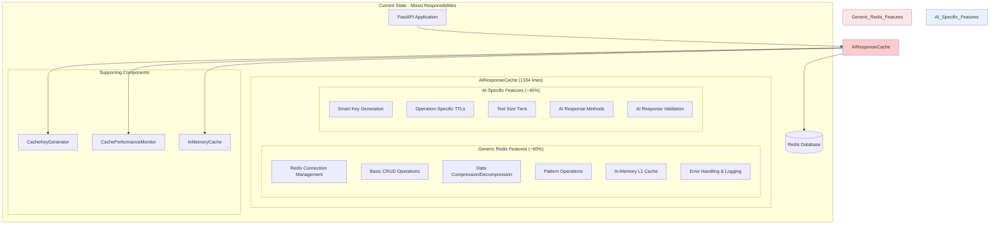
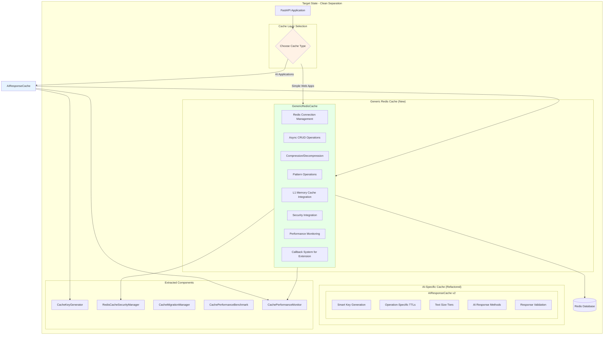
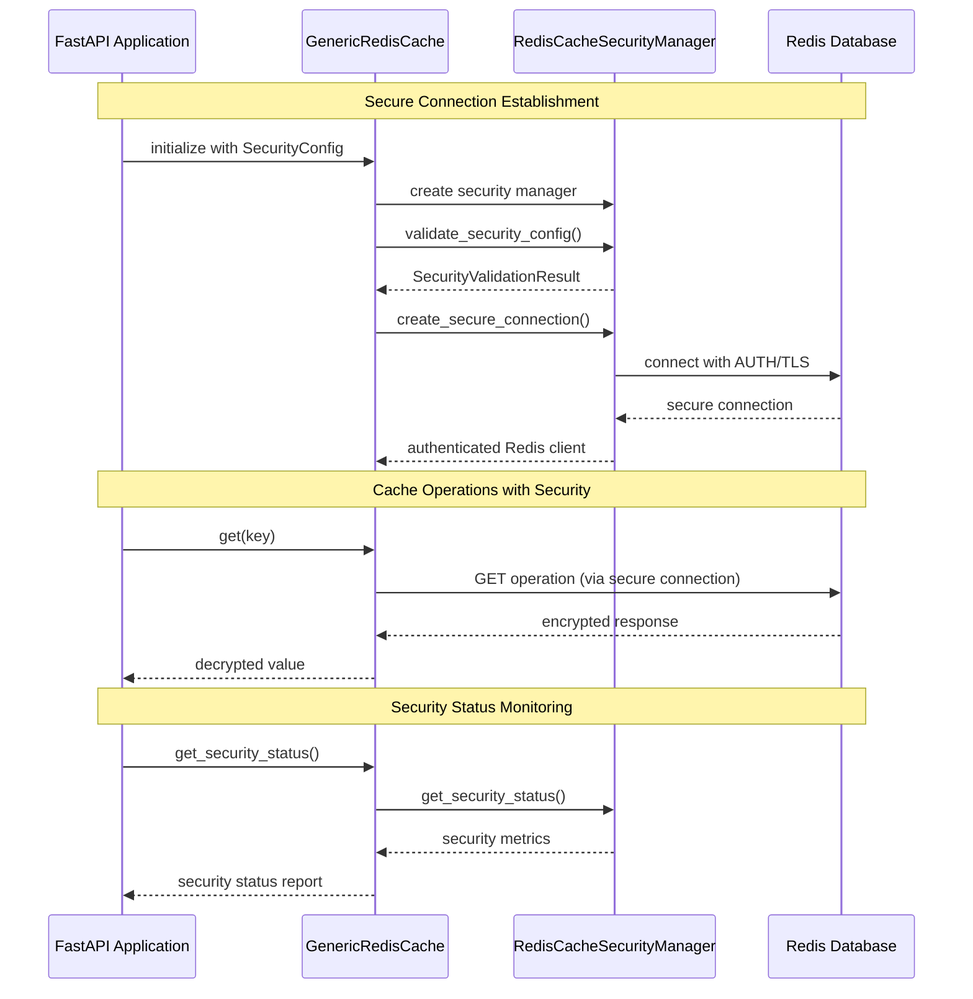
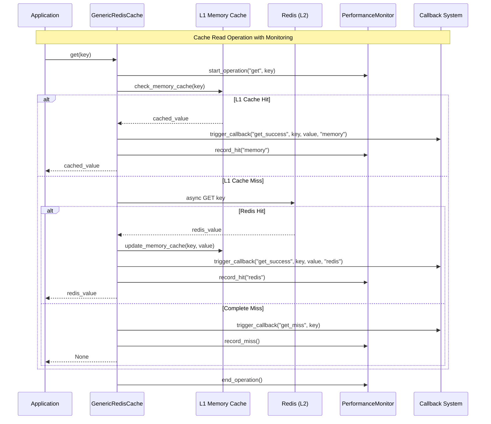
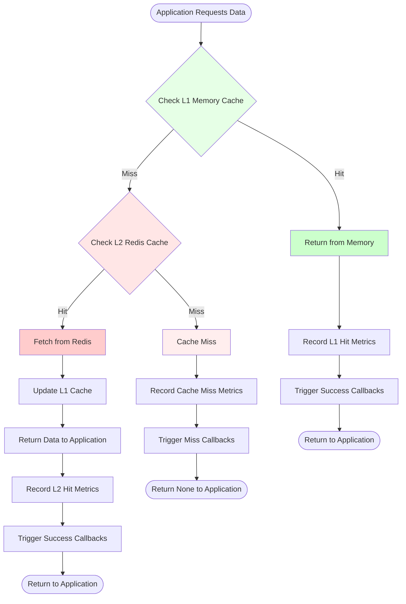
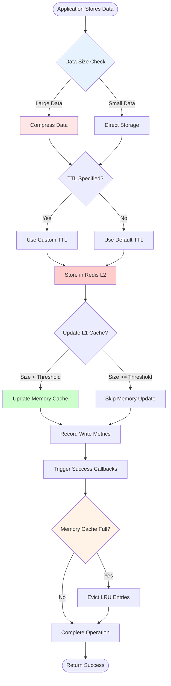
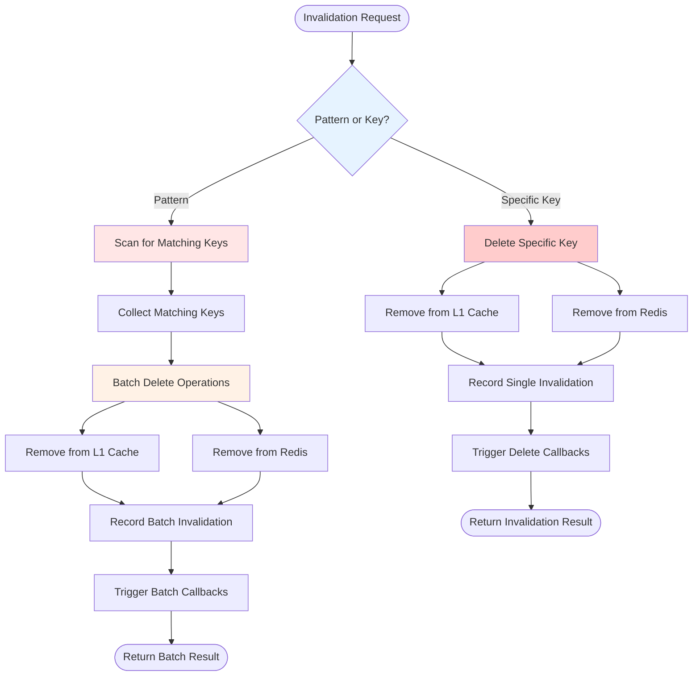
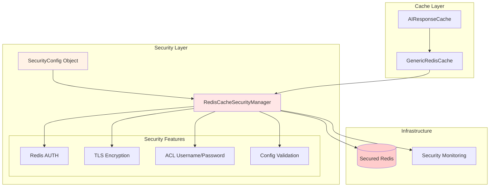
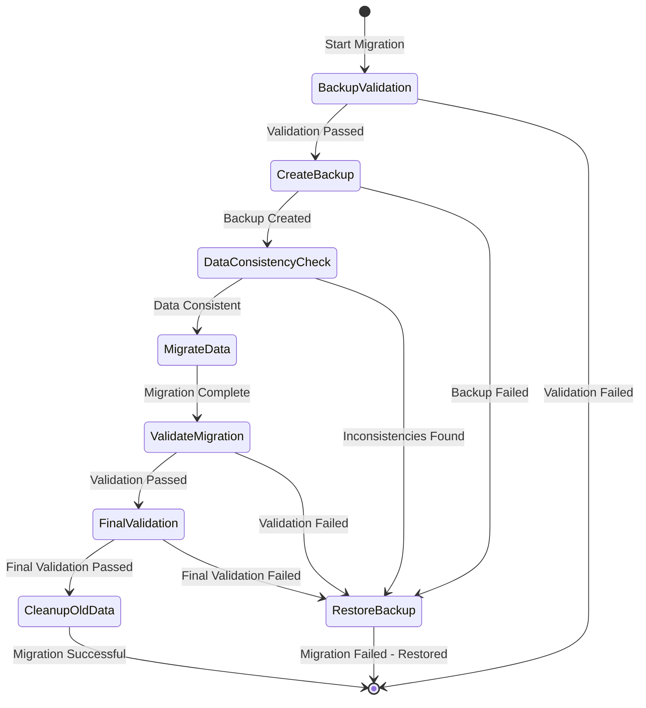
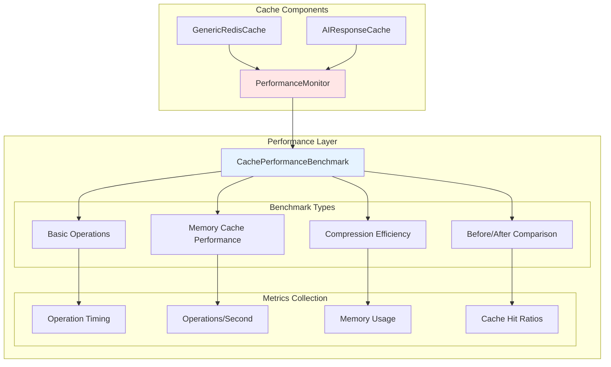

# Cache Infrastructure Refactoring - Architectural Diagrams

## Overview

This document presents the architectural diagrams for the cache infrastructure refactoring project, showing the current state problems and the target state solutions. The refactoring aims to separate generic Redis functionality from AI-specific features, enabling template users to choose the appropriate caching solution for their needs.

---

## 1. Current State Architecture - Mixed Responsibilities Problem

### Current Architecture Diagram

### Current State Problems

**🔴 Problem 1: Forced Complexity**
- Template users building simple web applications are forced to use AI-specific complexity
- 1334 lines of code with mixed responsibilities
- No way to use just the generic Redis functionality

**🔴 Problem 2: Tight Coupling**
- Generic Redis operations tightly coupled with AI-specific logic
- Difficult to extend or customize for different use cases
- Hard to test components independently

**🔴 Problem 3: Code Maintenance**
- Mixed responsibilities make the codebase harder to understand and maintain
- Changes to generic functionality risk breaking AI-specific features
- Difficult to optimize one aspect without affecting the other

---

## 2. Target State Architecture - Clean Separation

### Target Architecture Diagram

### Target State Benefits

**✅ Benefit 1: Flexible Template Usage**
- Simple web apps can use `GenericRedisCache` without AI complexity
- AI applications can use the full `AIResponseCache` with all features
- Clear separation enables easier customization

**✅ Benefit 2: Inheritance-Based Architecture**
- `AIResponseCache` inherits from `GenericRedisCache`
- Clean separation of concerns with proper abstraction
- Easier to test and maintain each layer independently

**✅ Benefit 3: Extensibility**
- Callback system allows composition-based extensions
- Security manager provides pluggable security features
- Migration tools enable safe transitions

---

## 3. Component Interaction Diagrams

### GenericRedisCache ↔ RedisCacheSecurityManager Interaction

### GenericRedisCache Internal Component Interaction

---

## 4. Data Flow Diagrams - L1/L2 Cache Interactions

### Read Operation Data Flow

### Write Operation Data Flow

### Cache Invalidation Data Flow

---

## 5. Security Architecture Integration

### Redis Security Manager Integration

---

## 6. Migration Architecture

### Data Migration Process Flow

---

## 7. Performance Monitoring Integration

### Benchmarking Architecture

---

## Summary

These architectural diagrams illustrate the comprehensive refactoring approach that addresses the current mixed responsibilities problem while maintaining backward compatibility and introducing new capabilities:

### Key Architectural Improvements

1. **Clean Separation**: Generic Redis functionality separated from AI-specific features
2. **Flexible Usage**: Template users can choose appropriate complexity level
3. **Security Integration**: Pluggable security architecture with comprehensive features
4. **Performance Monitoring**: Built-in benchmarking and performance validation
5. **Safe Migration**: Comprehensive data migration tools with rollback capabilities
6. **Extensibility**: Callback-based extension system for customization

### Implementation Benefits

- **Reduced Complexity**: Simple applications avoid AI-specific overhead
- **Better Maintainability**: Clear component boundaries and responsibilities
- **Enhanced Security**: Production-ready Redis security implementation
- **Performance Validation**: Comprehensive benchmarking prevents regressions
- **Safe Deployment**: Migration tools ensure zero-downtime transitions

This architecture provides a solid foundation for the Phase 1 implementation while preparing for future enhancements in Phase 2.