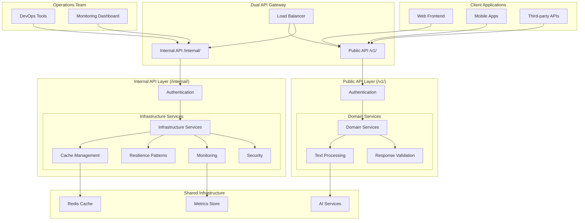

# Dual API Architecture

The FastAPI backend employs a sophisticated **dual-API architecture** that cleanly separates external business operations from internal infrastructure management. This design provides both developer-friendly business APIs and powerful administrative capabilities while maintaining clear architectural boundaries.

## Architecture Overview



## API Separation Philosophy

### Public API (`/v1/`) - Business Logic Interface

**Purpose**: External-facing endpoints designed for client applications and business operations.

**Characteristics**:
- **Business-focused**: Endpoints aligned with domain operations
- **Stable contracts**: Version-controlled with backward compatibility
- **External consumption**: Designed for frontend, mobile apps, and third-party integrations
- **Domain services**: Educational examples demonstrating infrastructure usage patterns
- **User-centric**: Error messages and responses optimized for end-user applications

**Target Audience**: 
- Frontend developers
- Mobile app developers
- Third-party API consumers
- End-user applications

### Internal API (`/internal/`) - Infrastructure Management Interface

**Purpose**: Administrative endpoints for system monitoring, configuration, and operational management.

**Characteristics**:
- **Infrastructure-focused**: Technical system management and monitoring
- **Operational tools**: Performance tuning, debugging, and system health
- **Production-ready**: Stable APIs with backward compatibility guarantees
- **Administrative access**: Requires elevated authentication
- **Ops-centric**: Detailed technical information for system administrators

**Target Audience**:
- DevOps engineers
- System administrators
- Monitoring systems
- Operations teams

## Public API (`/v1/`) Endpoints

### Core Business Operations

#### Health and Status
```http
GET /v1/health                    # System health check
GET /v1/auth/status               # Authentication verification
```

#### Text Processing (Domain Services)
```http
GET /v1/text_processing/operations         # Available AI operations
POST /v1/text_processing/process           # Single text processing
POST /v1/text_processing/batch_process     # Batch processing
GET /v1/text_processing/batch_status/{id}  # Batch status
GET /v1/text_processing/health             # Service health
```

### Example Usage

**Single Text Processing**:
```bash
curl -X POST "http://localhost:8000/v1/text_processing/process" \
  -H "X-API-Key: your-api-key" \
  -H "Content-Type: application/json" \
  -d '{
    "text": "Your text to analyze",
    "operation": "summarize",
    "options": {"max_length": 150}
  }'
```

**Response**:
```json
{
  "result": "Generated summary of the input text...",
  "operation": "summarize", 
  "metadata": {"processing_time": 1.23}
}
```

### Authentication
- **Optional for health checks**: Basic health endpoints work without authentication
- **Required for processing**: All text processing operations require API key
- **Flexible authentication**: Supports multiple authentication methods

## Internal API (`/internal/`) Endpoints

### Infrastructure Management Categories

The internal API provides **38 specialized endpoints** across **8 focused modules**:

#### 1. System Monitoring (`/internal/monitoring/`)
```http
GET /internal/monitoring/health    # Comprehensive system health
```

**Response Example**:
```json
{
  "status": "healthy",
  "timestamp": "2024-01-15T10:30:00.123456",
  "components": {
    "cache_performance_monitor": {"status": "healthy", "total_operations_tracked": 1250},
    "resilience_monitoring": {"status": "healthy", "circuit_breaker_tracked": true},
    "cache_service_monitoring": {"status": "healthy", "redis_monitoring": "connected"}
  },
  "available_endpoints": [
    "GET /internal/monitoring/health",
    "GET /internal/cache/metrics",
    "GET /internal/resilience/health"
  ]
}
```

#### 2. Cache Management (`/internal/cache/`)
```http
GET /internal/cache/status                     # Cache status and statistics
GET /internal/cache/metrics                    # Performance metrics
POST /internal/cache/invalidate                # Pattern-based invalidation
GET /internal/cache/invalidation-stats         # Invalidation analytics
GET /internal/cache/invalidation-recommendations # Optimization suggestions
```

**Cache Metrics Example**:
```json
{
  "timestamp": "2024-01-15T10:30:00.123456",
  "cache_hit_rate": 85.5,
  "total_cache_operations": 150,
  "key_generation": {
    "total_operations": 75,
    "avg_duration": 0.002,
    "avg_text_length": 1250,
    "slow_operations": 2
  },
  "compression": {
    "avg_compression_ratio": 0.65,
    "total_bytes_saved": 183500,
    "overall_savings_percent": 35.0
  }
}
```

#### 3. Resilience Management (`/internal/resilience/`)
```http
GET /internal/resilience/health                # Resilience system health
GET /internal/resilience/config                # Current configuration
GET /internal/resilience/metrics               # Performance metrics
POST /internal/resilience/metrics/reset        # Reset metrics
GET /internal/resilience/dashboard             # Dashboard summary
```

#### 4. Circuit Breaker Management (`/internal/resilience/circuit-breakers/`)
```http
GET /internal/resilience/circuit-breakers                    # All circuit breakers
GET /internal/resilience/circuit-breakers/{name}            # Specific breaker
POST /internal/resilience/circuit-breakers/{name}/reset     # Reset breaker
```

#### 5. Configuration Management (`/internal/resilience/config/`)
```http
GET /internal/resilience/config/presets                     # Available presets
GET /internal/resilience/config/presets/{name}              # Preset details
GET /internal/resilience/config/recommend-preset/{env}      # Environment recommendation
GET /internal/resilience/config/recommend-preset-auto      # Auto-detect recommendation
```

#### 6. Configuration Validation (`/internal/resilience/config/validate*`)
```http
POST /internal/resilience/config/validate                   # Standard validation
POST /internal/resilience/config/validate-secure           # Enhanced security validation
POST /internal/resilience/config/validate-json             # JSON string validation
POST /internal/resilience/config/validate/field-whitelist  # Field whitelist validation
GET /internal/resilience/config/validate/security-config   # Security validation config
GET /internal/resilience/config/validate/rate-limit-status # Rate limiting status
```

#### 7. Performance Benchmarking (`/internal/resilience/performance/`)
```http
POST /internal/resilience/performance/benchmark             # Run benchmarks
GET /internal/resilience/performance/benchmark/results      # Get benchmark results
GET /internal/resilience/performance/thresholds            # Get performance thresholds
POST /internal/resilience/performance/thresholds           # Update thresholds
GET /internal/resilience/performance/reports               # Performance analysis reports
```

#### 8. Monitoring and Analytics (`/internal/resilience/monitoring/`)
```http
GET /internal/resilience/monitoring/usage                  # Usage patterns
GET /internal/resilience/monitoring/performance            # Performance data
GET /internal/resilience/monitoring/alerts                 # Alert configuration
POST /internal/resilience/monitoring/alerts                # Update alerts
GET /internal/resilience/monitoring/export/{format}        # Export monitoring data
GET /internal/resilience/monitoring/analytics/trends       # Trend analysis
GET /internal/resilience/monitoring/analytics/insights     # Operational insights
```

### Example Internal API Usage

**Check System Health**:
```bash
curl "http://localhost:8000/internal/monitoring/health" \
  -H "X-API-Key: your-api-key"
```

**Get Cache Performance**:
```bash
curl "http://localhost:8000/internal/cache/metrics" \
  -H "X-API-Key: your-api-key"
```

**Reset Circuit Breaker**:
```bash
curl -X POST "http://localhost:8000/internal/resilience/circuit-breakers/ai_service/reset" \
  -H "X-API-Key: your-api-key"
```

**Validate Configuration**:
```bash
curl -X POST "http://localhost:8000/internal/resilience/config/validate" \
  -H "X-API-Key: your-api-key" \
  -H "Content-Type: application/json" \
  -d '{"configuration": {"retry_attempts": 3, "circuit_breaker_threshold": 5}}'
```

## Authentication Strategy

### Multi-Key Authentication System

Both APIs use a flexible multi-key authentication system:

```bash
# Primary API key (required)
export API_KEY=your-secure-primary-key

# Additional API keys (optional)
export ADDITIONAL_API_KEYS=staging-key,dev-key,monitoring-key
```

### Authentication Methods
1. **X-API-Key Header** (Recommended): `X-API-Key: your-api-key`
2. **Authorization Header**: `Authorization: Bearer your-api-key`
3. **Query Parameter**: `?api_key=your-api-key`

### Authentication Requirements

#### Public API Authentication
- **Health endpoints**: No authentication required
- **Processing endpoints**: Authentication required
- **Flexible access**: Supports both authenticated and unauthenticated health checks

#### Internal API Authentication
- **Administrative operations**: Authentication required
- **Monitoring endpoints**: Optional authentication (may provide limited data without auth)
- **Configuration changes**: Always require authentication

## Infrastructure vs Domain Services

### Infrastructure Services (`/internal/`) - **Production Ready**

**Characteristics**:
- **>90% test coverage** requirement
- **Backward compatibility** guarantees
- **Production stability** focus
- **Reusable components** across projects
- **Technical problem solving** (caching, resilience, monitoring)

**Usage Pattern**: Keep and extend these services - they form the backbone of the system.

### Domain Services (`/v1/`) - **Educational Examples**

**Characteristics**:
- **>70% test coverage** requirement
- **Business-specific** implementations
- **Educational examples** demonstrating patterns
- **Expected to be replaced** per project
- **Feature-driven development**

**Usage Pattern**: Study the patterns, then replace with your specific business logic.

## Deployment Considerations

### Development Environment
```bash
# Enable both API documentations
export DISABLE_INTERNAL_DOCS=false

# Use development resilience preset
export RESILIENCE_PRESET=development

# Enable debug logging
export DEBUG=true
export LOG_LEVEL=DEBUG
```

**Access**:
- Public API docs: http://localhost:8000/docs
- Internal API docs: http://localhost:8000/internal/docs

### Production Environment
```bash
# Disable internal API documentation for security
export DISABLE_INTERNAL_DOCS=true

# Use production resilience preset
export RESILIENCE_PRESET=production

# Production logging
export DEBUG=false
export LOG_LEVEL=INFO
```

**Access**:
- Public API docs: https://your-domain.com/docs
- Internal API: Available but documentation disabled

### Security Considerations

#### Public API Security
- **Input validation**: All inputs validated and sanitized
- **Rate limiting**: Can be implemented per endpoint
- **CORS configuration**: Configurable for cross-origin requests
- **Error handling**: User-friendly error messages

#### Internal API Security
- **Administrative access**: Always requires authentication
- **Sensitive operations**: Enhanced security validation
- **Production protection**: Documentation can be disabled
- **Rate limiting**: Built-in rate limiting for validation endpoints

## Monitoring and Observability

### Public API Monitoring
- **Business metrics**: Processing times, success rates, operation usage
- **User experience**: Error rates, response times
- **Domain health**: Text processing service health

### Internal API Monitoring
- **Infrastructure metrics**: Cache performance, circuit breaker status
- **System health**: Component-level health checks
- **Operational insights**: Usage patterns, performance trends
- **Alert management**: Configurable alerts and thresholds

## Best Practices

### For Public API Usage
1. **Use semantic versioning**: APIs are versioned (`/v1/`)
2. **Handle authentication**: Include API keys in headers
3. **Implement retry logic**: Use exponential backoff for failures
4. **Monitor response times**: Track performance for user experience
5. **Validate inputs**: Client-side validation for better UX

### For Internal API Usage
1. **Secure access**: Always use authentication for administrative operations
2. **Monitor regularly**: Set up automated health checks
3. **Use configuration validation**: Validate before applying changes
4. **Implement alerting**: Configure alerts for critical thresholds
5. **Regular maintenance**: Use performance benchmarks and optimization recommendations

### For Development
1. **Use both documentations**: Public and internal API docs during development
2. **Test both APIs**: Include both in integration tests
3. **Follow patterns**: Study domain service patterns before customization
4. **Understand boundaries**: Know which services to keep vs replace

## Migration and Customization

### Keeping Infrastructure Services
The internal API infrastructure services are designed to be kept and extended:

```python
# Example: Extending cache management
from app.infrastructure.cache.base import CacheService

class CustomCacheService(CacheService):
    def custom_cache_operation(self):
        # Your custom caching logic
        pass
```

### Replacing Domain Services
The public API domain services are meant to be replaced:

```python
# Example: Replacing text processing with your domain logic
from app.infrastructure.resilience.orchestrator import ResilienceOrchestrator

class CustomBusinessService:
    def __init__(self, resilience: ResilienceOrchestrator):
        self.resilience = resilience
    
    async def custom_business_operation(self, data):
        # Use infrastructure services for resilience
        return await self.resilience.execute_with_resilience(
            operation_name="custom_operation",
            operation=lambda: self.process_business_logic(data)
        )
```

## Conclusion

The dual API architecture provides:

- **Clear separation**: Business logic vs infrastructure management
- **Operational efficiency**: Powerful administrative capabilities
- **Developer experience**: Clean, focused APIs for different use cases
- **Production readiness**: Comprehensive monitoring and management tools
- **Flexibility**: Easy to customize business logic while leveraging robust infrastructure

This architecture enables teams to build production-ready applications quickly while maintaining operational excellence through comprehensive infrastructure management capabilities.