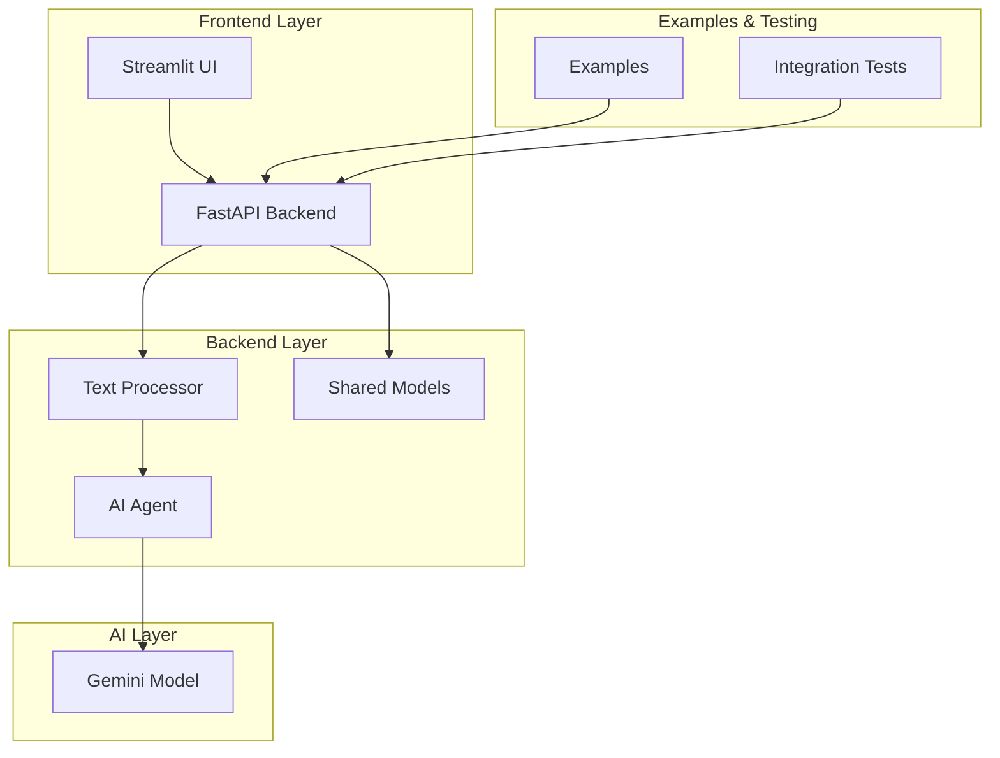

# 🚀 FastAPI-Streamlit-LLM Starter Template - Complete Integration Guide

Welcome to the comprehensive integration guide for the FastAPI-Streamlit-LLM Starter Template! This guide ties together all components and provides complete usage examples to get you up and running quickly.

## 📋 Table of Contents

1. [Quick Start](#-quick-start)
2. [System Architecture](#-system-architecture)
3. [Complete Setup Guide](#-complete-setup-guide)
4. [Usage Examples](#-usage-examples)
5. [API Integration](#-api-integration)
6. [Frontend Integration](#-frontend-integration)
7. [Custom Operations](#-custom-operations)
8. [Testing & Validation](#-testing--validation)
9. [Deployment](#-deployment)
10. [Troubleshooting](#-troubleshooting)

## 🚀 Quick Start

Get the entire system running in under 5 minutes:

### 1. Clone and Setup
```bash
git clone <repository-url>
cd fastapi-streamlit-llm-starter
cp .env.example .env
# Edit .env with your API keys
```

### 2. Start Backend
```bash
# Using Makefile (recommended)
make install  # Creates virtual environment and installs dependencies

# Or manually
cd backend
pip install -r requirements.txt
python -m uvicorn app.main:app --reload
```

### 3. Start Frontend
```bash
# If using Makefile, dependencies are already installed
# Or manually
cd frontend
pip install -r requirements.txt
streamlit run app/app.py
```

### 4. Test the System
```bash
# Using the enhanced Makefile (recommended)
make install  # Setup virtual environment and dependencies
make test-local  # Run tests without Docker

# Or manually
cd examples
python basic_usage.py
```

**🎉 You're ready to go!**
- Backend API: http://localhost:8000
- Frontend UI: http://localhost:8501
- API Docs: http://localhost:8000/docs

## 🏗️ System Architecture



### Component Overview

| Component | Purpose | Technology |
|-----------|---------|------------|
| **Frontend** | User interface for text processing | Streamlit |
| **Backend** | REST API for text operations | FastAPI |
| **Text Processor** | Core AI processing logic | Python + AI Agent |
| **Shared Models** | Data validation and types | Pydantic |
| **Examples** | Usage demonstrations | Python scripts |
| **Tests** | Quality assurance | pytest + custom |

## 🔧 Complete Setup Guide

### Prerequisites
- Python 3.8+
- Gemini API key (get from Google AI Studio)
- Git

### Environment Setup

1. **Backend Configuration:**
   ```bash
   cd backend
   cp env.example .env
   ```
   
   Edit `.env`:
   ```env
   GEMINI_API_KEY=your_api_key_here
   AI_MODEL=gemini-pro
   DEBUG=true
   HOST=0.0.0.0
   PORT=8000
   LOG_LEVEL=INFO
   ALLOWED_ORIGINS=["http://localhost:8501"]
   ```

2. **Install Dependencies:**
   ```bash
   # Using Makefile (recommended - handles virtual environment automatically)
   make install
   
   # Or manually with project-level virtual environment
   python3 -m venv .venv
   source .venv/bin/activate  # On Windows: .venv\Scripts\activate
   
   # Backend
   cd backend
   pip install -r requirements.txt -r requirements-dev.txt
   
   # Frontend
   cd ../frontend
   pip install -r requirements.txt -r requirements-dev.txt
   
   # Examples (optional)
   pip install httpx asyncio
   ```

3. **Verify Installation:**
   ```bash
   # Using Makefile (recommended)
   make test-local  # Runs tests to verify everything works
   
   # Or manually test components
   cd backend
   ../.venv/bin/python -c "from app.main import app; print('Backend OK')"
   
   # Test frontend
   cd ../frontend
   ../.venv/bin/python -c "import streamlit; print('Frontend OK')"
   ```

## 💡 Usage Examples

### Basic API Usage

```python
#!/usr/bin/env python3
"""Basic API usage example with standardized patterns."""

# Standard library imports
import asyncio
import logging
from typing import Dict, Any, Optional

# Third-party imports
import httpx

# Local application imports
from shared.sample_data import get_sample_text

# Configure logging
logging.basicConfig(level=logging.INFO)
logger = logging.getLogger(__name__)

async def basic_example():
    """Demonstrate basic API usage with error handling."""
    try:
        async with httpx.AsyncClient(timeout=30.0) as client:
            # Health check
            response = await client.get("http://localhost:8000/health")
            response.raise_for_status()
            health = response.json()
            print(f"API Status: {health['status']}")
            
            # Process text using standardized sample data
            response = await client.post(
                "http://localhost:8000/process",
                json={
                    "text": get_sample_text("ai_technology"),
                    "operation": "summarize",
                    "options": {"max_length": 50}
                }
            )
            response.raise_for_status()
            result = response.json()
            print(f"Summary: {result['result']}")
            
    except httpx.TimeoutException:
        logger.error("Request timeout")
        print("Request timed out. Please try again.")
    except httpx.HTTPStatusError as e:
        logger.error(f"HTTP error: {e.response.status_code}")
        print(f"API Error: {e.response.status_code}")
    except Exception as e:
        logger.error(f"Unexpected error: {str(e)}")
        print(f"Error: {str(e)}")

# Run the example
if __name__ == "__main__":
    asyncio.run(basic_example())
```

### All Operations Example

```python
async def demonstrate_all_operations():
    """Demonstrate all available text processing operations."""
    
    # Use standardized sample data
    sample_text = get_sample_text("climate_change")
    
    operations = [
        {
            "operation": "summarize",
            "options": {"max_length": 50},
            "description": "Generate a concise summary"
        },
        {
            "operation": "sentiment",
            "options": {},
            "description": "Analyze emotional tone"
        },
        {
            "operation": "key_points",
            "options": {"max_points": 3},
            "description": "Extract main points"
        },
        {
            "operation": "questions",
            "options": {"num_questions": 2},
            "description": "Generate questions"
        },
        {
            "operation": "qa",
            "question": "What causes climate change?",
            "options": {},
            "description": "Answer specific questions"
        }
    ]
    
    async with httpx.AsyncClient() as client:
        for op in operations:
            print(f"\n🔄 {op['description']}")
            
            payload = {
                "text": sample_text,
                "operation": op["operation"],
                "options": op["options"]
            }
            
            if "question" in op:
                payload["question"] = op["question"]
            
            response = await client.post(
                "http://localhost:8000/process",
                json=payload
            )
            
            result = response.json()
            
            if op["operation"] == "sentiment":
                sentiment = result["sentiment"]
                print(f"   Sentiment: {sentiment['sentiment']} ({sentiment['confidence']:.1%})")
            elif op["operation"] == "key_points":
                print("   Key Points:")
                for i, point in enumerate(result["key_points"], 1):
                    print(f"     {i}. {point}")
            elif op["operation"] == "questions":
                print("   Questions:")
                for i, question in enumerate(result["questions"], 1):
                    print(f"     {i}. {question}")
            else:
                print(f"   Result: {result['result']}")

# Run the demonstration
asyncio.run(demonstrate_all_operations())
```

## 🔌 API Integration

### RESTful Endpoints

#### Health Check
```http
GET /health
```
**Response:**
```json
{
  "status": "healthy",
  "timestamp": "2024-01-15T10:30:00",
  "version": "1.0.0",
  "ai_model_available": true
}
```

#### Process Text
```http
POST /process
Content-Type: application/json

{
  "text": "Your text here",
  "operation": "summarize",
  "options": {"max_length": 100},
  "question": "Optional question for Q&A"
}
```

**Response:**
```json
{
  "operation": "summarize",
  "success": true,
  "result": "Processed text result",
  "sentiment": null,
  "key_points": null,
  "questions": null,
  "metadata": {"word_count": 150},
  "processing_time": 2.3,
  "timestamp": "2024-01-15T10:30:00"
}
```

#### Available Operations
```http
GET /operations
```
**Response:**
```json
{
  "operations": [
    {
      "id": "summarize",
      "name": "Summarize",
      "description": "Generate a concise summary of the text",
      "options": ["max_length"]
    }
  ]
}
```

### Python Client Library

Create a reusable client:

```python
class LLMClient:
    """Reusable client for the FastAPI-Streamlit-LLM API."""
    
    def __init__(self, base_url: str = "http://localhost:8000"):
        self.base_url = base_url
        self.session = None
    
    async def __aenter__(self):
        self.session = httpx.AsyncClient(timeout=30.0)
        return self
    
    async def __aexit__(self, exc_type, exc_val, exc_tb):
        if self.session:
            await self.session.aclose()
    
    async def summarize(self, text: str, max_length: int = 100) -> str:
        """Summarize text."""
        response = await self.session.post(
            f"{self.base_url}/process",
            json={
                "text": text,
                "operation": "summarize",
                "options": {"max_length": max_length}
            }
        )
        response.raise_for_status()
        return response.json()["result"]
    
    async def analyze_sentiment(self, text: str) -> dict:
        """Analyze sentiment."""
        response = await self.session.post(
            f"{self.base_url}/process",
            json={"text": text, "operation": "sentiment"}
        )
        response.raise_for_status()
        return response.json()["sentiment"]
    
    async def extract_key_points(self, text: str, max_points: int = 5) -> list:
        """Extract key points."""
        response = await self.session.post(
            f"{self.base_url}/process",
            json={
                "text": text,
                "operation": "key_points",
                "options": {"max_points": max_points}
            }
        )
        response.raise_for_status()
        return response.json()["key_points"]

# Usage
async def use_client():
    async with LLMClient() as client:
        summary = await client.summarize("Your long text here...")
        sentiment = await client.analyze_sentiment("I love this!")
        points = await client.extract_key_points("Complex document...")
```

## 🎨 Frontend Integration

### Streamlit Interface

The frontend provides an intuitive web interface:

1. **Text Input Area** - Enter or paste text to process
2. **Operation Selection** - Choose from available operations
3. **Options Configuration** - Set operation-specific parameters
4. **Results Display** - View processed results with formatting
5. **History Tracking** - Review previous operations

### Custom Frontend Integration

Integrate with your own frontend:

```javascript
// JavaScript example for web integration
class LLMAPIClient {
    constructor(baseURL = 'http://localhost:8000') {
        this.baseURL = baseURL;
    }
    
    async processText(text, operation, options = {}, question = null) {
        const payload = { text, operation, options };
        if (question) payload.question = question;
        
        const response = await fetch(`${this.baseURL}/process`, {
            method: 'POST',
            headers: { 'Content-Type': 'application/json' },
            body: JSON.stringify(payload)
        });
        
        if (!response.ok) {
            throw new Error(`API Error: ${response.status}`);
        }
        
        return await response.json();
    }
    
    async getOperations() {
        const response = await fetch(`${this.baseURL}/operations`);
        return await response.json();
    }
}

// Usage
const client = new LLMAPIClient();

client.processText(
    "Your text here",
    "summarize",
    { max_length: 100 }
).then(result => {
    console.log('Summary:', result.result);
});
```

## 🔧 Custom Operations

### Adding New Operations

Follow these steps to add custom text processing operations:

#### 1. Extend the Models
```python
# shared/models.py
class TextProcessingOperation(str, Enum):
    SUMMARIZE = "summarize"
    SENTIMENT = "sentiment"
    KEY_POINTS = "key_points"
    QUESTIONS = "questions"
    QA = "qa"
    
    # New custom operations
    TRANSLATE = "translate"
    CLASSIFY = "classify"
```

#### 2. Implement Processing Logic
```python
# backend/app/services/text_processor.py
async def _translate_text(self, text: str, options: Dict[str, Any]) -> str:
    """Translate text to target language."""
    target_language = options.get("target_language", "Spanish")
    
    prompt = f"""
    Translate the following text to {target_language}:
    
    Text: {text}
    
    Translation:
    """
    
    result = await self.agent.run(prompt)
    return result.data.strip()

# Add to process_text method
elif request.operation == TextProcessingOperation.TRANSLATE:
    result = await self._translate_text(request.text, request.options)
```

#### 3. Update API Endpoints
```python
# backend/app/main.py
@app.get("/operations")
async def get_operations():
    return {
        "operations": [
            # ... existing operations ...
            {
                "id": "translate",
                "name": "Translate",
                "description": "Translate text to another language",
                "options": ["target_language"]
            }
        ]
    }
```

#### 4. Enhance Frontend
```python
# frontend/app/app.py
if operation == "translate":
    options["target_language"] = st.selectbox(
        "Target Language",
        ["Spanish", "French", "German", "Italian"],
        key="target_language"
    )
```

### Example Custom Operations

See `examples/custom_operation.py` for complete implementation examples of:
- 🌐 Text Translation
- 📊 Text Classification  
- 🏷️ Named Entity Extraction
- 📖 Readability Analysis

## 🧪 Testing & Validation

### Running Tests

The project now includes enhanced testing with automatic virtual environment management:

```bash
# Setup and run all tests (recommended)
make install     # Create virtual environment and install dependencies
make test        # Run all tests (includes Docker integration if available)
make test-local  # Run tests without Docker dependency

# Individual test suites
make test-backend   # Backend tests only
make test-frontend  # Frontend tests only
make test-coverage  # Tests with coverage report

# Code quality
make lint        # Code quality checks
make format      # Format code

# Manual testing
cd examples
.venv/bin/python basic_usage.py  # Using virtual environment

# Run comprehensive integration tests
.venv/bin/python integration_test.py

# Manual unit tests with virtual environment
cd backend
../.venv/bin/python -m pytest

cd ../frontend
../.venv/bin/python -m pytest
```

### Test Coverage

The integration tests cover:
- ✅ API health and availability
- ✅ All text processing operations
- ✅ Error handling scenarios
- ✅ Performance benchmarks
- ✅ Concurrent request handling

### Custom Test Scenarios

```python
# Add your own test scenarios
async def test_custom_scenario():
    async with httpx.AsyncClient() as client:
        # Test with your specific use case
        response = await client.post(
            "http://localhost:8000/process",
            json={
                "text": "Your specific test text",
                "operation": "your_operation"
            }
        )
        
        assert response.status_code == 200
        result = response.json()
        assert result["success"] is True
        # Add your specific assertions
```

## 🚀 Deployment

### Docker Deployment

```bash
# Build and run with Docker Compose
docker-compose up --build

# Production deployment
docker-compose -f docker-compose.prod.yml up -d
```

### Manual Deployment

```bash
# Backend
cd backend
gunicorn app.main:app -w 4 -k uvicorn.workers.UvicornWorker

# Frontend
cd frontend
streamlit run app/app.py --server.port 8501
```

### Environment Variables for Production

```env
# Production settings
DEBUG=false
LOG_LEVEL=WARNING
ALLOWED_ORIGINS=["https://yourdomain.com"]
GEMINI_API_KEY=your_production_key
```

## 🔍 Troubleshooting

### Common Issues

#### 1. API Connection Issues
```
Error: Connection refused to localhost:8000
```
**Solutions:**
- Ensure backend is running: `python -m uvicorn app.main:app --reload`
- Check port availability: `lsof -i :8000`
- Verify firewall settings

#### 2. AI Model Issues
```
Error: AI model not available
```
**Solutions:**
- Set `GEMINI_API_KEY` environment variable
- Verify API key validity
- Check internet connectivity

#### 3. Frontend Issues
```
Error: Streamlit app won't start
```
**Solutions:**
- Install dependencies: `pip install -r requirements.txt`
- Check Python version (3.8+)
- Clear Streamlit cache: `streamlit cache clear`

#### 4. Performance Issues
```
Error: Request timeout
```
**Solutions:**
- Increase timeout settings
- Optimize text length
- Check AI model rate limits

### Debug Mode

Enable comprehensive debugging:

```python
import logging
logging.basicConfig(
    level=logging.DEBUG,
    format='%(asctime)s - %(name)s - %(levelname)s - %(message)s'
)
```

### Health Monitoring

Monitor system health:

```bash
# Check API health
curl http://localhost:8000/health

# Monitor logs
tail -f backend/logs/app.log

# Check resource usage
htop
```

## 📚 Additional Resources

### Documentation
- **API Documentation:** http://localhost:8000/docs
- **Examples:** `examples/README.md`
- **Testing Guide:** `TESTING.md`
- **Docker Guide:** `DOCKER_README.md`

### Community & Support
- **Issues:** GitHub Issues
- **Discussions:** GitHub Discussions
- **Contributing:** `CONTRIBUTING.md`

### Learning Resources
- **FastAPI:** https://fastapi.tiangolo.com/
- **Streamlit:** https://streamlit.io/
- **Gemini API:** https://ai.google.dev/

## 🎯 Next Steps

After completing this integration guide:

1. **Explore Examples:** Run all examples in the `examples/` directory
2. **Customize Operations:** Add your own text processing operations
3. **Deploy to Production:** Use Docker or manual deployment
4. **Monitor Performance:** Set up logging and monitoring
5. **Scale as Needed:** Add load balancing and caching

## 🤝 Contributing

We welcome contributions! Please:

1. Fork the repository
2. Create a feature branch
3. Add tests for new functionality
4. Update documentation
5. Submit a pull request

## 📄 License

This project is licensed under the MIT License. See `LICENSE` file for details.

---

**🎉 Congratulations!** You now have a complete understanding of the FastAPI-Streamlit-LLM Starter Template. Start building amazing AI-powered applications! 