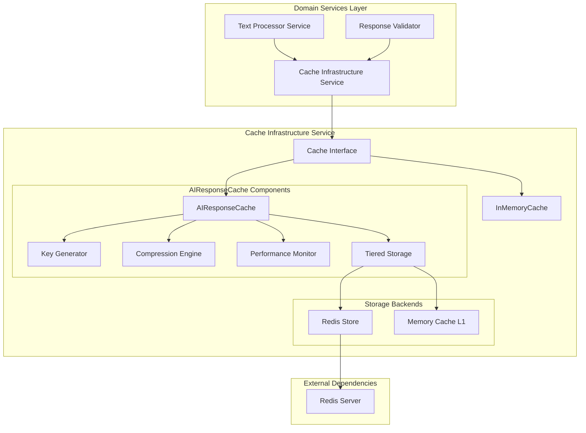
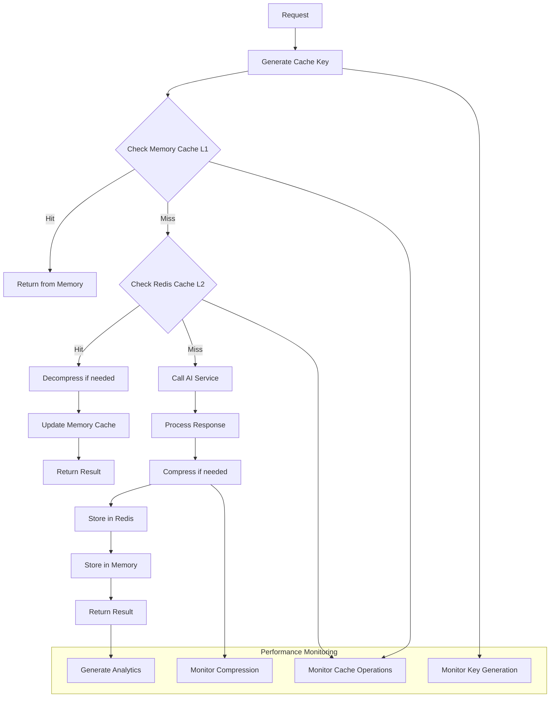

# Cache Infrastructure Service

The Cache Infrastructure Service provides production-ready, multi-tiered caching capabilities specifically optimized for AI response caching within the FastAPI-Streamlit-LLM Starter Template. This infrastructure service implements intelligent caching strategies, comprehensive monitoring, and graceful degradation to ensure optimal performance and reliability.

## Overview

The Cache Infrastructure Service is a **production-ready infrastructure component** (>90% test coverage) designed to dramatically improve response times and reduce AI service costs through intelligent caching. It follows the template's infrastructure vs domain service separation, serving as a foundational component that domain services leverage for performance optimization.

### Architecture Position



### Key Features

- ✅ **Multi-Tiered Caching**: Memory (L1) + Redis (L2) with intelligent placement
- ✅ **AI-Optimized**: Specialized for AI response patterns and characteristics
- ✅ **Intelligent Compression**: Automatic zlib compression with configurable thresholds
- ✅ **Graceful Degradation**: Falls back to memory-only when Redis unavailable
- ✅ **Advanced Monitoring**: Comprehensive performance analytics and optimization recommendations
- ✅ **Smart Key Generation**: Optimized cache keys for different text sizes
- ✅ **Pattern Invalidation**: Flexible cache management with pattern-based clearing
- ✅ **Operation-Specific TTLs**: Different expiration strategies per AI operation type

## Core Components

### Cache Interface (`base.py`)

Provides the abstract foundation for all cache implementations, ensuring consistent behavior and enabling seamless switching between cache types.

#### Interface Contract

```python
class CacheInterface(ABC):
    @abstractmethod
    async def get(self, key: str):
        """Retrieve a value from cache"""
        pass
    
    @abstractmethod
    async def set(self, key: str, value: Any, ttl: Optional[int] = None):
        """Store a value in cache with optional TTL"""
        pass
    
    @abstractmethod
    async def delete(self, key: str):
        """Remove a value from cache"""
        pass
```

#### Architecture Benefits

| Feature | Benefit | Implementation |
|---------|---------|----------------|
| **Interface Compliance** | Enables dependency injection and testing | Common contract for all implementations |
| **Implementation Flexibility** | Seamless switching between cache types | Consistent API across memory/Redis |
| **Async Pattern** | Optimal performance with FastAPI | All operations use async/await |
| **Type Safety** | Better development experience | Proper type hints throughout |

### InMemoryCache (`memory.py`)

Lightweight, fast in-memory caching for development, testing, and Redis fallback scenarios.

#### Key Features

| Feature | Description | Performance |
|---------|-------------|-------------|
| **TTL Support** | Automatic expiration with per-entry configuration | O(1) expiration check |
| **LRU Eviction** | Intelligent memory management with access tracking | O(1) eviction |
| **Statistics** | Built-in metrics and utilization tracking | Minimal overhead |
| **Thread Safety** | Safe for asyncio concurrent usage | Lock-free design |
| **Cleanup** | Periodic cleanup of expired entries | Background cleanup |

#### Usage Examples

**Basic Configuration**:
```python
from app.infrastructure.cache import InMemoryCache

# Initialize with custom settings
cache = InMemoryCache(
    default_ttl=3600,      # 1 hour default expiration
    max_size=1000          # Maximum 1000 entries before LRU eviction
)

# Basic operations
await cache.set("user:123", {"name": "John", "role": "admin"})
user_data = await cache.get("user:123")
await cache.delete("user:123")
```

**Advanced Operations**:
```python
# Check existence and TTL
exists = await cache.exists("session:abc") 
ttl_remaining = await cache.get_ttl("session:abc")

# Get active keys
active_keys = await cache.get_active_keys()

# Statistics and monitoring
stats = cache.get_stats()
print(f"Cache utilization: {stats['utilization_percent']:.1f}%")
print(f"Hit ratio: {stats['hit_ratio']:.2f}")
```

#### Performance Characteristics

- **Get Operations**: O(1) average, O(n) during cleanup
- **Set Operations**: O(1) average, O(n) during eviction
- **Memory Usage**: ~100-200 bytes per entry
- **Startup Time**: Instant
- **Best For**: Development, testing, fallback scenarios

### AIResponseCache (`redis.py`)

Production-ready, feature-rich caching system specifically optimized for AI response caching with advanced monitoring and compression.

#### Advanced Features

| Feature | Description | Benefits |
|---------|-------------|----------|
| **Tiered Caching** | Memory cache + Redis persistence | Best of both worlds |
| **Smart Compression** | Automatic zlib compression above threshold | 60-80% storage savings |
| **Intelligent Keys** | Optimized key generation for different text sizes | Efficient storage and retrieval |
| **Performance Monitoring** | Comprehensive analytics via `CachePerformanceMonitor` | Data-driven optimization |
| **Graceful Degradation** | Memory-only fallback when Redis unavailable | High availability |
| **Pattern Invalidation** | Flexible cache management with pattern matching | Administrative control |

#### Configuration

```python
from app.infrastructure.cache import AIResponseCache

cache = AIResponseCache(
    redis_url="redis://localhost:6379",
    default_ttl=3600,                    # Base TTL in seconds
    text_hash_threshold=1000,            # Hash texts over 1000 chars
    compression_threshold=1000,          # Compress responses over 1KB
    compression_level=6,                 # zlib compression level (1-9)
    memory_cache_size=100,              # In-memory cache entries
    text_size_tiers={                   # Text categorization thresholds
        'small': 500,
        'medium': 5000, 
        'large': 50000
    }
)
```

#### Operation-Specific TTL Strategies

```python
operation_ttls = {
    "summarize": 7200,    # 2 hours - summaries are stable
    "sentiment": 86400,   # 24 hours - sentiment rarely changes  
    "key_points": 7200,   # 2 hours - key points stable
    "questions": 3600,    # 1 hour - questions can vary
    "qa": 1800           # 30 minutes - context-dependent
}
```

#### Smart Key Generation

The cache implements intelligent key generation optimized for different text sizes:

**Text Size Tiers**:
- **Small** (<500 chars): Full text preserved for debugging
- **Medium** (500-5K chars): Optimized hashing for performance
- **Large** (5K-50K chars): Content hash with metadata
- **X-Large** (>50K chars): Streaming hash for memory efficiency

**Key Structure**:
```
ai_cache:op:<operation>|txt:<text_identifier>|opts:<options_hash>|q:<question_hash>
```

**Example Keys**:
```bash
# Small text (preserved for readability)
ai_cache:op:summarize|txt:Hello_world_example|opts:a1b2c3d4

# Large text (hashed for efficiency)
ai_cache:op:sentiment|txt:hash:f8a7b3c912de4567|opts:e5f6a7b8|q:1a2b3c4d
```

#### Compression Strategy

- **Automatic Compression**: Responses above configurable threshold
- **Configurable Levels**: Compression levels 1-9 (speed vs ratio)
- **Algorithm**: zlib for optimal balance of speed and compression
- **Benefits**: 60-80% storage reduction for typical AI responses

```python
# Compression decision flow
def should_compress(response_size: int, threshold: int = 1000) -> bool:
    return response_size >= threshold

# Compression with monitoring
compressed_data = zlib.compress(response.encode(), level=6)
compression_ratio = len(compressed_data) / len(response)
```

### Performance Monitor (`monitoring.py`)

Comprehensive analytics system providing detailed insights into cache performance and optimization opportunities.

#### Metrics Tracked

| Category | Metrics | Purpose |
|----------|---------|---------|
| **Key Generation** | Timing, text length correlation, slow operations | Optimize key generation strategy |
| **Cache Operations** | Hit/miss ratios, operation timing, type breakdown | Monitor cache effectiveness |
| **Memory Usage** | Consumption, growth trends, threshold alerts | Prevent memory issues |
| **Compression** | Ratios, timing, size savings | Optimize compression settings |
| **Invalidation** | Frequency, patterns, efficiency | Cache management insights |

#### Advanced Analytics

**Statistical Analysis**:
- Mean, median, min/max calculations for all metrics
- Performance trend analysis with growth rate calculations
- Threshold monitoring with configurable warning levels
- Automated optimization recommendations

**Configurable Alerting**:
```python
alert_thresholds = {
    "memory_warning": 50_000_000,      # 50MB warning
    "memory_critical": 100_000_000,    # 100MB critical
    "key_gen_slow": 0.1,              # 100ms key generation
    "cache_op_slow": 0.05,            # 50ms cache operations
    "invalidation_rate": 50           # 50 invalidations per hour
}
```

## Multi-Tiered Architecture

### Cache Flow Diagram



### Tier Characteristics

| Tier | Storage | Speed | Capacity | Persistence | Use Case |
|------|---------|-------|----------|-------------|----------|
| **L1 (Memory)** | RAM | <1ms | ~100 entries | No | Hot data, small responses |
| **L2 (Redis)** | Redis | 1-5ms | Unlimited* | Yes | All responses, large data |

*Subject to Redis memory limits

## Integration Patterns

### Domain Service Integration

```python
from app.infrastructure.cache import AIResponseCache, get_available_templates

class TextProcessorService:
    """Domain service using cache infrastructure."""
    
    def __init__(self, cache: AIResponseCache):
        self.cache = cache
    
    async def process_text_with_cache(
        self, 
        text: str, 
        operation: str, 
        options: dict = None
    ) -> dict:
        """Process text with comprehensive caching."""
        
        # Step 1: Check cache first
        cached_result = await self.cache.get_cached_response(
            text=text,
            operation=operation,
            options=options or {}
        )
        
        if cached_result:
            return {
                **cached_result,
                "cache_hit": True,
                "cached_at": cached_result.get("timestamp")
            }
        
        # Step 2: Process with AI service
        result = await self._process_with_ai(text, operation, options)
        
        # Step 3: Cache the result
        await self.cache.cache_response(
            text=text,
            operation=operation,
            options=options or {},
            response=result
        )
        
        return {
            **result,
            "cache_hit": False
        }
```

### FastAPI Dependency Injection

```python
from app.infrastructure.cache import CacheInterface, AIResponseCache

async def get_cache_service(
    settings: Settings = Depends(get_settings)
) -> AIResponseCache:
    """Dependency provider for cache service."""
    cache = AIResponseCache(
        redis_url=settings.redis_url,
        default_ttl=settings.cache_default_ttl,
        text_hash_threshold=settings.cache_text_hash_threshold,
        compression_threshold=settings.cache_compression_threshold,
        compression_level=settings.cache_compression_level,
        memory_cache_size=settings.cache_memory_cache_size
    )
    
    try:
        await cache.connect()
        logger.info("Cache service connected to Redis")
    except Exception as e:
        logger.warning(f"Redis connection failed, using memory-only mode: {e}")
        # Cache continues to work in memory-only mode
    
    return cache

# Use in endpoints
@app.post("/v1/text_processing/process")
async def process_text(
    request: ProcessRequest,
    cache: AIResponseCache = Depends(get_cache_service)
):
    """Process text with caching."""
    # Check cache first
    cached_result = await cache.get_cached_response(
        text=request.text,
        operation=request.operation,
        options=request.options
    )
    
    if cached_result:
        return {
            **cached_result,
            "cache_hit": True
        }
    
    # Process and cache
    result = await ai_service.process(request)
    await cache.cache_response(
        text=request.text,
        operation=request.operation,
        options=request.options,
        response=result
    )
    
    return {
        **result,
        "cache_hit": False
    }
```

### Environment-Based Configuration

```python
# Development configuration
development_cache = InMemoryCache(
    default_ttl=1800,  # 30 minutes for rapid iteration
    max_size=100       # Small cache for testing
)

# Production configuration  
production_cache = AIResponseCache(
    redis_url=os.getenv("REDIS_URL", "redis://redis:6379"),
    default_ttl=int(os.getenv("CACHE_TTL", "3600")),
    compression_threshold=int(os.getenv("CACHE_COMPRESSION_THRESHOLD", "1000")),
    compression_level=int(os.getenv("CACHE_COMPRESSION_LEVEL", "6")),
    memory_cache_size=int(os.getenv("CACHE_MEMORY_SIZE", "100"))
)
```

## Advanced Cache Management

### Pattern-Based Invalidation

```python
# Clear all summarization cache
await cache.invalidate_by_operation("summarize", 
                                   operation_context="model_update")

# Clear sentiment analysis cache
await cache.invalidate_pattern("sentiment",
                               operation_context="batch_invalidation")

# Clear cache for specific text hash
await cache.invalidate_by_text_hash(text_hash)

# Clear all cache (administrative)
await cache.invalidate_all()
```

### Performance Monitoring API

**Internal API Endpoint**: `/internal/cache/metrics`

```bash
curl "http://localhost:8000/internal/cache/metrics" \
  -H "X-API-Key: your-api-key"
```

**Response Structure**:
```json
{
  "timestamp": "2024-01-15T10:30:00.123456",
  "retention_hours": 1,
  "cache_hit_rate": 85.5,
  "total_cache_operations": 150,
  "key_generation": {
    "total_operations": 75,
    "avg_duration": 0.002,
    "avg_text_length": 1250,
    "slow_operations": 2
  },
  "compression": {
    "avg_compression_ratio": 0.65,
    "total_bytes_saved": 183500,
    "overall_savings_percent": 35.0
  },
  "memory_usage": {
    "total_cache_size_mb": 25.5,
    "warning_threshold_reached": false
  }
}
```

### Cache Health Monitoring

**Health Check Endpoint**: `/internal/cache/status`

```json
{
  "redis": {
    "status": "connected",
    "keys": 1247,
    "memory_used": "2.5M",
    "connected_clients": 3
  },
  "memory": {
    "memory_cache_entries": 45,
    "memory_cache_utilization": "45/100"
  },
  "performance": {
    "hit_ratio": 0.85,
    "total_operations": 1250
  }
}
```

## Performance Characteristics

### Benchmarks

| Operation | InMemoryCache | AIResponseCache (Memory Hit) | AIResponseCache (Redis Hit) |
|-----------|---------------|------------------------------|----------------------------|
| **Get Small (< 1KB)** | ~0.1ms | ~0.1ms | ~2-5ms |
| **Get Large (> 10KB)** | ~0.5ms | ~0.5ms | ~5-15ms |
| **Set Small** | ~0.1ms | ~0.1ms | ~3-8ms |
| **Set Large** | ~0.5ms | ~2-5ms (compression) | ~10-25ms |

### Memory Usage

| Component | Memory Usage | Scaling |
|-----------|--------------|---------|
| **Base Cache** | ~100KB | Fixed overhead |
| **Per Entry (Small)** | ~200 bytes | Linear with entries |
| **Per Entry (Large)** | Variable (compressed) | Depends on compression ratio |
| **Monitoring** | ~50KB | Fixed + ~1KB per 100 operations |

### Optimization Features

- **Pre-compiled Patterns**: Regex patterns compiled once for efficiency
- **Connection Pooling**: Efficient Redis connection reuse
- **Batch Operations**: Multiple cache operations in single request
- **Compression Streaming**: Memory-efficient compression for large responses
- **Intelligent Eviction**: LRU with access pattern optimization

## Security Considerations

### Data Protection

**Key Security Measures**:
- **Content Hashing**: Sensitive text hashed in cache keys (SHA256)
- **No PII in Keys**: Cache keys never expose personally identifiable information
- **Secure Key Generation**: Cryptographically secure hashing algorithms
- **Access Control**: Cache operations respect application authentication

**Security Implementation**:
```python
def generate_secure_cache_key(text: str, operation: str, options: dict) -> str:
    """Generate cache keys without exposing sensitive content."""
    if len(text) < 50 and not contains_sensitive_data(text):
        # Small, non-sensitive text for debugging
        text_part = text.replace(" ", "_")[:30]
    else:
        # Hash longer or sensitive content
        text_part = f"hash:{hashlib.sha256(text.encode()).hexdigest()[:16]}"
    
    options_hash = hashlib.md5(
        json.dumps(options, sort_keys=True).encode()
    ).hexdigest()[:8]
    
    return f"ai_cache:op:{operation}|txt:{text_part}|opts:{options_hash}"
```

### Network Security

- **Redis Authentication**: Support for Redis AUTH and ACLs
- **TLS Encryption**: Redis connections can use TLS in production
- **Network Isolation**: Redis typically deployed in private network
- **Audit Logging**: All cache operations logged for security monitoring

## Error Handling & Resilience

### Graceful Degradation

```python
class CacheResilienceHandler:
    """Handles cache failures gracefully."""
    
    async def get_with_fallback(self, key: str) -> Optional[Any]:
        """Get from cache with automatic fallback."""
        try:
            # Try Redis first
            result = await self.redis_cache.get(key)
            if result is not None:
                return result
        except RedisConnectionError:
            logger.warning("Redis unavailable, checking memory cache")
        
        # Fallback to memory cache
        try:
            return await self.memory_cache.get(key)
        except Exception as e:
            logger.error(f"Cache completely unavailable: {e}")
            return None
    
    async def set_with_resilience(self, key: str, value: Any, ttl: int = None):
        """Set in cache with error handling."""
        # Always try to store in memory cache
        try:
            await self.memory_cache.set(key, value, ttl)
        except Exception as e:
            logger.warning(f"Memory cache set failed: {e}")
        
        # Try Redis if available
        try:
            await self.redis_cache.set(key, value, ttl)
        except RedisConnectionError:
            logger.warning("Redis unavailable for cache write")
        except Exception as e:
            logger.error(f"Redis cache set failed: {e}")
```

### Circuit Breaker Integration

```python
from app.infrastructure.resilience import CircuitBreaker

class CacheWithCircuitBreaker:
    """Cache with circuit breaker protection."""
    
    def __init__(self, cache: AIResponseCache):
        self.cache = cache
        self.circuit_breaker = CircuitBreaker(
            failure_threshold=5,
            recovery_timeout=30
        )
    
    async def get_with_protection(self, key: str) -> Optional[Any]:
        """Get from cache with circuit breaker protection."""
        if self.circuit_breaker.is_open():
            logger.warning("Cache circuit breaker open, skipping cache")
            return None
        
        try:
            result = await self.cache.get(key)
            self.circuit_breaker.record_success()
            return result
        except Exception as e:
            self.circuit_breaker.record_failure()
            logger.error(f"Cache operation failed: {e}")
            return None
```

## Configuration Management

### Environment Variables

| Variable | Default | Description |
|----------|---------|-------------|
| `REDIS_URL` | `redis://redis:6379` | Redis connection URL |
| `CACHE_DEFAULT_TTL` | `3600` | Default TTL in seconds |
| `CACHE_TEXT_HASH_THRESHOLD` | `1000` | Text size threshold for hashing |
| `CACHE_COMPRESSION_THRESHOLD` | `1000` | Response size threshold for compression |
| `CACHE_COMPRESSION_LEVEL` | `6` | Compression level (1-9) |
| `CACHE_MEMORY_CACHE_SIZE` | `100` | Memory cache entry limit |

### Configuration Examples

**Development Environment**:
```bash
REDIS_URL=redis://localhost:6379
CACHE_DEFAULT_TTL=1800
CACHE_MEMORY_CACHE_SIZE=50
CACHE_COMPRESSION_THRESHOLD=2000
```

**Production Environment**:
```bash
REDIS_URL=redis://redis-cluster:6379
CACHE_DEFAULT_TTL=7200
CACHE_MEMORY_CACHE_SIZE=200
CACHE_COMPRESSION_THRESHOLD=1000
CACHE_COMPRESSION_LEVEL=7
```

**Memory-Constrained Environment**:
```bash
CACHE_MEMORY_CACHE_SIZE=25
CACHE_COMPRESSION_THRESHOLD=500
CACHE_COMPRESSION_LEVEL=8
```

## API Reference

### AIResponseCache Methods

#### `cache_response(text: str, operation: str, options: dict, response: dict) -> None`
Cache an AI response with intelligent key generation and compression.
- **Parameters**:
  - `text` - Input text content
  - `operation` - AI operation type
  - `options` - Operation options/parameters
  - `response` - AI response to cache
- **Returns**: None
- **Side Effects**: Stores in both memory and Redis tiers

#### `get_cached_response(text: str, operation: str, options: dict) -> Optional[dict]`
Retrieve cached AI response with automatic decompression.
- **Parameters**: Same as `cache_response`
- **Returns**: Cached response dict or None
- **Behavior**: Checks memory first, then Redis with automatic promotion

#### `get_cache_stats() -> dict`
Get comprehensive cache performance statistics.
- **Returns**: Dictionary with hit rates, operation counts, memory usage
- **Use Case**: Performance monitoring and optimization

#### `invalidate_by_operation(operation: str, operation_context: str = None) -> int`
Invalidate all cache entries for a specific operation type.
- **Parameters**:
  - `operation` - Operation type to invalidate
  - `operation_context` - Optional context for tracking
- **Returns**: Number of entries invalidated

#### `invalidate_pattern(pattern: str, operation_context: str = None) -> int`
Invalidate cache entries matching a pattern.
- **Parameters**:
  - `pattern` - Pattern to match against cache keys
  - `operation_context` - Optional context for tracking
- **Returns**: Number of entries invalidated

### InMemoryCache Methods

#### `set(key: str, value: Any, ttl: Optional[int] = None) -> None`
Store value in memory cache with optional TTL.
- **Parameters**:
  - `key` - Cache key
  - `value` - Value to store (must be serializable)
  - `ttl` - Time to live in seconds (optional)
- **Behavior**: Triggers LRU eviction if at capacity

#### `get(key: str) -> Optional[Any]`
Retrieve value from memory cache.
- **Parameters**: `key` - Cache key
- **Returns**: Stored value or None if not found/expired
- **Side Effects**: Updates access time for LRU

#### `exists(key: str) -> bool`
Check if key exists and is not expired.
- **Parameters**: `key` - Cache key
- **Returns**: True if key exists and valid

#### `get_stats() -> dict`
Get memory cache statistics.
- **Returns**: Dict with hit/miss ratios, utilization, entry count

## Best Practices

### Cache Strategy Guidelines

1. **Choose Appropriate TTL**: Match TTL to content stability
   - Stable operations (summarize): Longer TTL (2+ hours)
   - Context-dependent (Q&A): Shorter TTL (30 minutes)
   - Development: Very short TTL (5-10 minutes)

2. **Optimize Memory Usage**: Configure memory cache size based on available RAM
   - High-memory environments: 200-500 entries
   - Memory-constrained: 25-50 entries
   - Development: 10-25 entries

3. **Configure Compression**: Balance storage savings vs CPU usage
   - Storage-critical: Low threshold (500 bytes), high level (8-9)
   - CPU-critical: High threshold (5000 bytes), low level (3-4)
   - Balanced: Medium threshold (1000 bytes), medium level (6)

### Performance Guidelines

1. **Monitor Hit Rates**: Aim for >70% cache hit rates
   - <50%: Investigate key generation consistency
   - 50-70%: Consider TTL adjustments
   - >80%: Excellent performance

2. **Watch Memory Usage**: Set appropriate thresholds
   - Warning: 50MB memory usage
   - Critical: 100MB memory usage
   - Action: Increase compression or reduce cache size

3. **Optimize Key Generation**: Minimize key generation time
   - Target: <5ms average key generation
   - Monitor: Text length vs generation time correlation
   - Optimize: Text preprocessing consistency

### Development Guidelines

1. **Environment Configuration**: Use appropriate settings per environment
2. **Error Handling**: Implement graceful degradation patterns
3. **Monitoring Integration**: Include cache metrics in application monitoring
4. **Testing Strategy**: Test both cache implementations in test suite

## Migration Guide

### From InMemoryCache to AIResponseCache

1. **Install Redis**: Set up Redis server or cluster
2. **Update Configuration**: Change cache initialization
3. **Configure Settings**: Set appropriate TTLs and compression
4. **Monitor Performance**: Track migration impact
5. **Implement Fallback**: Ensure graceful degradation works

**Before (InMemoryCache)**:
```python
cache = InMemoryCache(default_ttl=3600, max_size=1000)
```

**After (AIResponseCache)**:
```python
cache = AIResponseCache(
    redis_url="redis://localhost:6379",
    default_ttl=3600,
    memory_cache_size=100,
    compression_threshold=1000
)
```

## Troubleshooting

### Common Issues

#### Cache Not Working
**Symptoms**: All requests show full processing time
**Diagnosis**:
```bash
# Check cache status
curl http://localhost:8000/internal/cache/status

# Check Redis connection
docker logs redis-container
```
**Solutions**:
- Restart Redis service
- Verify Redis URL configuration
- Check network connectivity

#### Low Hit Rates
**Symptoms**: Cache hit rate <50%
**Diagnosis**:
```bash
# Check cache metrics
curl http://localhost:8000/internal/cache/metrics
```
**Solutions**:
- Review text preprocessing consistency
- Adjust TTL settings
- Investigate key generation patterns

#### High Memory Usage
**Symptoms**: Memory usage approaching limits
**Solutions**:
- Enable/increase compression
- Reduce memory cache size
- Implement more aggressive TTL policies

## Conclusion

The Cache Infrastructure Service provides enterprise-grade caching capabilities specifically optimized for AI-powered applications. With its multi-tiered architecture, intelligent compression, and comprehensive monitoring, it serves as the performance foundation for the FastAPI-Streamlit-LLM Starter Template.

By implementing industry best practices for caching, including graceful degradation, security considerations, and detailed analytics, this service ensures optimal performance while maintaining reliability and scalability for production deployments.

For domain-specific caching needs, leverage this infrastructure service through the established patterns while implementing your business logic in separate domain services that maintain the >70% test coverage standard.