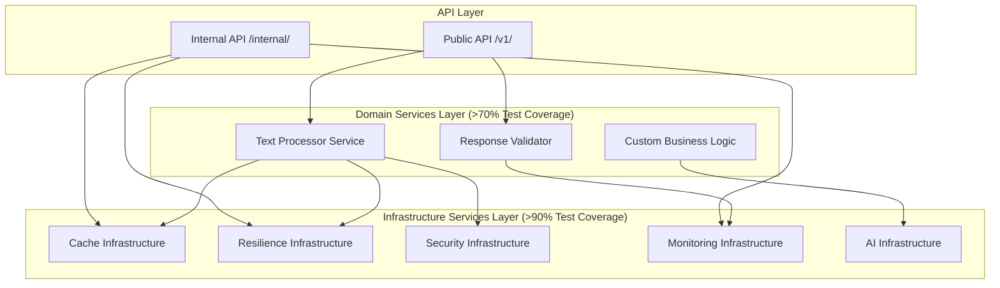

# Code Standards & Examples

This document defines the standardized patterns for code examples, imports, error handling, and sample data across the FastAPI-Streamlit-LLM Starter Template. It establishes the architectural guidelines for infrastructure vs domain service separation and maintains consistency across the entire codebase.

## 📋 Table of Contents

1. [Architecture Guidelines](#architecture-guidelines)
2. [Infrastructure vs Domain Services](#infrastructure-vs-domain-services)
3. [Test Coverage Standards](#test-coverage-standards)
4. [Import Patterns](#import-patterns)
5. [Error Handling](#error-handling)
6. [Sample Data](#sample-data)
7. [Code Structure](#code-structure)
8. [Documentation Examples](#documentation-examples)
9. [Testing Patterns](#testing-patterns)

## 🏗️ Architecture Guidelines

### Template Architecture Principles

The FastAPI-Streamlit-LLM Starter Template follows a **dual-API architecture** with strict separation between **Infrastructure Services** and **Domain Services**:



### Architectural Boundaries

| Aspect | Infrastructure Services | Domain Services |
|--------|------------------------|-----------------|
| **Purpose** | Business-agnostic technical capabilities | Business-specific implementations |
| **Stability** | Stable APIs, minimal breaking changes | Expected to be customized per project |
| **Test Coverage** | **>90% required** | **>70% required** |
| **Reusability** | Reusable across all projects | Project-specific, replaceable |
| **Dependencies** | Only other infrastructure services + external | Infrastructure services + external |
| **Examples** | Cache, Resilience, Security, Monitoring | Text Processing, Business Logic |

## 🏛️ Infrastructure vs Domain Services

### Infrastructure Services (`app/infrastructure/`)

**Definition**: Business-agnostic, reusable technical capabilities that form the backbone of any LLM API.

#### Infrastructure Service Characteristics

```python
# Infrastructure Service Example - CacheInterface
from abc import ABC, abstractmethod
from typing import Any, Optional

class CacheInterface(ABC):
    """Production-ready infrastructure interface (>90% test coverage)."""
    
    @abstractmethod
    async def get(self, key: str) -> Optional[Any]:
        """Retrieve value from cache."""
        pass
    
    @abstractmethod
    async def set(self, key: str, value: Any, ttl: Optional[int] = None) -> None:
        """Store value in cache with optional TTL."""
        pass
    
    @abstractmethod
    async def delete(self, key: str) -> bool:
        """Remove value from cache."""
        pass

# Infrastructure Service Implementation
class AIResponseCache(CacheInterface):
    """Production-ready cache implementation with comprehensive features."""
    
    def __init__(self, redis_url: str = None, default_ttl: int = 3600):
        """Initialize with production-ready defaults."""
        self.redis_url = redis_url
        self.default_ttl = default_ttl
        # Comprehensive initialization for production use
    
    async def get(self, key: str) -> Optional[Any]:
        """Get with comprehensive error handling and monitoring."""
        try:
            # Implementation with monitoring, error handling, graceful degradation
            pass
        except Exception as e:
            # Infrastructure services must handle all error cases
            logger.error(f"Cache get failed: {e}")
            return None  # Graceful degradation
```

#### Infrastructure Service Standards

1. **API Stability**: Public interfaces should remain stable across template updates
2. **Comprehensive Error Handling**: Handle all failure modes gracefully
3. **Configuration-Driven**: Behavior controlled through settings and environment variables
4. **Monitoring Integration**: Built-in performance monitoring and health checks
5. **Documentation**: Comprehensive API documentation with usage examples
6. **Test Coverage**: **>90% test coverage required**

### Domain Services (`app/services/`)

**Definition**: Business-specific implementations serving as educational examples, meant to be replaced with your business logic.

#### Domain Service Characteristics

```python
# Domain Service Example - TextProcessorService
from app.infrastructure.cache import AIResponseCache
from app.infrastructure.resilience import with_operation_resilience
from shared.models import TextProcessingRequest, TextProcessingResponse

class TextProcessorService:
    """Educational example of domain service (>70% test coverage)."""
    
    def __init__(self, cache: AIResponseCache):
        """Initialize with infrastructure service dependencies."""
        self.cache = cache
        # Domain services use infrastructure services
    
    @with_operation_resilience("text_summarization")
    async def summarize(self, request: TextProcessingRequest) -> TextProcessingResponse:
        """Business-specific text summarization logic."""
        # Check cache using infrastructure service
        cached_result = await self.cache.get_cached_response(
            text=request.text,
            operation="summarize",
            options=request.options
        )
        
        if cached_result:
            return cached_result
        
        # Business logic here - this is what you'd replace
        result = await self._perform_summarization(request)
        
        # Cache using infrastructure service
        await self.cache.cache_response(
            text=request.text,
            operation="summarize", 
            options=request.options,
            response=result
        )
        
        return result
    
    async def _perform_summarization(self, request: TextProcessingRequest) -> TextProcessingResponse:
        """Internal business logic - replace with your implementation."""
        # This is the part you customize for your business needs
        pass
```

#### Domain Service Standards

1. **Business Focus**: Implement business-specific logic and workflows
2. **Infrastructure Usage**: Leverage infrastructure services through dependency injection
3. **Customization Expected**: Designed to be replaced per project requirements
4. **Educational Value**: Serve as examples of best practices
5. **Test Coverage**: **>70% test coverage required**

### Service Integration Patterns

#### Dependency Injection Pattern

```python
# FastAPI Dependency Injection for Services
from fastapi import Depends
from app.infrastructure.cache import AIResponseCache, get_cache_service
from app.infrastructure.resilience import AIServiceResilience, get_resilience_service

async def get_text_processor_service(
    cache: AIResponseCache = Depends(get_cache_service),
    resilience: AIServiceResilience = Depends(get_resilience_service)
) -> TextProcessorService:
    """Dependency factory for domain service."""
    return TextProcessorService(cache=cache, resilience=resilience)

# Usage in API endpoints
@app.post("/v1/text_processing/process")
async def process_text(
    request: TextProcessingRequest,
    text_processor: TextProcessorService = Depends(get_text_processor_service)
) -> TextProcessingResponse:
    """Public API endpoint using domain service."""
    return await text_processor.process(request)
```

#### Configuration Pattern

```python
# Infrastructure services use configuration-driven behavior
class CacheConfiguration:
    """Infrastructure service configuration."""
    
    def __init__(self):
        self.redis_url = os.getenv("REDIS_URL", "redis://redis:6379")
        self.default_ttl = int(os.getenv("CACHE_DEFAULT_TTL", "3600"))
        self.compression_threshold = int(os.getenv("CACHE_COMPRESSION_THRESHOLD", "1000"))
    
    @classmethod
    def for_environment(cls, env: str) -> "CacheConfiguration":
        """Get environment-specific configuration."""
        if env == "production":
            config = cls()
            config.default_ttl = 7200  # Longer TTL for production
            return config
        elif env == "development":
            config = cls()
            config.default_ttl = 300   # Shorter TTL for development
            return config
        else:
            return cls()

# Domain services can have simpler, business-focused configuration
class TextProcessingOptions:
    """Domain service configuration."""
    
    def __init__(self):
        self.max_text_length = int(os.getenv("MAX_TEXT_LENGTH", "50000"))
        self.default_language = os.getenv("DEFAULT_LANGUAGE", "en")
        # Business-specific settings
```

## 📊 Test Coverage Standards

### Coverage Requirements

| Service Type | Minimum Coverage | Rationale | Focus Areas |
|--------------|------------------|-----------|-------------|
| **Infrastructure Services** | **>90%** | Stable, reusable foundation | Error handling, edge cases, integration |
| **Domain Services** | **>70%** | Business logic examples | Core functionality, integration patterns |
| **API Endpoints** | **>80%** | Critical user interface | Request validation, response formatting |
| **Integration Tests** | **>85%** | Cross-component reliability | Service interactions, data flow |

### Test Organization by Architecture

```
backend/tests/
├── infrastructure/          # Infrastructure service tests (>90% coverage)
│   ├── cache/              # Cache infrastructure tests
│   ├── resilience/         # Resilience infrastructure tests
│   ├── security/           # Security infrastructure tests
│   └── monitoring/         # Monitoring infrastructure tests
├── services/               # Domain service tests (>70% coverage)
│   ├── test_text_processor.py
│   └── test_response_validator.py
├── api/                    # API endpoint tests (>80% coverage)
│   ├── v1/                # Public API tests
│   └── internal/          # Internal API tests
└── integration/            # Integration tests (>85% coverage)
    ├── test_cache_integration.py
    └── test_end_to_end.py
```

### Infrastructure Service Testing Pattern

```python
# Infrastructure Service Test Example (>90% coverage required)
class TestAIResponseCache:
    """Comprehensive infrastructure service tests."""
    
    @pytest.fixture
    async def cache_service(self):
        """Provide configured cache service for testing."""
        return AIResponseCache(
            redis_url="redis://localhost:6379",
            default_ttl=3600
        )
    
    async def test_basic_operations(self, cache_service):
        """Test basic cache operations."""
        # Test successful get/set/delete operations
        pass
    
    async def test_error_handling_redis_unavailable(self, cache_service):
        """Test graceful degradation when Redis unavailable."""
        # Infrastructure services must handle all failure modes
        pass
    
    async def test_compression_functionality(self, cache_service):
        """Test compression features."""
        # Test infrastructure-specific features
        pass
    
    async def test_performance_monitoring(self, cache_service):
        """Test built-in performance monitoring."""
        # Infrastructure services include monitoring
        pass
    
    @pytest.mark.parametrize("ttl", [60, 3600, 7200])
    async def test_ttl_configurations(self, cache_service, ttl):
        """Test various TTL configurations."""
        # Test configuration-driven behavior
        pass
```

### Domain Service Testing Pattern

```python
# Domain Service Test Example (>70% coverage required)
class TestTextProcessorService:
    """Domain service tests focusing on business logic."""
    
    @pytest.fixture
    def mock_dependencies(self):
        """Mock infrastructure service dependencies."""
        return {
            "cache": Mock(spec=AIResponseCache),
            "resilience": Mock(spec=AIServiceResilience)
        }
    
    async def test_summarization_logic(self, mock_dependencies):
        """Test core business logic for summarization."""
        # Focus on business logic, not infrastructure concerns
        pass
    
    async def test_integration_with_infrastructure(self, mock_dependencies):
        """Test integration with infrastructure services."""
        # Verify proper use of infrastructure services
        pass
    
    async def test_business_validation_rules(self, mock_dependencies):
        """Test domain-specific validation rules."""
        # Test business rules and constraints
        pass
```

### Test Quality Standards

#### Infrastructure Service Tests Must Include

1. **Error Handling**: All failure modes and graceful degradation
2. **Configuration**: Different configuration scenarios
3. **Performance**: Performance characteristics and monitoring
4. **Integration**: Integration with external systems
5. **Edge Cases**: Boundary conditions and error states
6. **Concurrency**: Thread safety and async behavior

#### Domain Service Tests Must Include

1. **Business Logic**: Core functionality and algorithms
2. **Infrastructure Integration**: Proper use of infrastructure services
3. **Validation**: Business rules and input validation
4. **Error Scenarios**: Business-specific error handling
5. **Integration**: End-to-end business workflows

## 🔧 Import Patterns

### Standard Import Order

All Python files should follow this import order:

```python
#!/usr/bin/env python3
"""Module docstring describing the purpose of the file."""

# 1. Standard library imports (alphabetical)
import asyncio
import json
import logging
import time
from datetime import datetime
from typing import Dict, Any, List, Optional, Union

# 2. Third-party imports (alphabetical)
import httpx
import streamlit as st
from fastapi import FastAPI, HTTPException, status
from pydantic import BaseModel, Field

# 3. Local application imports (alphabetical)
from app.core.config import settings
from app.services.text_processor import text_processor
from shared.models import (
    TextProcessingOperation,
    TextProcessingRequest,
    TextProcessingResponse,
    ErrorResponse
)

# 4. Configure logging (if needed)
logger = logging.getLogger(__name__)
```

### Import Guidelines

- **Group imports** by category with blank lines between groups
- **Sort alphabetically** within each group
- **Use explicit imports** rather than `import *`
- **Import only what you need** to keep dependencies clear
- **Use consistent aliases** (e.g., `import streamlit as st`)

## 🚨 Error Handling

### Standard Error Handling Pattern

All functions should follow this error handling pattern:

```python
async def process_request(request: TextProcessingRequest) -> Optional[TextProcessingResponse]:
    """Process a text request with standardized error handling."""
    try:
        logger.info(f"Processing request for operation: {request.operation}")
        
        # Validate input
        if not request.text.strip():
            raise ValueError("Text cannot be empty")
        
        # Process the request
        result = await perform_processing(request)
        
        logger.info("Request processed successfully")
        return result
        
    except ValueError as e:
        logger.warning(f"Validation error: {str(e)}")
        raise HTTPException(
            status_code=status.HTTP_400_BAD_REQUEST,
            detail=str(e)
        )
    except httpx.TimeoutException:
        logger.error("Request timeout")
        raise HTTPException(
            status_code=status.HTTP_408_REQUEST_TIMEOUT,
            detail="Request timed out. Please try again."
        )
    except Exception as e:
        logger.error(f"Unexpected error: {str(e)}")
        raise HTTPException(
            status_code=status.HTTP_500_INTERNAL_SERVER_ERROR,
            detail="Internal server error"
        )
```

### Error Handling Guidelines

- **Always log errors** with appropriate log levels
- **Use specific exception types** when possible
- **Provide meaningful error messages** to users
- **Include context** in error logs for debugging
- **Handle timeouts explicitly** for external API calls
- **Return appropriate HTTP status codes**

### Client-Side Error Handling

```python
async def api_call_with_error_handling(client: httpx.AsyncClient, url: str, data: Dict[str, Any]) -> Optional[Dict[str, Any]]:
    """Make API call with standardized error handling."""
    try:
        response = await client.post(url, json=data, timeout=30.0)
        response.raise_for_status()
        return response.json()
        
    except httpx.TimeoutException:
        logger.error("API request timeout")
        st.error("Request timed out. Please try again.")
        return None
    except httpx.HTTPStatusError as e:
        logger.error(f"API error: {e.response.status_code}")
        error_detail = e.response.json().get('detail', 'Unknown error')
        st.error(f"API Error: {error_detail}")
        return None
    except Exception as e:
        logger.error(f"Unexpected error: {str(e)}")
        st.error(f"Error: {str(e)}")
        return None
```

## 📝 Sample Data

### Standard Sample Texts

Use these standardized sample texts across all examples and documentation:

```python
# Standard sample texts for consistent examples
STANDARD_SAMPLE_TEXTS = {
    "ai_technology": """
    Artificial intelligence is revolutionizing industries across the globe. 
    From healthcare diagnostics to autonomous vehicles, AI systems are becoming 
    increasingly sophisticated and capable. Machine learning algorithms can now 
    process vast amounts of data to identify patterns and make predictions with 
    remarkable accuracy. However, this rapid advancement also raises important 
    questions about ethics, privacy, and the future of human employment in an 
    AI-driven world.
    """,
    
    "climate_change": """
    Climate change represents one of the most significant challenges facing 
    humanity today. Rising global temperatures, caused primarily by increased 
    greenhouse gas emissions, are leading to more frequent extreme weather events, 
    rising sea levels, and disruptions to ecosystems worldwide. Scientists agree 
    that immediate action is required to mitigate these effects and transition 
    to sustainable energy sources. The Paris Agreement, signed by nearly 200 
    countries, aims to limit global warming to well below 2 degrees Celsius 
    above pre-industrial levels.
    """,
    
    "business_report": """
    The quarterly earnings report shows strong performance across all business 
    units. Revenue increased by 15% compared to the same period last year, driven 
    primarily by growth in our digital services division. Customer satisfaction 
    scores have improved significantly, and we've successfully launched three new 
    products. Looking ahead, we remain optimistic about market conditions and 
    expect continued growth in the coming quarters.
    """,
    
    "positive_review": """
    I absolutely love this new product! It has exceeded all my expectations and 
    made my daily routine so much easier. The design is elegant, the functionality 
    is intuitive, and the customer service was fantastic. I would definitely 
    recommend this to anyone looking for a high-quality solution.
    """,
    
    "negative_review": """
    This product was a complete disappointment. The build quality is poor, the 
    interface is confusing, and it doesn't work as advertised. Customer support 
    was unhelpful and took days to respond. I would not recommend this product 
    and am considering returning it for a refund.
    """
}
```

### Sample Data Guidelines

- **Use consistent sample texts** across all examples
- **Choose representative content** for each operation type
- **Keep text length appropriate** (100-500 words typically)
- **Include diverse content types** (technical, business, reviews, etc.)
- **Ensure content is appropriate** and professional

## 🏗️ Code Structure

### Function Structure

```python
async def standard_function_template(
    required_param: str,
    optional_param: Optional[str] = None,
    options: Dict[str, Any] = None
) -> Dict[str, Any]:
    """
    Brief description of what the function does.
    
    Args:
        required_param: Description of required parameter
        optional_param: Description of optional parameter
        options: Dictionary of additional options
        
    Returns:
        Dictionary containing the result and metadata
        
    Raises:
        ValueError: When input validation fails
        HTTPException: When API call fails
    """
    # Initialize variables
    options = options or {}
    start_time = time.time()
    
    try:
        # Input validation
        if not required_param.strip():
            raise ValueError("Required parameter cannot be empty")
        
        # Main processing logic
        result = await perform_main_operation(required_param, options)
        
        # Calculate metrics
        processing_time = time.time() - start_time
        
        # Return standardized response
        return {
            "success": True,
            "result": result,
            "metadata": {
                "processing_time": processing_time,
                "timestamp": datetime.now().isoformat()
            }
        }
        
    except Exception as e:
        logger.error(f"Error in {__name__}: {str(e)}")
        raise
```

### Class Structure

```python
class StandardServiceTemplate:
    """
    Brief description of the service class.
    
    This class provides standardized methods for [specific functionality].
    All methods follow consistent error handling and logging patterns.
    """
    
    def __init__(self, config: Optional[Dict[str, Any]] = None):
        """
        Initialize the service with configuration.
        
        Args:
            config: Optional configuration dictionary
        """
        self.config = config or {}
        self.logger = logging.getLogger(self.__class__.__name__)
        
        # Initialize any required resources
        self._initialize_resources()
    
    def _initialize_resources(self) -> None:
        """Initialize internal resources (private method)."""
        # Implementation details
        pass
    
    async def public_method(self, param: str) -> Dict[str, Any]:
        """
        Public method with standardized structure.
        
        Args:
            param: Description of parameter
            
        Returns:
            Standardized response dictionary
        """
        try:
            self.logger.info(f"Processing {param}")
            
            # Method implementation
            result = await self._process_internal(param)
            
            return {
                "success": True,
                "result": result
            }
            
        except Exception as e:
            self.logger.error(f"Error in {self.__class__.__name__}.public_method: {str(e)}")
            raise
    
    async def _process_internal(self, param: str) -> Any:
        """Internal processing method (private)."""
        # Implementation details
        pass
```

## 📚 Documentation Examples

### API Endpoint Documentation

```python
@app.post("/process", response_model=TextProcessingResponse)
async def process_text(request: TextProcessingRequest):
    """
    Process text using AI models.
    
    This endpoint accepts text and performs various AI-powered operations
    such as summarization, sentiment analysis, and key point extraction.
    
    **Example Request:**
    ```json
    {
        "text": "Artificial intelligence is revolutionizing industries...",
        "operation": "summarize",
        "options": {"max_length": 100}
    }
    ```
    
    **Example Response:**
    ```json
    {
        "operation": "summarize",
        "success": true,
        "result": "AI is transforming industries..."
    }
    ```
    
    **Error Responses:**
    - 400: Invalid input (text too short/long, invalid operation)
    - 500: Internal server error (AI service unavailable)
    """
    # Implementation follows standard error handling pattern
    pass
```

### Usage Examples in Documentation

```python
# Example 1: Basic Text Summarization
async def example_summarization():
    """Demonstrate text summarization with error handling."""
    async with httpx.AsyncClient() as client:
        try:
            response = await client.post(
                "http://localhost:8000/process",
                json={
                    "text": STANDARD_SAMPLE_TEXTS["ai_technology"],
                    "operation": "summarize",
                    "options": {"max_length": 100}
                },
                timeout=30.0
            )
            response.raise_for_status()
            result = response.json()
            print(f"Summary: {result['result']}")
            
        except httpx.HTTPStatusError as e:
            print(f"API Error: {e.response.status_code}")
        except httpx.TimeoutException:
            print("Request timed out")
        except Exception as e:
            print(f"Error: {str(e)}")

# Example 2: Batch Processing
async def example_batch_processing():
    """Demonstrate batch processing with error handling."""
    operations = [
        ("summarize", {"max_length": 50}),
        ("sentiment", {}),
        ("key_points", {"max_points": 3})
    ]
    
    async with httpx.AsyncClient() as client:
        results = []
        
        for operation, options in operations:
            try:
                response = await client.post(
                    "http://localhost:8000/process",
                    json={
                        "text": STANDARD_SAMPLE_TEXTS["business_report"],
                        "operation": operation,
                        "options": options
                    },
                    timeout=30.0
                )
                response.raise_for_status()
                results.append(response.json())
                
            except Exception as e:
                print(f"Error processing {operation}: {str(e)}")
                results.append({"error": str(e)})
        
        return results
```

## 🧪 Testing Patterns

### Test Structure

```python
import pytest
from unittest.mock import AsyncMock, patch
from httpx import AsyncClient

class TestStandardPattern:
    """Test class following standard patterns."""
    
    @pytest.fixture
    def sample_data(self):
        """Provide standard sample data for tests."""
        return {
            "text": STANDARD_SAMPLE_TEXTS["ai_technology"],
            "operation": "summarize",
            "options": {"max_length": 100}
        }
    
    async def test_successful_operation(self, sample_data):
        """Test successful operation with standard sample data."""
        # Arrange
        expected_result = "AI is transforming industries..."
        
        # Act
        result = await process_text_function(sample_data)
        
        # Assert
        assert result["success"] is True
        assert "result" in result
        assert result["metadata"]["processing_time"] > 0
    
    async def test_error_handling(self, sample_data):
        """Test error handling with invalid input."""
        # Arrange
        sample_data["text"] = ""  # Invalid empty text
        
        # Act & Assert
        with pytest.raises(ValueError, match="Text cannot be empty"):
            await process_text_function(sample_data)
    
    @patch('httpx.AsyncClient')
    async def test_api_timeout(self, mock_client, sample_data):
        """Test API timeout handling."""
        # Arrange
        mock_client.return_value.__aenter__.return_value.post.side_effect = httpx.TimeoutException("Timeout")
        
        # Act
        result = await api_call_function(sample_data)
        
        # Assert
        assert result is None
```

### Test Guidelines

- **Use standard sample data** from `STANDARD_SAMPLE_TEXTS`
- **Test both success and error cases**
- **Mock external dependencies** consistently
- **Use descriptive test names** that explain what is being tested
- **Follow Arrange-Act-Assert pattern**
- **Include performance assertions** where appropriate

## 🔍 Code Review Standards

### Infrastructure vs Domain Service Review Guidelines

#### Infrastructure Service Reviews

**Focus Areas for Infrastructure Service Changes:**
1. **API Stability**: Ensure backward compatibility and minimal breaking changes
2. **Error Handling**: Verify comprehensive error handling and graceful degradation
3. **Performance**: Check for performance impact and monitoring integration
4. **Test Coverage**: Require >90% test coverage with comprehensive edge case testing
5. **Documentation**: Ensure API documentation is complete and accurate
6. **Configuration**: Verify environment-based configuration patterns

**Infrastructure Service Review Checklist:**
- [ ] Public API remains backward compatible
- [ ] All error cases handled with graceful degradation
- [ ] Performance monitoring and metrics included
- [ ] >90% test coverage achieved
- [ ] Configuration-driven behavior implemented
- [ ] Comprehensive documentation provided
- [ ] Integration with other infrastructure services tested

#### Domain Service Reviews

**Focus Areas for Domain Service Changes:**
1. **Business Logic**: Verify correct implementation of business requirements
2. **Infrastructure Usage**: Ensure proper use of infrastructure services
3. **Test Coverage**: Require >70% test coverage focusing on business logic
4. **Integration**: Check integration with infrastructure services
5. **Customization**: Ensure code is customizable and educational

**Domain Service Review Checklist:**
- [ ] Business logic correctly implemented
- [ ] Infrastructure services used appropriately via dependency injection
- [ ] >70% test coverage with focus on business scenarios
- [ ] Clear separation from infrastructure concerns
- [ ] Educational value for template users
- [ ] Customization points clearly identified

### Architecture Compliance Review

**Questions to Ask During Code Reviews:**

1. **Service Classification**: Is this properly classified as infrastructure or domain?
2. **Dependency Direction**: Does the dependency flow follow the architecture (domain → infrastructure)?
3. **Test Coverage**: Does the test coverage meet the service type requirements?
4. **Separation of Concerns**: Are infrastructure concerns separated from business logic?
5. **Configuration**: Is configuration handled appropriately for the service type?

## 🔄 Migration Checklist

When updating existing code to follow these architectural standards:

### 1. Architecture Compliance
- [ ] Classify services as infrastructure or domain
- [ ] Ensure dependency direction flows from domain to infrastructure
- [ ] Verify test coverage meets service type requirements (>90% infra, >70% domain)
- [ ] Separate infrastructure concerns from business logic

### 2. Service Refactoring
- [ ] Move infrastructure services to `app/infrastructure/`
- [ ] Move domain services to `app/services/`
- [ ] Implement dependency injection patterns
- [ ] Add configuration-driven behavior for infrastructure services

### 3. Test Organization
- [ ] Organize tests by architectural boundaries
- [ ] Ensure infrastructure tests achieve >90% coverage
- [ ] Ensure domain tests achieve >70% coverage
- [ ] Add integration tests for service interactions

### 4. Import Standardization
- [ ] Reorder imports according to standard pattern
- [ ] Remove unused imports
- [ ] Use consistent import aliases
- [ ] Group imports with proper spacing

### 5. Error Handling Updates
- [ ] Add try-catch blocks with specific exception types
- [ ] Include appropriate logging statements
- [ ] Use standard error response formats
- [ ] Handle timeouts explicitly

### 6. Sample Data Consistency
- [ ] Replace custom sample texts with `STANDARD_SAMPLE_TEXTS`
- [ ] Update documentation examples
- [ ] Ensure test data consistency
- [ ] Verify example completeness

### 7. Code Structure Alignment
- [ ] Add comprehensive docstrings
- [ ] Follow standard function/class structure
- [ ] Include type hints consistently
- [ ] Add appropriate metadata to responses

### 8. Documentation Updates
- [ ] Update API documentation examples
- [ ] Ensure code examples are runnable
- [ ] Include error handling in examples
- [ ] Verify example consistency across docs

## 📋 Validation & Compliance

### Automated Validation

```bash
# Run comprehensive validation
make lint-backend          # Code style and imports
make test-backend          # Test coverage validation
make test-coverage         # Coverage reports

# Specific validation commands
pytest --cov=app/infrastructure --cov-fail-under=90  # Infrastructure coverage
pytest --cov=app/services --cov-fail-under=70        # Domain coverage
```

### Manual Review Process

1. **Architecture Review**: Verify service classification and dependency flow
2. **Test Coverage Review**: Check coverage meets service type requirements
3. **Code Quality Review**: Ensure code follows established patterns
4. **Documentation Review**: Verify examples and documentation are accurate
5. **Integration Review**: Test service interactions and API contracts

### Compliance Checklist

**For Infrastructure Services:**
- [ ] >90% test coverage achieved
- [ ] API stability maintained
- [ ] Comprehensive error handling implemented
- [ ] Performance monitoring included
- [ ] Configuration-driven behavior
- [ ] Documentation complete

**For Domain Services:**
- [ ] >70% test coverage achieved
- [ ] Business logic clearly implemented
- [ ] Infrastructure services used via dependency injection
- [ ] Educational value maintained
- [ ] Customization points identified

**For API Endpoints:**
- [ ] >80% test coverage achieved
- [ ] Request validation implemented
- [ ] Response formatting standardized
- [ ] Error handling comprehensive
- [ ] Authentication/authorization applied

## 🎯 Success Metrics

### Code Quality Metrics

| Metric | Infrastructure Services | Domain Services | API Endpoints |
|--------|------------------------|-----------------|---------------|
| **Test Coverage** | >90% | >70% | >80% |
| **Cyclomatic Complexity** | <10 per function | <15 per function | <8 per function |
| **Code Duplication** | <5% | <10% | <5% |
| **Documentation Coverage** | 100% public APIs | >80% public methods | 100% endpoints |

### Architecture Compliance Metrics

- **Service Classification Accuracy**: >95% of services correctly classified
- **Dependency Direction Compliance**: 100% compliance with domain → infrastructure flow
- **Test Organization**: 100% of tests in correct architectural boundaries
- **Configuration Consistency**: 100% of infrastructure services use configuration patterns

This standardization ensures consistency, maintainability, and reliability across the entire codebase while maintaining clear architectural boundaries between infrastructure and domain concerns. 