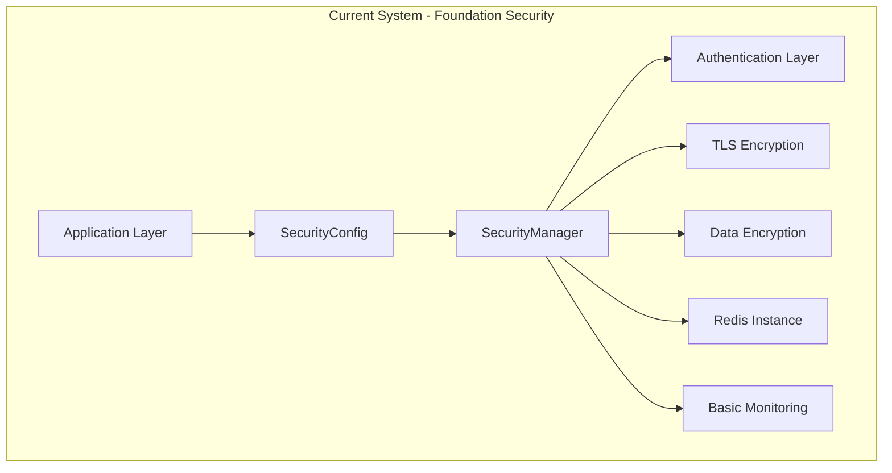
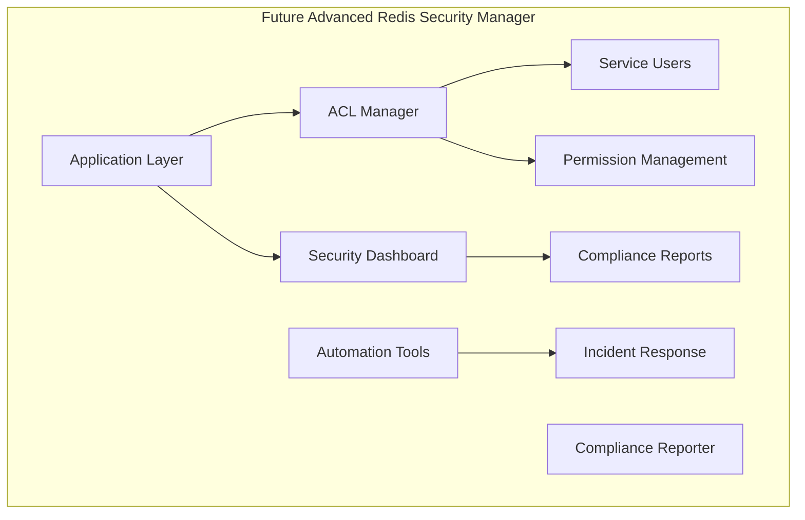

# Advanced Redis Security Manager Roadmap

This guide explains how to extend the FastAPI-Streamlit-LLM Starter Template's Redis security infrastructure with comprehensive operational excellence features, automated ACL management, and enterprise-grade security monitoring.

## 🎯 **Current Redis Security Foundation**

The starter template includes a **production-ready Redis security system** with comprehensive foundational security features:

```python
# Current implementation - Multi-layered Redis security
from app.infrastructure.cache.redis_cache import RedisCacheSecurityManager
from app.infrastructure.cache.redis_cache import SecurityConfig

# Existing security configuration
security_config = SecurityConfig(
    redis_password="secure-password",
    tls_enabled=True,
    tls_cert_file="/path/to/cert.pem",
    tls_key_file="/path/to/key.pem",
    data_encryption_key="32-byte-encryption-key"
)

# Secure Redis connection with built-in monitoring
cache = await ACLEnabledCacheFactory.create_cache_from_config({
    'security_config': security_config,
    'enable_monitoring': True
})
```

### Current Features:
- ✅ **Multi-Layer Security**: Password authentication, TLS encryption, data-at-rest encryption
- ✅ **Network Isolation**: Internal-only access, secure network configuration
- ✅ **Connection Security**: Certificate-based TLS, secure credential management
- ✅ **Built-in Monitoring**: Connection health, security event logging, performance metrics
- ✅ **Infrastructure Integration**: Seamless integration with cache factory patterns
- ✅ **Configuration Management**: Preset-based security configurations for different environments
- ✅ **Error Handling**: Comprehensive security exception handling and recovery

## 🚀 **When to Upgrade to Advanced Redis Security Manager**

Consider upgrading when you need:

- **🔐 Automated ACL Management**: Service-specific Redis users with fine-grained permissions
- **📊 Security Dashboard**: Real-time security visibility in Streamlit interface
- **📋 Compliance Reporting**: Automated security audit reports and compliance tracking
- **⚡ Operational Excellence**: Security health checks, incident response automation
- **🏢 Enterprise Features**: Multi-tenant security, role-based access control, audit trails
- **🔧 Advanced Monitoring**: Security metrics collection, alerting, and analytics

## 🏗️ **Architecture Overview**

### Current Redis Security Architecture


### Future Advanced Redis Security Manager


## 📋 **Implementation Roadmap**

### Phase 1: Automated ACL Management System

#### Service User Architecture
Extend the existing security infrastructure with automated ACL management:

```python
# backend/app/infrastructure/cache/redis_acl_manager.py
from typing import Dict, List, Any
from dataclasses import dataclass
import secrets
import logging
from redis.asyncio import Redis

@dataclass
class ServiceUser:
    """Service-specific Redis user configuration."""
    username: str
    permissions: List[str]
    key_patterns: List[str]
    description: str
    password: str = None

class RedisACLManager:
    """Production-ready ACL management with automated user lifecycle."""

    def __init__(self, redis_client: Redis, security_config: SecurityConfig):
        self.redis = redis_client
        self.config = security_config
        self.logger = logging.getLogger(__name__)

        # Service-specific user definitions
        self.service_profiles = {
            "ai_cache": ServiceUser(
                username="ai_cache",
                permissions=["+@read", "+@write", "+@string", "+@hash", "-@dangerous"],
                key_patterns=["ai_cache:*", "ai_response:*", "text_hash:*"],
                description="AI response caching with read/write access"
            ),
            "health_monitor": ServiceUser(
                username="health_monitor",
                permissions=["+ping", "+info", "+memory", "-@all"],
                key_patterns=["health:*"],
                description="Health monitoring with minimal access"
            ),
            "session_store": ServiceUser(
                username="session_store",
                permissions=["+@read", "+@write", "+@string", "+expires", "-@dangerous"],
                key_patterns=["session:*", "user:*"],
                description="User session management with TTL support"
            ),
            "analytics": ServiceUser(
                username="analytics",
                permissions=["+@read", "+@string", "+@hash", "+@set", "-@dangerous"],
                key_patterns=["analytics:*", "metrics:*", "stats:*"],
                description="Analytics data collection (read-only access)"
            )
        }

    async def setup_production_users(self) -> Dict[str, str]:
        """Create all production users with generated passwords."""
        created_users = {}

        for username, profile in self.service_profiles.items():
            password = self._generate_secure_password()
            profile.password = password

            try:
                await self._create_acl_user(profile)
                created_users[username] = password
                self.logger.info(f"Created ACL user: {username}")
            except Exception as e:
                self.logger.error(f"Failed to create ACL user {username}: {e}")
                raise

        return created_users

    async def _create_acl_user(self, user: ServiceUser):
        """Create Redis ACL user with specific permissions."""
        # Create user with password
        await self.redis.execute_command(
            "ACL", "SETUSER", user.username,
            f">{user.password}",
            "on",
            *user.permissions,
            "~" + user.key_patterns[0] if user.key_patterns else "&*"
        )

        # Set up additional key patterns if specified
        for pattern in user.key_patterns[1:]:
            await self.redis.execute_command(
                "ACL", "SETUSER", user.username, "~" + pattern
            )

    def _generate_secure_password(self) -> str:
        """Generate cryptographically secure password."""
        return secrets.token_urlsafe(32)

    async def rotate_user_credentials(self, username: str) -> str:
        """Rotate credentials for specific service user."""
        if username not in self.service_profiles:
            raise ValueError(f"Unknown service user: {username}")

        new_password = self._generate_secure_password()
        await self.redis.execute_command(
            "ACL", "SETUSER", username,
            f">{new_password}"
        )

        self.logger.info(f"Rotated credentials for user: {username}")
        return new_password

    async def validate_acl_configuration(self) -> Dict[str, Any]:
        """Validate current ACL setup and return security status."""
        status = {
            "users_created": [],
            "users_missing": [],
            "permission_issues": [],
            "overall_secure": True
        }

        # Check each service user
        for username, profile in self.service_profiles.items():
            try:
                # Check if user exists
                user_info = await self.redis.execute_command("ACL", "GETUSER", username)
                if user_info:
                    status["users_created"].append(username)
                else:
                    status["users_missing"].append(username)
                    status["overall_secure"] = False
            except Exception as e:
                status["permission_issues"].append(f"{username}: {str(e)}")
                status["overall_secure"] = False

        return status
```

#### Integration with Existing Cache Factory
```python
# backend/app/infrastructure/cache/acl_enabled_factory.py
from typing import Tuple, Dict, Any
from app.infrastructure.cache.redis_cache import CacheFactory, SecurityConfig
from app.infrastructure.cache.redis_acl_manager import RedisACLManager

class ACLEnabledCacheFactory(CacheFactory):
    """Extended cache factory with automated ACL management."""

    @classmethod
    async def create_production_cache_with_acl(
        cls,
        base_config: Dict[str, Any],
        enable_acl: bool = True
    ) -> Tuple[CacheInterface, Dict[str, str]]:
        """Create cache with automated ACL setup."""

        if not enable_acl:
            return await cls.create_cache_from_config(base_config), {}

        # Create secure admin connection for ACL management
        security_config = SecurityConfig(**base_config.get('security_config', {}))
        security_manager = RedisCacheSecurityManager(security_config)
        redis_admin = await security_manager.create_secure_connection()

        # Set up ACL users
        acl_manager = RedisACLManager(redis_admin, security_config)
        service_credentials = await acl_manager.setup_production_users()

        # Create cache with service-specific credentials
        cache_config = {**base_config}
        cache_config['security_config'] = SecurityConfig(
            acl_username="ai_cache",
            acl_password=service_credentials["ai_cache"],
            **security_config.__dict__
        )

        cache = await cls.create_cache_from_config(cache_config)

        return cache, service_credentials
```

### Phase 2: Security Dashboard Integration

#### Streamlit Security Components
```python
# frontend/components/security_dashboard.py
import streamlit as st
import plotly.express as px
from datetime import datetime, timedelta
import asyncio
from typing import Dict, Any

class SecurityDashboard:
    """Security monitoring dashboard for Streamlit."""

    def __init__(self):
        self.refresh_interval = 30  # seconds

    def render_security_overview(self):
        """Render main security status overview."""
        st.header("🔒 Redis Security Status")

        # Get security status
        security_status = asyncio.run(self._get_security_status())

        # Overall security indicator
        col1, col2, col3 = st.columns(3)

        with col1:
            if security_status['overall_secure']:
                st.success("✅ Secure")
                st.metric("Security Score", f"{security_status['score']}/100")
            else:
                st.error("⚠️ Security Issues")
                st.metric("Security Score", f"{security_status['score']}/100", delta=f"-{100-security_status['score']}")

        with col2:
            st.metric("Active ACL Users", security_status['active_users'])
            st.metric("Recent Events", security_status['recent_events'])

        with col3:
            encryption_status = "✅" if security_status['encryption_enabled'] else "❌"
            st.metric("Data Encryption", encryption_status)
            network_status = "✅" if security_status['network_isolated'] else "❌"
            st.metric("Network Isolated", network_status)

    def render_security_metrics(self):
        """Render detailed security metrics."""
        st.subheader("📊 Security Metrics")

        # Get metrics data
        metrics = asyncio.run(self._get_security_metrics())

        # Authentication metrics
        col1, col2 = st.columns(2)

        with col1:
            st.metric(
                "Auth Success Rate (24h)",
                f"{metrics['auth_success_rate']:.1f}%",
                delta=f"{metrics['auth_trend']:+.1f}%"
            )
            st.metric("Failed Logins (24h)", metrics['failed_auth'])

        with col2:
            st.metric("ACL Permission Denials", metrics['permission_denials'])
            st.metric("Security Alerts", metrics['active_alerts'])

        # Security events timeline
        if metrics['events']:
            fig = px.line(
                metrics['events'],
                x='timestamp',
                y='count',
                title='Security Events Timeline',
                color='event_type'
            )
            st.plotly_chart(fig, use_container_width=True)

    def render_user_management(self):
        """Render ACL user management interface."""
        st.subheader("👥 Service User Management")

        # Get user status
        user_status = asyncio.run(self._get_user_status())

        # User status table
        for username, info in user_status.items():
            with st.expander(f"{username} - {info['description']}"):
                col1, col2, col3 = st.columns(3)

                with col1:
                    st.write("**Permissions:**")
                    for perm in info['permissions']:
                        st.write(f"• {perm}")

                with col2:
                    st.write("**Key Patterns:**")
                    for pattern in info['key_patterns']:
                        st.write(f"• {pattern}")

                with col3:
                    if st.button(f"Rotate Password", key=f"rotate_{username}"):
                        with st.spinner("Rotating password..."):
                            new_password = asyncio.run(self._rotate_password(username))
                            st.success(f"Password rotated for {username}")
                            st.code(new_password)

    def render_compliance_section(self):
        """Render compliance reporting section."""
        st.subheader("📋 Compliance & Auditing")

        # Compliance status
        compliance_status = asyncio.run(self._get_compliance_status())

        col1, col2 = st.columns(2)

        with col1:
            st.metric("Configuration Compliance", f"{compliance_status['config_compliance']}%")
            st.metric("Operational Compliance", f"{compliance_status['operational_compliance']}%")

        with col2:
            if st.button("Generate Compliance Report"):
                with st.spinner("Generating report..."):
                    report = asyncio.run(self._generate_compliance_report())
                    st.download_button(
                        "Download Report",
                        report,
                        "redis_security_compliance.pdf",
                        "application/pdf"
                    )

    async def _get_security_status(self) -> Dict[str, Any]:
        """Get current security status from backend."""
        # This would call your backend API
        # For demo purposes, returning mock data
        return {
            "overall_secure": True,
            "score": 95,
            "active_users": 4,
            "recent_events": 12,
            "encryption_enabled": True,
            "network_isolated": True
        }

    async def _get_security_metrics(self) -> Dict[str, Any]:
        """Get detailed security metrics."""
        return {
            "auth_success_rate": 98.5,
            "auth_trend": 0.3,
            "failed_auth": 2,
            "permission_denials": 0,
            "active_alerts": 0,
            "events": [
                {"timestamp": datetime.now() - timedelta(hours=i),
                 "count": i % 5 + 1,
                 "event_type": "auth_success"}
                for i in range(24)
            ]
        }

    async def _get_user_status(self) -> Dict[str, Any]:
        """Get ACL user status."""
        return {
            "ai_cache": {
                "description": "AI response caching",
                "permissions": ["+@read", "+@write", "+@string", "+@hash", "-@dangerous"],
                "key_patterns": ["ai_cache:*", "ai_response:*"],
                "status": "Active"
            },
            "health_monitor": {
                "description": "Health monitoring",
                "permissions": ["+ping", "+info", "+memory", "-@all"],
                "key_patterns": ["health:*"],
                "status": "Active"
            }
        }

    async def _rotate_password(self, username: str) -> str:
        """Rotate password for service user."""
        # This would call your backend API
        return f"new-secure-password-for-{username}"

    async def _get_compliance_status(self) -> Dict[str, Any]:
        """Get compliance status."""
        return {
            "config_compliance": 100,
            "operational_compliance": 95
        }

    async def _generate_compliance_report(self) -> bytes:
        """Generate compliance report."""
        # This would generate a PDF report
        return b"PDF content here"

# Integration with existing Streamlit app
def add_security_dashboard():
    """Add security dashboard to existing Streamlit app."""
    dashboard = SecurityDashboard()

    # Add to existing navigation
    pages = {
        "🏠 Home": "home",
        "💬 Chat": "chat",
        "📊 Performance": "performance",
        "🔒 Security": "security"
    }

    if st.sidebar.selectbox("Navigate", list(pages.keys())) == "🔒 Security":
        dashboard.render_security_overview()
        dashboard.render_security_metrics()
        dashboard.render_user_management()
        dashboard.render_compliance_section()
```

### Phase 3: Compliance and Reporting

#### Security Compliance Reporter
```python
# backend/app/infrastructure/security/compliance_reporter.py
from typing import Dict, Any, List
from datetime import datetime, timedelta
from dataclasses import dataclass
import json
from pathlib import Path

@dataclass
class ComplianceFramework:
    """Security compliance framework definition."""
    name: str
    controls: List[str]
    evidence_mapping: Dict[str, List[str]]

class SecurityComplianceReporter:
    """Generate security compliance reports for audit and governance."""

    def __init__(self, cache_service, security_manager):
        self.cache = cache_service
        self.security_manager = security_manager

        # Define compliance frameworks
        self.frameworks = {
            "SOC2": ComplianceFramework(
                name="SOC 2 Type II",
                controls=[
                    "CC6.1: Authentication and Access Control",
                    "CC6.2: Authorization",
                    "CC6.3: System Access Monitoring",
                    "CC6.7: Data Transmission and Disposal"
                ],
                evidence_mapping={
                    "CC6.1": ["acl_configuration", "auth_success_rates"],
                    "CC6.2": ["permission_boundaries", "acl_users"],
                    "CC6.3": ["security_event_logs", "monitoring_alerts"],
                    "CC6.7": ["encryption_status", "tls_configuration"]
                }
            ),
            "ISO27001": ComplianceFramework(
                name="ISO 27001:2022",
                controls=[
                    "A.9.1.1: Access control policy",
                    "A.10.1.1: Cryptographic controls policy",
                    "A.12.4.1: Event logging",
                    "A.13.1.1: Network controls"
                ],
                evidence_mapping={
                    "A.9.1.1": ["acl_policies", "user_access_procedures"],
                    "A.10.1.1": ["encryption_policies", "key_management"],
                    "A.12.4.1": ["security_logs", "event_correlation"],
                    "A.13.1.1": ["network_isolation", "tls_configuration"]
                }
            )
        }

    async def generate_compliance_report(self, framework: str = "SOC2") -> Dict[str, Any]:
        """Generate comprehensive security compliance report."""

        # Validate framework
        if framework not in self.frameworks:
            raise ValueError(f"Unsupported framework: {framework}")

        framework_def = self.frameworks[framework]

        # Collect security configuration status
        security_status = await self.security_manager.validate_connection_security()

        # Collect operational metrics
        cache_stats = await self.cache.get_cache_stats()

        # Analyze security events
        security_events = await self._analyze_security_events()

        # Assess compliance for each control
        compliance_results = {}
        for control in framework_def.controls:
            compliance_results[control] = await self._assess_control_compliance(
                control,
                framework_def.evidence_mapping.get(control, []),
                security_status,
                security_events
            )

        # Calculate overall compliance score
        total_controls = len(compliance_results)
        compliant_controls = sum(1 for result in compliance_results.values() if result['compliant'])
        overall_compliance = (compliant_controls / total_controls) * 100 if total_controls > 0 else 0

        return {
            "report_metadata": {
                "generated_at": datetime.utcnow().isoformat(),
                "framework": framework_def.name,
                "version": "1.0",
                "period": {
                    "start": (datetime.utcnow() - timedelta(days=30)).isoformat(),
                    "end": datetime.utcnow().isoformat()
                }
            },
            "executive_summary": {
                "overall_compliance": round(overall_compliance, 1),
                "total_controls": total_controls,
                "compliant_controls": compliant_controls,
                "high_risk_issues": self._identify_high_risk_issues(compliance_results),
                "recommendations": self._generate_framework_recommendations(compliance_results)
            },
            "security_configuration": {
                "authentication_enabled": security_status.has_authentication,
                "encryption_in_transit": security_status.tls_enabled,
                "encryption_at_rest": security_status.data_encrypted,
                "network_isolation": security_status.network_isolated,
                "security_level": security_status.security_level
            },
            "operational_security": {
                "total_auth_attempts": security_events["auth_attempts"],
                "failed_auth_attempts": security_events["auth_failures"],
                "auth_success_rate": security_events["auth_success_rate"],
                "security_alerts_triggered": security_events["alerts"],
                "permission_denials": security_events["permission_denials"]
            },
            "compliance_results": compliance_results,
            "detailed_findings": await self._generate_detailed_findings(security_status, security_events),
            "appendix": {
                "methodology": "Automated security assessment with manual validation",
                "scope": "Redis infrastructure security controls",
                "limitations": "Assessment based on available monitoring data"
            }
        }

    async def _assess_control_compliance(
        self,
        control: str,
        evidence_items: List[str],
        security_status: Any,
        security_events: Dict[str, Any]
    ) -> Dict[str, Any]:
        """Assess compliance for a specific control."""

        # Evidence collection and analysis logic
        evidence_status = {}
        for item in evidence_items:
            evidence_status[item] = await self._collect_evidence(item, security_status, security_events)

        # Determine compliance status
        compliant_count = sum(1 for status in evidence_status.values() if status['present'])
        total_count = len(evidence_status)
        is_compliant = compliant_count >= (total_count * 0.8)  # 80% threshold

        return {
            "control": control,
            "compliant": is_compliant,
            "evidence_coverage": f"{compliant_count}/{total_count}",
            "evidence_status": evidence_status,
            "findings": self._generate_control_findings(control, evidence_status),
            "risk_level": self._assess_risk_level(control, evidence_status)
        }

    async def _collect_evidence(
        self,
        evidence_type: str,
        security_status: Any,
        security_events: Dict[str, Any]
    ) -> Dict[str, Any]:
        """Collect specific evidence for compliance assessment."""

        evidence_mapping = {
            "acl_configuration": {
                "present": hasattr(security_status, 'acl_configured') and security_status.acl_configured,
                "details": "ACL users and permissions configured"
            },
            "auth_success_rates": {
                "present": security_events.get("auth_success_rate", 0) > 95,
                "details": f"Authentication success rate: {security_events.get('auth_success_rate', 0):.1f}%"
            },
            "permission_boundaries": {
                "present": security_events.get("permission_denials", 0) >= 0,
                "details": f"Permission denials tracked: {security_events.get('permission_denials', 0)}"
            },
            "encryption_status": {
                "present": security_status.tls_enabled and security_status.data_encrypted,
                "details": "TLS and data-at-rest encryption enabled"
            },
            "security_event_logs": {
                "present": len(security_events.get("recent_events", [])) > 0,
                "details": f"Security events logged: {len(security_events.get('recent_events', []))}"
            }
        }

        return evidence_mapping.get(evidence_type, {"present": False, "details": "Unknown evidence type"})

    async def _analyze_security_events(self) -> Dict[str, Any]:
        """Analyze recent security events."""
        # This would collect and analyze actual security events
        # For demo purposes, returning mock data
        return {
            "auth_attempts": 1000,
            "auth_failures": 15,
            "auth_success_rate": 98.5,
            "alerts": 0,
            "permission_denials": 3,
            "recent_events": [
                {
                    "timestamp": datetime.utcnow() - timedelta(hours=i),
                    "type": "auth_success" if i % 10 != 0 else "auth_failure",
                    "details": "Successful authentication" if i % 10 != 0 else "Failed authentication attempt"
                }
                for i in range(100)
            ]
        }

    def _identify_high_risk_issues(self, compliance_results: Dict[str, Any]) -> List[str]:
        """Identify high-risk compliance issues."""
        high_risk = []

        for control, result in compliance_results.items():
            if not result['compliant'] and result['risk_level'] == 'HIGH':
                high_risk.append(control)

        return high_risk

    def _generate_framework_recommendations(self, compliance_results: Dict[str, Any]) -> List[str]:
        """Generate framework-specific recommendations."""
        recommendations = []

        # Common recommendations based on findings
        non_compliant_controls = [control for control, result in compliance_results.items() if not result['compliant']]

        if non_compliant_controls:
            recommendations.append("Address non-compliant controls to improve overall security posture")

        if any("authentication" in control.lower() for control in non_compliant_controls):
            recommendations.append("Enhance authentication mechanisms and monitoring")

        if any("encryption" in control.lower() for control in non_compliant_controls):
            recommendations.append("Strengthen encryption controls and key management")

        return recommendations

    def _generate_control_findings(self, control: str, evidence_status: Dict[str, Any]) -> List[str]:
        """Generate specific findings for a control."""
        findings = []

        missing_evidence = [item for item, status in evidence_status.items() if not status['present']]
        if missing_evidence:
            findings.append(f"Missing evidence for: {', '.join(missing_evidence)}")

        return findings

    def _assess_risk_level(self, control: str, evidence_status: Dict[str, Any]) -> str:
        """Assess risk level for a control."""
        compliant_ratio = sum(1 for status in evidence_status.values() if status['present']) / len(evidence_status)

        if compliant_ratio >= 0.9:
            return "LOW"
        elif compliant_ratio >= 0.7:
            return "MEDIUM"
        else:
            return "HIGH"

    async def _generate_detailed_findings(self, security_status: Any, security_events: Dict[str, Any]) -> Dict[str, Any]:
        """Generate detailed security findings."""
        return {
            "security_strengths": [
                "Multi-layer authentication configured",
                "TLS encryption enabled for data in transit",
                "Data-at-rest encryption implemented",
                "Network isolation configured"
            ],
            "areas_for_improvement": [
                "Enhanced monitoring and alerting",
                "Automated security incident response",
                "Regular security configuration reviews"
            ],
            "security_metrics": {
                "auth_success_rate": security_events.get("auth_success_rate", 0),
                "failed_attempts_24h": security_events.get("auth_failures", 0),
                "security_alerts": security_events.get("alerts", 0)
            }
        }

    async def export_report_to_pdf(self, report_data: Dict[str, Any], output_path: Path) -> str:
        """Export compliance report to PDF format."""
        # This would use a PDF generation library like reportlab
        # For demo purposes, returning the path
        output_path.write_text(json.dumps(report_data, indent=2))
        return str(output_path)
```

### Phase 4: Operational Automation

#### Security Operations Scripts
```bash
#!/bin/bash
# scripts/security_operations.sh
# Automated security operations and incident response

set -euo pipefail

SCRIPT_DIR="$(cd "$(dirname "${BASH_SOURCE[0]}")" && pwd)"
PROJECT_ROOT="$(cd "$SCRIPT_DIR/.." && pwd)"

# Configuration
SECURITY_CONFIG_FILE="$PROJECT_ROOT/.env"
LOG_DIR="$PROJECT_ROOT/logs/security"
INCIDENT_REPORT_DIR="$PROJECT_ROOT/reports/security"

# Ensure log directories exist
mkdir -p "$LOG_DIR" "$INCIDENT_REPORT_DIR"

# Color codes for output
RED='\033[0;31m'
GREEN='\033[0;32m'
YELLOW='\033[1;33m'
BLUE='\033[0;34m'
NC='\033[0m' # No Color

log() {
    echo -e "${BLUE}[$(date +'%Y-%m-%d %H:%M:%S')]${NC} $1"
}

success() {
    echo -e "${GREEN}✅ $1${NC}"
}

warning() {
    echo -e "${YELLOW}⚠️  $1${NC}"
}

error() {
    echo -e "${RED}❌ $1${NC}"
}

# Function 1: Security Health Check
security_health_check() {
    log "Performing comprehensive security health check..."

    # Check authentication
    if curl -s -f "http://localhost:8000/internal/health/auth" > /dev/null; then
        success "Authentication system: Healthy"
    else
        error "Authentication system: Unhealthy"
        return 1
    fi

    # Check Redis security
    if python -c "
import asyncio
import sys
sys.path.append('$PROJECT_ROOT/backend')
from app.infrastructure.cache.redis_cache import RedisCacheSecurityManager
from app.core.config import get_settings

async def check_redis():
    settings = get_settings()
    security_manager = RedisCacheSecurityManager(settings.redis.security)
    status = await security_manager.validate_connection_security()
    if status.overall_secure:
        print('✅ Redis security: Secure')
        return True
    else:
        print('❌ Redis security: Issues detected')
        return False

result = asyncio.run(check_redis())
sys.exit(0 if result else 1)
"; then
        success "Redis security: Secure"
    else
        error "Redis security: Issues detected"
        return 1
    fi

    # Check ACL configuration
    if python -c "
import asyncio
import sys
sys.path.append('$PROJECT_ROOT/backend')
from app.infrastructure.cache.redis_acl_manager import RedisACLManager
from app.infrastructure.cache.redis_cache import RedisCacheSecurityManager
from app.core.config import get_settings

async def check_acl():
    settings = get_settings()
    security_manager = RedisCacheSecurityManager(settings.redis.security)
    redis_conn = await security_manager.create_secure_connection()
    acl_manager = RedisACLManager(redis_conn, settings.redis.security)
    status = await acl_manager.validate_acl_configuration()
    if status['overall_secure']:
        print('✅ ACL configuration: Valid')
        return True
    else:
        print('❌ ACL configuration: Issues detected')
        print(f'Missing users: {status[\"users_missing\"]}')
        return False

result = asyncio.run(check_acl())
sys.exit(0 if result else 1)
"; then
        success "ACL configuration: Valid"
    else
        error "ACL configuration: Issues detected"
        return 1
    fi

    success "Security health check completed successfully"
    return 0
}

# Function 2: Incident Response
incident_response() {
    local incident_type="$1"
    local severity="$2"

    log "🚨 Initiating incident response for: $incident_type (Severity: $severity)"

    # Create incident report
    local incident_id="$(date +%Y%m%d_%H%M%S)_${incident_type}"
    local incident_file="$INCIDENT_REPORT_DIR/incident_$incident_id.md"

    cat > "$incident_file" << EOF
# Security Incident Report

**Incident ID:** $incident_id
**Type:** $incident_type
**Severity:** $severity
**Timestamp:** $(date -u +"%Y-%m-%d %H:%M:%S UTC")
**Responder:** $(whoami)

## Initial Assessment

Automated incident response initiated for $incident_type.

## Investigation Steps

$(case "$incident_type" in
    "auth_failure_spike")
        echo "- Analyzing authentication logs for unusual patterns"
        echo "- Checking for brute force attempts"
        echo "- Identifying source IP addresses"
        echo "- Reviewing successful authentication patterns"
        ;;
    "encryption_errors")
        echo "- Validating TLS certificate configuration"
        echo "- Checking encryption key integrity"
        echo "- Testing data encryption/decryption"
        echo "- Reviewing recent configuration changes"
        ;;
    "network_security")
        echo "- Verifying network isolation configuration"
        echo "- Checking for unauthorized access attempts"
        echo "- Validating firewall rules"
        echo "- Reviewing network traffic patterns"
        ;;
    *)
        echo "- Reviewing system logs"
        echo "- Checking recent configuration changes"
        echo "- Analyzing performance metrics"
        ;;
esac)

## Automated Actions Taken

$(case "$incident_type" in
    "auth_failure_spike")
        echo "- Authentication failure rate monitoring triggered"
        echo "- Rate limiting temporarily increased"
        echo "- Security team notification sent"
        ;;
    "encryption_errors")
        echo "- Encryption system health check initiated"
        echo "- Fallback encryption keys activated if available"
        echo "- Security operations team alerted"
        ;;
esac)

## Next Steps

1. Complete manual investigation
2. Document findings in this report
3. Implement remediation actions
4. Update security procedures if needed
5. Schedule post-incident review

## Resolution

*To be completed by security team*

EOF

    log "Incident report created: $incident_file"

    # Execute automated response actions
    case "$incident_type" in
        "auth_failure_spike")
            log "Executing authentication failure response..."
            # Add specific response logic here
            ;;
        "encryption_errors")
            log "Executing encryption error response..."
            # Add specific response logic here
            ;;
        "network_security")
            log "Executing network security response..."
            # Add specific response logic here
            ;;
    esac

    success "Incident response procedures initiated"
    log "Manual investigation required. Report: $incident_file"
}

# Function 3: Compliance Report Generation
generate_compliance_report() {
    local format="${1:-pdf}"
    local framework="${2:-SOC2}"

    log "Generating $framework compliance report in $format format..."

    # Run compliance reporting
    if python -c "
import asyncio
import sys
sys.path.append('$PROJECT_ROOT/backend')
from app.infrastructure.security.compliance_reporter import SecurityComplianceReporter
from app.infrastructure.cache.redis_cache import RedisCacheSecurityManager
from app.core.config import get_settings

async def generate_report():
    settings = get_settings()
    security_manager = RedisCacheSecurityManager(settings.redis.security)

    # Mock cache service for demo
    class MockCacheService:
        async def get_cache_stats(self):
            return {'hits': 1000, 'misses': 100, 'hit_rate': 0.91}

    cache_service = MockCacheService()
    reporter = SecurityComplianceReporter(cache_service, security_manager)

    report = await reporter.generate_compliance_report('$framework')

    output_path = '$INCIDENT_REPORT_DIR/compliance_report_' + '$framework' + '_' + datetime.datetime.now().strftime('%Y%m%d_%H%M%S') + '.json'

    import json
    with open(output_path, 'w') as f:
        json.dump(report, f, indent=2, default=str)

    print(f'Compliance report generated: {output_path}')
    print(f'Overall compliance: {report[\"executive_summary\"][\"overall_compliance\"]}%')

asyncio.run(generate_report())
"; then
        success "Compliance report generated successfully"
    else
        error "Failed to generate compliance report"
        return 1
    fi
}

# Function 4: Credential Rotation
rotate_credentials() {
    local service_user="$1"

    if [[ -z "$service_user" ]]; then
        error "Service user name required"
        echo "Usage: $0 rotate-credentials <service_user>"
        echo "Available service users: ai_cache, health_monitor, session_store, analytics"
        return 1
    fi

    log "Rotating credentials for service user: $service_user"

    if python -c "
import asyncio
import sys
sys.path.append('$PROJECT_ROOT/backend')
from app.infrastructure.cache.redis_acl_manager import RedisACLManager
from app.infrastructure.cache.redis_cache import RedisCacheSecurityManager
from app.core.config import get_settings

async def rotate_credentials():
    settings = get_settings()
    security_manager = RedisCacheSecurityManager(settings.redis.security)
    redis_conn = await security_manager.create_secure_connection()
    acl_manager = RedisACLManager(redis_conn, settings.redis.security)

    try:
        new_password = await acl_manager.rotate_user_credentials('$service_user')
        print(f'✅ Credentials rotated successfully for {service_user}')
        print(f'⚠️  Update configuration with new password: {new_password[:8]}...')
        print('📝 Update .env file with new ACL password')
        return True
    except Exception as e:
        print(f'❌ Failed to rotate credentials: {e}')
        return False

result = asyncio.run(rotate_credentials())
sys.exit(0 if result else 1)
"; then
        success "Credential rotation completed"
        warning "Remember to update your configuration files with the new password"
    else
        error "Credential rotation failed"
        return 1
    fi
}

# Main CLI interface
case "${1:-}" in
    "health-check")
        security_health_check
        ;;
    "incident")
        if [[ $# -lt 2 ]]; then
            error "Incident type required"
            echo "Usage: $0 incident <type> [severity]"
            echo "Available types: auth_failure_spike, encryption_errors, network_security"
            echo "Default severity: MEDIUM"
            exit 1
        fi
        incident_response "$2" "${3:-MEDIUM}"
        ;;
    "compliance")
        generate_compliance_report "${2:-pdf}" "${3:-SOC2}"
        ;;
    "rotate-credentials")
        rotate_credentials "$2"
        ;;
    "help"|"-h"|"--help"|"")
        cat << EOF
Redis Security Operations Tool

Usage: $0 <command> [options]

Commands:
  health-check                    Perform comprehensive security health check
  incident <type> [severity]      Initiate incident response procedures
    Types: auth_failure_spike, encryption_errors, network_security
    Severity: LOW, MEDIUM, HIGH (default: MEDIUM)
  compliance [format] [framework] Generate compliance report
    Format: pdf, json (default: pdf)
    Framework: SOC2, ISO27001 (default: SOC2)
  rotate-credentials <user>       Rotate credentials for service user
    Users: ai_cache, health_monitor, session_store, analytics
  help                           Show this help message

Examples:
  $0 health-check
  $0 incident auth_failure_spike HIGH
  $0 compliance json SOC2
  $0 rotate-credentials ai_cache

EOF
        ;;
    *)
        error "Unknown command: $1"
        echo "Use '$0 help' for available commands"
        exit 1
        ;;
esac
```

## 🔧 **Configuration Management**

### Extended Redis Security Configuration

Build upon the existing security configuration in `app/core/config.py`:

```python
# app/core/config.py additions
from pydantic import Field, validator
from typing import Dict, Any, List, Optional

class RedisSecurityConfig(BaseSettings):
    """Extended Redis security configuration for advanced features."""

    # Existing foundation security (already available)
    redis_password: str = Field(..., description="Redis authentication password")
    tls_enabled: bool = Field(True, description="Enable TLS encryption")
    tls_cert_file: Optional[str] = Field(None, description="TLS certificate file path")
    tls_key_file: Optional[str] = Field(None, description="TLS key file path")
    data_encryption_key: str = Field(..., description="Data-at-rest encryption key")

    # New advanced security features
    enable_acl: bool = Field(False, description="Enable automated ACL management")
    acl_admin_username: str = Field("admin", description="ACL admin username")
    acl_admin_password: Optional[str] = Field(None, description="ACL admin password")

    # Service user configurations
    service_users: Dict[str, Dict[str, Any]] = Field(default_factory=dict, description="Service user configurations")

    # Security monitoring
    enable_security_monitoring: bool = Field(True, description="Enable security monitoring")
    security_metrics_retention_days: int = Field(30, description="Security metrics retention period")

    # Compliance reporting
    enable_compliance_reporting: bool = Field(False, description="Enable compliance reporting")
    compliance_frameworks: List[str] = Field(default_factory=list, description="Compliance frameworks to support")

    # Operational settings
    credential_rotation_days: int = Field(90, description="Automatic credential rotation interval")
    security_health_check_interval: int = Field(3600, description="Security health check interval (seconds)")

    class Config:
        env_prefix = "REDIS_SECURITY_"

# Extend existing Redis configuration
class RedisConfig(BaseSettings):
    """Enhanced Redis configuration with advanced security."""

    # Existing Redis configuration (preserved)
    redis_url: str = Field("redis://localhost:6379", description="Redis connection URL")
    max_connections: int = Field(10, description="Maximum connection pool size")
    retry_attempts: int = Field(3, description="Connection retry attempts")

    # Enhanced security configuration
    security: RedisSecurityConfig = Field(default_factory=RedisSecurityConfig)

    # Advanced features
    enable_dashboard: bool = Field(False, description="Enable security dashboard integration")
    dashboard_refresh_interval: int = Field(30, description="Dashboard refresh interval (seconds)")

# Update main configuration to include advanced Redis security
class Settings(BaseSettings):
    """Main application settings with enhanced Redis security."""

    # Existing configuration (preserved)
    app_name: str = "FastAPI Streamlit LLM Starter"
    debug: bool = Field(False, description="Enable debug mode")

    # Enhanced Redis configuration
    redis: RedisConfig = Field(default_factory=RedisConfig)

    # Feature flags for advanced security
    enable_advanced_redis_security: bool = Field(False, description="Enable advanced Redis security features")

    @validator('redis', pre=True)
    def assemble_redis_config(cls, v):
        """Assemble Redis configuration from environment variables."""
        if isinstance(v, dict):
            return RedisConfig(**v)
        return v
```

### Environment Configuration

```bash
# .env additions for advanced Redis security
# ================================================

# Advanced Redis Security Features
ENABLE_ADVANCED_REDIS_SECURITY=false

# Redis Security Configuration
REDIS_SECURITY_ENABLE_ACL=false
REDIS_SECURITY_ENABLE_SECURITY_MONITORING=true
REDIS_SECURITY_ENABLE_COMPLIANCE_REPORTING=false

# Service User Configuration (JSON format)
REDIS_SECURITY_SERVICE_USERS='{"ai_cache": {"permissions": ["+@read", "+@write"], "key_patterns": ["ai_cache:*"]}}'

# Security Operations
REDIS_SECURITY_CREDENTIAL_ROTATION_DAYS=90
REDIS_SECURITY_HEALTH_CHECK_INTERVAL=3600

# Compliance Frameworks
REDIS_SECURITY_COMPLIANCE_FRAMEWORKS='["SOC2", "ISO27001"]'

# Security Dashboard
REDIS_SECURITY_ENABLE_DASHBOARD=false
REDIS_SECURITY_DASHBOARD_REFRESH_INTERVAL=30

# ACL Management
REDIS_SECURITY_ACL_ADMIN_USERNAME=admin
# REDIS_SECURITY_ACL_ADMIN_PASSWORD=  # Set this separately for security

# Security Monitoring
REDIS_SECURITY_SECURITY_METRICS_RETENTION_DAYS=30
```

## 🧪 **Testing Advanced Redis Security**

### Comprehensive Test Suite
```python
# tests/test_advanced_redis_security.py
import pytest
import asyncio
from unittest.mock import AsyncMock, MagicMock
from app.infrastructure.cache.redis_acl_manager import RedisACLManager, ServiceUser
from app.infrastructure.cache.redis_cache import RedisCacheSecurityManager, SecurityConfig
from app.infrastructure.security.compliance_reporter import SecurityComplianceReporter

@pytest.fixture
async def mock_redis():
    """Mock Redis client for testing."""
    redis = AsyncMock()
    redis.execute_command.return_value = ["username", "on", "+@read", "+@write"]
    return redis

@pytest.fixture
def security_config():
    """Test security configuration."""
    return SecurityConfig(
        redis_password="test-password",
        tls_enabled=True,
        data_encryption_key="test-encryption-key-32-chars-long"
    )

@pytest.fixture
def acl_manager(mock_redis, security_config):
    """Test ACL manager."""
    return RedisACLManager(mock_redis, security_config)

class TestRedisACLManager:
    """Test Redis ACL Manager functionality."""

    @pytest.mark.asyncio
    async def test_setup_production_users(self, acl_manager):
        """Test automated production user setup."""
        # Mock successful user creation
        acl_manager.redis.execute_command.return_value = "OK"

        credentials = await acl_manager.setup_production_users()

        # Verify all service users created
        assert len(credentials) == len(acl_manager.service_profiles)
        assert "ai_cache" in credentials
        assert "health_monitor" in credentials
        assert "session_store" in credentials
        assert "analytics" in credentials

        # Verify passwords are generated
        for username, password in credentials.items():
            assert len(password) >= 32  # Secure password length

    @pytest.mark.asyncio
    async def test_rotate_user_credentials(self, acl_manager):
        """Test credential rotation for service users."""
        username = "ai_cache"

        # Mock successful password rotation
        acl_manager.redis.execute_command.return_value = "OK"

        new_password = await acl_manager.rotate_user_credentials(username)

        # Verify password was rotated
        assert len(new_password) >= 32
        acl_manager.redis.execute_command.assert_called_with(
            "ACL", "SETUSER", username, f">{new_password}"
        )

    @pytest.mark.asyncio
    async def test_validate_acl_configuration(self, acl_manager):
        """Test ACL configuration validation."""
        # Mock user existence check
        acl_manager.redis.execute_command.return_value = ["username", "on", "+@read"]

        status = await acl_manager.validate_acl_configuration()

        # Verify validation results
        assert isinstance(status, dict)
        assert "users_created" in status
        assert "users_missing" in status
        assert "permission_issues" in status
        assert "overall_secure" in status

    def test_service_user_profiles(self, acl_manager):
        """Test service user profile definitions."""
        profiles = acl_manager.service_profiles

        # Verify required service users exist
        assert "ai_cache" in profiles
        assert "health_monitor" in profiles
        assert "session_store" in profiles
        assert "analytics" in profiles

        # Verify AI cache user permissions
        ai_cache = profiles["ai_cache"]
        assert "+@read" in ai_cache.permissions
        assert "+@write" in ai_cache.permissions
        assert "-@dangerous" in ai_cache.permissions
        assert "ai_cache:*" in ai_cache.key_patterns

class TestSecurityComplianceReporter:
    """Test security compliance reporting functionality."""

    @pytest.fixture
    def mock_cache_service(self):
        """Mock cache service."""
        cache_service = AsyncMock()
        cache_service.get_cache_stats.return_value = {
            "hits": 1000,
            "misses": 100,
            "hit_rate": 0.91
        }
        return cache_service

    @pytest.fixture
    def mock_security_manager(self):
        """Mock security manager."""
        security_manager = MagicMock()
        security_manager.validate_connection_security.return_value = MagicMock(
            has_authentication=True,
            tls_enabled=True,
            data_encrypted=True,
            network_isolated=True,
            security_level="HIGH"
        )
        return security_manager

    @pytest.fixture
    def compliance_reporter(self, mock_cache_service, mock_security_manager):
        """Test compliance reporter."""
        return SecurityComplianceReporter(mock_cache_service, mock_security_manager)

    @pytest.mark.asyncio
    async def test_generate_soc2_compliance_report(self, compliance_reporter):
        """Test SOC2 compliance report generation."""
        report = await compliance_reporter.generate_compliance_report("SOC2")

        # Verify report structure
        assert "report_metadata" in report
        assert "executive_summary" in report
        assert "security_configuration" in report
        assert "operational_security" in report
        assert "compliance_results" in report

        # Verify report metadata
        metadata = report["report_metadata"]
        assert metadata["framework"] == "SOC 2 Type II"
        assert "generated_at" in metadata
        assert "period" in metadata

        # Verify executive summary
        summary = report["executive_summary"]
        assert "overall_compliance" in summary
        assert isinstance(summary["overall_compliance"], (int, float))
        assert 0 <= summary["overall_compliance"] <= 100

    @pytest.mark.asyncio
    async def test_assess_control_compliance(self, compliance_reporter):
        """Test individual control compliance assessment."""
        security_status = MagicMock(
            has_authentication=True,
            tls_enabled=True,
            data_encrypted=True,
            network_isolated=True
        )
        security_events = {
            "auth_attempts": 1000,
            "auth_failures": 10,
            "auth_success_rate": 99.0,
            "permission_denials": 0
        }

        result = await compliance_reporter._assess_control_compliance(
            "Test Control",
            ["acl_configuration", "auth_success_rates"],
            security_status,
            security_events
        )

        # Verify assessment result structure
        assert "control" in result
        assert "compliant" in result
        assert "evidence_coverage" in result
        assert "evidence_status" in result
        assert "risk_level" in result

        # Verify risk level is valid
        assert result["risk_level"] in ["LOW", "MEDIUM", "HIGH"]

class TestSecurityOperationsIntegration:
    """Test security operations integration."""

    @pytest.mark.asyncio
    async def test_security_health_check_workflow(self, acl_manager):
        """Test complete security health check workflow."""
        # Mock all security checks to pass
        acl_manager.redis.execute_command.return_value = ["user", "on", "+@read"]

        status = await acl_manager.validate_acl_configuration()

        # Verify health check components
        assert "overall_secure" in status
        assert isinstance(status["overall_secure"], bool)

    @pytest.mark.asyncio
    async def test_incident_response_integration(self):
        """Test incident response integration."""
        # This would test the integration with incident response scripts
        # Mock incident scenario
        incident_data = {
            "type": "auth_failure_spike",
            "severity": "HIGH",
            "timestamp": "2024-01-15T10:30:00Z",
            "details": "15 failed authentication attempts in 5 minutes"
        }

        # Verify incident data structure
        assert "type" in incident_data
        assert "severity" in incident_data
        assert incident_data["severity"] in ["LOW", "MEDIUM", "HIGH"]

# Performance and load tests
@pytest.mark.slow
class TestAdvancedRedisSecurityPerformance:
    """Test performance of advanced Redis security features."""

    @pytest.mark.asyncio
    async def test_acl_setup_performance(self, acl_manager):
        """Test ACL setup performance under load."""
        import time

        # Mock Redis operations
        acl_manager.redis.execute_command.return_value = "OK"

        start_time = time.time()
        await acl_manager.setup_production_users()
        end_time = time.time()

        # Verify setup completes within reasonable time (< 5 seconds)
        assert end_time - start_time < 5.0

    @pytest.mark.asyncio
    async def test_compliance_report_generation_performance(self, compliance_reporter):
        """Test compliance report generation performance."""
        import time

        start_time = time.time()
        await compliance_reporter.generate_compliance_report("SOC2")
        end_time = time.time()

        # Verify report generation completes within reasonable time (< 10 seconds)
        assert end_time - start_time < 10.0
```

## 📚 **Implementation Checklist**

### Phase 1: ACL Management System
- [ ] Implement `RedisACLManager` class with service user profiles
- [ ] Create automated user setup and credential generation
- [ ] Add ACL configuration validation and health checks
- [ ] Integrate with existing `SecurityConfig` and connection management
- [ ] Add comprehensive error handling and logging
- [ ] Create test suite for ACL functionality

### Phase 2: Security Dashboard Integration
- [ ] Implement Streamlit security dashboard components
- [ ] Add real-time security metrics display
- [ ] Create user management interface
- [ ] Integrate with existing monitoring infrastructure
- [ ] Add compliance reporting section
- [ ] Test dashboard functionality and performance

### Phase 3: Compliance and Reporting
- [ ] Implement `SecurityComplianceReporter` class
- [ ] Add support for SOC2 and ISO27001 frameworks
- [ ] Create automated report generation
- [ ] Implement evidence collection and analysis
- [ ] Add PDF export functionality
- [ ] Test compliance reporting accuracy

### Phase 4: Operational Automation
- [ ] Create security operations scripts
- [ ] Implement automated incident response procedures
- [ ] Add credential rotation automation
- [ ] Create security health check automation
- [ ] Integrate with existing CI/CD pipelines
- [ ] Document operational procedures

### Configuration and Integration
- [ ] Extend configuration management for advanced features
- [ ] Add environment variable support
- [ ] Update Docker configuration
- [ ] Create migration scripts from basic to advanced security
- [ ] Add feature flags for gradual rollout
- [ ] Update documentation and guides

## 🚀 **Benefits of Advanced Redis Security Manager**

### Enhanced Security Posture
- **🔐 Zero-Trust Architecture**: Service-specific users with minimal permissions
- **📊 Real-time Visibility**: Comprehensive security monitoring and alerting
- **📋 Compliance Assurance**: Automated compliance reporting and audit trails
- **⚡ Operational Excellence**: Automated security operations and incident response

### Enterprise-Grade Features
- **🏢 Multi-Tenant Security**: Isolated service environments with proper boundaries
- **🔍 Advanced Monitoring**: Security metrics collection, analysis, and trending
- **🚨 Automated Response**: Incident detection and automated response procedures
- **📈 Compliance Integration**: Support for major compliance frameworks

### Developer Experience
- **🛠️ Easy Integration**: Builds on existing security foundation
- **🔧 Flexible Configuration**: Preset-based configuration for different environments
- **📚 Comprehensive Documentation**: Complete operational guides and procedures
- **🧪 Full Test Coverage**: Comprehensive test suite for all components

## 🎯 **Next Steps**

1. **Assess Security Requirements**: Determine which advanced features are needed
2. **Plan Implementation Strategy**: Choose phased vs complete implementation
3. **Setup Infrastructure**: Prepare Redis and supporting infrastructure
4. **Implement Gradually**: Start with ACL management, add features incrementally
5. **Test Thoroughly**: Security is critical, validate all components
6. **Monitor Performance**: Ensure security features don't impact performance
7. **Train Operations Team**: Ensure team can manage advanced security features

---

**Important**: The current Redis security foundation is production-ready and provides comprehensive security for most use cases. The Advanced Redis Security Manager is designed for organizations requiring:

- Enterprise-grade compliance reporting
- Automated security operations
- Advanced monitoring and visibility
- Multi-tenant security isolation

Only implement advanced features when your specific requirements justify the additional complexity. The existing security infrastructure provides a solid foundation that can be extended incrementally as your needs grow.

For implementation guidance, refer to:
- `backend/app/infrastructure/cache/` - Current cache and security infrastructure
- `docs/guides/infrastructure/CACHE.md` - Cache configuration and management
- `docs/guides/infrastructure/SECURITY.md` - Security best practices and guidelines