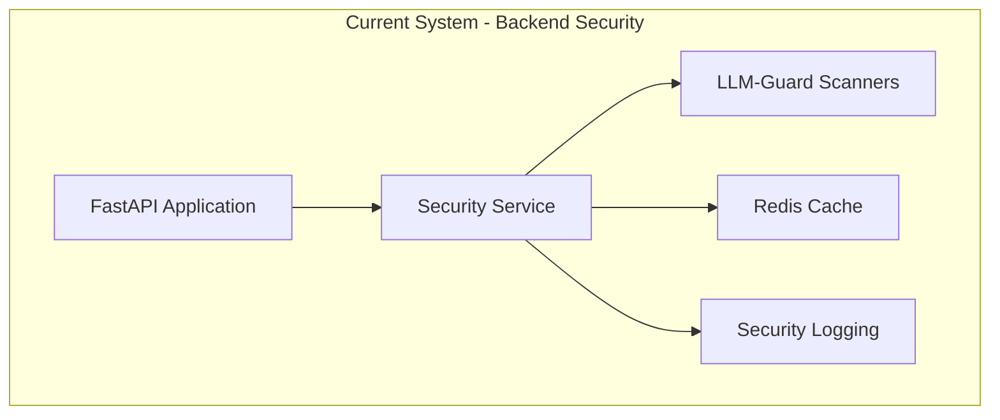
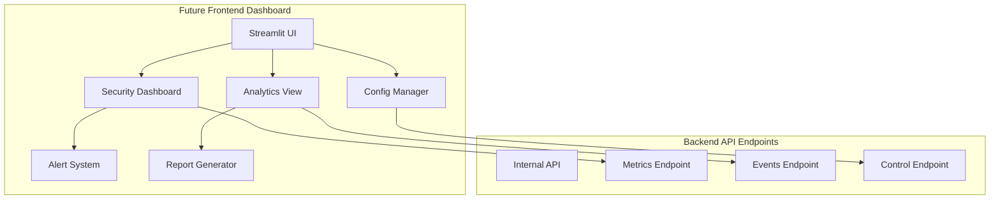

# LLM-Guard Frontend Dashboard & Management UI

This guide explains how to extend the FastAPI-Streamlit-LLM Starter Template's LLM-Guard security integration with comprehensive user-facing management interfaces, real-time monitoring dashboards, and security analytics.

## 🎯 **Current LLM-Guard Backend Foundation**

The starter template includes a **production-ready LLM-Guard backend integration** with comprehensive security scanning:

```python
# Current implementation - Backend security service
from app.infrastructure.security.llm_guard_service import SecurityService
from app.infrastructure.security.config import SecurityConfig

# Existing security configuration
security_config = SecurityConfig(
    mode="local",
    scanners={
        "prompt_injection": {"enabled": True, "threshold": 0.8},
        "toxicity": {"enabled": True, "threshold": 0.7},
        "pii_detection": {"enabled": True, "redact": True}
    },
    performance={
        "cache_enabled": True,
        "use_onnx": True,
        "lazy_loading": True
    }
)

# Secure LLM request processing
security_service = SecurityService(security_config)
result = await security_service.validate_input(user_prompt)
```

### Current Backend Features:
- ✅ **Comprehensive Scanner Suite**: PromptInjection, Toxicity, PII, Bias, Language validation, Malicious URLs
- ✅ **ONNX Optimization**: CPU/GPU acceleration for sub-50ms latency
- ✅ **Intelligent Caching**: Redis-based result caching for repeated patterns
- ✅ **Async Processing**: Non-blocking security validation
- ✅ **YAML Configuration**: File-based scanner configuration with environment overrides
- ✅ **Structured Logging**: Detailed security event audit trail
- ✅ **Extensibility**: Factory pattern supports future SaaS integration

## 🚀 **When to Add Frontend Dashboard**

Consider adding the Streamlit-based frontend when you need:

- **🎨 Visual Configuration**: Non-technical users need to adjust security settings without editing YAML files
- **📊 Real-Time Monitoring**: Product owners want visibility into security activity and trends
- **🔍 Security Analytics**: Need to visualize attack patterns, block rates, and scanner performance
- **⚙️ Dynamic Management**: Runtime configuration updates without service restarts
- **📈 Compliance Reporting**: Automated security reports with visualizations for stakeholders
- **🚨 Alert Management**: Visual alerting system for unusual security patterns
- **👥 Team Collaboration**: Multiple team members need access to security controls

## 🏗️ **Architecture Overview**

### Current Backend Architecture


### Future Frontend Dashboard Architecture


## 📋 **Implementation Roadmap**

### Phase 1: Security Dashboard - Real-Time Monitoring

#### Dashboard Overview Component
A comprehensive security status overview providing at-a-glance visibility into the security posture.

```python
# frontend/components/security/dashboard_overview.py
import streamlit as st
import plotly.express as px
import plotly.graph_objects as go
from datetime import datetime, timedelta
from typing import Dict, Any
import asyncio

class SecurityDashboardOverview:
    """Real-time security monitoring dashboard component."""
    
    def __init__(self, api_client):
        self.api = api_client
        self.refresh_interval = 30  # seconds
    
    def render(self):
        """Render the main security dashboard overview."""
        st.title("🔒 LLM Security Dashboard")
        
        # Get current security status
        with st.spinner("Loading security status..."):
            status = asyncio.run(self._fetch_security_status())
        
        # Top-level metrics in columns
        self._render_metrics_row(status)
        
        st.divider()
        
        # Security activity charts
        col1, col2 = st.columns(2)
        
        with col1:
            self._render_scan_volume_chart(status)
            self._render_block_rate_chart(status)
        
        with col2:
            self._render_scanner_performance_chart(status)
            self._render_violation_breakdown_chart(status)
        
        st.divider()
        
        # Recent security events
        self._render_recent_events(status)
        
        # Auto-refresh
        if st.button("🔄 Refresh Dashboard"):
            st.rerun()
    
    def _render_metrics_row(self, status: Dict[str, Any]):
        """Render top-level security metrics."""
        col1, col2, col3, col4, col5 = st.columns(5)
        
        with col1:
            st.metric(
                "🛡️ Security Status",
                "Protected" if status['is_healthy'] else "Warning",
                delta=None
            )
        
        with col2:
            st.metric(
                "📊 Scans (24h)",
                f"{status['scan_count_24h']:,}",
                delta=f"+{status['scan_trend_pct']}%" if status['scan_trend_pct'] > 0 else f"{status['scan_trend_pct']}%"
            )
        
        with col3:
            st.metric(
                "🚫 Blocks (24h)",
                f"{status['block_count_24h']:,}",
                delta=f"{status['block_rate_24h']:.1f}% rate"
            )
        
        with col4:
            st.metric(
                "⚡ Avg Latency",
                f"{status['avg_latency_ms']:.1f}ms",
                delta=f"{status['latency_trend_ms']:+.1f}ms"
            )
        
        with col5:
            cache_pct = status['cache_hit_rate'] * 100
            st.metric(
                "💾 Cache Hit Rate",
                f"{cache_pct:.1f}%",
                delta=f"{status['cache_trend_pct']:+.1f}%"
            )
    
    def _render_scan_volume_chart(self, status: Dict[str, Any]):
        """Render scan volume over time chart."""
        st.subheader("📈 Scan Volume")
        
        # Get hourly scan data for last 24 hours
        scan_data = status['hourly_scans']
        
        fig = px.area(
            scan_data,
            x='timestamp',
            y='count',
            title='Security Scans (Last 24 Hours)',
            labels={'count': 'Scans', 'timestamp': 'Time'},
            color_discrete_sequence=['#1f77b4']
        )
        
        fig.update_layout(
            hovermode='x unified',
            showlegend=False
        )
        
        st.plotly_chart(fig, use_container_width=True)
    
    def _render_block_rate_chart(self, status: Dict[str, Any]):
        """Render block rate trend chart."""
        st.subheader("🚫 Block Rate Trend")
        
        block_data = status['hourly_blocks']
        
        # Calculate block rate percentage
        block_data['block_rate'] = (block_data['blocks'] / block_data['scans'] * 100).fillna(0)
        
        fig = go.Figure()
        
        fig.add_trace(go.Scatter(
            x=block_data['timestamp'],
            y=block_data['block_rate'],
            fill='tozeroy',
            name='Block Rate',
            line_color='#ff7f0e'
        ))
        
        fig.update_layout(
            title='Block Rate % (Last 24 Hours)',
            xaxis_title='Time',
            yaxis_title='Block Rate %',
            hovermode='x unified'
        )
        
        st.plotly_chart(fig, use_container_width=True)
    
    def _render_scanner_performance_chart(self, status: Dict[str, Any]):
        """Render scanner performance comparison."""
        st.subheader("⚡ Scanner Performance")
        
        scanner_perf = status['scanner_performance']
        
        fig = px.bar(
            scanner_perf,
            x='scanner',
            y='avg_latency_ms',
            title='Average Scanner Latency',
            labels={'avg_latency_ms': 'Latency (ms)', 'scanner': 'Scanner'},
            color='avg_latency_ms',
            color_continuous_scale='RdYlGn_r'
        )
        
        fig.update_layout(showlegend=False)
        
        st.plotly_chart(fig, use_container_width=True)
    
    def _render_violation_breakdown_chart(self, status: Dict[str, Any]):
        """Render violation type breakdown."""
        st.subheader("📊 Violation Breakdown")
        
        violations = status['violation_breakdown']
        
        fig = px.pie(
            violations,
            values='count',
            names='type',
            title='Violations by Type (24h)',
            color_discrete_sequence=px.colors.qualitative.Set3
        )
        
        fig.update_traces(textposition='inside', textinfo='percent+label')
        
        st.plotly_chart(fig, use_container_width=True)
    
    def _render_recent_events(self, status: Dict[str, Any]):
        """Render recent security events table."""
        st.subheader("🔍 Recent Security Events")
        
        events = status['recent_events']
        
        if not events:
            st.info("No security events in the last hour.")
            return
        
        # Display events with color coding
        for event in events[:10]:  # Show latest 10
            severity_emoji = {
                'HIGH': '🔴',
                'MEDIUM': '🟡',
                'LOW': '🟢'
            }
            
            with st.expander(
                f"{severity_emoji.get(event['severity'], '⚪')} "
                f"{event['scanner']} - {event['timestamp']}"
            ):
                col1, col2 = st.columns(2)
                
                with col1:
                    st.write("**Details:**")
                    st.write(f"• Risk Score: {event['risk_score']:.2f}")
                    st.write(f"• Violation Type: {event['violation_type']}")
                    st.write(f"• Action: {event['action']}")
                
                with col2:
                    st.write("**Context:**")
                    st.write(f"• User: {event['user_id']}")
                    st.write(f"• Endpoint: {event['endpoint']}")
                    st.write(f"• Duration: {event['scan_time_ms']}ms")
                
                if event.get('input_preview'):
                    st.code(event['input_preview'], language='text')
    
    async def _fetch_security_status(self) -> Dict[str, Any]:
        """Fetch current security status from backend API."""
        # This would call your backend /internal/security/status endpoint
        response = await self.api.get("/internal/security/status")
        return response.json()
```

#### Scanner Status Component
Display individual scanner status and configuration.

```python
# frontend/components/security/scanner_status.py
import streamlit as st
from typing import Dict, List, Any

class ScannerStatusView:
    """Display status and health of individual scanners."""
    
    def __init__(self, api_client):
        self.api = api_client
    
    def render(self):
        """Render scanner status overview."""
        st.subheader("🔍 Scanner Status")
        
        scanners = asyncio.run(self._fetch_scanner_status())
        
        # Group by input/output scanners
        input_scanners = [s for s in scanners if s['type'] == 'input']
        output_scanners = [s for s in scanners if s['type'] == 'output']
        
        col1, col2 = st.columns(2)
        
        with col1:
            st.markdown("### 📥 Input Scanners")
            self._render_scanner_table(input_scanners)
        
        with col2:
            st.markdown("### 📤 Output Scanners")
            self._render_scanner_table(output_scanners)
    
    def _render_scanner_table(self, scanners: List[Dict[str, Any]]):
        """Render table of scanner status."""
        for scanner in scanners:
            status_icon = "✅" if scanner['enabled'] else "⭕"
            health_icon = "🟢" if scanner['healthy'] else "🔴"
            
            with st.expander(f"{status_icon} {scanner['name']}"):
                col1, col2, col3 = st.columns(3)
                
                with col1:
                    st.metric("Status", health_icon, delta=None)
                    st.write(f"**Enabled:** {scanner['enabled']}")
                
                with col2:
                    st.metric("Scans (24h)", f"{scanner['scan_count']:,}")
                    st.write(f"**Blocks:** {scanner['block_count']}")
                
                with col3:
                    st.metric("Avg Latency", f"{scanner['avg_latency_ms']:.1f}ms")
                    st.write(f"**Threshold:** {scanner['threshold']}")
                
                # Performance indicator
                if scanner['avg_latency_ms'] > 100:
                    st.warning("⚠️ High latency detected. Consider enabling ONNX optimization.")
                
                # Configuration preview
                st.write("**Configuration:**")
                st.json(scanner['config'])
    
    async def _fetch_scanner_status(self) -> List[Dict[str, Any]]:
        """Fetch scanner status from backend."""
        response = await self.api.get("/internal/security/scanners")
        return response.json()
```

### Phase 2: Configuration Management UI

#### Dynamic Scanner Configuration
Allow runtime configuration updates through the UI.

```python
# frontend/components/security/config_manager.py
import streamlit as st
import yaml
from typing import Dict, Any

class SecurityConfigManager:
    """Visual configuration management for LLM-Guard scanners."""
    
    def __init__(self, api_client):
        self.api = api_client
        self.scanner_descriptions = {
            "prompt_injection": {
                "name": "Prompt Injection Detector",
                "description": "Detects attempts to manipulate or bypass LLM instructions",
                "recommended_threshold": 0.8,
                "risk_level": "HIGH"
            },
            "toxicity": {
                "name": "Toxicity Filter",
                "description": "Blocks toxic, offensive, or harmful content",
                "recommended_threshold": 0.7,
                "risk_level": "HIGH"
            },
            "pii_detection": {
                "name": "PII Detection & Redaction",
                "description": "Identifies and optionally redacts personally identifiable information",
                "recommended_threshold": 0.9,
                "risk_level": "CRITICAL"
            },
            "bias": {
                "name": "Bias Detector",
                "description": "Detects biased or discriminatory content",
                "recommended_threshold": 0.7,
                "risk_level": "MEDIUM"
            },
            "language": {
                "name": "Language Validator",
                "description": "Validates content is in expected language(s)",
                "recommended_threshold": 0.8,
                "risk_level": "LOW"
            },
            "malicious_urls": {
                "name": "Malicious URL Detector",
                "description": "Identifies potentially harmful URLs in content",
                "recommended_threshold": 0.9,
                "risk_level": "HIGH"
            }
        }
    
    def render(self):
        """Render configuration management interface."""
        st.title("⚙️ Security Configuration")
        
        # Load current configuration
        current_config = asyncio.run(self._fetch_current_config())
        
        # Configuration mode selector
        config_mode = st.radio(
            "Configuration Mode",
            ["Visual Editor", "YAML Editor", "Import/Export"],
            horizontal=True
        )
        
        if config_mode == "Visual Editor":
            self._render_visual_editor(current_config)
        elif config_mode == "YAML Editor":
            self._render_yaml_editor(current_config)
        else:
            self._render_import_export(current_config)
    
    def _render_visual_editor(self, config: Dict[str, Any]):
        """Render visual configuration editor."""
        st.subheader("📝 Visual Configuration Editor")
        
        # Preview mode toggle
        preview_mode = st.toggle(
            "Preview Mode",
            value=False,
            help="Test configuration without applying to production"
        )
        
        if preview_mode:
            st.info("🔍 Preview Mode: Changes will not affect production traffic")
        
        # Tabs for input and output scanners
        tab1, tab2, tab3 = st.tabs(["Input Scanners", "Output Scanners", "Performance"])
        
        with tab1:
            self._render_scanner_configs(config['input_scanners'], "input")
        
        with tab2:
            self._render_scanner_configs(config['output_scanners'], "output")
        
        with tab3:
            self._render_performance_config(config['performance'])
        
        # Save configuration
        col1, col2, col3 = st.columns([1, 1, 2])
        
        with col1:
            if st.button("💾 Save Configuration", type="primary"):
                self._save_configuration(config, preview_mode)
        
        with col2:
            if st.button("🔄 Reset to Defaults"):
                if st.confirm("Reset to default configuration?"):
                    self._reset_to_defaults()
        
        with col3:
            if st.button("✅ Validate Configuration"):
                self._validate_configuration(config)
    
    def _render_scanner_configs(self, scanners: Dict[str, Any], scanner_type: str):
        """Render configuration for a group of scanners."""
        st.markdown(f"### Configure {scanner_type.title()} Scanners")
        
        for scanner_id, scanner_config in scanners.items():
            scanner_info = self.scanner_descriptions.get(scanner_id, {})
            
            risk_colors = {
                "CRITICAL": "🔴",
                "HIGH": "🟠",
                "MEDIUM": "🟡",
                "LOW": "🟢"
            }
            
            risk_icon = risk_colors.get(scanner_info.get("risk_level", "MEDIUM"), "⚪")
            
            with st.expander(
                f"{risk_icon} {scanner_info.get('name', scanner_id)} "
                f"{'✅' if scanner_config['enabled'] else '⭕'}",
                expanded=scanner_config['enabled']
            ):
                # Description
                st.markdown(f"**Description:** {scanner_info.get('description', 'No description available')}")
                st.markdown(f"**Risk Level:** {scanner_info.get('risk_level', 'UNKNOWN')}")
                
                st.divider()
                
                # Configuration controls
                col1, col2 = st.columns(2)
                
                with col1:
                    scanner_config['enabled'] = st.toggle(
                        "Enable Scanner",
                        value=scanner_config['enabled'],
                        key=f"{scanner_type}_{scanner_id}_enabled"
                    )
                
                with col2:
                    scanner_config['use_onnx'] = st.toggle(
                        "ONNX Optimization",
                        value=scanner_config.get('use_onnx', True),
                        key=f"{scanner_type}_{scanner_id}_onnx",
                        help="Use ONNX runtime for 5-10x performance improvement"
                    )
                
                # Threshold slider
                recommended = scanner_info.get('recommended_threshold', 0.7)
                
                scanner_config['threshold'] = st.slider(
                    "Detection Threshold",
                    min_value=0.0,
                    max_value=1.0,
                    value=scanner_config.get('threshold', recommended),
                    step=0.05,
                    key=f"{scanner_type}_{scanner_id}_threshold",
                    help=f"Recommended: {recommended} (Lower = more sensitive, Higher = more permissive)"
                )
                
                # Show impact of threshold change
                if scanner_config['threshold'] < recommended - 0.1:
                    st.warning("⚠️ Lower threshold may increase false positives")
                elif scanner_config['threshold'] > recommended + 0.1:
                    st.warning("⚠️ Higher threshold may miss some violations")
                else:
                    st.success("✅ Within recommended range")
                
                # Scanner-specific options
                if scanner_id == "pii_detection":
                    scanner_config['redact'] = st.checkbox(
                        "Auto-redact PII",
                        value=scanner_config.get('redact', True),
                        key=f"{scanner_type}_{scanner_id}_redact"
                    )
                
                if scanner_id == "language":
                    scanner_config['expected_languages'] = st.multiselect(
                        "Expected Languages",
                        ["en", "es", "fr", "de", "zh", "ja"],
                        default=scanner_config.get('expected_languages', ["en"]),
                        key=f"{scanner_type}_{scanner_id}_languages"
                    )
                
                # Performance impact estimate
                st.caption(f"📊 Estimated latency impact: ~{self._estimate_latency_impact(scanner_id, scanner_config)}ms")
    
    def _render_performance_config(self, perf_config: Dict[str, Any]):
        """Render performance configuration."""
        st.markdown("### ⚡ Performance Settings")
        
        col1, col2 = st.columns(2)
        
        with col1:
            perf_config['cache_enabled'] = st.toggle(
                "Enable Result Caching",
                value=perf_config.get('cache_enabled', True),
                help="Cache scan results for identical content"
            )
            
            if perf_config['cache_enabled']:
                perf_config['cache_ttl_seconds'] = st.number_input(
                    "Cache TTL (seconds)",
                    min_value=60,
                    max_value=86400,
                    value=perf_config.get('cache_ttl_seconds', 3600),
                    help="How long to cache results"
                )
        
        with col2:
            perf_config['lazy_loading'] = st.toggle(
                "Lazy Model Loading",
                value=perf_config.get('lazy_loading', True),
                help="Load models on-demand for faster startup"
            )
            
            perf_config['onnx_providers'] = st.multiselect(
                "ONNX Execution Providers",
                ["CUDAExecutionProvider", "CPUExecutionProvider"],
                default=perf_config.get('onnx_providers', ["CPUExecutionProvider"]),
                help="Execution providers in order of preference"
            )
        
        # Performance impact summary
        st.divider()
        st.markdown("#### 📈 Performance Impact Summary")
        
        impact_col1, impact_col2, impact_col3 = st.columns(3)
        
        with impact_col1:
            cache_improvement = "80-90% faster" if perf_config['cache_enabled'] else "No improvement"
            st.metric("Cache Impact", cache_improvement)
        
        with impact_col2:
            onnx_improvement = "5-10x faster" if "CPUExecutionProvider" in perf_config['onnx_providers'] else "Baseline"
            st.metric("ONNX Impact", onnx_improvement)
        
        with impact_col3:
            startup_time = "<5s" if perf_config['lazy_loading'] else "10-20s"
            st.metric("Startup Time", startup_time)
    
    def _render_yaml_editor(self, config: Dict[str, Any]):
        """Render YAML configuration editor."""
        st.subheader("📄 YAML Configuration Editor")
        
        # Convert config to YAML
        yaml_config = yaml.dump(config, default_flow_style=False, sort_keys=False)
        
        # Editable text area
        edited_yaml = st.text_area(
            "Configuration YAML",
            value=yaml_config,
            height=400,
            help="Edit the configuration directly in YAML format"
        )
        
        # Validate and save
        col1, col2 = st.columns(2)
        
        with col1:
            if st.button("✅ Validate YAML"):
                try:
                    parsed_config = yaml.safe_load(edited_yaml)
                    st.success("✅ YAML is valid")
                    st.json(parsed_config)
                except yaml.YAMLError as e:
                    st.error(f"❌ Invalid YAML: {e}")
        
        with col2:
            if st.button("💾 Save YAML Configuration"):
                try:
                    parsed_config = yaml.safe_load(edited_yaml)
                    asyncio.run(self._save_yaml_config(parsed_config))
                    st.success("✅ Configuration saved successfully")
                except Exception as e:
                    st.error(f"❌ Failed to save: {e}")
    
    def _render_import_export(self, config: Dict[str, Any]):
        """Render import/export interface."""
        st.subheader("📦 Import / Export Configuration")
        
        # Export section
        st.markdown("### 📤 Export Configuration")
        
        export_format = st.radio(
            "Export Format",
            ["YAML", "JSON"],
            horizontal=True
        )
        
        if export_format == "YAML":
            export_data = yaml.dump(config, default_flow_style=False)
            file_ext = "yaml"
        else:
            import json
            export_data = json.dumps(config, indent=2)
            file_ext = "json"
        
        st.download_button(
            "⬇️ Download Configuration",
            data=export_data,
            file_name=f"security_config_{datetime.now().strftime('%Y%m%d_%H%M%S')}.{file_ext}",
            mime=f"application/{file_ext}"
        )
        
        st.divider()
        
        # Import section
        st.markdown("### 📥 Import Configuration")
        
        uploaded_file = st.file_uploader(
            "Upload Configuration File",
            type=['yaml', 'yml', 'json'],
            help="Upload a YAML or JSON configuration file"
        )
        
        if uploaded_file:
            try:
                content = uploaded_file.read().decode('utf-8')
                
                if uploaded_file.name.endswith(('.yaml', '.yml')):
                    imported_config = yaml.safe_load(content)
                else:
                    imported_config = json.loads(content)
                
                st.success("✅ File parsed successfully")
                st.json(imported_config)
                
                if st.button("Apply Imported Configuration"):
                    asyncio.run(self._save_yaml_config(imported_config))
                    st.success("✅ Configuration applied successfully")
                    st.rerun()
            
            except Exception as e:
                st.error(f"❌ Failed to import: {e}")
    
    def _estimate_latency_impact(self, scanner_id: str, config: Dict[str, Any]) -> float:
        """Estimate latency impact of scanner configuration."""
        base_latencies = {
            "prompt_injection": 30,
            "toxicity": 25,
            "pii_detection": 35,
            "bias": 20,
            "language": 15,
            "malicious_urls": 10
        }
        
        base = base_latencies.get(scanner_id, 20)
        
        # ONNX optimization reduces latency significantly
        if config.get('use_onnx', False):
            base = base / 5
        
        return round(base, 1)
    
    def _save_configuration(self, config: Dict[str, Any], preview: bool):
        """Save configuration to backend."""
        try:
            if preview:
                response = asyncio.run(
                    self.api.post("/internal/security/config/preview", json=config)
                )
                st.success("✅ Configuration validated in preview mode")
            else:
                response = asyncio.run(
                    self.api.post("/internal/security/config", json=config)
                )
                st.success("✅ Configuration saved and applied successfully")
                st.info("ℹ️ Changes will take effect immediately for new requests")
            
        except Exception as e:
            st.error(f"❌ Failed to save configuration: {e}")
    
    def _validate_configuration(self, config: Dict[str, Any]):
        """Validate configuration without saving."""
        try:
            response = asyncio.run(
                self.api.post("/internal/security/config/validate", json=config)
            )
            
            validation = response.json()
            
            if validation['valid']:
                st.success("✅ Configuration is valid")
                
                # Show validation details
                with st.expander("Validation Details"):
                    st.json(validation['details'])
            else:
                st.error("❌ Configuration has errors")
                
                for error in validation['errors']:
                    st.warning(f"• {error}")
        
        except Exception as e:
            st.error(f"❌ Validation failed: {e}")
    
    def _reset_to_defaults(self):
        """Reset configuration to defaults."""
        try:
            asyncio.run(self.api.post("/internal/security/config/reset"))
            st.success("✅ Configuration reset to defaults")
            st.rerun()
        except Exception as e:
            st.error(f"❌ Failed to reset: {e}")
    
    async def _fetch_current_config(self) -> Dict[str, Any]:
        """Fetch current configuration from backend."""
        response = await self.api.get("/internal/security/config")
        return response.json()
    
    async def _save_yaml_config(self, config: Dict[str, Any]):
        """Save YAML configuration to backend."""
        response = await self.api.post("/internal/security/config", json=config)
        return response.json()
```

### Phase 3: Security Analytics & Reporting

#### Analytics Dashboard
Comprehensive security analytics with trend analysis and pattern detection.

```python
# frontend/components/security/analytics_dashboard.py
import streamlit as st
import plotly.express as px
import plotly.graph_objects as go
import pandas as pd
from datetime import datetime, timedelta
from typing import Dict, List, Any

class SecurityAnalyticsDashboard:
    """Advanced security analytics and reporting."""
    
    def __init__(self, api_client):
        self.api = api_client
    
    def render(self):
        """Render analytics dashboard."""
        st.title("📊 Security Analytics")
        
        # Date range selector
        col1, col2, col3 = st.columns([2, 2, 1])
        
        with col1:
            start_date = st.date_input(
                "Start Date",
                value=datetime.now() - timedelta(days=7)
            )
        
        with col2:
            end_date = st.date_input(
                "End Date",
                value=datetime.now()
            )
        
        with col3:
            if st.button("🔄 Refresh Data"):
                st.rerun()
        
        # Fetch analytics data
        with st.spinner("Loading analytics..."):
            analytics = asyncio.run(
                self._fetch_analytics(start_date, end_date)
            )
        
        # Render analytics sections
        self._render_summary_metrics(analytics)
        
        st.divider()
        
        # Trend analysis
        self._render_trend_analysis(analytics)
        
        st.divider()
        
        # Attack pattern analysis
        self._render_attack_patterns(analytics)
        
        st.divider()
        
        # Performance analysis
        self._render_performance_analysis(analytics)
        
        st.divider()
        
        # Export options
        self._render_export_options(analytics)
    
    def _render_summary_metrics(self, analytics: Dict[str, Any]):
        """Render summary metrics."""
        st.subheader("📈 Summary Metrics")
        
        col1, col2, col3, col4 = st.columns(4)
        
        summary = analytics['summary']
        
        with col1:
            st.metric(
                "Total Scans",
                f"{summary['total_scans']:,}",
                delta=f"+{summary['scan_growth_pct']:.1f}% vs prev period"
            )
        
        with col2:
            st.metric(
                "Total Blocks",
                f"{summary['total_blocks']:,}",
                delta=f"{summary['block_growth_pct']:+.1f}% vs prev period"
            )
        
        with col3:
            st.metric(
                "Block Rate",
                f"{summary['block_rate']:.2f}%",
                delta=f"{summary['block_rate_change']:+.2f}%"
            )
        
        with col4:
            st.metric(
                "Avg Response Time",
                f"{summary['avg_response_time_ms']:.1f}ms",
                delta=f"{summary['response_time_change']:+.1f}ms"
            )
    
    def _render_trend_analysis(self, analytics: Dict[str, Any]):
        """Render trend analysis charts."""
        st.subheader("📉 Trend Analysis")
        
        trends = analytics['trends']
        
        # Create dataframe from trends
        df = pd.DataFrame(trends['daily_stats'])
        
        # Dual-axis chart: scans and block rate
        fig = go.Figure()
        
        # Scans (left axis)
        fig.add_trace(go.Scatter(
            x=df['date'],
            y=df['scans'],
            name='Scans',
            yaxis='y',
            line=dict(color='#1f77b4', width=2)
        ))
        
        # Block rate (right axis)
        fig.add_trace(go.Scatter(
            x=df['date'],
            y=df['block_rate'],
            name='Block Rate %',
            yaxis='y2',
            line=dict(color='#ff7f0e', width=2, dash='dash')
        ))
        
        fig.update_layout(
            title='Security Activity Trends',
            xaxis=dict(title='Date'),
            yaxis=dict(
                title='Scan Count',
                side='left'
            ),
            yaxis2=dict(
                title='Block Rate %',
                overlaying='y',
                side='right'
            ),
            hovermode='x unified',
            height=400
        )
        
        st.plotly_chart(fig, use_container_width=True)
    
    def _render_attack_patterns(self, analytics: Dict[str, Any]):
        """Render attack pattern analysis."""
        st.subheader("🎯 Attack Pattern Analysis")
        
        patterns = analytics['attack_patterns']
        
        col1, col2 = st.columns(2)
        
        with col1:
            # Violation types over time
            st.markdown("#### Violation Types Over Time")
            
            violations_df = pd.DataFrame(patterns['violation_timeline'])
            
            fig = px.area(
                violations_df,
                x='timestamp',
                y='count',
                color='violation_type',
                title='Violation Distribution',
                labels={'count': 'Violations', 'violation_type': 'Type'}
            )
            
            st.plotly_chart(fig, use_container_width=True)
        
        with col2:
            # Top violation sources
            st.markdown("#### Top Violation Sources")
            
            sources_df = pd.DataFrame(patterns['top_sources'])
            
            fig = px.bar(
                sources_df,
                x='count',
                y='source',
                orientation='h',
                title='Violations by Source',
                labels={'count': 'Violation Count', 'source': 'Source'}
            )
            
            st.plotly_chart(fig, use_container_width=True)
        
        # Attack sophistication analysis
        st.markdown("#### Attack Sophistication")
        
        sophistication_col1, sophistication_col2, sophistication_col3 = st.columns(3)
        
        with sophistication_col1:
            st.metric(
                "Simple Attacks",
                patterns['sophistication']['simple'],
                help="Basic injection attempts"
            )
        
        with sophistication_col2:
            st.metric(
                "Moderate Attacks",
                patterns['sophistication']['moderate'],
                help="Obfuscated or chained attempts"
            )
        
        with sophistication_col3:
            st.metric(
                "Advanced Attacks",
                patterns['sophistication']['advanced'],
                help="Novel or sophisticated attempts"
            )
    
    def _render_performance_analysis(self, analytics: Dict[str, Any]):
        """Render performance analysis."""
        st.subheader("⚡ Performance Analysis")
        
        performance = analytics['performance']
        
        col1, col2 = st.columns(2)
        
        with col1:
            # Latency distribution
            st.markdown("#### Latency Distribution")
            
            latency_data = performance['latency_percentiles']
            
            fig = go.Figure(data=[go.Bar(
                x=list(latency_data.keys()),
                y=list(latency_data.values()),
                marker_color='#2ca02c'
            )])
            
            fig.update_layout(
                title='Latency Percentiles',
                xaxis_title='Percentile',
                yaxis_title='Latency (ms)'
            )
            
            st.plotly_chart(fig, use_container_width=True)
        
        with col2:
            # Cache effectiveness
            st.markdown("#### Cache Effectiveness")
            
            cache_data = {
                'Status': ['Hits', 'Misses'],
                'Count': [
                    performance['cache_hits'],
                    performance['cache_misses']
                ]
            }
            
            fig = px.pie(
                cache_data,
                values='Count',
                names='Status',
                title=f"Cache Hit Rate: {performance['cache_hit_rate']:.1f}%",
                color_discrete_sequence=['#2ca02c', '#d62728']
            )
            
            st.plotly_chart(fig, use_container_width=True)
        
        # Scanner performance comparison
        st.markdown("#### Scanner Performance Comparison")
        
        scanner_perf_df = pd.DataFrame(performance['scanner_performance'])
        
        fig = px.bar(
            scanner_perf_df,
            x='scanner',
            y=['p50_latency', 'p95_latency', 'p99_latency'],
            title='Scanner Latency by Percentile',
            labels={'value': 'Latency (ms)', 'scanner': 'Scanner'},
            barmode='group'
        )
        
        st.plotly_chart(fig, use_container_width=True)
    
    def _render_export_options(self, analytics: Dict[str, Any]):
        """Render analytics export options."""
        st.subheader("📥 Export Analytics")
        
        col1, col2, col3 = st.columns(3)
        
        with col1:
            if st.button("📊 Export CSV"):
                csv_data = self._generate_csv_export(analytics)
                st.download_button(
                    "⬇️ Download CSV",
                    data=csv_data,
                    file_name=f"security_analytics_{datetime.now().strftime('%Y%m%d')}.csv",
                    mime="text/csv"
                )
        
        with col2:
            if st.button("📄 Export PDF Report"):
                with st.spinner("Generating PDF report..."):
                    pdf_data = asyncio.run(self._generate_pdf_report(analytics))
                    st.download_button(
                        "⬇️ Download PDF",
                        data=pdf_data,
                        file_name=f"security_report_{datetime.now().strftime('%Y%m%d')}.pdf",
                        mime="application/pdf"
                    )
        
        with col3:
            if st.button("📨 Email Report"):
                email = st.text_input("Email address")
                if email and st.button("Send"):
                    asyncio.run(self._email_report(analytics, email))
                    st.success(f"✅ Report sent to {email}")
    
    def _generate_csv_export(self, analytics: Dict[str, Any]) -> str:
        """Generate CSV export of analytics data."""
        # Convert analytics to CSV format
        df = pd.DataFrame(analytics['trends']['daily_stats'])
        return df.to_csv(index=False)
    
    async def _fetch_analytics(self, start_date, end_date) -> Dict[str, Any]:
        """Fetch analytics data from backend."""
        response = await self.api.get(
            f"/internal/security/analytics?start={start_date}&end={end_date}"
        )
        return response.json()
    
    async def _generate_pdf_report(self, analytics: Dict[str, Any]) -> bytes:
        """Generate PDF report from analytics."""
        response = await self.api.post(
            "/internal/security/reports/pdf",
            json=analytics
        )
        return response.content
    
    async def _email_report(self, analytics: Dict[str, Any], email: str):
        """Email analytics report."""
        await self.api.post(
            "/internal/security/reports/email",
            json={"analytics": analytics, "recipient": email}
        )
```

### Phase 4: Alert Management & Notifications

#### Alert Configuration & Monitoring

```python
# frontend/components/security/alert_manager.py
import streamlit as st
from typing import Dict, List, Any
from datetime import datetime

class SecurityAlertManager:
    """Security alert configuration and monitoring."""
    
    def __init__(self, api_client):
        self.api = api_client
    
    def render(self):
        """Render alert management interface."""
        st.title("🚨 Security Alerts")
        
        # Active alerts section
        self._render_active_alerts()
        
        st.divider()
        
        # Alert configuration
        self._render_alert_configuration()
        
        st.divider()
        
        # Alert history
        self._render_alert_history()
    
    def _render_active_alerts(self):
        """Render currently active security alerts."""
        st.subheader("🔴 Active Alerts")
        
        alerts = asyncio.run(self._fetch_active_alerts())
        
        if not alerts:
            st.success("✅ No active alerts")
            return
        
        for alert in alerts:
            severity_colors = {
                'CRITICAL': 'error',
                'HIGH': 'warning',
                'MEDIUM': 'info',
                'LOW': 'info'
            }
            
            severity_emoji = {
                'CRITICAL': '🔴',
                'HIGH': '🟠',
                'MEDIUM': '🟡',
                'LOW': '🟢'
            }
            
            alert_type = severity_colors.get(alert['severity'], 'info')
            emoji = severity_emoji.get(alert['severity'], '⚪')
            
            with st.container():
                st.markdown(f"### {emoji} {alert['title']}")
                
                col1, col2, col3 = st.columns(3)
                
                with col1:
                    st.write(f"**Severity:** {alert['severity']}")
                    st.write(f"**Triggered:** {alert['triggered_at']}")
                
                with col2:
                    st.write(f"**Type:** {alert['alert_type']}")
                    st.write(f"**Count:** {alert['event_count']}")
                
                with col3:
                    if st.button(f"Acknowledge", key=f"ack_{alert['id']}"):
                        asyncio.run(self._acknowledge_alert(alert['id']))
                        st.rerun()
                    
                    if st.button(f"Dismiss", key=f"dismiss_{alert['id']}"):
                        asyncio.run(self._dismiss_alert(alert['id']))
                        st.rerun()
                
                st.write(f"**Description:** {alert['description']}")
                
                if alert.get('recommended_actions'):
                    with st.expander("📋 Recommended Actions"):
                        for action in alert['recommended_actions']:
                            st.write(f"• {action}")
                
                st.divider()
    
    def _render_alert_configuration(self):
        """Render alert configuration interface."""
        st.subheader("⚙️ Alert Configuration")
        
        config = asyncio.run(self._fetch_alert_config())
        
        # Alert rules
        st.markdown("### Alert Rules")
        
        with st.expander("🔥 High Block Rate Alert", expanded=True):
            col1, col2 = st.columns(2)
            
            with col1:
                config['high_block_rate']['enabled'] = st.toggle(
                    "Enable Alert",
                    value=config['high_block_rate']['enabled'],
                    key="alert_high_block_rate"
                )
                
                config['high_block_rate']['threshold'] = st.slider(
                    "Block Rate Threshold (%)",
                    min_value=1.0,
                    max_value=50.0,
                    value=config['high_block_rate']['threshold'],
                    step=1.0,
                    key="alert_high_block_rate_threshold"
                )
            
            with col2:
                config['high_block_rate']['window_minutes'] = st.number_input(
                    "Time Window (minutes)",
                    min_value=5,
                    max_value=60,
                    value=config['high_block_rate']['window_minutes'],
                    key="alert_high_block_rate_window"
                )
                
                config['high_block_rate']['severity'] = st.selectbox(
                    "Alert Severity",
                    ["LOW", "MEDIUM", "HIGH", "CRITICAL"],
                    index=["LOW", "MEDIUM", "HIGH", "CRITICAL"].index(
                        config['high_block_rate']['severity']
                    ),
                    key="alert_high_block_rate_severity"
                )
        
        with st.expander("⚠️ Suspicious Pattern Alert"):
            col1, col2 = st.columns(2)
            
            with col1:
                config['suspicious_pattern']['enabled'] = st.toggle(
                    "Enable Alert",
                    value=config['suspicious_pattern']['enabled'],
                    key="alert_suspicious_pattern"
                )
                
                config['suspicious_pattern']['pattern_threshold'] = st.number_input(
                    "Similar Attempts Threshold",
                    min_value=5,
                    max_value=100,
                    value=config['suspicious_pattern']['pattern_threshold'],
                    key="alert_suspicious_pattern_threshold"
                )
            
            with col2:
                config['suspicious_pattern']['window_minutes'] = st.number_input(
                    "Time Window (minutes)",
                    min_value=5,
                    max_value=60,
                    value=config['suspicious_pattern']['window_minutes'],
                    key="alert_suspicious_pattern_window"
                )
                
                config['suspicious_pattern']['severity'] = st.selectbox(
                    "Alert Severity",
                    ["LOW", "MEDIUM", "HIGH", "CRITICAL"],
                    index=["LOW", "MEDIUM", "HIGH", "CRITICAL"].index(
                        config['suspicious_pattern']['severity']
                    ),
                    key="alert_suspicious_pattern_severity"
                )
        
        # Notification channels
        st.markdown("### Notification Channels")
        
        col1, col2 = st.columns(2)
        
        with col1:
            config['notifications']['email']['enabled'] = st.toggle(
                "Email Notifications",
                value=config['notifications']['email']['enabled']
            )
            
            if config['notifications']['email']['enabled']:
                config['notifications']['email']['recipients'] = st.text_area(
                    "Email Recipients (one per line)",
                    value="\n".join(config['notifications']['email']['recipients'])
                ).split('\n')
        
        with col2:
            config['notifications']['webhook']['enabled'] = st.toggle(
                "Webhook Notifications",
                value=config['notifications']['webhook']['enabled']
            )
            
            if config['notifications']['webhook']['enabled']:
                config['notifications']['webhook']['url'] = st.text_input(
                    "Webhook URL",
                    value=config['notifications']['webhook']['url']
                )
        
        # Save configuration
        if st.button("💾 Save Alert Configuration", type="primary"):
            asyncio.run(self._save_alert_config(config))
            st.success("✅ Alert configuration saved successfully")
    
    def _render_alert_history(self):
        """Render alert history."""
        st.subheader("📜 Alert History")
        
        # Time range filter
        col1, col2, col3 = st.columns([2, 2, 1])
        
        with col1:
            start_date = st.date_input(
                "Start Date",
                value=datetime.now() - timedelta(days=7)
            )
        
        with col2:
            end_date = st.date_input(
                "End Date",
                value=datetime.now()
            )
        
        with col3:
            severity_filter = st.multiselect(
                "Severity",
                ["LOW", "MEDIUM", "HIGH", "CRITICAL"],
                default=["HIGH", "CRITICAL"]
            )
        
        # Fetch and display alert history
        history = asyncio.run(
            self._fetch_alert_history(start_date, end_date, severity_filter)
        )
        
        if not history:
            st.info("No alerts found for the selected time range.")
            return
        
        # Display as table
        df = pd.DataFrame(history)
        st.dataframe(
            df[[
                'timestamp', 'severity', 'alert_type',
                'title', 'status', 'event_count'
            ]],
            use_container_width=True
        )
    
    async def _fetch_active_alerts(self) -> List[Dict[str, Any]]:
        """Fetch currently active alerts."""
        response = await self.api.get("/internal/security/alerts/active")
        return response.json()
    
    async def _acknowledge_alert(self, alert_id: str):
        """Acknowledge an alert."""
        await self.api.post(f"/internal/security/alerts/{alert_id}/acknowledge")
    
    async def _dismiss_alert(self, alert_id: str):
        """Dismiss an alert."""
        await self.api.post(f"/internal/security/alerts/{alert_id}/dismiss")
    
    async def _fetch_alert_config(self) -> Dict[str, Any]:
        """Fetch alert configuration."""
        response = await self.api.get("/internal/security/alerts/config")
        return response.json()
    
    async def _save_alert_config(self, config: Dict[str, Any]):
        """Save alert configuration."""
        await self.api.post("/internal/security/alerts/config", json=config)
    
    async def _fetch_alert_history(
        self,
        start_date,
        end_date,
        severity_filter: List[str]
    ) -> List[Dict[str, Any]]:
        """Fetch alert history."""
        response = await self.api.get(
            f"/internal/security/alerts/history"
            f"?start={start_date}&end={end_date}"
            f"&severity={','.join(severity_filter)}"
        )
        return response.json()
```

## 🔧 **Integration with Existing Streamlit App**

### Main App Integration

```python
# frontend/app.py (additions)
from components.security.dashboard_overview import SecurityDashboardOverview
from components.security.scanner_status import ScannerStatusView
from components.security.config_manager import SecurityConfigManager
from components.security.analytics_dashboard import SecurityAnalyticsDashboard
from components.security.alert_manager import SecurityAlertManager

# Add to navigation
def main():
    pages = {
        "🏠 Home": render_home,
        "💬 Chat": render_chat,
        "📊 Performance": render_performance,
        "🔒 Security": render_security,  # New section
    }
    
    selection = st.sidebar.selectbox("Navigate", list(pages.keys()))
    pages[selection]()

def render_security():
    """Render security section with sub-pages."""
    security_pages = {
        "Dashboard": "dashboard",
        "Scanner Status": "scanners",
        "Configuration": "config",
        "Analytics": "analytics",
        "Alerts": "alerts"
    }
    
    security_tab = st.sidebar.radio(
        "Security Section",
        list(security_pages.keys())
    )
    
    # Initialize API client
    api_client = get_backend_client()
    
    if security_tab == "Dashboard":
        dashboard = SecurityDashboardOverview(api_client)
        dashboard.render()
    
    elif security_tab == "Scanner Status":
        scanner_view = ScannerStatusView(api_client)
        scanner_view.render()
    
    elif security_tab == "Configuration":
        config_manager = SecurityConfigManager(api_client)
        config_manager.render()
    
    elif security_tab == "Analytics":
        analytics = SecurityAnalyticsDashboard(api_client)
        analytics.render()
    
    elif security_tab == "Alerts":
        alerts = SecurityAlertManager(api_client)
        alerts.render()
```

## 📚 **Required Backend API Endpoints**

The frontend requires these backend endpoints to be implemented:

```python
# backend/app/internal/security_api.py (new endpoints)

# Status & Monitoring
GET  /internal/security/status           # Dashboard overview data
GET  /internal/security/scanners         # Scanner status
GET  /internal/security/metrics          # Current metrics

# Configuration Management
GET  /internal/security/config           # Current configuration
POST /internal/security/config           # Update configuration
POST /internal/security/config/validate  # Validate configuration
POST /internal/security/config/preview   # Preview changes
POST /internal/security/config/reset     # Reset to defaults

# Analytics
GET  /internal/security/analytics        # Analytics data
GET  /internal/security/events           # Security events
POST /internal/security/reports/pdf      # Generate PDF report
POST /internal/security/reports/email    # Email report

# Alerts
GET  /internal/security/alerts/active    # Active alerts
GET  /internal/security/alerts/history   # Alert history
GET  /internal/security/alerts/config    # Alert configuration
POST /internal/security/alerts/config    # Update alert config
POST /internal/security/alerts/{id}/acknowledge
POST /internal/security/alerts/{id}/dismiss
```

## 🧪 **Testing Frontend Components**

```python
# frontend/tests/test_security_dashboard.py
import pytest
from unittest.mock import AsyncMock, MagicMock
from components.security.dashboard_overview import SecurityDashboardOverview

@pytest.fixture
def mock_api_client():
    """Mock API client for testing."""
    client = AsyncMock()
    client.get.return_value.json.return_value = {
        "is_healthy": True,
        "scan_count_24h": 1000,
        "block_count_24h": 50,
        "block_rate_24h": 5.0,
        "avg_latency_ms": 25.5,
        "cache_hit_rate": 0.85
    }
    return client

def test_dashboard_renders(mock_api_client):
    """Test dashboard component renders successfully."""
    dashboard = SecurityDashboardOverview(mock_api_client)
    
    # Render should not raise exceptions
    dashboard.render()
    
    # API should be called
    mock_api_client.get.assert_called()

# Additional tests for all components...
```

## 🎯 **Benefits of Frontend Dashboard**

### Enhanced User Experience
- **🎨 Visual Configuration**: No need to edit YAML files manually
- **📊 Real-time Visibility**: Instant insights into security posture
- **🔍 Pattern Detection**: Visual identification of attack trends
- **⚡ Quick Actions**: One-click configuration and alert management

### Operational Excellence
- **👥 Team Collaboration**: Multiple stakeholders can access security controls
- **📈 Data-Driven Decisions**: Analytics inform security policy adjustments
- **🚨 Proactive Response**: Alerts enable rapid incident response
- **📋 Compliance Support**: Automated reporting simplifies audits

### Developer Experience
- **🛠️ Easy Integration**: Builds on existing Streamlit infrastructure
- **🔧 Flexible Architecture**: Modular components can be used independently
- **📚 Comprehensive Testing**: Full test coverage for UI components
- **🔄 Real-time Updates**: Auto-refresh capabilities for monitoring

## 🚀 **Next Steps**

1. **Assess User Needs**: Determine which frontend features provide the most value
2. **Implement Backend APIs**: Create required endpoints for frontend data
3. **Build Phase-by-Phase**: Start with dashboard overview, add features incrementally
4. **User Testing**: Validate UI/UX with actual users
5. **Documentation**: Create user guides for each frontend feature
6. **Monitor Usage**: Track which features are most valuable to users

---

**Important**: The current backend LLM-Guard integration is production-ready and fully functional through code-based configuration and API endpoints. The frontend dashboard adds user-facing convenience but is not required for security functionality. Only implement frontend features when your team requires visual management and monitoring capabilities that justify the development effort.

For backend integration documentation, refer to:
- `backend/app/infrastructure/security/` - Security service implementation
- `dev/taskplans/current/llm-guard-integration_PRD.md` - Backend implementation PRD
- `docs/guides/infrastructure/SECURITY.md` - Security best practices
