# Template Customization Guide

## **1\. Executive Summary**

This document is your guide to understanding the project's architecture, which is designed for both stability and easy customization.

The core principle is a clear separation between **reusable Infrastructure** and **replaceable Domain logic**. By understanding this distinction, you can confidently build your unique application on top of a robust, production-ready foundation.

This guide will walk you through:

* **Core Architectural Concepts**: The "why" behind the structure.  
* **Project Layout**: A tour of the key directories and their roles.  
* **Getting Started**: An actionable roadmap for customizing the template for your project.  
* **Extending the Infrastructure**: A guide for adding new, reusable technical capabilities.

## **2\. Core Architectural Concepts**

Our architecture is organized into functional layers that clearly separate concerns. The three most important concepts to understand are **Domain**, **Infrastructure**, and **Core**.

### **Domain Services 💼**

* **Definition**: This is your application's unique business logic. It answers the question, **"What does my application do?"**  
* **Location**: app/services/  
* **Purpose**: To implement the specific features and workflows that make your project unique. This layer is where you will spend most of your development time.  
* **Key Characteristics**:  
  * **Replaceable**: The example text\_processing\_service.py is meant to be deleted and replaced with your logic.  
  * **Composes Infrastructure**: It uses the stable services from the infrastructure/ layer to get work done (e.g., it uses the cache service, the AI client, etc.).  
  * **High Customization**: You will heavily modify and add files here.

### **Infrastructure Services 🏗️**

* **Definition**: These are the stable, reusable, business-agnostic technical capabilities that support your domain logic. They answer the question, **"HOW does my application do things?"**  
* **Location**: app/infrastructure/  
* **Purpose**: To provide a reliable, battle-tested library of tools like caching, resilience patterns, multi-mode authentication, and comprehensive monitoring.  
* **Key Characteristics**:  
  * **Production-Ready**: These services include comprehensive error handling, performance monitoring, and graceful degradation patterns.
  * **Stable API**: Designed for long-term stability with >90% test coverage requirements.
  * **Business-Agnostic**: A caching service or authentication system works the same way whether you're building a chatbot or a document analysis tool.  
  * **Configuration-Driven**: Behavior is controlled through environment variables and preset configurations.
  * **Low Customization**: You will configure these services (via core/config.py and environment variables), but you won't often edit their code.

### **Core Application Setup ⚙️**

* **Definition**: This is the application's foundational setup and assembly code. It answers the question, **"How is my application put together?"**  
* **Location**: app/core/  
* **Purpose**: To handle application-wide concerns like configuration management and custom exception definitions.  
* **Key Characteristics**:  
  * **Project-Specific Foundation**: While the patterns are reusable, the specific contents (e.g., your project's unique configuration variables) are tailored to your application.  
  * **Moderate Customization**: You will modify files here when you start a new project to add settings or define custom errors, but you won't touch them frequently during feature development.

### **Dependency Direction**

The most important rule is the direction of dependencies. This ensures that your business logic can change without breaking the stable foundation.

Domain Services → Infrastructure Services → External Libraries  
(changeable) (stable) (managed)

## **3\. Project Structure Overview**

The backend codebase is organized to reflect these architectural principles. Here is a map of the key directories and their purpose:

```
backend/app/  
├── main.py                  \# FastAPI app setup, middleware, top-level routers  
├── dependencies.py          \# Global dependency injection functions  
│  
├── api/                     \# Dual-API Layer: Public and Internal endpoints
│   ├── v1/                  \# Public API (external-facing)
│   │   ├── text\_processing.py      \# Business logic endpoints (/v1/text_processing/*)
│   │   ├── health.py                \# Public health and operations endpoints
│   │   ├── auth.py                  \# Authentication status endpoints (/v1/auth/*)
│   │   └── deps.py                  \# Public API dependencies
│   └── internal/            \# Internal API (admin/monitoring)
│       ├── monitoring.py            \# System monitoring endpoints (/internal/monitoring/*)
│       ├── cache.py                 \# Cache management endpoints (/internal/cache/*)
│       └── resilience/              \# Resilience management (38 endpoints across 8 modules)
│  
├── core/                    \# Application-wide setup & cross-cutting concerns  
│   ├── config.py              \# Centralized Pydantic settings  
│   └── exceptions.py          \# Custom exception classes  
│  
├── services/ (Domain)       \# Business-specific, replaceable logic  
│   ├── text\_processor.py         \# Main text processing service (composes infrastructure)
│   └── response\_validator.py     \# AI response validation and security service
│  
├── infrastructure/          \# Production-ready, business-agnostic technical services (>90% test coverage)
│   ├── ai/                    \# AI provider abstractions, prompt security, input sanitization
│   ├── cache/                 \# Redis + memory cache with compression, performance monitoring
│   ├── resilience/            \# Circuit breakers, retry patterns, preset configurations
│   ├── security/              \# Multi-mode authentication, API key management, security utilities
│   └── monitoring/            \# System monitoring, performance metrics, health checks  
│  
└── schemas/                 \# Pydantic models (data contracts)  
    ├── text\_processing.py       \# Request/Response models for text processing  
    ├── health.py                \# Models for health check endpoints  
    └── common.py                \# Shared response models (errors, success, pagination)
```

## **4\. Getting Started: Your Customization Roadmap**

This section provides a clear, step-by-step guide on where to make changes to adapt this template for your own project.

### **Golden Path Customization Workflow**

```mermaid
graph TD
    START[Start Template Customization] --> DECISION{What are you<br/>building?}
    
    DECISION -->|AI Text Processing<br/>Extension| EXTEND_PATH[Extend Existing<br/>Text Processing]
    DECISION -->|Different Domain<br/>e.g., Document Analysis| REPLACE_PATH[Replace Domain<br/>Services]
    DECISION -->|New Infrastructure<br/>e.g., Database| INFRA_PATH[Add Infrastructure<br/>Service]
    
    subgraph "Path 1: Extend Text Processing"
        EXTEND_PATH --> EXT_CONFIG[Configure Environment<br/>📁 .env, core/config.py]
        EXT_CONFIG --> EXT_SCHEMAS[Add New Schemas<br/>📁 schemas/text_processing.py]
        EXT_SCHEMAS --> EXT_SERVICES[Extend Text Processor<br/>📁 services/text_processor.py]
        EXT_SERVICES --> EXT_API[Add API Endpoints<br/>📁 api/v1/text_processing.py]
        EXT_API --> EXT_TEST[Add Tests<br/>📁 tests/services/, tests/api/]
        EXT_TEST --> EXT_DONE[✅ Extended Successfully]
    end
    
    subgraph "Path 2: Replace Domain Services"
        REPLACE_PATH --> REP_CONFIG[Configure for Your Domain<br/>📁 .env, core/config.py]
        REP_CONFIG --> REP_MODELS[Define Domain Models<br/>📁 shared/models.py]
        REP_MODELS --> REP_SCHEMAS[Create Domain Schemas<br/>📁 schemas/your_domain.py]
        REP_SCHEMAS --> REP_SERVICES[Replace Domain Services<br/>📁 services/your_service.py]
        REP_SERVICES --> REP_API[Create Domain API<br/>📁 api/v1/your_endpoints.py]
        REP_API --> REP_MAIN[Update Main Router<br/>📁 main.py]
        REP_MAIN --> REP_FRONTEND[Customize Frontend<br/>📁 frontend/app/]
        REP_FRONTEND --> REP_TEST[Create Domain Tests<br/>📁 tests/services/, tests/api/]
        REP_TEST --> REP_DONE[✅ Domain Replaced Successfully]
    end
    
    subgraph "Path 3: Add Infrastructure Service"
        INFRA_PATH --> INFRA_DIR[Create Infrastructure Directory<br/>📁 infrastructure/your_service/]
        INFRA_DIR --> INFRA_SERVICE[Implement Service<br/>📁 infrastructure/your_service/service.py]
        INFRA_SERVICE --> INFRA_CONFIG[Add Configuration<br/>📁 core/config.py]
        INFRA_CONFIG --> INFRA_DEPS[Create Dependency Provider<br/>📁 dependencies.py]
        INFRA_DEPS --> INFRA_USE[Use in Domain Services<br/>📁 services/]
        INFRA_USE --> INFRA_TEST[Add Infrastructure Tests<br/>📁 tests/infrastructure/]
        INFRA_TEST --> INFRA_DONE[✅ Infrastructure Added Successfully]
    end
    
    subgraph "Common Steps for All Paths"
        COMMON_AUTH[Configure Authentication<br/>📁 .env: API_KEY, AUTH_MODE]
        COMMON_RESILIENCE[Set Resilience Preset<br/>📁 .env: RESILIENCE_PRESET]
        COMMON_CACHE[Configure Caching<br/>📁 .env: REDIS_URL, CACHE_*]
        COMMON_AI[Setup AI Provider<br/>📁 .env: GEMINI_API_KEY]
    end
    
    EXT_CONFIG --> COMMON_AUTH
    REP_CONFIG --> COMMON_AUTH
    INFRA_CONFIG --> COMMON_AUTH
    
    COMMON_AUTH --> COMMON_RESILIENCE
    COMMON_RESILIENCE --> COMMON_CACHE
    COMMON_CACHE --> COMMON_AI
    
    subgraph "Decision Points"
        KEEP_INFRA{Keep Infrastructure<br/>Services?}
        KEEP_DOMAIN{Keep Example<br/>Domain Services?}
        ADD_FEATURES{Add New<br/>Features?}
    end
    
    COMMON_AI --> KEEP_INFRA
    KEEP_INFRA -->|Yes ✅| KEEP_DOMAIN
    KEEP_INFRA -->|No ❌| INFRA_WARNING[⚠️ Not Recommended<br/>Infrastructure is Production-Ready]
    
    KEEP_DOMAIN -->|Yes| ADD_FEATURES
    KEEP_DOMAIN -->|No| REPLACE_PATH
    
    ADD_FEATURES -->|Yes| EXTEND_PATH
    ADD_FEATURES -->|No| VALIDATION[Validate Setup<br/>Run Tests & Linting]
    
    EXT_DONE --> VALIDATION
    REP_DONE --> VALIDATION
    INFRA_DONE --> VALIDATION
    
    VALIDATION --> DEPLOY[Deploy Your Application<br/>🚀 Production Ready!]
    
    subgraph "File Impact Legend"
        HIGH_IMPACT[🔴 High Impact<br/>Core business logic]
        MEDIUM_IMPACT[🟡 Medium Impact<br/>Configuration & setup]
        LOW_IMPACT[🟢 Low Impact<br/>Keep existing patterns]
        NO_CHANGE[⚪ No Change<br/>Production-ready infrastructure]
    end
    
    subgraph "Architecture Boundaries"
        DOMAIN_BOUNDARY[Domain Services<br/>Expected to change]
        INFRA_BOUNDARY[Infrastructure Services<br/>Designed to be stable]
        CORE_BOUNDARY[Core Configuration<br/>Project-specific setup]
    end
```



### **Step 1: Configure Your Project (core/config.py and Environment Variables)**

This is the first place you should go for initial setup.

#### **Authentication Configuration**
* **Set Authentication Mode**: Choose between `AUTH_MODE=simple` (basic API key auth) or `AUTH_MODE=advanced` (enhanced features with user tracking)
* **Configure API Keys**: Set `API_KEY` for the primary key and `ADDITIONAL_API_KEYS` for multiple clients
* **Advanced Features**: Enable `ENABLE_USER_TRACKING=true` and `ENABLE_REQUEST_LOGGING=true` for enhanced security features

#### **Resilience Configuration**
* **Choose Resilience Preset**: Set `RESILIENCE_PRESET` to `simple`, `development`, or `production` based on your environment
* **Custom Configuration**: For advanced setups, use `RESILIENCE_CUSTOM_CONFIG` with JSON configuration

#### **Core Application Settings**
* **Add Your Settings**: Add new fields to the Settings class for any API keys, feature flags, or other environment variables your application needs
* **AI Provider Setup**: Configure `GEMINI_API_KEY` and adjust `AI_MODEL` settings
* **Infrastructure Settings**: Configure Redis (`REDIS_URL`) or rely on automatic memory cache fallback

### **Step 2: Define Your Business Logic (services/)**

This is where your unique application comes to life.

* **Understand the Example**: Review `app/services/text_processor.py` to understand how domain services are structured and how they compose infrastructure services.
* **Replace or Extend**: You have two options:
  - **Replace**: Delete `app/services/text_processor.py` and create entirely new services for your domain (e.g., `invoicing_service.py`, `document_analysis_service.py`)
  - **Extend**: Keep the text processing service as an example and add new services alongside it
* **Keep Supporting Services**: The `response_validator.py` service provides important security validation for AI responses - consider keeping it if you're working with AI-generated content.
* **Follow the Pattern**: New services should import and compose infrastructure services from `app/infrastructure/` rather than implementing technical concerns directly.

### **Step 3: Create Your Data Contracts (schemas/)**

Define the shape of your API's inputs and outputs.

* **Review the Examples**: Examine `app/schemas/text_processing.py` to understand how to structure domain-specific schemas, and `app/schemas/common.py` to see reusable response patterns.
* **Keep Common Schemas**: The `common.py` file provides standardized error responses, success messages, and pagination - keep these as they ensure API consistency.
* **Replace or Extend Domain Schemas**: For `text_processing.py`, you can either:
  - **Replace**: Delete it and create new schema files for your domain (e.g., `invoicing.py`, `document_analysis.py`)
  - **Extend**: Keep it as an example and add new schema files alongside it
* **Maintain Health Schemas**: The `health.py` file provides system health check models - typically keep this unchanged.

### **Step 4: Expose Your Services via Dual-API Structure (api/)**

Make your domain services accessible over HTTP using the dual-API architecture.

#### **Dual-API Architecture Overview**
The template provides two distinct API interfaces:
* **Public API (`/v1/`)**: External-facing business endpoints with authentication
* **Internal API (`/internal/`)**: Administrative endpoints for monitoring and system management

#### **Public API Customization (`api/v1/`)**
* **Replace or Extend Business Endpoints**: 
  - **Replace**: Delete `text_processing.py` and create new routers for your domain (e.g., `invoicing.py`, `document_analysis.py`)
  - **Extend**: Keep the text processing router as an example and add new routers alongside it
* **Authentication Integration**: Use the provided authentication patterns:
  - `Depends(verify_api_key)` for required authentication
  - `Depends(optional_verify_api_key)` for optional authentication
  - `Depends(verify_api_key_with_metadata)` for advanced mode with user context

#### **Internal API (Keep Unchanged)**
* **Monitoring Endpoints** (`/internal/monitoring/*`): System health and performance metrics
* **Resilience Management** (`/internal/resilience/*`): 38 endpoints across 8 modules for resilience pattern management
* **Cache Management** (`/internal/cache/*`): Cache performance and administration

#### **System Routers (Keep These)**
* `auth.py`: Authentication status and validation endpoints
* `health.py`: Public health check endpoints
* `deps.py`: API-specific dependencies and security

### **Step 5: Define Custom Errors (core/exceptions.py)**

Give your application a clear error contract.

* **Add Domain Exceptions**: As you write your domain services, define specific exceptions for them here (e.g., InvoiceNotFoundError). These should inherit from the base exceptions provided in the file.  
* **Leave Base Exceptions Alone**: Do not modify the base ApplicationError or InfrastructureError, as these provide a consistent error handling foundation.

## **5\. Available Infrastructure Services**

Before extending the infrastructure, it's important to understand what services are already available. The template includes several production-ready infrastructure services that you can leverage:

### **AI Services (`infrastructure/ai/`)**
* **Input Sanitizer**: Prompt injection protection and comprehensive input validation for AI operations
* **Prompt Builder**: Safe prompt construction utilities with security-aware patterns
* **AI Provider Abstractions**: Clean interfaces for working with different AI providers (currently optimized for Gemini)

### **Caching (`infrastructure/cache/`)**
* **AIResponseCache**: Redis-based cache with automatic fallback to in-memory cache when Redis unavailable
* **Performance Optimization**: Built-in compression, memory management, and performance monitoring
* **Multiple Backends**: Seamless switching between Redis and memory cache based on availability
* **Cache Analytics**: Comprehensive hit/miss ratios, memory usage tracking, and performance metrics

### **Resilience (`infrastructure/resilience/`)**  
* **Circuit Breakers**: Prevent cascading failures with automatic recovery and state management
* **Retry Logic**: Intelligent retry mechanisms with exponential backoff and jitter
* **Preset Configuration System**: Three built-in presets (simple, development, production) reducing configuration complexity
* **Comprehensive API**: 38 endpoints across 8 modules for complete resilience pattern management
* **Performance Benchmarks**: Built-in benchmarking and performance validation capabilities

### **Security (`infrastructure/security/`)**
* **Multi-Mode Authentication**: Support for simple and advanced authentication modes with user context tracking
* **API Key Management**: Primary and additional API key support with secure key verification
* **RFC 6750 Compliance**: Bearer token authentication following web standards
* **Security Event Logging**: Comprehensive audit trails with secure key information handling
* **Development Integration**: Automatic development mode detection for seamless testing

### **Monitoring (`infrastructure/monitoring/`)**
* **Centralized Monitoring**: Unified access to performance metrics from cache and resilience systems
* **Real-time Metrics**: Live system monitoring with configurable retention and alerting
* **Health Status Reporting**: Comprehensive system health checks and component status monitoring
* **Performance Analytics**: Detailed performance analysis and trend monitoring

These services are designed to be composed together in your domain services. For example, the `TextProcessorService` combines AI, caching, resilience, and security services to provide robust text processing functionality.

## **6\. Extending the Infrastructure**

As your application grows, you may need to add new technical capabilities, such as a database, a message queue, or more advanced monitoring. This section provides a guide for adding new components to the infrastructure/ layer correctly.

### **When to Add a New Infrastructure Service?**

First, determine if your new component truly belongs in the infrastructure/ layer. Ask these four questions:

1. **Is it Business-Agnostic?** Can it work without knowing the specific business rules of your application? (e.g., a database connection service doesn't care if it's storing users or products).  
2. **Is it Reusable?** Could multiple, different domain services potentially use this component? (e.g., both an orders\_service and a users\_service would need a database).  
3. **Is it Stable?** Will its core interface change infrequently? The *implementation* might change (e.g., swapping Postgres for MySQL), but the *methods* your domain services call should remain consistent (e.g., save\_record()).  
4. **Does it Solve a Technical Problem?** Does it handle a "how-to" problem (like "how to store data persistently" or "how to send an email") rather than a "what-to-do" business problem?

If you answer **YES** to all four, it's an infrastructure service.

### **How to Add a New Infrastructure Service: A Checklist**

Follow these steps to integrate a new infrastructure component cleanly. We'll use adding a **Supabase client for persistent storage** as an example.

#### **✅ Step 1: Create a New Subdirectory**

Create a new folder inside app/infrastructure/ that describes the component's function.

* **Example**: app/infrastructure/database/

#### **✅ Step 2: Implement the Service**

Inside the new directory, create a service.py file. This file will contain the class or functions that encapsulate the third-party library's logic.

* **Example**: Create app/infrastructure/database/service.py with a DatabaseService class.

\# app/infrastructure/database/service.py  
from supabase import create\_client, Client

class DatabaseService:  
    def \_\_init\_\_(self, url: str, key: str):  
        self.client: Client \= create\_client(url, key)

    async def get\_user\_by\_id(self, user\_id: int):  
        \# Encapsulate the Supabase-specific call  
        return self.client.table('users').select("\*").eq('id', user\_id).execute()

    \# Add other generic methods: save\_record, update\_record, etc.

#### **✅ Step 3: Add Configuration**

Add the required settings (API keys, URLs, etc.) to app/core/config.py. Your new service should be configured from this central file.

* **Example**: Add Supabase settings to the Settings class in app/core/config.py.

\# app/core/config.py  
class Settings(BaseSettings):  
    \# ... other settings  
    supabase\_url: str \= Field(default="", description="Supabase project URL")  
    supabase\_key: str \= Field(default="", description="Supabase public anon key")

#### **✅ Step 4: Create a Dependency Provider**

Make your new service available to the rest of the application using FastAPI's dependency injection system. Add a "getter" function to app/dependencies.py.

* **Example**: Add get\_database\_service to app/dependencies.py.

\# app/dependencies.py  
from functools import lru\_cache  
from .infrastructure.database.service import DatabaseService  
from .core.config import Settings

@lru\_cache()  
def get\_database\_service(settings: Settings \= Depends(get\_settings)) \-\> DatabaseService:  
    return DatabaseService(url=settings.supabase\_url, key=settings.supabase\_key)

#### **✅ Step 5: Use the Service in Your Domain Logic**

Now, your domain services can cleanly depend on the new infrastructure without knowing any of its implementation details.

* **Example**: Your domain service in app/services/ can now use the database.

\# app/services/your\_new\_service.py  
from fastapi import Depends  
from ..infrastructure.database.service import DatabaseService  
from ..dependencies import get\_database\_service

class YourService:  
    def \_\_init\_\_(self, db: DatabaseService \= Depends(get\_database\_service)):  
        self.db \= db

    async def get\_user\_profile(self, user\_id: int):  
        \# The domain service calls a simple, abstract method  
        user\_data \= await self.db.get\_user\_by\_id(user\_id)  
        \# ... process the data ...  
        return user\_profile

### **Example 2: Integrating OpenTelemetry for Grafana**

This follows the same pattern, even though it's not a client library.

1. **Directory**: app/infrastructure/telemetry/  
2. **Service**: app/infrastructure/telemetry/service.py could contain functions to configure the OTLP exporter and initialize tracing.  
3. **Configuration**: Add OTEL\_EXPORTER\_OTLP\_ENDPOINT to app/core/config.py.  
4. **Integration**: Instead of a dependency provider, you would call your telemetry setup function from within the application's lifespan manager in app/main.py.

By following this pattern, you keep your new technical capabilities isolated, reusable, and cleanly separated from your core business logic, making your application easier to maintain and scale.

## **7\. Summary and Next Steps**

Congratulations! You now have a comprehensive understanding of the FastAPI LLM Starter Template's architecture and how to customize it for your specific needs.

### **Batteries Are Included**

The template now provides you with:

* **Production-Ready Infrastructure**: Comprehensive caching, resilience, security, and monitoring services that are battle-tested and ready for production use.
* **Clean Separation of Concerns**: Clear boundaries between domain logic (your business rules) and infrastructure (technical capabilities).
* **Flexible API Structure**: Organized API endpoints with separation between public (v1) and internal administrative endpoints.
* **Comprehensive Examples**: The text processing domain serves as a complete example showing how to compose infrastructure services into business functionality.

### **Recommended Development Approach**

1. **Start Small**: Begin by examining the text processing example to understand the patterns, then gradually replace or extend it with your domain logic.
2. **Leverage Infrastructure**: Use the existing infrastructure services rather than implementing technical concerns from scratch. They're designed to handle edge cases and production requirements.
3. **Follow the Patterns**: The dependency injection, error handling, and service composition patterns are designed for maintainability and testability.
4. **Incremental Changes**: Make changes incrementally rather than wholesale replacements. This allows you to validate each step and maintain a working system.

### **Key Benefits of This Architecture**

* **Rapid Development**: Focus on business logic rather than infrastructure concerns
* **Production Readiness**: Built-in resilience, monitoring, and security features
* **Maintainability**: Clear separation makes the codebase easier to understand and modify
* **Scalability**: Infrastructure services are designed to handle production loads
* **Testability**: Dependency injection makes services easy to test in isolation

By following this guide, you'll be able to build robust, production-ready applications while maintaining clean, maintainable code that can grow with your needs.

## Related Documentation

### Prerequisites
- **[Infrastructure vs Domain Services](../reference/key-concepts/INFRASTRUCTURE_VS_DOMAIN.md)**: Critical architectural distinction for template customization
- **[Complete Setup Guide](../get-started/SETUP_INTEGRATION.md)**: Basic template setup and understanding

### Related Topics
- **[Code Standards](./developer/CODE_STANDARDS.md)**: Standardized patterns for infrastructure vs domain service separation
- **[Backend Guide](./BACKEND.md)**: Understanding the backend architecture you're customizing
- **[Frontend Guide](./FRONTEND.md)**: Understanding the frontend architecture you're customizing

### Next Steps
- **[AI Infrastructure](./infrastructure/AI.md)**: Leverage production-ready AI infrastructure in your domain services
- **[Cache Infrastructure](./infrastructure/CACHE.md)**: Leverage production-ready caching in your domain services
- **[Resilience Infrastructure](./infrastructure/RESILIENCE.md)**: Leverage production-ready resilience patterns in your domain services
- **[Authentication Guide](./developer/AUTHENTICATION.md)**: Configure authentication for your customized application