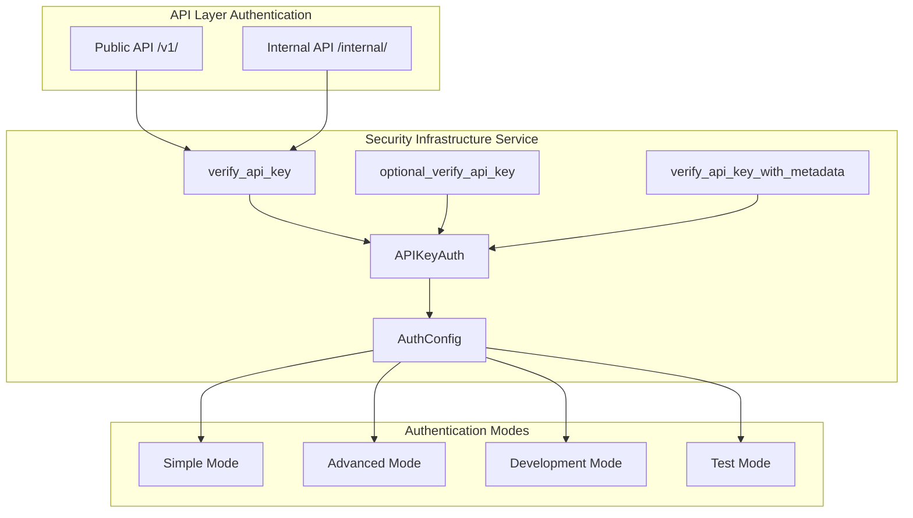

# API Authentication & Authorization

This document describes the comprehensive authentication and authorization system implemented in the FastAPI-Streamlit-LLM Starter Template, featuring multi-key authentication, dual-API architecture protection, and flexible security modes designed for both development and production environments.

## Overview

The template uses a **production-ready Security Infrastructure Service** with multi-tier API key authentication supporting Bearer tokens (RFC 6750 compliant). The system provides comprehensive security features while maintaining flexibility for different deployment environments and development workflows.

### Security Architecture



## Features

- ✅ **Multi-Mode Operation**: Simple, advanced, development, and test modes
- ✅ **RFC 6750 Compliant**: Bearer Token authentication following web standards
- ✅ **Multi-Key Support**: Primary + additional API keys with metadata tracking
- ✅ **Dual-API Protection**: Separate authentication for public and internal APIs
- ✅ **Development Integration**: Automatic development mode with graceful fallbacks
- ✅ **Optional Authentication**: Flexible endpoints supporting both authenticated and anonymous access
- ✅ **User Context Tracking**: Optional user metadata and request tracking
- ✅ **Security Event Logging**: Comprehensive audit trails with secure key truncation
- ✅ **Runtime Configuration**: Dynamic configuration updates and feature detection
- ✅ **Test Integration**: Built-in support for automated testing environments

## Configuration

### Environment Variables

The authentication system supports multiple operational modes configured through environment variables:

```bash
# Authentication Mode Configuration
AUTH_MODE=simple                      # "simple" or "advanced" (default: simple)

# Core Authentication Keys
API_KEY=your_secure_api_key_here      # Primary API key (required for production)
ADDITIONAL_API_KEYS=key1,key2,key3    # Additional API keys (optional, comma-separated)

# Advanced Mode Features (AUTH_MODE=advanced only)
ENABLE_USER_TRACKING=true             # Enable user context tracking (default: false)
ENABLE_REQUEST_LOGGING=true           # Enable security event logging (default: false)
```

### Authentication Modes

#### Simple Mode (Default)
Basic API key validation without advanced features:
```bash
AUTH_MODE=simple
API_KEY=your-secure-api-key
```

#### Advanced Mode
Full feature set including user tracking and enhanced logging:
```bash
AUTH_MODE=advanced
API_KEY=your-secure-api-key
ADDITIONAL_API_KEYS=client1-key,client2-key,admin-key
ENABLE_USER_TRACKING=true
ENABLE_REQUEST_LOGGING=true
```

#### Development Mode
Automatically enabled when no API keys are configured:
```bash
# No API_KEY or ADDITIONAL_API_KEYS set
# System automatically operates in development mode
# All endpoints accessible without authentication
```

#### Test Mode
Automatically detected during pytest execution:
```bash
# Detected via PYTEST_CURRENT_TEST environment variable
# Provides special handling for automated testing
```

### Example Configuration

```bash
# Production Configuration (Advanced Mode)
AUTH_MODE=advanced
API_KEY=sk-1234567890abcdef1234567890abcdef12345678
ADDITIONAL_API_KEYS=client1-key-abc123,client2-key-def456,admin-key-xyz789
ENABLE_USER_TRACKING=true
ENABLE_REQUEST_LOGGING=true

# Development Configuration (Simple Mode)
AUTH_MODE=simple
API_KEY=dev-test-key-12345

# Testing Configuration (Development Mode)
# No keys configured - development mode automatically enabled
```

## API Key Security Best Practices

1. **Use Strong Keys**: Generate cryptographically secure random strings
2. **Minimum Length**: Use at least 32 characters
3. **Unique Keys**: Each client should have a unique API key
4. **Regular Rotation**: Rotate keys periodically
5. **Secure Storage**: Store keys in environment variables or secret managers
6. **Never Commit**: Never commit API keys to version control

### Generating Secure API Keys

```bash
# Using openssl
openssl rand -hex 32

# Using Python
python -c "import secrets; print('sk-' + secrets.token_hex(32))"

# Using Node.js
node -e "console.log('sk-' + require('crypto').randomBytes(32).toString('hex'))"
```

## Endpoint Protection Levels

### Public Endpoints (No Authentication Required)
- `GET /` - Root endpoint
- `GET /health` - Health check

### Protected Endpoints (Authentication Required)
- `POST /process` - Text processing (main API functionality)
- `GET /auth/status` - Authentication status check

### Optional Authentication Endpoints
- `GET /operations` - Available operations (works with or without auth)

## Usage Examples

### FastAPI Dependency Integration

The authentication system provides three main dependency functions for different use cases:

#### Standard Authentication (Required)
```python
from app.infrastructure.security import verify_api_key

@app.post("/v1/process")
async def process_text(
    request: ProcessRequest,
    api_key: str = Depends(verify_api_key)
):
    """Protected endpoint requiring valid API key."""
    return {"message": "Access granted", "authenticated": True}
```

#### Optional Authentication
```python
from app.infrastructure.security import optional_verify_api_key

@app.get("/v1/operations")
async def get_operations(
    api_key: Optional[str] = Depends(optional_verify_api_key)
):
    """Endpoint supporting both authenticated and anonymous access."""
    if api_key:
        return {"operations": ["summarize", "sentiment", "questions", "key_points"], "authenticated": True}
    return {"operations": ["summarize"], "authenticated": False}
```

#### Authentication with Metadata (Advanced Mode)
```python
from app.infrastructure.security.auth import verify_api_key_with_metadata

@app.post("/v1/advanced-process")
async def advanced_process(
    request: ProcessRequest,
    auth_data: dict = Depends(verify_api_key_with_metadata)
):
    """Protected endpoint with user context tracking."""
    return {
        "message": "Processing complete",
        "user_context": auth_data.get("metadata", {}),
        "api_key": auth_data.get("api_key", "")[:8] + "..."
    }
```

### Making Authenticated Requests

#### Using curl
```bash
# Set your API key
export API_KEY="your_api_key_here"

# Make authenticated request to public API
curl -X POST "http://localhost:8000/v1/text_processing/process" \
  -H "Authorization: Bearer $API_KEY" \
  -H "Content-Type: application/json" \
  -d '{
    "text": "Hello world",
    "operation": "summarize"
  }'

# Access internal API endpoints
curl -X GET "http://localhost:8000/internal/monitoring/overview" \
  -H "Authorization: Bearer $API_KEY"
```

#### Using Python requests
```python
import requests

api_key = "your_api_key_here"
headers = {"Authorization": f"Bearer {api_key}"}

# Public API request
response = requests.post(
    "http://localhost:8000/v1/text_processing/process",
    headers=headers,
    json={
        "text": "Hello world",
        "operation": "summarize"
    }
)

# Internal API request
monitoring_response = requests.get(
    "http://localhost:8000/internal/monitoring/overview",
    headers=headers
)
```

#### Using JavaScript fetch
```javascript
const apiKey = "your_api_key_here";

// Public API request
const response = await fetch("http://localhost:8000/v1/text_processing/process", {
  method: "POST",
  headers: {
    "Authorization": `Bearer ${apiKey}`,
    "Content-Type": "application/json"
  },
  body: JSON.stringify({
    text: "Hello world",
    operation: "summarize"
  })
});

// Internal API request
const monitoringResponse = await fetch("http://localhost:8000/internal/monitoring/overview", {
  method: "GET",
  headers: {
    "Authorization": `Bearer ${apiKey}`
  }
});
```

### Authentication Status Checking

```python
# Check authentication status
from app.infrastructure.security.auth import get_auth_status, is_development_mode

@app.get("/auth/status")
async def auth_status():
    """Get current authentication system status."""
    status = get_auth_status()
    
    return {
        "auth_system": status,
        "development_mode": is_development_mode(),
        "features": {
            "user_tracking": status.get("user_tracking_enabled", False),
            "request_logging": status.get("request_logging_enabled", False),
            "multi_key_support": status.get("additional_keys_count", 0) > 0
        }
    }
```

## Error Responses

### 401 Unauthorized - Missing API Key
```json
{
  "detail": "API key required. Please provide a valid API key in the Authorization header."
}
```

### 401 Unauthorized - Invalid API Key
```json
{
  "detail": "Invalid API key"
}
```

## Development & Testing

### Development Mode

When no API keys are configured, the system automatically operates in development mode:

```bash
# Development mode activation (no keys configured)
# API_KEY and ADDITIONAL_API_KEYS are empty or not set

# The system will:
# - Allow all endpoints to be accessed without authentication
# - Log warning messages about development mode
# - Provide helpful development-specific error messages
```

**Development Mode Features:**
- ✅ **No Authentication Required**: All endpoints accessible without API keys
- ✅ **Development Warnings**: Clear logging indicating development mode is active
- ✅ **Graceful Degradation**: Endpoints work normally but with reduced security
- ✅ **Testing Integration**: Seamless integration with automated testing

### Testing Authentication

#### Manual Testing

```bash
# 1. Start the server with authentication enabled
cd backend
export API_KEY=test-api-key-12345
export AUTH_MODE=simple
python -m uvicorn app.main:app --reload --port 8000

# 2. Test authenticated endpoint
curl -X POST "http://localhost:8000/v1/text_processing/process" \
  -H "Authorization: Bearer test-api-key-12345" \
  -H "Content-Type: application/json" \
  -d '{"text": "Test text", "operation": "summarize"}'

# 3. Test unauthenticated request (should fail)
curl -X POST "http://localhost:8000/v1/text_processing/process" \
  -H "Content-Type: application/json" \
  -d '{"text": "Test text", "operation": "summarize"}'
```

#### Automated Testing

The authentication system integrates seamlessly with pytest:

```python
import pytest
from fastapi.testclient import TestClient
from app.main import app

client = TestClient(app)

def test_authentication_required():
    """Test that protected endpoints require authentication."""
    response = client.post(
        "/v1/text_processing/process",
        json={"text": "Test text", "operation": "summarize"}
    )
    assert response.status_code == 401

def test_valid_authentication():
    """Test that valid API key grants access."""
    response = client.post(
        "/v1/text_processing/process",
        headers={"Authorization": "Bearer test-api-key-12345"},
        json={"text": "Test text", "operation": "summarize"}
    )
    assert response.status_code in [200, 202]

def test_invalid_authentication():
    """Test that invalid API key is rejected."""
    response = client.post(
        "/v1/text_processing/process",
        headers={"Authorization": "Bearer invalid-key"},
        json={"text": "Test text", "operation": "summarize"}
    )
    assert response.status_code == 401

def test_optional_authentication():
    """Test optional authentication endpoints."""
    # Test without authentication
    response = client.get("/v1/operations")
    assert response.status_code == 200
    assert not response.json().get("authenticated", True)
    
    # Test with authentication
    response = client.get(
        "/v1/operations",
        headers={"Authorization": "Bearer test-api-key-12345"}
    )
    assert response.status_code == 200
    assert response.json().get("authenticated", False)
```

#### Test Mode Configuration

The system automatically detects test environments:

```bash
# Test mode is automatically activated during pytest execution
# No special configuration needed

# For manual test mode activation:
export PYTEST_CURRENT_TEST="test_module.py::test_function"
```

## Monitoring and Logging

The authentication system provides comprehensive logging:

- **INFO**: Number of API keys loaded at startup
- **WARNING**: Unauthenticated access attempts, invalid keys
- **DEBUG**: Successful authentication events

Example log entries:
```
INFO - Loaded 3 API key(s)
WARNING - Invalid API key attempted: 12345678...
DEBUG - API key authentication successful
```

## Integration with Frontend

### Streamlit Integration

For the Streamlit frontend, you can store the API key in Streamlit secrets:

```toml
# .streamlit/secrets.toml
[api]
key = "your_api_key_here"
```

```python
# In your Streamlit app
import streamlit as st

api_key = st.secrets["api"]["key"]
headers = {"Authorization": f"Bearer {api_key}"}
```

## Production Deployment

### Docker Environment Variables

```yaml
# docker-compose.yml
services:
  backend:
    environment:
      # Core authentication configuration
      - AUTH_MODE=advanced
      - API_KEY=${API_KEY}
      - ADDITIONAL_API_KEYS=${ADDITIONAL_API_KEYS}
      
      # Advanced mode features
      - ENABLE_USER_TRACKING=true
      - ENABLE_REQUEST_LOGGING=true
      
      # Security settings
      - DISABLE_INTERNAL_DOCS=true
      - CORS_ORIGINS=["https://your-frontend-domain.com"]
```

### Kubernetes Secrets

```yaml
apiVersion: v1
kind: Secret
metadata:
  name: api-keys
type: Opaque
stringData:
  API_KEY: "your_secure_api_key_here"
  ADDITIONAL_API_KEYS: "key1,key2,key3"
  AUTH_MODE: "advanced"
  ENABLE_USER_TRACKING: "true"
  ENABLE_REQUEST_LOGGING: "true"
---
apiVersion: apps/v1
kind: Deployment
metadata:
  name: fastapi-backend
spec:
  template:
    spec:
      containers:
      - name: backend
        envFrom:
        - secretRef:
            name: api-keys
        env:
        - name: ENVIRONMENT
          value: "production"
        - name: DISABLE_INTERNAL_DOCS
          value: "true"
```

### Production Security Checklist

#### Essential Production Settings
```bash
# Required for production
AUTH_MODE=advanced
API_KEY=your-secure-production-key
ADDITIONAL_API_KEYS=key1,key2,key3

# Security features
ENABLE_USER_TRACKING=true
ENABLE_REQUEST_LOGGING=true
DISABLE_INTERNAL_DOCS=true

# Environment identification
ENVIRONMENT=production
```

#### Security Validation
```python
# Production startup validation
from app.infrastructure.security.auth import get_auth_status, is_development_mode

def validate_production_security():
    """Validate security configuration for production deployment."""
    if is_development_mode():
        raise ValueError("Production deployment cannot run in development mode")
    
    auth_status = get_auth_status()
    
    if not auth_status.get("api_keys_configured", False):
        raise ValueError("API keys must be configured for production")
    
    if auth_status.get("mode") != "advanced":
        logger.warning("Consider using advanced mode for production")
    
    return True

# Call during application startup
validate_production_security()
```

## Advanced Features

### User Context Tracking (Advanced Mode)

When `AUTH_MODE=advanced` and `ENABLE_USER_TRACKING=true`, the system provides enhanced user context capabilities:

```python
from app.infrastructure.security.auth import verify_api_key_with_metadata

@app.post("/v1/user-specific-operation")
async def user_specific_operation(
    request: ProcessRequest,
    auth_data: dict = Depends(verify_api_key_with_metadata)
):
    """Endpoint with user context tracking."""
    user_context = auth_data.get("metadata", {})
    api_key = auth_data.get("api_key", "")
    
    # Use user context for personalized processing
    return {
        "result": f"Processed for user: {user_context.get('user_id', 'anonymous')}",
        "api_key_hash": api_key[:8] + "...",
        "tracking_enabled": True
    }
```

### Request Logging & Audit Trails

Enable comprehensive security event logging:

```python
# Configuration for enhanced logging
AUTH_MODE=advanced
ENABLE_REQUEST_LOGGING=true

# The system will automatically log:
# - Authentication attempts (success/failure)
# - API key usage patterns
# - Security events with truncated key information
# - Request metadata and context
```

### Runtime Configuration Management

```python
from app.infrastructure.security.auth import api_key_auth, get_auth_status

# Check current authentication configuration
auth_status = get_auth_status()
print(f"Current mode: {auth_status['mode']}")
print(f"Keys configured: {auth_status['api_keys_configured']}")
print(f"Advanced features: {auth_status['features']}")

# Programmatic key verification
from app.infrastructure.security.auth import verify_api_key_string

def custom_authentication_logic(key: str) -> bool:
    """Custom authentication with manual key verification."""
    is_valid = verify_api_key_string(key)
    if is_valid:
        logger.info(f"Valid key used: {key[:8]}...")
        return True
    logger.warning(f"Invalid key attempted: {key[:4]}...")
    return False
```

### Feature Detection

```python
from app.infrastructure.security.auth import supports_feature

# Check available features
if supports_feature('user_tracking'):
    # Implement user-specific functionality
    pass

if supports_feature('request_logging'):
    # Enable detailed logging
    pass

if supports_feature('multi_key_support'):
    # Handle multiple API key scenarios
    pass
```

### Integration with External Systems

```python
from app.infrastructure.security.auth import APIKeyAuth, AuthConfig

class CustomAuthConfig(AuthConfig):
    """Extended configuration for external system integration."""
    
    def __init__(self):
        super().__init__()
        self.external_auth_provider = os.getenv("EXTERNAL_AUTH_PROVIDER")
        self.oauth_integration = os.getenv("ENABLE_OAUTH", "false").lower() == "true"
    
    async def validate_external_token(self, token: str) -> bool:
        """Validate token against external provider."""
        if self.external_auth_provider:
            # Integration logic with external auth provider
            return await self._check_external_provider(token)
        return False

# Hybrid authentication supporting both API keys and external tokens
async def hybrid_auth_dependency(
    credentials: Optional[HTTPAuthorizationCredentials] = Depends(security)
) -> dict:
    """Authenticate using API key or external token."""
    if not credentials:
        raise AuthenticationError("Authentication required")
    
    token = credentials.credentials
    
    # Try API key authentication first
    if verify_api_key_string(token):
        return {"type": "api_key", "token": token}
    
    # Try external authentication
    custom_config = CustomAuthConfig()
    if await custom_config.validate_external_token(token):
        return {"type": "external", "token": token}
    
    raise AuthenticationError("Invalid authentication credentials")
```

## Troubleshooting

### Common Issues

1. **403 Forbidden**: Check if API key is set in environment
2. **401 Unauthorized**: Verify API key format and value
3. **Missing Authorization Header**: Ensure Bearer token format

### Debug Steps

1. Check environment variables: `echo $API_KEY`
2. Verify server logs for authentication messages
3. Test with the provided test script
4. Use `/auth/status` endpoint to verify authentication

## Future Enhancements

Potential improvements for production systems:

1. **JWT Tokens**: Replace API keys with JWT for stateless auth
2. **Rate Limiting**: Add per-key rate limiting
3. **Key Expiration**: Implement key expiration dates
4. **Audit Logging**: Enhanced logging for compliance
5. **Role-Based Access**: Different permission levels
6. **OAuth2 Integration**: Support for OAuth2 flows 

See implementation details and recommendations in [ADVANCED_AUTH_GUIDE.md](./ADVANCED_AUTH_GUIDE.md).

## Related Documentation

### Prerequisites
- **[Dual API Architecture](../../reference/key-concepts/DUAL_API_ARCHITECTURE.md)**: Understanding the dual-API design that this authentication system secures
- **[Backend Guide](../BACKEND.md)**: Basic understanding of the backend architecture

### Related Topics
- **[Security Infrastructure](../infrastructure/SECURITY.md)**: Infrastructure-level security patterns that complement authentication
- **[API Documentation](../API.md)**: How authentication is applied across public and internal APIs

### Next Steps
- **[Deployment Guide](../DEPLOYMENT.md)**: Production authentication configuration and security hardening
- **[Testing Guide](../TESTING.md)**: Testing strategies for authentication and authorization
