# Authentication & Authorization

This document describes the comprehensive authentication and authorization system implemented in the FastAPI-Streamlit-LLM Starter Template, featuring multi-key authentication, dual-API architecture protection, and flexible security modes designed for both development and production environments.

## Overview

The template uses a **production-ready Security Infrastructure Service** with multi-tier API key authentication supporting Bearer tokens (RFC 6750 compliant). The system provides comprehensive security features while maintaining flexibility for different deployment environments and development workflows.

## Table of Contents

- [Authentication Flow Overview](#authentication-flow-overview)
- [Configuration](#configuration)
- [Choosing the Right Authentication Dependency](#choosing-the-right-authentication-dependency)
- [Authentication Modes](#authentication-modes)
- [Usage Examples](#usage-examples)
- [API Key Security Best Practices](#api-key-security-best-practices)
- [Endpoint Protection Levels](#endpoint-protection-levels)
- [Making Authenticated Requests](#making-authenticated-requests)
- [Development & Testing](#development--testing)
- [Production Deployment](#production-deployment)
- [Advanced Features](#advanced-features)
- [Troubleshooting](#troubleshooting)
- [Related Documentation](#related-documentation)

### Security Architecture


## Authentication Flow Overview

```mermaid
graph TD
    REQUEST[Authentication Request] --> CONFIG_CHECK{Configuration<br/>Detection}

    CONFIG_CHECK -->|No API Keys| DEV_MODE[Development Mode<br/>🔓 No Auth Required]
    CONFIG_CHECK -->|API Keys Present| AUTH_MODE{AUTH_MODE<br/>Setting}

    AUTH_MODE -->|simple or unset| SIMPLE[Simple Mode<br/>🔑 Basic API Key Auth]
    AUTH_MODE -->|advanced| ADVANCED[Advanced Mode<br/>🔐 Full Features + Tracking]
    AUTH_MODE -->|test| TEST[Test Mode<br/>🧪 Automated Testing]

    DEV_MODE --> SUCCESS[✅ Request Processed]
    SIMPLE --> VALIDATE[Validate API Key]
    ADVANCED --> VALIDATE_PLUS[Validate + Track Context]
    TEST --> MOCK_AUTH[Mock Authentication]

    VALIDATE --> VALID{Valid Key?}
    VALIDATE_PLUS --> VALID_PLUS{Valid Key?}

    VALID -->|Yes| SUCCESS
    VALID -->|No| ERROR[❌ 401 Unauthorized]
    VALID_PLUS -->|Yes| SUCCESS_PLUS[✅ Enhanced Processing]
    VALID_PLUS -->|No| ERROR

    MOCK_AUTH --> SUCCESS

    SUCCESS --> RESPONSE[Return Response]
    SUCCESS_PLUS --> RESPONSE
    ERROR --> RESPONSE
```



## Detailed Authentication Decision Flow

<details>
<summary><strong>🔍 Advanced: Detailed Decision Flow (Click to expand)</strong></summary>

This comprehensive diagram shows the complete authentication decision logic including all modes, validation paths, and security monitoring features.


</details>

## Features

- ✅ **Multi-Mode Operation**: Simple, advanced, development, and test modes
- ✅ **RFC 6750 Compliant**: Bearer Token authentication following web standards
- ✅ **Multi-Key Support**: Primary + additional API keys with metadata tracking
- ✅ **Dual-API Protection**: Separate authentication for public and internal APIs
- ✅ **Development Integration**: Automatic development mode with graceful fallbacks
- ✅ **Optional Authentication**: Flexible endpoints supporting both authenticated and anonymous access
- ✅ **User Context Tracking**: Optional user metadata and request tracking
- ✅ **Security Event Logging**: Comprehensive audit trails with secure key truncation
- ✅ **Runtime Configuration**: Dynamic configuration updates and feature detection
- ✅ **Test Integration**: Built-in support for automated testing environments

## Configuration

### Environment Variables

The authentication system supports multiple operational modes configured through environment variables:

```bash
# Authentication Mode Configuration
AUTH_MODE=simple                      # "simple" or "advanced" (default: simple)

# Core Authentication Keys
API_KEY=your_secure_api_key_here      # Primary API key (required for production)
ADDITIONAL_API_KEYS=key1,key2,key3    # Additional API keys (optional, comma-separated)

# Advanced Mode Features (AUTH_MODE=advanced only)
ENABLE_USER_TRACKING=true             # Enable user context tracking (default: false)
ENABLE_REQUEST_LOGGING=true           # Enable security event logging (default: false)
```

### Authentication Modes

#### Simple Mode (Default)
Basic API key validation without advanced features:
```bash
AUTH_MODE=simple
API_KEY=your-secure-api-key
```

#### Advanced Mode
Full feature set including user tracking and enhanced logging:
```bash
AUTH_MODE=advanced
API_KEY=your-secure-api-key
ADDITIONAL_API_KEYS=client1-key,client2-key,admin-key
ENABLE_USER_TRACKING=true
ENABLE_REQUEST_LOGGING=true
```

#### Development Mode
Automatically enabled when no API keys are configured:
```bash
# No API_KEY or ADDITIONAL_API_KEYS set
# System automatically operates in development mode
# All endpoints accessible without authentication
```

#### Test Mode
Automatically detected during pytest execution:
```bash
# Detected via PYTEST_CURRENT_TEST environment variable
# Provides special handling for automated testing
```

### Example Configuration

```bash
# Production Configuration (Advanced Mode)
AUTH_MODE=advanced
API_KEY=sk-1234567890abcdef1234567890abcdef12345678
ADDITIONAL_API_KEYS=client1-key-abc123,client2-key-def456,admin-key-xyz789
ENABLE_USER_TRACKING=true
ENABLE_REQUEST_LOGGING=true

# Development Configuration (Simple Mode)
AUTH_MODE=simple
API_KEY=dev-test-key-12345

# Testing Configuration (Development Mode)
# No keys configured - development mode automatically enabled
```

## API Key Security Best Practices

1. **Use Strong Keys**: Generate cryptographically secure random strings
2. **Minimum Length**: Use at least 32 characters
3. **Unique Keys**: Each client should have a unique API key
4. **Regular Rotation**: Rotate keys periodically
5. **Secure Storage**: Store keys in environment variables or secret managers
6. **Never Commit**: Never commit API keys to version control

### Generating Secure API Keys

```bash
# Using openssl
openssl rand -hex 32

# Using Python
python -c "import secrets; print('sk-' + secrets.token_hex(32))"

# Using Node.js
node -e "console.log('sk-' + require('crypto').randomBytes(32).toString('hex'))"
```

## Endpoint Protection Levels

### Public Endpoints (No Authentication Required)
- `GET /` - Root endpoint
- `GET /health` - Health check

### Protected Endpoints (Authentication Required)
- `POST /process` - Text processing (main API functionality)
- `GET /auth/status` - Authentication status check

### Optional Authentication Endpoints
- `GET /v1/text_processing/operations` - Available operations (works with or without auth)

## Choosing the Right Authentication Dependency

The authentication system provides different dependency functions optimized for various use cases. Understanding which one to use ensures optimal performance and compatibility with FastAPI middleware.

### `verify_api_key_http` (Recommended for Most Endpoints)

**Use Case**: Standard HTTP endpoints requiring authentication
**Benefits**:
- Optimized for FastAPI middleware compatibility
- Better error handling for HTTP requests
- Consistent with REST API patterns
- Recommended for all public API endpoints (`/v1/`)

```python
from app.infrastructure.security import verify_api_key_http

@app.post("/v1/text_processing/process")
async def process_text(
    request: ProcessRequest,
    api_key: str = Depends(verify_api_key_http)
):
    """Standard protected endpoint - recommended pattern."""
    return {"message": "Processing complete", "authenticated": True}
```

> 💡 **Best Practice Example**: See [`backend/app/api/v1/auth.py`](../../../backend/app/api/v1/auth.py) for a complete reference implementation demonstrating proper use of `verify_api_key_http` in a production endpoint. This file shows how to:
> - Implement secure authentication validation endpoints
> - Handle API key verification with proper error responses
> - Safely truncate sensitive information in API responses
> - Document authentication requirements clearly

### `verify_api_key` (Advanced Use Cases)

**Use Case**: Advanced scenarios requiring direct access to authentication logic
**Benefits**:
- Direct access to core authentication functionality
- More control over authentication flow
- Useful for custom authentication wrappers

```python
from app.infrastructure.security import verify_api_key

@app.post("/advanced/custom-auth")
async def advanced_endpoint(
    request: ProcessRequest,
    api_key: str = Depends(verify_api_key)
):
    """Advanced endpoint with direct authentication access."""
    return {"message": "Advanced processing", "authenticated": True}
```

### `verify_api_key_string` (Manual Validation)

**Use Case**: Non-HTTP contexts requiring manual key verification
**Benefits**:
- Batch jobs and background tasks
- WebSocket authentication
- Custom authentication flows
- Services without HTTP request context

```python
from app.infrastructure.security.auth import verify_api_key_string

async def background_job(api_key: str, data: dict):
    """Background job with manual API key verification."""
    if not verify_api_key_string(api_key):
        raise ValueError("Invalid API key for background job")

    # Process data with authenticated context
    return await process_background_data(data)
```

### Recommendation Summary

| Use Case | Function | When to Use |
|----------|----------|-------------|
| **Standard HTTP Endpoints** | `verify_api_key_http` | Most common - all REST API endpoints |
| **Advanced HTTP Scenarios** | `verify_api_key` | Custom authentication logic needed |
| **Non-HTTP Contexts** | `verify_api_key_string` | Batch jobs, WebSocket, background tasks |
| **Optional Access** | `optional_verify_api_key` | Endpoints supporting both auth and anonymous access |

## Authentication Modes

The authentication system operates in different modes based on environment configuration, providing flexibility for development, testing, and production scenarios.

### Development Mode

**Activation**: Automatically enabled when no `API_KEY` is configured
**Behavior**:
- Allows unauthenticated access to all endpoints
- Logs warning messages about development mode
- Provides helpful development-specific error messages
- Perfect for local development and initial setup

```bash
# Development mode configuration (no API key required)
# API_KEY and ADDITIONAL_API_KEYS are empty or not set
AUTH_MODE=simple  # Optional - defaults to simple when no keys configured
```

**Features**:
- ✅ No authentication required for any endpoint
- ✅ Development warnings in logs
- ✅ Graceful degradation for protected endpoints
- ✅ Seamless integration with automated testing

### Simple Mode (Production Ready)

**Activation**: Triggered when `API_KEY` is configured with `AUTH_MODE=simple` (or default)
**Behavior**:
- Basic API key validation
- Essential security features enabled
- Optimal for most production use cases

```bash
# Simple mode configuration
AUTH_MODE=simple
API_KEY=your-secure-production-key
ADDITIONAL_API_KEYS=secondary-key,backup-key
```

**Features**:
- ✅ Multi-key authentication support
- ✅ Bearer token validation (RFC 6750 compliant)
- ✅ Basic security event logging
- ✅ Production-ready performance

### Advanced Mode (Full Featured)

**Activation**: Triggered when `AUTH_MODE=advanced`
**Behavior**:
- All simple mode features plus advanced capabilities
- User context tracking and metadata
- Enhanced security event logging
- Comprehensive audit trails

```bash
# Advanced mode configuration
AUTH_MODE=advanced
API_KEY=your-secure-production-key
ADDITIONAL_API_KEYS=client1-key,client2-key,admin-key
ENABLE_USER_TRACKING=true
ENABLE_REQUEST_LOGGING=true
```

**Features**:
- ✅ All simple mode features
- ✅ User context tracking (`ENABLE_USER_TRACKING=true`)
- ✅ Detailed request logging (`ENABLE_REQUEST_LOGGING=true`)
- ✅ Enhanced audit trails and security events
- ✅ API key metadata and permissions (future)

### Test Mode

**Activation**: Automatically detected during pytest execution
**Behavior**:
- Special handling for automated testing environments
- Provides predictable test behavior
- Supports both authenticated and mock scenarios

```bash
# Test mode (automatically detected)
# PYTEST_CURRENT_TEST environment variable present
# Can override with explicit configuration for custom test scenarios
```

**Features**:
- ✅ Automatic test environment detection
- ✅ Predictable authentication behavior for tests
- ✅ Support for both authenticated and unauthenticated test scenarios
- ✅ Integration with pytest fixtures and test utilities

### Mode Selection Guide

| Environment | Recommended Mode | Configuration | Use Case |
|-------------|------------------|---------------|----------|
| **Local Development** | Development | No API keys configured | Quick setup, debugging |
| **Testing/CI** | Test | Auto-detected during pytest | Automated testing |
| **Staging** | Simple | `AUTH_MODE=simple` + API keys | Production validation |
| **Production** | Advanced | `AUTH_MODE=advanced` + full config | Full security features |

## Usage Examples

### FastAPI Dependency Integration

The authentication system provides three main dependency functions for different use cases:

#### Standard Authentication (Required)
```python
from app.infrastructure.security import verify_api_key_http

@app.post("/v1/text_processing/process")
async def process_text(
    request: ProcessRequest,
    api_key: str = Depends(verify_api_key_http)
):
    """Protected endpoint requiring valid API key."""
    return {"message": "Access granted", "authenticated": True}
```

#### Optional Authentication
```python
from app.infrastructure.security import optional_verify_api_key

@app.get("/v1/text_processing/operations")
async def get_operations(
    api_key: Optional[str] = Depends(optional_verify_api_key)
):
    """Endpoint supporting both authenticated and anonymous access."""
    if api_key:
        return {"operations": ["summarize", "sentiment", "questions", "key_points"], "authenticated": True}
    return {"operations": ["summarize"], "authenticated": False}
```

#### Authentication with Metadata (Advanced Mode)

**Future Feature** see [Advanced Authentication](../../future-features/ADVANCED_AUTHENTICATION.md)

```python
from app.infrastructure.security.auth import verify_api_key_with_metadata

@app.post("/v1/text_processing/advanced-process")
async def advanced_process(
    request: ProcessRequest,
    auth_data: dict = Depends(verify_api_key_with_metadata)
):
    """Protected endpoint with user context tracking."""
    return {
        "message": "Processing complete",
        "user_context": auth_data.get("metadata", {}),
        "api_key": auth_data.get("api_key", "")[:8] + "..."
    }
```

### Making Authenticated Requests

#### Using curl
```bash
# Set your API key
export API_KEY="your_api_key_here"

# Make authenticated request to public API
curl -X POST "http://localhost:8000/v1/text_processing/process" \
  -H "Authorization: Bearer $API_KEY" \
  -H "Content-Type: application/json" \
  -d '{
    "text": "Hello world",
    "operation": "summarize"
  }'

# Access internal API endpoints
curl -X GET "http://localhost:8000/internal/monitoring/overview" \
  -H "Authorization: Bearer $API_KEY"
```

#### Using Python requests
```python
import requests

api_key = "your_api_key_here"
headers = {"Authorization": f"Bearer {api_key}"}

# Public API request
response = requests.post(
    "http://localhost:8000/v1/text_processing/process",
    headers=headers,
    json={
        "text": "Hello world",
        "operation": "summarize"
    }
)

# Internal API request
monitoring_response = requests.get(
    "http://localhost:8000/internal/monitoring/overview",
    headers=headers
)
```

#### Using JavaScript fetch
```javascript
const apiKey = "your_api_key_here";

// Public API request
const response = await fetch("http://localhost:8000/v1/text_processing/process", {
  method: "POST",
  headers: {
    "Authorization": `Bearer ${apiKey}`,
    "Content-Type": "application/json"
  },
  body: JSON.stringify({
    text: "Hello world",
    operation: "summarize"
  })
});

// Internal API request
const monitoringResponse = await fetch("http://localhost:8000/internal/monitoring/overview", {
  method: "GET",
  headers: {
    "Authorization": `Bearer ${apiKey}`
  }
});
```

### Authentication Status Checking

```python
# Check authentication status
from app.infrastructure.security.auth import get_auth_status, is_development_mode

@app.get("/auth/status")
async def auth_status():
    """Get current authentication system status."""
    status = get_auth_status()
    
    return {
        "auth_system": status,
        "development_mode": is_development_mode(),
        "features": {
            "user_tracking": status.get("user_tracking_enabled", False),
            "request_logging": status.get("request_logging_enabled", False),
            "multi_key_support": status.get("additional_keys_count", 0) > 0
        }
    }
```

## Error Responses

### 401 Unauthorized - Missing API Key
```json
{
  "detail": "API key required. Please provide a valid API key in the Authorization header."
}
```

### 401 Unauthorized - Invalid API Key
```json
{
  "detail": "Invalid API key"
}
```

## Development & Testing

### Development Mode

When no API keys are configured, the system automatically operates in development mode:

```bash
# Development mode activation (no keys configured)
# API_KEY and ADDITIONAL_API_KEYS are empty or not set

# The system will:
# - Allow all endpoints to be accessed without authentication
# - Log warning messages about development mode
# - Provide helpful development-specific error messages
```

**Development Mode Features:**
- ✅ **No Authentication Required**: All endpoints accessible without API keys
- ✅ **Development Warnings**: Clear logging indicating development mode is active
- ✅ **Graceful Degradation**: Endpoints work normally but with reduced security
- ✅ **Testing Integration**: Seamless integration with automated testing

### Testing Authentication

#### Manual Testing

```bash
# 1. Start the server with authentication enabled
cd backend
export API_KEY=test-api-key-12345
export AUTH_MODE=simple
python -m uvicorn app.main:app --reload --port 8000

# 2. Test authenticated endpoint
curl -X POST "http://localhost:8000/v1/text_processing/process" \
  -H "Authorization: Bearer test-api-key-12345" \
  -H "Content-Type: application/json" \
  -d '{"text": "Test text", "operation": "summarize"}'

# 3. Test unauthenticated request (should fail)
curl -X POST "http://localhost:8000/v1/text_processing/process" \
  -H "Content-Type: application/json" \
  -d '{"text": "Test text", "operation": "summarize"}'
```

#### Automated Testing

The authentication system integrates seamlessly with pytest:

```python
import pytest
from fastapi.testclient import TestClient
from app.main import app

client = TestClient(app)

def test_authentication_required():
    """Test that protected endpoints require authentication."""
    response = client.post(
        "/v1/text_processing/process",
        json={"text": "Test text", "operation": "summarize"}
    )
    assert response.status_code == 401

def test_valid_authentication():
    """Test that valid API key grants access."""
    response = client.post(
        "/v1/text_processing/process",
        headers={"Authorization": "Bearer test-api-key-12345"},
        json={"text": "Test text", "operation": "summarize"}
    )
    assert response.status_code in [200, 202]

def test_invalid_authentication():
    """Test that invalid API key is rejected."""
    response = client.post(
        "/v1/text_processing/process",
        headers={"Authorization": "Bearer invalid-key"},
        json={"text": "Test text", "operation": "summarize"}
    )
    assert response.status_code == 401

def test_optional_authentication():
    """Test optional authentication endpoints."""
    # Test without authentication
    response = client.get("/v1/text_processing/operations")
    assert response.status_code == 200
    assert not response.json().get("authenticated", True)
    
    # Test with authentication
    response = client.get(
        "/v1/text_processing/operations",
        headers={"Authorization": "Bearer test-api-key-12345"}
    )
    assert response.status_code == 200
    assert response.json().get("authenticated", False)
```

#### Test Mode Configuration

The system automatically detects test environments:

```bash
# Test mode is automatically activated during pytest execution
# No special configuration needed

# For manual test mode activation:
export PYTEST_CURRENT_TEST="test_module.py::test_function"
```

## Monitoring and Logging

The authentication system provides comprehensive logging:

- **INFO**: Number of API keys loaded at startup
- **WARNING**: Unauthenticated access attempts, invalid keys
- **DEBUG**: Successful authentication events

Example log entries:
```
INFO - Loaded 3 API key(s)
WARNING - Invalid API key attempted: 12345678...
DEBUG - API key authentication successful
```

## Integration with Frontend

### Streamlit Integration

For the Streamlit frontend, you can store the API key in Streamlit secrets:

```toml
# .streamlit/secrets.toml
[api]
key = "your_api_key_here"
```

```python
# In your Streamlit app
import streamlit as st

api_key = st.secrets["api"]["key"]
headers = {"Authorization": f"Bearer {api_key}"}
```

## Production Deployment

### Docker Environment Variables

```yaml
# docker-compose.yml
services:
  backend:
    environment:
      # Core authentication configuration
      - AUTH_MODE=advanced
      - API_KEY=${API_KEY}
      - ADDITIONAL_API_KEYS=${ADDITIONAL_API_KEYS}
      
      # Advanced mode features
      - ENABLE_USER_TRACKING=true
      - ENABLE_REQUEST_LOGGING=true
      
      # Security settings
      - DISABLE_INTERNAL_DOCS=true
      - CORS_ORIGINS=["https://your-frontend-domain.com"]
```

### Kubernetes Secrets

```yaml
apiVersion: v1
kind: Secret
metadata:
  name: api-keys
type: Opaque
stringData:
  API_KEY: "your_secure_api_key_here"
  ADDITIONAL_API_KEYS: "key1,key2,key3"
  AUTH_MODE: "advanced"
  ENABLE_USER_TRACKING: "true"
  ENABLE_REQUEST_LOGGING: "true"
---
apiVersion: apps/v1
kind: Deployment
metadata:
  name: fastapi-backend
spec:
  template:
    spec:
      containers:
      - name: backend
        envFrom:
        - secretRef:
            name: api-keys
        env:
        - name: ENVIRONMENT
          value: "production"
        - name: DISABLE_INTERNAL_DOCS
          value: "true"
```

### Production Security Checklist

#### Essential Production Settings
```bash
# Required for production
AUTH_MODE=advanced
API_KEY=your-secure-production-key
ADDITIONAL_API_KEYS=key1,key2,key3

# Security features
ENABLE_USER_TRACKING=true
ENABLE_REQUEST_LOGGING=true
DISABLE_INTERNAL_DOCS=true

# Environment identification
ENVIRONMENT=production
```

#### Security Validation
```python
# Production startup validation
from app.infrastructure.security.auth import get_auth_status, is_development_mode

def validate_production_security():
    """Validate security configuration for production deployment."""
    if is_development_mode():
        raise ValueError("Production deployment cannot run in development mode")
    
    auth_status = get_auth_status()
    
    if not auth_status.get("api_keys_configured", False):
        raise ValueError("API keys must be configured for production")
    
    if auth_status.get("mode") != "advanced":
        logger.warning("Consider using advanced mode for production")
    
    return True

# Call during application startup
validate_production_security()
```

## Advanced Features

### Manual Key Verification (Programmatic Validation)

The `verify_api_key_string` function provides programmatic API key validation for scenarios where FastAPI dependency injection is not available or suitable.

#### Use Cases

**Batch Jobs and Background Tasks**:
```python
from app.infrastructure.security.auth import verify_api_key_string
import logging

logger = logging.getLogger(__name__)

async def process_batch_job(api_key: str, batch_data: list):
    """Process batch job with API key validation."""
    if not verify_api_key_string(api_key):
        logger.error("Invalid API key for batch job")
        raise ValueError("Authentication failed for batch processing")

    logger.info(f"Starting batch job with {len(batch_data)} items")
    results = []
    for item in batch_data:
        result = await process_single_item(item)
        results.append(result)

    return {"processed": len(results), "results": results}
```

**WebSocket Authentication**:
```python
from fastapi import WebSocket, WebSocketDisconnect
from app.infrastructure.security.auth import verify_api_key_string

@app.websocket("/ws/{client_id}")
async def websocket_endpoint(websocket: WebSocket, client_id: str):
    """WebSocket endpoint with manual authentication."""
    await websocket.accept()

    try:
        # Request authentication
        await websocket.send_text("Please provide your API key")
        api_key = await websocket.receive_text()

        if not verify_api_key_string(api_key):
            await websocket.send_text("Authentication failed")
            await websocket.close(code=1008, reason="Invalid API key")
            return

        await websocket.send_text("Authentication successful")

        # Handle authenticated WebSocket communication
        while True:
            data = await websocket.receive_text()
            response = await process_websocket_data(data, api_key)
            await websocket.send_text(response)

    except WebSocketDisconnect:
        logger.info(f"WebSocket disconnected: {client_id}")
```

**Custom Service Integration**:
```python
from app.infrastructure.security.auth import verify_api_key_string

class CustomAuthenticationService:
    """Custom service with integrated API key validation."""

    def __init__(self):
        self.authenticated_sessions = {}

    async def create_authenticated_session(self, api_key: str, user_context: dict):
        """Create authenticated session for custom workflows."""
        if not verify_api_key_string(api_key):
            raise AuthenticationError("Invalid API key for session creation")

        session_id = self._generate_session_id()
        self.authenticated_sessions[session_id] = {
            "api_key": api_key[:8] + "...",  # Store truncated for security
            "user_context": user_context,
            "created_at": datetime.utcnow(),
            "last_activity": datetime.utcnow()
        }

        return session_id

    async def validate_session(self, session_id: str) -> bool:
        """Validate existing session without re-checking API key."""
        session = self.authenticated_sessions.get(session_id)
        if not session:
            return False

        # Update last activity
        session["last_activity"] = datetime.utcnow()
        return True
```

**Integration with External Systems**:
```python
from app.infrastructure.security.auth import verify_api_key_string
import httpx

class ExternalAPIProxy:
    """Proxy service that validates API keys before external calls."""

    async def proxy_request(self, api_key: str, external_endpoint: str, data: dict):
        """Proxy request to external API with authentication check."""
        # Validate API key first
        if not verify_api_key_string(api_key):
            return {"error": "Authentication failed", "code": 401}

        # Make external API call
        async with httpx.AsyncClient() as client:
            try:
                response = await client.post(
                    external_endpoint,
                    json=data,
                    headers={"Authorization": f"Bearer {api_key}"}
                )
                return response.json()
            except httpx.RequestError as e:
                logger.error(f"External API request failed: {e}")
                return {"error": "External service unavailable", "code": 503}
```

#### Best Practices for Manual Validation

1. **Always Log Authentication Attempts**:
```python
if verify_api_key_string(api_key):
    logger.info(f"Manual auth success: {api_key[:8]}...")
else:
    logger.warning(f"Manual auth failed: {api_key[:4]}...")
```

2. **Handle Authentication Errors Gracefully**:
```python
try:
    if not verify_api_key_string(api_key):
        raise AuthenticationError("Invalid API key")
    # Process authenticated request
except AuthenticationError:
    # Handle authentication failure appropriately
    return {"error": "Authentication required", "authenticated": False}
```

3. **Integrate with Application Logging**:
```python
from app.infrastructure.security.auth import verify_api_key_string, get_auth_status

def validate_and_log_auth(api_key: str, operation: str) -> bool:
    """Validate API key and log the operation."""
    is_valid = verify_api_key_string(api_key)
    auth_status = get_auth_status()

    logger.info(f"Auth attempt for {operation}: valid={is_valid}, mode={auth_status.get('mode')}")
    return is_valid
```

### User Context Tracking (Advanced Mode)

When `AUTH_MODE=advanced` and `ENABLE_USER_TRACKING=true`, the system provides enhanced user context capabilities:

```python
from app.infrastructure.security.auth import verify_api_key_with_metadata

@app.post("/v1/user-specific-operation")
async def user_specific_operation(
    request: ProcessRequest,
    auth_data: dict = Depends(verify_api_key_with_metadata)
):
    """Endpoint with user context tracking."""
    user_context = auth_data.get("metadata", {})
    api_key = auth_data.get("api_key", "")
    
    # Use user context for personalized processing
    return {
        "result": f"Processed for user: {user_context.get('user_id', 'anonymous')}",
        "api_key_hash": api_key[:8] + "...",
        "tracking_enabled": True
    }
```

### Request Logging & Audit Trails

Enable comprehensive security event logging:

```python
# Configuration for enhanced logging
AUTH_MODE=advanced
ENABLE_REQUEST_LOGGING=true

# The system will automatically log:
# - Authentication attempts (success/failure)
# - API key usage patterns
# - Security events with truncated key information
# - Request metadata and context
```

### Runtime Configuration Management

```python
from app.infrastructure.security.auth import api_key_auth, get_auth_status

# Check current authentication configuration
auth_status = get_auth_status()
print(f"Current mode: {auth_status['mode']}")
print(f"Keys configured: {auth_status['api_keys_configured']}")
print(f"Advanced features: {auth_status['features']}")

# Programmatic key verification
from app.infrastructure.security.auth import verify_api_key_string

def custom_authentication_logic(key: str) -> bool:
    """Custom authentication with manual key verification."""
    is_valid = verify_api_key_string(key)
    if is_valid:
        logger.info(f"Valid key used: {key[:8]}...")
        return True
    logger.warning(f"Invalid key attempted: {key[:4]}...")
    return False
```

### Feature Detection

```python
from app.infrastructure.security.auth import supports_feature

# Check available features
if supports_feature('user_tracking'):
    # Implement user-specific functionality
    pass

if supports_feature('request_logging'):
    # Enable detailed logging
    pass

if supports_feature('multi_key_support'):
    # Handle multiple API key scenarios
    pass
```

### Integration with External Systems

```python
from app.infrastructure.security.auth import APIKeyAuth, AuthConfig

class CustomAuthConfig(AuthConfig):
    """Extended configuration for external system integration."""
    
    def __init__(self):
        super().__init__()
        self.external_auth_provider = os.getenv("EXTERNAL_AUTH_PROVIDER")
        self.oauth_integration = os.getenv("ENABLE_OAUTH", "false").lower() == "true"
    
    async def validate_external_token(self, token: str) -> bool:
        """Validate token against external provider."""
        if self.external_auth_provider:
            # Integration logic with external auth provider
            return await self._check_external_provider(token)
        return False

# Hybrid authentication supporting both API keys and external tokens
async def hybrid_auth_dependency(
    credentials: Optional[HTTPAuthorizationCredentials] = Depends(security)
) -> dict:
    """Authenticate using API key or external token."""
    if not credentials:
        raise AuthenticationError("Authentication required")
    
    token = credentials.credentials
    
    # Try API key authentication first
    if verify_api_key_string(token):
        return {"type": "api_key", "token": token}
    
    # Try external authentication
    custom_config = CustomAuthConfig()
    if await custom_config.validate_external_token(token):
        return {"type": "external", "token": token}
    
    raise AuthenticationError("Invalid authentication credentials")
```

## Troubleshooting

### Common Authentication Errors

#### 1. 401 Unauthorized - Missing API Key
**Symptoms**: All protected endpoints return 401 with "API key required" message
**Common Causes**:
- No `Authorization` header in request
- API key not set in environment variables
- Wrong header format (not using `Bearer` prefix)

**Solutions**:
```bash
# Check environment variables
echo $API_KEY
echo $ADDITIONAL_API_KEYS

# Test request format
curl -X POST "http://localhost:8000/v1/text_processing/process" \
  -H "Authorization: Bearer YOUR_API_KEY" \
  -H "Content-Type: application/json" \
  -d '{"text": "Test", "operation": "summarize"}'

# Verify authentication status
curl "http://localhost:8000/auth/status"
```

#### 2. 401 Unauthorized - Invalid API Key
**Symptoms**: API key is provided but still returns 401 with "Invalid API key" message
**Common Causes**:
- API key doesn't match configured keys
- Typo in API key value
- API key truncated or corrupted in request

**Solutions**:
```bash
# Verify API key matches configuration
echo "Configured: $API_KEY"
echo "Using in request: YOUR_ACTUAL_KEY"

# Check for whitespace or special characters
printf "API_KEY='%s'\n" "$API_KEY"

# Test with a known good key
export API_KEY="test-api-key-12345"
```

#### 3. Authentication Working in Development but Failing in Production
**Symptoms**: Authentication works locally but fails when deployed
**Common Causes**:
- Environment variables not set in production
- Different API key configuration between environments
- Development mode enabled locally but not configured for production

**Solutions**:
```bash
# Production environment check
echo "Environment: $ENVIRONMENT"
echo "Auth Mode: $AUTH_MODE"
echo "API Key Set: $([ -n "$API_KEY" ] && echo "YES" || echo "NO")"

# Production configuration example
export ENVIRONMENT=production
export AUTH_MODE=advanced
export API_KEY=your-production-key
export ENABLE_REQUEST_LOGGING=true
```

#### 4. Development Mode Not Activating
**Symptoms**: Still required authentication when expecting development mode
**Common Causes**:
- API_KEY or ADDITIONAL_API_KEYS environment variables are set
- Explicit AUTH_MODE configuration overriding development mode

**Solutions**:
```bash
# Clear all authentication environment variables
unset API_KEY
unset ADDITIONAL_API_KEYS
unset AUTH_MODE

# Verify development mode is active
curl "http://localhost:8000/auth/status" | grep development_mode

# Check for conflicting environment files
cat .env | grep -E "(API_KEY|AUTH_MODE)"
```

#### 5. Mode Transition Issues
**Symptoms**: Authentication behaves unexpectedly after changing modes
**Common Causes**:
- Configuration not reloaded after environment changes
- Mixed configuration between simple and advanced modes
- Cached authentication state

**Solutions**:
```bash
# Clear configuration and restart
unset API_KEY ADDITIONAL_API_KEYS AUTH_MODE ENABLE_USER_TRACKING ENABLE_REQUEST_LOGGING

# Set consistent configuration for target mode
# For Simple Mode:
export AUTH_MODE=simple
export API_KEY=your-api-key

# For Advanced Mode:
export AUTH_MODE=advanced
export API_KEY=your-api-key
export ENABLE_USER_TRACKING=true
export ENABLE_REQUEST_LOGGING=true

# Restart application to reload configuration
```

### Debugging Authentication Issues

#### Step 1: Check Authentication System Status
```python
# Use the authentication status endpoint
import requests

response = requests.get("http://localhost:8000/auth/status")
status = response.json()

print(f"Development Mode: {status.get('development_mode')}")
print(f"Auth System: {status.get('auth_system')}")
print(f"Features: {status.get('features')}")
```

#### Step 2: Verify Environment Configuration
```python
import os
from app.infrastructure.security.auth import get_auth_status, is_development_mode

# Check environment variables
print(f"API_KEY set: {bool(os.getenv('API_KEY'))}")
print(f"AUTH_MODE: {os.getenv('AUTH_MODE', 'default')}")
print(f"Development mode: {is_development_mode()}")

# Check authentication status
auth_status = get_auth_status()
print(f"Auth status: {auth_status}")
```

#### Step 3: Test Different Authentication Methods
```bash
#!/bin/bash
# Test script for authentication debugging

API_KEY="test-api-key-12345"
BASE_URL="http://localhost:8000"

echo "Testing authentication methods..."

# Test 1: No authentication
echo "1. No authentication:"
curl -s -o /dev/null -w "%{http_code}" "$BASE_URL/v1/text_processing/process" \
  -H "Content-Type: application/json" \
  -d '{"text":"test","operation":"summarize"}'

# Test 2: Valid API key
echo -e "\n2. Valid API key:"
curl -s -o /dev/null -w "%{http_code}" "$BASE_URL/v1/text_processing/process" \
  -H "Authorization: Bearer $API_KEY" \
  -H "Content-Type: application/json" \
  -d '{"text":"test","operation":"summarize"}'

# Test 3: Invalid API key
echo -e "\n3. Invalid API key:"
curl -s -o /dev/null -w "%{http_code}" "$BASE_URL/v1/text_processing/process" \
  -H "Authorization: Bearer invalid-key" \
  -H "Content-Type: application/json" \
  -d '{"text":"test","operation":"summarize"}'

# Test 4: Optional authentication endpoint
echo -e "\n4. Optional authentication endpoint:"
curl -s "$BASE_URL/v1/text_processing/operations" | jq '.authenticated'
```

#### Step 4: Analyze Server Logs
```bash
# Look for authentication-related log entries
grep -E "(auth|API key|Bearer|401|403)" /path/to/your/logs/app.log

# Focus on authentication events
grep -E "(Authentication|Invalid API key|Development mode)" /path/to/your/logs/app.log
```

### Authentication Mode Debugging

#### Development Mode Issues
```python
# Verify development mode is properly detected
from app.infrastructure.security.auth import is_development_mode, get_auth_status

if is_development_mode():
    print("✅ Development mode active")
    print("All endpoints should be accessible without authentication")
else:
    print("❌ Development mode not active")
    auth_status = get_auth_status()
    print(f"Current mode: {auth_status.get('mode')}")
    print(f"API keys configured: {auth_status.get('api_keys_configured')}")
```

#### Advanced Mode Feature Issues
```bash
# Check if advanced features are properly enabled
export AUTH_MODE=advanced
export ENABLE_USER_TRACKING=true
export ENABLE_REQUEST_LOGGING=true

# Restart application and test
curl "http://localhost:8000/auth/status" | jq '.features_enabled'
```

### Performance and Production Issues

#### Slow Authentication Response
**Symptoms**: Authentication endpoints respond slowly
**Debugging**:
```python
import time
from app.infrastructure.security.auth import verify_api_key_string

# Measure authentication performance
start_time = time.time()
is_valid = verify_api_key_string("your-api-key")
end_time = time.time()

print(f"Authentication took: {(end_time - start_time) * 1000:.2f}ms")
print(f"Result: {is_valid}")

# Performance should be < 1ms typically
if (end_time - start_time) > 0.001:
    print("⚠️ Authentication is slower than expected")
```

#### Production Security Validation
```python
def validate_production_auth_config():
    """Validate authentication configuration for production."""
    import os
    from app.infrastructure.security.auth import is_development_mode, get_auth_status

    issues = []

    # Check development mode
    if is_development_mode():
        issues.append("❌ Development mode active in production")

    # Check API key configuration
    if not os.getenv("API_KEY"):
        issues.append("❌ No API_KEY configured")

    # Check auth mode
    auth_mode = os.getenv("AUTH_MODE", "simple")
    if auth_mode not in ["simple", "advanced"]:
        issues.append(f"❌ Invalid AUTH_MODE: {auth_mode}")

    # Check advanced mode features
    if auth_mode == "advanced":
        if not os.getenv("ENABLE_REQUEST_LOGGING", "false").lower() == "true":
            issues.append("⚠️ Request logging disabled in advanced mode")

    if issues:
        print("Production authentication issues found:")
        for issue in issues:
            print(f"  {issue}")
        return False

    print("✅ Production authentication configuration is valid")
    return True

# Run validation
validate_production_auth_config()
```

### Testing Authentication in Development

#### Quick Authentication Test
```python
# test_auth_quick.py - Quick authentication test script
import requests
import os

def test_authentication():
    """Quick test of authentication system."""
    base_url = "http://localhost:8000"
    api_key = os.getenv("API_KEY", "test-api-key-12345")

    # Test authentication status
    try:
        status_response = requests.get(f"{base_url}/auth/status")
        status = status_response.json()
        print(f"Auth system status: {status.get('auth_system', {}).get('mode', 'unknown')}")

        # Test protected endpoint
        test_response = requests.post(
            f"{base_url}/v1/text_processing/process",
            headers={"Authorization": f"Bearer {api_key}"},
            json={"text": "Hello", "operation": "summarize"}
        )

        if test_response.status_code == 200:
            print("✅ Authentication working correctly")
        else:
            print(f"❌ Authentication failed: {test_response.status_code}")
            print(f"Response: {test_response.text}")

    except requests.exceptions.ConnectionError:
        print("❌ Cannot connect to server - is it running?")
    except Exception as e:
        print(f"❌ Test failed with error: {e}")

if __name__ == "__main__":
    test_authentication()
```

### Best Practices for Testing Authentication

1. **Test All Modes**: Verify authentication works in development, simple, and advanced modes
2. **Test Edge Cases**: Empty keys, malformed headers, special characters
3. **Test Performance**: Ensure authentication doesn't add significant latency
4. **Test Production Config**: Validate production configuration before deployment
5. **Monitor Authentication Events**: Set up logging and monitoring for authentication failures

## Future Enhancements

Potential improvements for production systems:

1. **JWT Tokens**: Replace API keys with JWT for stateless auth
2. **Rate Limiting**: Add per-key rate limiting
3. **Key Expiration**: Implement key expiration dates
4. **Audit Logging**: Enhanced logging for compliance
5. **Role-Based Access**: Different permission levels
6. **OAuth2 Integration**: Support for OAuth2 flows 

See implementation details and recommendations in [ADVANCED_AUTH_GUIDE.md](./ADVANCED_AUTH_GUIDE.md).

## Related Documentation

### Prerequisites
- **[Dual API Architecture](../../reference/key-concepts/DUAL_API_ARCHITECTURE.md)**: Understanding the dual-API design that this authentication system secures
- **[Backend Guide](../BACKEND.md)**: Basic understanding of the backend architecture

### Related Topics
- **[Security Infrastructure](../infrastructure/SECURITY.md)**: Infrastructure-level security patterns that complement authentication
- **[API Documentation](../API.md)**: How authentication is applied across public and internal APIs

### Next Steps
- **[Security Guide](../SECURITY.md)**: Comprehensive security implementation guide covering authentication and beyond
- **[Deployment Guide](../DEPLOYMENT.md)**: Production authentication configuration and security hardening
- **[Testing Guide](../TESTING.md)**: Testing strategies for authentication and authorization
