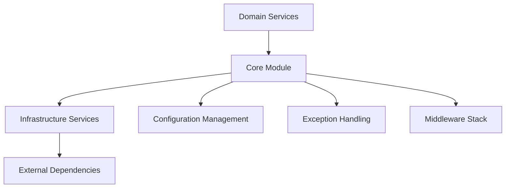

# Core Module Integration Guide

The `backend/app/core/` module serves as the **critical integration layer** between template infrastructure, custom domain services, and application setup. This guide explains how to effectively work with and extend the core module when customizing the template for your specific use case.

## 🎯 Core Module's Role in Template Architecture

### Central Integration Layer

The core module acts as the **central nervous system** of the FastAPI application, providing:

1. **Configuration Bridge**: Connects infrastructure services with domain logic through centralized settings
2. **Exception Integration**: Provides unified error handling across infrastructure and domain boundaries  
3. **Middleware Orchestration**: Sets up the production-ready middleware stack for all endpoints
4. **Dependency Injection Hub**: Serves as the central point for application-wide dependencies

### Template Architecture Integration



The core module ensures that your **custom domain logic** can seamlessly integrate with the **production-ready infrastructure** without tight coupling.

## 📁 Core Module Components

### Configuration Management (`app/core/config.py`)

**Primary Integration Role**: Centralizes all application settings and provides validated configuration to both infrastructure and domain services.

#### Key Integration Patterns

**Infrastructure Service Configuration**:
```python
from app.core import settings

# Infrastructure services get their config from core
cache_service = CacheService(
    redis_url=settings.redis_url,
    default_ttl=settings.cache_default_ttl
)

ai_service = AIService(
    api_key=settings.gemini_api_key,
    model=settings.ai_model,
    temperature=settings.ai_temperature
)
```

**Domain Service Integration**:
```python
from app.core import settings

class TextProcessingService:
    def __init__(self):
        # Domain services access infrastructure through core config
        self.resilience_config = settings.get_resilience_config()
        self.operation_strategy = settings.get_operation_strategy("summarize")
        
    async def process_text(self, text: str) -> dict:
        # Use configuration to drive behavior
        if len(text) > settings.max_input_length:
            raise ValidationError("Text too long")
```

#### Preset-Based Resilience Integration

The core module provides simplified resilience configuration that automatically configures all infrastructure services:

```python
# Simple environment variable configuration
RESILIENCE_PRESET=production  # or development, simple

# Custom overrides when needed
RESILIENCE_CUSTOM_CONFIG='{"retry_attempts": 7, "operation_overrides": {"qa": "critical"}}'

# Core module handles the complexity
resilience_config = settings.get_resilience_config()
strategy = settings.get_operation_strategy("your_operation")
```

### Exception Handling (`app/core/exceptions.py`)

**Primary Integration Role**: Provides a unified exception hierarchy that spans infrastructure and domain concerns, with intelligent classification for resilience patterns.

> **📖 For comprehensive exception handling documentation**, see the **[Exception Handling Guide](./EXCEPTION_HANDLING.md)** which provides:
> - Complete exception hierarchy and usage patterns
> - Global exception handler middleware integration
> - HTTP status code mapping and response formatting
> - Exception classification for resilience patterns
> - Comprehensive testing strategies for exception handling

#### Exception Architecture Integration

```python
# Infrastructure exceptions (transient vs permanent classification)
from app.core.exceptions import TransientAIError, PermanentAIError, classify_ai_exception

# Domain-specific validation
from app.core.exceptions import ValidationError, BusinessLogicError

# Unified error handling in your services
class YourDomainService:
    async def your_business_logic(self, input_data: str):
        # Domain validation using core exceptions
        if not self._validate_input(input_data):
            raise ValidationError(
                "Invalid input format",
                context={"input_length": len(input_data)}
            )
        
        try:
            # Call infrastructure service
            result = await self.ai_service.process(input_data)
            return result
        except Exception as e:
            # Use core classification for infrastructure errors
            if classify_ai_exception(e):
                # Let resilience infrastructure handle transient errors
                raise TransientAIError(f"Temporary AI service failure: {e}")
            else:
                # Convert to domain error for permanent failures
                raise BusinessLogicError(f"Unable to process input: {e}")
```

#### HTTP Status Code Integration

The core module automatically maps exceptions to appropriate HTTP status codes:

```python
from app.core.exceptions import get_http_status_for_exception

# Your FastAPI exception handlers work seamlessly
@app.exception_handler(ApplicationError)
async def handle_application_error(request: Request, exc: ApplicationError):
    status_code = get_http_status_for_exception(exc)  # Automatic mapping
    return JSONResponse(status_code=status_code, content={"error": str(exc)})
```

### Middleware Infrastructure (`app/core/middleware.py`)

**Primary Integration Role**: Sets up a comprehensive, production-ready middleware stack that works seamlessly with both public and internal APIs.

#### Production Middleware Integration

```python
from fastapi import FastAPI
from app.core.middleware import setup_middleware
from app.core import settings

# Your application setup
app = FastAPI(title="Your Application")

# Core module sets up complete middleware stack
setup_middleware(app, settings)

# Now your endpoints automatically get:
# - CORS configuration
# - Security headers
# - Request logging with performance metrics
# - Global exception handling
# - Performance monitoring
```

#### Custom Middleware Integration

When you need to add custom middleware, integrate with the core patterns:

```python
from app.core.middleware import RequestLoggingMiddleware

class YourCustomMiddleware:
    def __init__(self):
        # Access core configuration
        self.config = settings
        
    async def __call__(self, request: Request, call_next):
        # Use core logging patterns
        request_id = getattr(request.state, 'request_id', 'unknown')
        
        # Your custom logic here
        response = await call_next(request)
        
        # Follow core logging patterns
        logger.info(f"Custom processing for request {request_id}")
        return response
```

## 🔧 Common Integration Patterns

### 1. New Domain Service Integration

When creating new domain services, follow these core integration patterns:

```python
from fastapi import Depends
from app.core import settings, Settings, ApplicationError, ValidationError
from app.core.exceptions import classify_ai_exception

class YourNewDomainService:
    """Example of properly integrated domain service."""
    
    def __init__(self, config: Settings = Depends(lambda: settings)):
        # Get configuration through core module
        self.config = config
        self.resilience_config = config.get_resilience_config()
        
        # Initialize infrastructure services through core config
        self.ai_service = AIService(
            api_key=config.gemini_api_key,
            model=config.ai_model
        )
        self.cache_service = CacheService(
            redis_url=config.redis_url,
            ttl=config.cache_default_ttl
        )
    
    async def your_business_operation(self, input_data: str) -> dict:
        """Business operation with full core integration."""
        
        # Use core validation patterns
        if len(input_data) > self.config.max_input_length:
            raise ValidationError(
                "Input exceeds maximum length",
                context={"length": len(input_data), "max": self.config.max_input_length}
            )
        
        # Get operation-specific resilience strategy
        strategy = self.config.get_operation_strategy("your_operation")
        
        try:
            # Your business logic with infrastructure integration
            result = await self._process_with_resilience(input_data, strategy)
            return {"result": result, "strategy_used": strategy.value}
            
        except Exception as e:
            # Use core exception classification
            if isinstance(e, ApplicationError):
                raise  # Already properly classified
            elif classify_ai_exception(e):
                raise TransientAIError(f"Temporary failure: {e}")
            else:
                raise BusinessLogicError(f"Processing failed: {e}")
```

### 2. Infrastructure Service Extension

When extending infrastructure services, maintain integration with core configuration:

```python
from app.infrastructure.cache.base import CacheInterface
from app.core import settings

class YourCustomCacheService(CacheInterface):
    """Custom cache service integrated with core configuration."""
    
    def __init__(self):
        # Use core configuration
        self.config = settings
        self.ttl = settings.cache_default_ttl
        self.compression_threshold = settings.cache_compression_threshold
        
    async def get(self, key: str) -> Optional[Any]:
        # Your custom implementation
        pass
    
    async def set(self, key: str, value: Any, ttl: Optional[int] = None) -> None:
        # Use core configuration for defaults
        actual_ttl = ttl or self.ttl
        # Your custom implementation
        pass
```

### 3. API Endpoint Integration

Your API endpoints automatically benefit from core module integration:

```python
from fastapi import Depends, HTTPException
from app.core import ApplicationError

@app.post("/your-endpoint")
async def your_endpoint(
    request: YourRequest,
    service: YourNewDomainService = Depends()
):
    """API endpoint with full core integration."""
    try:
        result = await service.your_business_operation(request.input_data)
        return result
    except ApplicationError:
        # Core exception handler will automatically:
        # - Map to appropriate HTTP status code
        # - Include proper error response format
        # - Log with request context
        # - Include error context if available
        raise
    except Exception as e:
        # Unexpected errors get caught by global handler
        logger.error(f"Unexpected error: {e}")
        raise HTTPException(status_code=500, detail="Internal server error")
```

## 🚀 Template Customization Workflows

### When You Add New Configuration

1. **Add to Settings Class** (`app/core/config.py`):
```python
class Settings(BaseSettings):
    # Your new setting
    your_new_setting: str = Field(
        default="default_value",
        description="Description of your setting"
    )
```

2. **Use in Services**:
```python
class YourService:
    def __init__(self):
        self.your_setting = settings.your_new_setting
```

3. **Document in Environment Variables**:
```bash
# Add to your .env file
YOUR_NEW_SETTING=production_value
```

### When You Add New Exception Types

1. **Extend Core Hierarchy** (`app/core/exceptions.py`):
```python
class YourDomainError(BusinessLogicError):
    """Your specific domain error."""
    pass
```

2. **Update HTTP Status Mapping** if needed:
```python
def get_http_status_for_exception(exc: Exception) -> int:
    # Add your mapping
    if isinstance(exc, YourDomainError):
        return 422  # Unprocessable Entity
    # ... existing mappings
```

### When You Add New Middleware

1. **Follow Core Patterns** (`app/core/middleware.py`):
```python
def setup_middleware(app: FastAPI, settings: Settings):
    # Add your middleware to the setup function
    app.add_middleware(YourCustomMiddleware, config=settings)
    # ... existing middleware
```

## 🔍 Debugging and Monitoring Integration

### Configuration Debugging

```python
from app.core import settings

# Check configuration status
config_status = {
    "environment": "production" if not settings.debug else "development",
    "ai_configured": bool(settings.gemini_api_key),
    "redis_configured": bool(settings.redis_url),
    "resilience_strategy": settings.default_resilience_strategy,
}

# Validate resilience configuration
try:
    resilience_config = settings.get_resilience_config()
    print(f"Using {resilience_config.strategy.value} resilience strategy")
    print(f"Max retries: {resilience_config.retry_config.max_attempts}")
except Exception as e:
    print(f"Configuration error: {e}")
```

### Exception Flow Debugging

```python
from app.core.exceptions import classify_ai_exception, get_http_status_for_exception

# Debug exception classification
try:
    # Your operation that might fail
    result = await risky_operation()
except Exception as e:
    is_transient = classify_ai_exception(e)
    http_status = get_http_status_for_exception(e)
    
    print(f"Exception: {type(e).__name__}")
    print(f"Transient: {is_transient}")
    print(f"HTTP Status: {http_status}")
    print(f"Should retry: {is_transient}")
```

## 📚 Related Documentation

- **[Complete Core Module Reference](../../code_ref/backend/app/core/)**: Comprehensive technical documentation
- **[Infrastructure vs Domain Services](../reference/key-concepts/INFRASTRUCTURE_VS_DOMAIN.md)**: Architectural principles
- **[Dual API Architecture](../reference/key-concepts/DUAL_API_ARCHITECTURE.md)**: API design patterns
- **[Code Standards & Examples](./CODE_STANDARDS.md)**: Coding patterns and examples
- **[Authentication & Authorization](./AUTHENTICATION.md)**: Security integration patterns

## 💡 Best Practices

1. **Always use core configuration**: Don't access environment variables directly in your services
2. **Follow exception hierarchy**: Use appropriate exception types from the core module
3. **Leverage middleware patterns**: Add custom middleware through the core setup function
4. **Maintain integration patterns**: Follow the established patterns for infrastructure and domain service integration
5. **Test with core patterns**: Use the core exception and configuration patterns in your tests

This integration approach ensures your customizations work seamlessly with the template's production-ready infrastructure while maintaining clean separation of concerns.