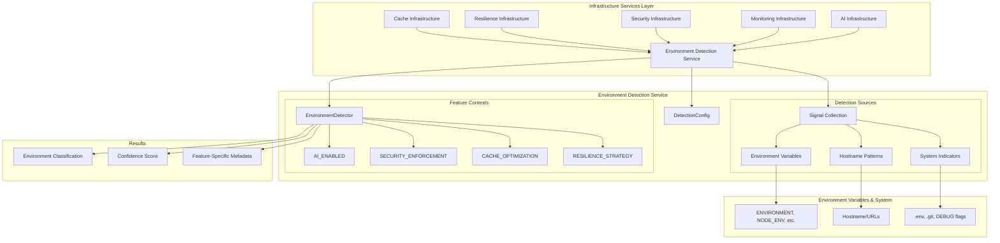
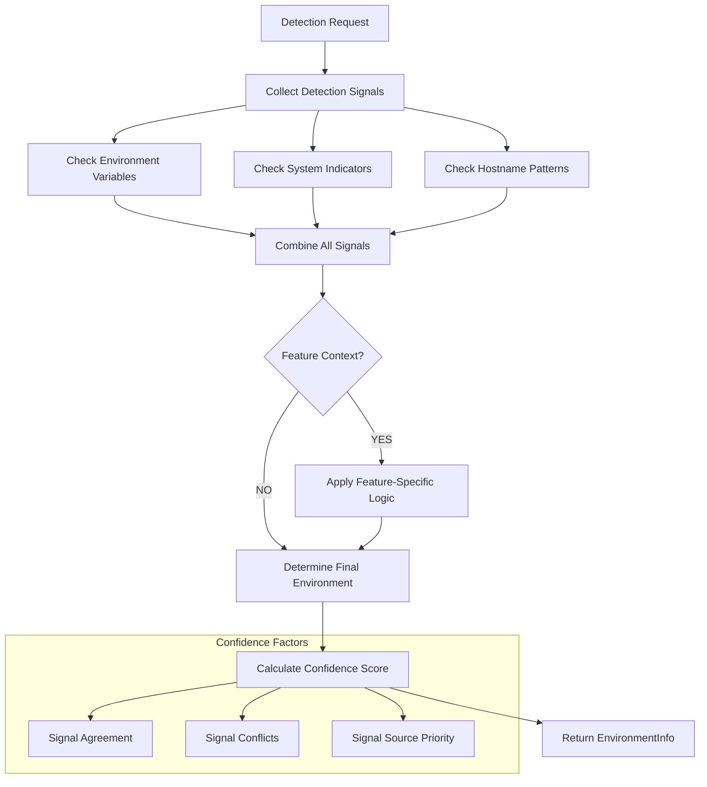

# Environment Detection Service

This document describes the unified Environment Detection Service (`app.core.environment`) - a centralized infrastructure service that provides consistent environment classification across all backend infrastructure services, eliminating code duplication and enabling feature-aware configuration management.

## 📋 Table of Contents

1. [Overview](#overview)
2. [Architecture Position](#architecture-position)
3. [Core Components](#core-components)
4. [Environment Detection Process](#environment-detection-process)
5. [Feature-Aware Detection](#feature-aware-detection)
6. [Configuration & Customization](#configuration--customization)
7. [Usage Patterns](#usage-patterns)
8. [Integration with Infrastructure Services](#integration-with-infrastructure-services)
9. [Best Practices](#best-practices)
10. [Debugging & Troubleshooting](#debugging--troubleshooting)
11. [Advanced Configuration](#advanced-configuration)
12. [See Also](#see-also)

## Overview

The Environment Detection Service provides centralized environment classification that eliminates code duplication across infrastructure services while providing consistent environment determination with confidence scoring, extensible patterns, and feature-specific context awareness.

### Key Features

- ✅ **Centralized Detection**: Single source of truth for environment classification
- ✅ **Confidence Scoring**: Provides confidence levels and reasoning for decisions
- ✅ **Extensible Patterns**: Configurable patterns for custom deployment scenarios
- ✅ **Context-Aware**: Supports feature-specific context (AI, security, cache, resilience)
- ✅ **Fallback Strategies**: Robust fallback detection for edge cases
- ✅ **Integration Ready**: Drop-in replacement for existing detection logic

### Template Architecture Benefits

The Environment Detection Service follows the template's **Infrastructure vs Domain Services** separation:

- **Infrastructure Service** (>90% test coverage required)
- **Business-agnostic** and reusable across all projects
- **Stable API** with minimal breaking changes
- **Foundation** for other infrastructure services (cache, resilience, security)

## Architecture Position



## Core Components

### Environment Classifications

The service provides five standard environment classifications with string enum behavior:

```python
from app.core.environment import Environment

class Environment(str, Enum):
    DEVELOPMENT = "development"    # Local development and testing environments
    TESTING = "testing"           # Automated testing and CI environments
    STAGING = "staging"           # Pre-production integration testing environments
    PRODUCTION = "production"     # Live production environments serving real users
    UNKNOWN = "unknown"           # Fallback when environment cannot be determined
```

**Usage Examples:**
```python
# String-like behavior for configuration
env = Environment.PRODUCTION
assert env.value == "production"
assert str(env) == "production"

# Comparison in configuration logic
if env == Environment.PRODUCTION:
    use_redis_cache = True
```

### Feature Contexts

Feature contexts enable specialized detection for specific infrastructure needs with string enum behavior:

```python
from app.core.environment import FeatureContext

class FeatureContext(str, Enum):
    AI_ENABLED = "ai_enabled"                    # AI-powered features requiring model access
    SECURITY_ENFORCEMENT = "security_enforcement" # Security-critical features with stricter requirements
    CACHE_OPTIMIZATION = "cache_optimization"    # Cache-intensive operations with performance tuning
    RESILIENCE_STRATEGY = "resilience_strategy"  # Resilience pattern selection and configuration
    DEFAULT = "default"                          # Standard environment detection without feature context
```

**Feature Context Behavior:**
- Each context applies specialized detection logic
- May include environment variable checks and overrides
- Provides feature-specific metadata in detection results
- Used with both convenience functions and detector methods

**Example Usage:**
```python
# Basic usage
context = FeatureContext.AI_ENABLED
assert context.value == "ai_enabled"

# Used with environment detection for feature-aware results
env_info = detector.detect_with_context(FeatureContext.SECURITY_ENFORCEMENT)
# May return production environment even in dev if security is enforced
```

### Detection Results

Environment detection returns comprehensive information with confidence scoring via dataclass:

```python
from app.core.environment import EnvironmentInfo

@dataclass
class EnvironmentInfo:
    environment: Environment              # Final determined environment classification
    confidence: float                    # Overall confidence score (0.0-1.0) for the detection
    reasoning: str                       # Human-readable explanation of the detection decision
    detected_by: str                     # Primary detection mechanism that determined the environment
    feature_context: FeatureContext      # Feature-specific context used in detection
    additional_signals: List[EnvironmentSignal]  # All environment signals collected during detection
    metadata: Dict[str, Any]             # Feature-specific metadata and configuration hints

    def __str__(self) -> str:
        """String representation for logging and debugging."""
        ...
```

**EnvironmentInfo Usage:**
```python
# Basic environment checking
env_info = detector.detect_environment()
if env_info.environment == Environment.PRODUCTION and env_info.confidence > 0.8:
    enable_production_features()

# Feature-aware detection
ai_env = detector.detect_with_context(FeatureContext.AI_ENABLED)
if 'ai_prefix' in ai_env.metadata:
    cache_key_prefix = ai_env.metadata['ai_prefix']

# Debugging detection issues
print(f"Environment: {env_info}")
print(f"Reasoning: {env_info.reasoning}")
for signal in env_info.additional_signals:
    print(f"  - {signal.source}: {signal.reasoning}")
```

### Environment Signals

Individual detection evidence with NamedTuple structure for performance:

```python
from app.core.environment import EnvironmentSignal

class EnvironmentSignal(NamedTuple):
    source: str                          # Detection mechanism (e.g., "env_var", "hostname_pattern")
    value: str                           # Raw value that triggered detection (e.g., "production")
    environment: Environment             # Environment classification this signal indicates
    confidence: float                    # Confidence score from 0.0-1.0 for this detection
    reasoning: str                       # Human-readable explanation of detection logic
```

**Signal Example:**
```python
signal = EnvironmentSignal(
    source="ENVIRONMENT",
    value="production",
    environment=Environment.PRODUCTION,
    confidence=0.95,
    reasoning="Explicit environment from ENVIRONMENT=production"
)
assert signal.confidence > 0.9
assert signal.environment == Environment.PRODUCTION
```

## Environment Detection Process

### Detection Flow



### Detection Sources

#### 1. Environment Variables (Highest Priority)

```python
# Priority order (highest to lowest confidence)
precedence = [
    'ENVIRONMENT',          # 0.95 confidence
    'NODE_ENV',            # 0.85 confidence
    'FLASK_ENV',           # 0.85 confidence
    'APP_ENV',             # 0.85 confidence
    'ENV',                 # 0.85 confidence
    'DEPLOYMENT_ENV',      # 0.85 confidence
    'DJANGO_SETTINGS_MODULE', # 0.85 confidence
    'RAILS_ENV'            # 0.85 confidence
]
```

#### 2. System Indicators (Moderate Priority)

```python
# Development indicators (0.70 confidence)
development_indicators = [
    'DEBUG=true',
    'DEBUG=1',
    '.env',                # File presence
    '.git',               # Directory presence
    'docker-compose.dev.yml'
]

# Production indicators (0.75 confidence)
production_indicators = [
    'PRODUCTION=true',
    'PROD=true',
    'DEBUG=false',
    'DEBUG=0'
]
```

#### 3. Hostname Patterns (Lower Priority)

```python
# Pattern matching (0.60-0.70 confidence)
patterns = {
    'development': [r'.*dev.*', r'.*local.*', r'.*test.*'],
    'staging': [r'.*stag.*', r'.*pre-?prod.*', r'.*uat.*'],
    'production': [r'.*prod.*', r'.*live.*', r'.*release.*']
}
```

## Feature-Aware Detection

### AI-Enabled Context

```python
from app.core.environment import get_environment_info, FeatureContext

# AI context provides cache prefix hints
ai_env = get_environment_info(FeatureContext.AI_ENABLED)
if ai_env.metadata.get('ai_prefix'):
    cache_prefix = ai_env.metadata['ai_prefix']
    cache_key = f"{cache_prefix}summarize:{text_hash}"
```

**Feature Configuration:**
```bash
# Enable AI-specific features
ENABLE_AI_CACHE=true  # Adds 'ai-' prefix metadata
```

### Security Enforcement Context

```python
# Security context may override to production
security_env = get_environment_info(FeatureContext.SECURITY_ENFORCEMENT)
if security_env.environment == Environment.PRODUCTION:
    enforce_authentication_requirements()
    enable_audit_logging()
```

**Feature Configuration:**
```bash
# Force security enforcement (overrides to production)
ENFORCE_AUTH=true  # May override environment to production
```

### Cache Optimization Context

```python
# Cache context for cache-intensive operations
cache_env = get_environment_info(FeatureContext.CACHE_OPTIMIZATION)
if cache_env.environment == Environment.DEVELOPMENT:
    use_memory_cache_only()
    set_short_cache_ttls()
```

### Resilience Strategy Context

```python
# Resilience context for pattern selection
resilience_env = get_environment_info(FeatureContext.RESILIENCE_STRATEGY)
preset = resilience_manager.recommend_preset(resilience_env.environment)
```

## Configuration & Customization

### Basic Usage

```python
from app.core.environment import EnvironmentDetector, get_environment_info

# Use global detector instance (recommended)
env_info = get_environment_info()
print(f"Environment: {env_info.environment} (confidence: {env_info.confidence})")

# Create custom detector instance
detector = EnvironmentDetector()
env_info = detector.detect_environment()
```

### Custom Detection Configuration

```python
from app.core.environment import DetectionConfig, EnvironmentDetector

# Custom configuration for specialized deployment
config = DetectionConfig(
    env_var_precedence=['CUSTOM_ENV', 'ENVIRONMENT'],
    development_patterns=[r'.*local.*', r'.*dev-.*', r'.*sandbox.*'],
    staging_patterns=[r'.*staging.*', r'.*uat.*', r'.*integration.*'],
    production_patterns=[r'.*live.*', r'.*prod.*', r'.*release.*', r'.*main.*'],
    development_indicators=['DEBUG=true', 'DEBUG=1', '.env', '.git'],
    production_indicators=['PRODUCTION=true', 'PROD=true', 'DEBUG=false'],
    feature_contexts={
        FeatureContext.SECURITY_ENFORCEMENT: {
            'environment_var': 'FORCE_SECURE_MODE',
            'production_override': True
        }
    }
)

detector = EnvironmentDetector(config)
env_info = detector.detect_environment()
```

## Usage Patterns

### Basic Environment Checking

```python
from app.core.environment import (
    get_environment_info,
    is_production_environment,
    is_development_environment,
    Environment
)

# Simple production check
if is_production_environment():
    configure_production_logging()
    enable_performance_monitoring()

# Development-specific features
if is_development_environment():
    enable_debug_logging()
    configure_hot_reloading()

# Detailed environment checking
env_info = get_environment_info()
if env_info.environment == Environment.PRODUCTION and env_info.confidence > 0.8:
    enable_production_features()
elif env_info.confidence < 0.7:
    logger.warning(f"Low confidence detection: {env_info.reasoning}")
```

### Integration with Configuration Systems

```python
# Cache preset selection
from app.infrastructure.cache import CacheManager

env_info = get_environment_info(FeatureContext.CACHE_OPTIMIZATION)
cache_preset = CacheManager.recommend_preset(env_info.environment)

# Resilience configuration
from app.infrastructure.resilience import ResilienceManager

resilience_env = get_environment_info(FeatureContext.RESILIENCE_STRATEGY)
resilience_config = ResilienceManager.get_preset_config(resilience_env.environment)

# Security configuration
from app.infrastructure.security import SecurityManager

security_env = get_environment_info(FeatureContext.SECURITY_ENFORCEMENT)
auth_config = SecurityManager.configure_for_environment(security_env)
```

## Integration with Infrastructure Services

### Cache Infrastructure

The Cache Infrastructure Service uses environment detection for automatic preset selection:

```python
# In cache infrastructure service
from app.core.environment import get_environment_info, FeatureContext

def get_cache_config():
    env_info = get_environment_info(FeatureContext.CACHE_OPTIMIZATION)

    if env_info.environment == Environment.PRODUCTION:
        return ProductionCacheConfig()
    elif env_info.environment == Environment.DEVELOPMENT:
        return DevelopmentCacheConfig()
    else:
        return DefaultCacheConfig()
```

### Resilience Infrastructure

The Resilience Infrastructure Service uses environment detection for strategy selection:

```python
# In resilience infrastructure service
from app.core.environment import get_environment_info, FeatureContext

def get_resilience_strategy():
    env_info = get_environment_info(FeatureContext.RESILIENCE_STRATEGY)

    strategies = {
        Environment.DEVELOPMENT: 'aggressive',  # Fast fail for development
        Environment.TESTING: 'balanced',        # Moderate resilience for testing
        Environment.PRODUCTION: 'conservative'  # High reliability for production
    }

    return strategies.get(env_info.environment, 'balanced')
```

### Security Infrastructure

The Security Infrastructure Service uses environment detection for authentication mode selection:

```python
# In security infrastructure service
from app.core.environment import get_environment_info, FeatureContext

def configure_auth_mode():
    env_info = get_environment_info(FeatureContext.SECURITY_ENFORCEMENT)

    # Security enforcement may override to production
    if env_info.environment == Environment.PRODUCTION or env_info.metadata.get('enforce_auth_enabled'):
        return AuthMode.PRODUCTION
    elif env_info.environment == Environment.DEVELOPMENT:
        return AuthMode.DEVELOPMENT
    else:
        return AuthMode.SIMPLE
```

## Best Practices

### 1. Use Feature Contexts for Specialized Detection

```python
# ✅ Good: Use specific context for specialized needs
ai_env = get_environment_info(FeatureContext.AI_ENABLED)
cache_prefix = ai_env.metadata.get('ai_prefix', '')

# ❌ Avoid: Generic detection for specialized needs
env_info = get_environment_info()  # Missing AI-specific context
```

### 2. Check Confidence Scores for Critical Decisions

```python
# ✅ Good: Validate confidence for critical decisions
env_info = get_environment_info()
if env_info.environment == Environment.PRODUCTION and env_info.confidence > 0.8:
    enable_production_features()
else:
    logger.warning(f"Uncertain environment detection: {env_info.reasoning}")

# ❌ Avoid: Ignoring confidence scores
if env_info.environment == Environment.PRODUCTION:
    enable_production_features()  # May be low confidence
```

### 3. Use Convenience Functions for Simple Checks

```python
# ✅ Good: Use convenience functions for simple checks
if is_production_environment():
    configure_production_settings()

# ✅ Good: Use convenience functions with feature context
if is_production_environment(FeatureContext.SECURITY_ENFORCEMENT):
    enforce_strict_security()

# ❌ Avoid: Verbose detection for simple checks
env_info = get_environment_info()
if env_info.environment == Environment.PRODUCTION and env_info.confidence > 0.60:
    configure_production_settings()
```

### 4. Leverage Feature-Specific Metadata

```python
# ✅ Good: Use metadata for configuration hints
ai_env = get_environment_info(FeatureContext.AI_ENABLED)
if ai_env.metadata.get('enable_ai_cache_enabled'):
    use_ai_optimized_cache_settings()

# ✅ Good: Use metadata for cache key prefixes
cache_prefix = ai_env.metadata.get('ai_prefix', '')
cache_key = f"{cache_prefix}operation-key"
```

## Debugging & Troubleshooting

### Environment Detection Summary

```python
from app.core.environment import EnvironmentDetector

detector = EnvironmentDetector()
summary = detector.get_environment_summary()

print(f"Detected Environment: {summary['detected_environment']}")
print(f"Confidence: {summary['confidence']:.2f}")
print(f"Reasoning: {summary['reasoning']}")
print(f"Primary Source: {summary['detected_by']}")

# Analyze all detection signals
print("\nDetection Signals:")
for signal in summary['all_signals']:
    print(f"  - {signal['source']}: {signal['environment']} ({signal['confidence']:.2f})")
    print(f"    Reasoning: {signal['reasoning']}")
```

### Low Confidence Detection

```python
def debug_low_confidence_detection():
    env_info = get_environment_info()

    if env_info.confidence < 0.7:
        logger.warning(f"Low confidence environment detection")
        logger.info(f"Environment: {env_info.environment}")
        logger.info(f"Confidence: {env_info.confidence:.2f}")
        logger.info(f"Reasoning: {env_info.reasoning}")

        # Log all detection signals for analysis
        for signal in env_info.additional_signals:
            logger.info(f"Signal - {signal.source}: {signal.environment.value} "
                       f"({signal.confidence:.2f}) - {signal.reasoning}")
```

### Common Detection Issues

#### Issue: No Environment Variables Set
```bash
# Solution: Set explicit environment variable
export ENVIRONMENT=development
```

#### Issue: Conflicting Detection Signals
```bash
# Check for conflicting environment variables
env | grep -E "(ENVIRONMENT|NODE_ENV|FLASK_ENV|APP_ENV)"

# Solution: Use ENVIRONMENT variable for highest precedence
export ENVIRONMENT=production
```

#### Issue: Hostname Pattern Not Matching
```python
# Debug hostname pattern matching
import os
hostname = os.getenv('HOSTNAME', '')
print(f"Hostname: {hostname}")

# Check if patterns match
patterns = [r'.*prod.*', r'.*live.*', r'.*release.*']
for pattern in patterns:
    if re.match(pattern, hostname, re.IGNORECASE):
        print(f"Matches production pattern: {pattern}")
```

## Advanced Configuration

### Custom Feature Contexts

```python
from app.core.environment import DetectionConfig, FeatureContext

# Define custom feature context
class CustomFeatureContext(str, Enum):
    BATCH_PROCESSING = "batch_processing"
    REALTIME_PROCESSING = "realtime_processing"

# Configure custom feature contexts
config = DetectionConfig(
    feature_contexts={
        CustomFeatureContext.BATCH_PROCESSING: {
            'environment_var': 'ENABLE_BATCH_MODE',
            'true_values': ['true', '1', 'enabled'],
            'preset_modifier': 'batch-'
        },
        CustomFeatureContext.REALTIME_PROCESSING: {
            'environment_var': 'ENABLE_REALTIME',
            'true_values': ['true', '1', 'yes'],
            'production_override': False
        }
    }
)
```

### Custom Detection Patterns

```python
# Custom deployment patterns with comprehensive configuration
config = DetectionConfig(
    env_var_precedence=['CUSTOM_ENV', 'DEPLOYMENT_STAGE', 'ENVIRONMENT'],
    development_patterns=[
        r'.*local.*',
        r'.*dev-.*',
        r'.*sandbox.*'
    ],
    staging_patterns=[
        r'.*staging.*',
        r'.*uat.*',
        r'.*integration.*'
    ],
    production_patterns=[
        r'.*prod.*',
        r'.*live.*',
        r'.*release.*',
        r'.*main.*'
    ],
    development_indicators=['TEST_MODE=true', 'DEVELOPMENT_MODE=true'],
    production_indicators=['LIVE_MODE=true', 'RELEASE_MODE=true']
)

# Apply custom patterns
detector = EnvironmentDetector(config)
env_info = detector.detect_environment()
```

### Integration Testing Support

```python
# Testing with custom environment detection
import pytest
from app.core.environment import EnvironmentDetector, DetectionConfig

@pytest.fixture
def test_detector():
    """Create detector configured for testing."""
    config = DetectionConfig(
        env_var_precedence=['TEST_ENVIRONMENT'],
        development_indicators=['TEST_MODE=true']
    )
    return EnvironmentDetector(config)

def test_environment_detection(test_detector, monkeypatch):
    monkeypatch.setenv('TEST_ENVIRONMENT', 'testing')

    env_info = test_detector.detect_environment()
    assert env_info.environment == Environment.TESTING
    assert env_info.confidence > 0.8
```

## See Also

### Related Documentation

- **[Core Module Integration Guide](./CORE_MODULE_INTEGRATION.md)**: Working with core module services including environment detection
- **[Backend Development Guide](../application/BACKEND.md)**: Complete backend development reference including environment detection usage
- **[Code Standards](./CODE_STANDARDS.md)**: Infrastructure vs domain service patterns and testing requirements

### Infrastructure Service Documentation

- **[Cache Infrastructure](../infrastructure/cache/CACHE.md)**: Cache service integration with environment detection
- **[Resilience Infrastructure](../infrastructure/RESILIENCE.md)**: Resilience pattern selection using environment detection
- **[Security Infrastructure](../infrastructure/SECURITY.md)**: Authentication mode configuration with environment detection
- **[Monitoring Infrastructure](../infrastructure/MONITORING.md)**: Environment-aware monitoring configuration

### Development Guides

- **[Exception Handling](./EXCEPTION_HANDLING.md)**: Custom exception patterns used in environment detection
- **[Testing Guide](../testing/TESTING.md)**: Testing patterns for infrastructure services including environment detection
- **[Authentication Guide](./AUTHENTICATION.md)**: Security infrastructure integration with environment detection

### Reference Documentation

- **[Infrastructure vs Domain Services](../../reference/key-concepts/INFRASTRUCTURE_VS_DOMAIN.md)**: Architectural foundation for environment detection service
- **[Dual API Architecture](../../reference/key-concepts/DUAL_API_ARCHITECTURE.md)**: API design patterns utilizing environment detection