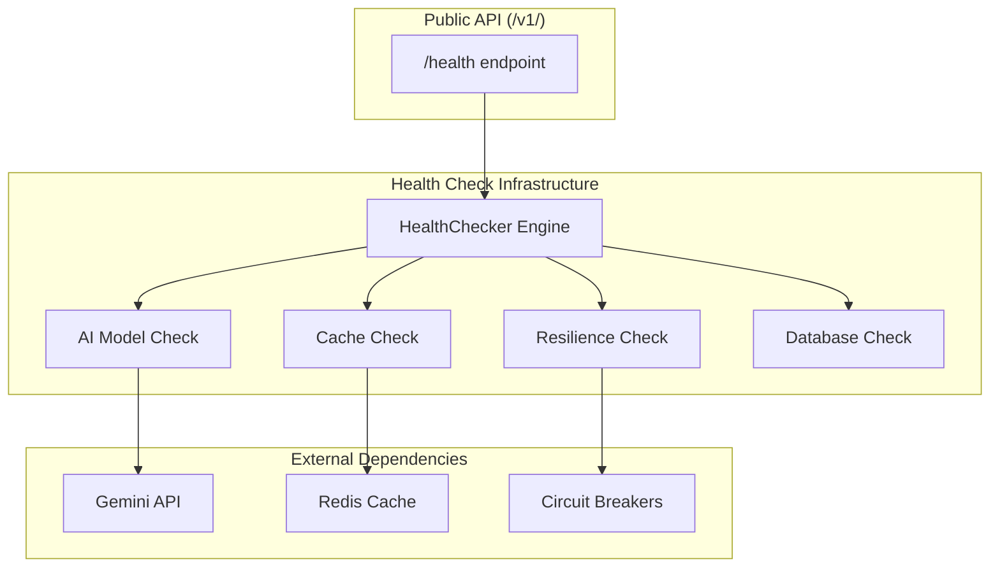

# Health Check Infrastructure Developer Guide

This comprehensive guide covers the health check infrastructure service, a production-ready component that provides standardized health monitoring for system components with async-first design, configurable timeouts, and graceful degradation patterns.

## Overview

The Health Check Infrastructure Service provides a robust foundation for monitoring application health across multiple components. It's designed as a **production-ready infrastructure service** that can be used as-is or extended for your specific monitoring requirements.

### Architecture Integration

The health check system integrates seamlessly with the template's dual-API architecture:

- **Infrastructure Service**: Provides business-agnostic health monitoring capabilities
- **Domain Integration**: Used by `/v1/health` endpoint to provide business-specific health status
- **Monitoring Integration**: Supports external monitoring systems and load balancers
- **Resilience Integration**: Works with circuit breakers and retry mechanisms



### Core Components

- **Infrastructure Module**: `app.infrastructure.monitoring.health`
- **Data Models**: `HealthStatus`, `ComponentStatus`, `SystemHealthStatus`
- **Engine**: `HealthChecker` (async, timeouts, retries, error isolation)
- **Built-in Checks**: AI model, cache, resilience, and database health validation
- **API Integration**: Dependency injection via `get_health_checker()`

## Quick Start

### Basic Health Checker Setup

```python
from app.infrastructure.monitoring.health import HealthChecker
from app.infrastructure.monitoring.health import (
    check_ai_model_health, 
    check_cache_health, 
    check_resilience_health
)

# Create health checker with default configuration
checker = HealthChecker()

# Register standard health checks
checker.register_check("ai_model", check_ai_model_health)
checker.register_check("cache", check_cache_health)
checker.register_check("resilience", check_resilience_health)

# Check all components
status = await checker.check_all_components()
print(f"Overall Status: {status.overall_status.value}")
for component in status.components:
    print(f"{component.name}: {component.status.value} - {component.message}")
```

### FastAPI Integration

```python
from fastapi import APIRouter, Depends
from app.dependencies import get_health_checker

health_router = APIRouter()

@health_router.get("/health")
async def custom_health_check(health_checker = Depends(get_health_checker)):
    """Custom health check endpoint using infrastructure service."""
    system_status = await health_checker.check_all_components()
    
    return {
        "status": system_status.overall_status.value,
        "components": [
            {
                "name": comp.name,
                "status": comp.status.value,
                "response_time_ms": comp.response_time_ms
            }
            for comp in system_status.components
        ],
        "timestamp": system_status.timestamp
    }
```

## Core Concepts

### HealthChecker Architecture

The `HealthChecker` class provides the core engine for health monitoring with these key design principles:

#### Async-First Design
All health checks are executed asynchronously with proper error isolation:

```python
# Components are checked in parallel for optimal performance
async def check_all_components(self) -> SystemHealthStatus:
    tasks = [self.check_component(name) for name in self._checks]
    components = await asyncio.gather(*tasks, return_exceptions=False)
    # ...
```

#### Timeout Management
Configurable timeouts prevent slow components from blocking the entire health check:

```python
checker = HealthChecker(
    default_timeout_ms=2000,
    per_component_timeouts_ms={
        "ai_model": 1000,    # Fast timeout for API key validation
        "cache": 3000,       # Longer timeout for cache operations
        "resilience": 1500   # Medium timeout for resilience checks
    }
)
```

#### Retry Strategies
Built-in retry logic with exponential backoff for transient failures:

```python
checker = HealthChecker(
    retry_count=2,                    # Retry up to 2 times
    backoff_base_seconds=0.1         # Start with 100ms backoff
)
```

#### Error Isolation
Component failures don't cascade - each check is isolated and reported independently:

```python
# Even if one component fails, others continue to execute
# Failed components return degraded/unhealthy status instead of raising exceptions
```

### Health Status Hierarchy

The system uses a three-tier status model:

#### HealthStatus Enum
```python
class HealthStatus(Enum):
    HEALTHY = "healthy"      # Component operating normally
    DEGRADED = "degraded"    # Component has issues but functional
    UNHEALTHY = "unhealthy"  # Component failed or unavailable
```

#### ComponentStatus Model
```python
@dataclass
class ComponentStatus:
    name: str                              # Component identifier
    status: HealthStatus                   # Current health status
    message: str = ""                      # Human-readable status message
    response_time_ms: float = 0.0         # Time taken for health check
    metadata: Optional[Dict[str, Any]] = None  # Additional diagnostic data
```

#### SystemHealthStatus Model
```python
@dataclass
class SystemHealthStatus:
    overall_status: HealthStatus           # Aggregated system status
    components: List[ComponentStatus]      # Individual component results
    timestamp: float                       # When check was performed
```

### Status Determination Logic

The overall system status follows this hierarchy:

1. **UNHEALTHY**: Any component reports unhealthy status
2. **DEGRADED**: No unhealthy components, but at least one degraded
3. **HEALTHY**: All components report healthy status

```python
@staticmethod
def _determine_overall_status(components: List[ComponentStatus]) -> HealthStatus:
    if any(c.status is HealthStatus.UNHEALTHY for c in components):
        return HealthStatus.UNHEALTHY
    if any(c.status is HealthStatus.DEGRADED for c in components):
        return HealthStatus.DEGRADED
    return HealthStatus.HEALTHY
```

## Usage Examples

### Custom Health Check Development

Create domain-specific health checks following the infrastructure pattern:

```python
async def check_custom_service_health() -> ComponentStatus:
    """Custom health check for domain-specific service."""
    name = "custom_service"
    start = time.perf_counter()
    
    try:
        # Perform your service-specific health validation
        service_available = await validate_custom_service()
        
        if service_available:
            status = HealthStatus.HEALTHY
            message = "Custom service operational"
        else:
            status = HealthStatus.DEGRADED
            message = "Custom service degraded"
            
        return ComponentStatus(
            name=name,
            status=status,
            message=message,
            response_time_ms=(time.perf_counter() - start) * 1000.0,
            metadata={"service_type": "custom", "checked_at": time.time()}
        )
        
    except Exception as e:
        return ComponentStatus(
            name=name,
            status=HealthStatus.UNHEALTHY,
            message=f"Custom service health check failed: {e}",
            response_time_ms=(time.perf_counter() - start) * 1000.0
        )

# Register your custom check
checker = get_health_checker()
checker.register_check("custom_service", check_custom_service_health)
```

### Advanced Configuration

Configure health checker with custom timeouts and retry behavior:

```python
from app.infrastructure.monitoring.health import HealthChecker

# Production configuration with aggressive timeouts
production_checker = HealthChecker(
    default_timeout_ms=1000,              # Fast default timeout
    per_component_timeouts_ms={
        "ai_model": 500,                   # Very fast for API key check
        "cache": 2000,                     # Allow time for cache operations
        "resilience": 1500,                # Medium timeout
        "database": 3000,                  # Longer for database operations
        "custom_service": 5000             # Custom timeout for specific needs
    },
    retry_count=3,                         # More retries for production
    backoff_base_seconds=0.05              # Faster initial backoff
)
```

### Dependency Injection Pattern

Use the built-in dependency injection for consistent health checker access:

```python
from app.dependencies import get_health_checker
from fastapi import Depends

async def my_endpoint(health_checker = Depends(get_health_checker)):
    """Endpoint that needs health checking capabilities."""
    # Check specific component
    ai_status = await health_checker.check_component("ai_model")
    
    if ai_status.status != HealthStatus.HEALTHY:
        # Handle degraded AI service
        return {"message": "AI service unavailable", "fallback": True}
    
    # Proceed with AI-dependent operations
    return {"message": "AI service available", "ai_status": ai_status.status.value}
```

### Metadata Integration

Include diagnostic information for advanced monitoring:

```python
async def check_enhanced_service_health() -> ComponentStatus:
    """Health check with comprehensive metadata."""
    name = "enhanced_service"
    start = time.perf_counter()
    
    try:
        # Collect detailed service metrics
        service_metrics = await get_service_metrics()
        
        status = HealthStatus.HEALTHY
        message = "Service operational"
        
        # Include rich metadata for monitoring systems
        metadata = {
            "version": service_metrics.get("version"),
            "uptime_seconds": service_metrics.get("uptime"),
            "memory_usage_mb": service_metrics.get("memory_mb"),
            "request_count": service_metrics.get("requests"),
            "error_rate": service_metrics.get("error_rate"),
            "performance_metrics": {
                "avg_response_time_ms": service_metrics.get("avg_response_time"),
                "p95_response_time_ms": service_metrics.get("p95_response_time"),
                "throughput_rps": service_metrics.get("throughput")
            }
        }
        
        # Determine status based on metrics
        if service_metrics.get("error_rate", 0) > 0.05:  # 5% error rate
            status = HealthStatus.DEGRADED
            message = "High error rate detected"
        elif service_metrics.get("avg_response_time", 0) > 1000:  # 1s avg response
            status = HealthStatus.DEGRADED
            message = "High response times detected"
            
        return ComponentStatus(
            name=name,
            status=status,
            message=message,
            response_time_ms=(time.perf_counter() - start) * 1000.0,
            metadata=metadata
        )
        
    except Exception as e:
        return ComponentStatus(
            name=name,
            status=HealthStatus.UNHEALTHY,
            message=f"Enhanced service health check failed: {e}",
            response_time_ms=(time.perf_counter() - start) * 1000.0,
            metadata={"error": str(e), "error_type": type(e).__name__}
        )
```

## Testing

### Unit Testing Health Checks

Test individual health check functions in isolation:

```python
import pytest
from unittest.mock import AsyncMock, patch
from app.infrastructure.monitoring.health import (
    check_ai_model_health, 
    HealthStatus,
    ComponentStatus
)

class TestAIModelHealthCheck:
    @pytest.mark.asyncio
    async def test_ai_model_healthy_with_api_key(self, monkeypatch):
        """Test AI model health check with valid API key."""
        monkeypatch.setenv("GEMINI_API_KEY", "test-key")
        
        result = await check_ai_model_health()
        
        assert result.name == "ai_model"
        assert result.status == HealthStatus.HEALTHY
        assert "AI model configured" in result.message
        assert result.metadata["has_api_key"] is True
        assert result.response_time_ms > 0

    @pytest.mark.asyncio
    async def test_ai_model_degraded_without_api_key(self, monkeypatch):
        """Test AI model health check without API key."""
        monkeypatch.setenv("GEMINI_API_KEY", "")
        
        result = await check_ai_model_health()
        
        assert result.name == "ai_model"
        assert result.status == HealthStatus.DEGRADED
        assert "Missing Gemini API key" in result.message
        assert result.metadata["has_api_key"] is False
```

### Integration Testing with FastAPI

Test health checks through FastAPI endpoints:

```python
import pytest
from fastapi.testclient import TestClient
from unittest.mock import AsyncMock, patch

class TestHealthEndpoint:
    def test_health_endpoint_healthy_components(self, client: TestClient, monkeypatch):
        """Test health endpoint with all components healthy."""
        # Mock healthy components
        mock_system_status = SystemHealthStatus(
            overall_status=HealthStatus.HEALTHY,
            components=[
                ComponentStatus("ai_model", HealthStatus.HEALTHY, "AI configured"),
                ComponentStatus("cache", HealthStatus.HEALTHY, "Cache operational"),
                ComponentStatus("resilience", HealthStatus.HEALTHY, "Resilience healthy")
            ],
            timestamp=time.time()
        )
        
        with patch('app.dependencies.get_health_checker') as mock_get_checker:
            mock_checker = AsyncMock()
            mock_checker.check_all_components.return_value = mock_system_status
            mock_get_checker.return_value = mock_checker
            
            response = client.get("/v1/health")
            
        assert response.status_code == 200
        data = response.json()
        assert data["status"] == "healthy"
        assert data["ai_model_available"] is True
        assert data["cache_healthy"] is True
        assert data["resilience_healthy"] is True

    def test_health_endpoint_degraded_components(self, client: TestClient):
        """Test health endpoint with degraded components."""
        mock_system_status = SystemHealthStatus(
            overall_status=HealthStatus.DEGRADED,
            components=[
                ComponentStatus("ai_model", HealthStatus.DEGRADED, "Missing API key"),
                ComponentStatus("cache", HealthStatus.HEALTHY, "Cache operational")
            ],
            timestamp=time.time()
        )
        
        with patch('app.dependencies.get_health_checker') as mock_get_checker:
            mock_checker = AsyncMock()
            mock_checker.check_all_components.return_value = mock_system_status
            mock_get_checker.return_value = mock_checker
            
            response = client.get("/v1/health")
            
        assert response.status_code == 200
        data = response.json()
        assert data["status"] == "degraded"
        assert data["ai_model_available"] is False
        assert data["cache_healthy"] is True
```

### Mocking Strategies

Isolate component dependencies for reliable testing:

```python
class TestHealthCheckerEngine:
    @pytest.mark.asyncio
    async def test_timeout_handling(self):
        """Test that timeouts are properly handled."""
        async def slow_check():
            await asyncio.sleep(2.0)  # Longer than timeout
            return ComponentStatus("slow", HealthStatus.HEALTHY, "Too slow")
        
        checker = HealthChecker(default_timeout_ms=100)  # Very short timeout
        checker.register_check("slow", slow_check)
        
        result = await checker.check_component("slow")
        
        assert result.status == HealthStatus.DEGRADED
        assert "timed out" in result.message
        assert result.response_time_ms > 100

    @pytest.mark.asyncio
    async def test_retry_mechanism(self):
        """Test retry behavior with transient failures."""
        call_count = 0
        
        async def flaky_check():
            nonlocal call_count
            call_count += 1
            if call_count < 3:  # Fail first 2 attempts
                raise Exception("Transient failure")
            return ComponentStatus("flaky", HealthStatus.HEALTHY, "Eventually works")
        
        checker = HealthChecker(retry_count=3, backoff_base_seconds=0.01)
        checker.register_check("flaky", flaky_check)
        
        result = await checker.check_component("flaky")
        
        assert result.status == HealthStatus.HEALTHY
        assert call_count == 3
```

### Performance Testing

Test health check performance and timeout behavior:

```python
@pytest.mark.slow
class TestHealthCheckPerformance:
    @pytest.mark.asyncio
    async def test_parallel_execution_performance(self):
        """Test that components are checked in parallel."""
        start_time = time.perf_counter()
        
        async def slow_check():
            await asyncio.sleep(0.1)  # 100ms delay
            return ComponentStatus("slow", HealthStatus.HEALTHY, "Slow but works")
        
        checker = HealthChecker()
        # Register 5 slow checks
        for i in range(5):
            checker.register_check(f"slow_{i}", slow_check)
        
        await checker.check_all_components()
        
        elapsed = time.perf_counter() - start_time
        # Should complete in ~100ms (parallel) not ~500ms (sequential)
        assert elapsed < 0.2, f"Health checks took {elapsed:.3f}s, expected < 0.2s"

    @pytest.mark.asyncio
    async def test_timeout_accuracy(self):
        """Test that timeouts are enforced accurately."""
        timeout_ms = 50
        
        async def timeout_check():
            await asyncio.sleep(0.1)  # 100ms - should timeout
            return ComponentStatus("timeout", HealthStatus.HEALTHY, "Should not reach")
        
        checker = HealthChecker(default_timeout_ms=timeout_ms)
        checker.register_check("timeout", timeout_check)
        
        start = time.perf_counter()
        result = await checker.check_component("timeout")
        elapsed_ms = (time.perf_counter() - start) * 1000
        
        assert result.status == HealthStatus.DEGRADED
        assert "timed out" in result.message
        # Should timeout close to the specified timeout
        assert elapsed_ms < timeout_ms + 20  # Allow 20ms tolerance
```

## Advanced Usage

### Custom Component Development

Develop sophisticated health checks with advanced features:

```python
from typing import Dict, Any
import aiohttp
import ssl

async def check_external_api_health() -> ComponentStatus:
    """Health check for external API dependency with comprehensive validation."""
    name = "external_api"
    start = time.perf_counter()
    
    try:
        # Create SSL context for secure connections
        ssl_context = ssl.create_default_context()
        
        async with aiohttp.ClientSession(
            timeout=aiohttp.ClientTimeout(total=2.0),
            connector=aiohttp.TCPConnector(ssl=ssl_context)
        ) as session:
            # Check API availability
            async with session.get("https://api.example.com/health") as response:
                response_data = await response.json()
                
                # Evaluate response
                api_status = response_data.get("status", "unknown")
                response_time = response_data.get("response_time_ms", 0)
                
                # Determine health based on multiple factors
                if response.status == 200 and api_status == "healthy":
                    if response_time < 500:  # Fast response
                        status = HealthStatus.HEALTHY
                        message = f"External API healthy (response: {response_time}ms)"
                    else:  # Slow but working
                        status = HealthStatus.DEGRADED
                        message = f"External API slow (response: {response_time}ms)"
                else:
                    status = HealthStatus.DEGRADED
                    message = f"External API degraded (status: {api_status})"
                
                metadata = {
                    "api_status": api_status,
                    "http_status": response.status,
                    "api_response_time_ms": response_time,
                    "ssl_verified": True,
                    "endpoint": "https://api.example.com/health"
                }
                
        return ComponentStatus(
            name=name,
            status=status,
            message=message,
            response_time_ms=(time.perf_counter() - start) * 1000.0,
            metadata=metadata
        )
        
    except aiohttp.ClientTimeout:
        return ComponentStatus(
            name=name,
            status=HealthStatus.DEGRADED,
            message="External API timeout",
            response_time_ms=(time.perf_counter() - start) * 1000.0,
            metadata={"error_type": "timeout"}
        )
    except aiohttp.ClientError as e:
        return ComponentStatus(
            name=name,
            status=HealthStatus.UNHEALTHY,
            message=f"External API connection failed: {e}",
            response_time_ms=(time.perf_counter() - start) * 1000.0,
            metadata={"error_type": "connection_error", "error": str(e)}
        )
    except Exception as e:
        return ComponentStatus(
            name=name,
            status=HealthStatus.UNHEALTHY,
            message=f"External API health check failed: {e}",
            response_time_ms=(time.perf_counter() - start) * 1000.0,
            metadata={"error_type": "unexpected_error", "error": str(e)}
        )
```

### Error Handling Patterns

Implement robust error handling for production environments:

```python
from contextlib import asynccontextmanager

class HealthCheckManager:
    """Advanced health check manager with error handling and logging."""
    
    def __init__(self, checker: HealthChecker):
        self.checker = checker
        self.logger = logging.getLogger(__name__)
    
    @asynccontextmanager
    async def component_check_context(self, component_name: str):
        """Context manager for safe component health checking."""
        self.logger.debug(f"Starting health check for {component_name}")
        start_time = time.perf_counter()
        
        try:
            yield
        except Exception as e:
            elapsed_ms = (time.perf_counter() - start_time) * 1000.0
            self.logger.error(
                f"Health check failed for {component_name}: {e}",
                extra={
                    "component": component_name,
                    "error": str(e),
                    "duration_ms": elapsed_ms,
                    "error_type": type(e).__name__
                }
            )
            raise
        finally:
            elapsed_ms = (time.perf_counter() - start_time) * 1000.0
            self.logger.debug(
                f"Completed health check for {component_name} in {elapsed_ms:.2f}ms"
            )
    
    async def safe_check_component(self, component_name: str) -> ComponentStatus:
        """Safely check component with comprehensive error handling."""
        async with self.component_check_context(component_name):
            try:
                return await self.checker.check_component(component_name)
            except ValueError as e:
                # Component not registered
                return ComponentStatus(
                    name=component_name,
                    status=HealthStatus.UNHEALTHY,
                    message=f"Component not registered: {e}",
                    response_time_ms=0.0,
                    metadata={"error_type": "configuration_error"}
                )
            except Exception as e:
                # Unexpected error
                return ComponentStatus(
                    name=component_name,
                    status=HealthStatus.UNHEALTHY,
                    message=f"Unexpected health check error: {e}",
                    response_time_ms=0.0,
                    metadata={"error_type": "unexpected_error", "error": str(e)}
                )
```

### Performance Optimization

Optimize health checks for high-performance scenarios:

```python
from functools import lru_cache
import asyncio

class OptimizedHealthChecker(HealthChecker):
    """Performance-optimized health checker with caching and batching."""
    
    def __init__(self, *args, cache_ttl_seconds: int = 30, **kwargs):
        super().__init__(*args, **kwargs)
        self.cache_ttl_seconds = cache_ttl_seconds
        self._last_check_time = 0.0
        self._cached_status: Optional[SystemHealthStatus] = None
    
    async def check_all_components_cached(self) -> SystemHealthStatus:
        """Check components with TTL-based caching."""
        current_time = time.time()
        
        # Return cached result if still fresh
        if (self._cached_status and 
            current_time - self._last_check_time < self.cache_ttl_seconds):
            return self._cached_status
        
        # Perform fresh check
        status = await self.check_all_components()
        
        # Update cache
        self._cached_status = status
        self._last_check_time = current_time
        
        return status
    
    async def check_critical_components_only(self, critical_components: List[str]) -> SystemHealthStatus:
        """Check only critical components for faster health validation."""
        tasks = [
            self.check_component(name) 
            for name in critical_components 
            if name in self._checks
        ]
        
        if not tasks:
            # No critical components registered
            return SystemHealthStatus(
                overall_status=HealthStatus.DEGRADED,
                components=[],
                timestamp=time.time()
            )
        
        components = await asyncio.gather(*tasks, return_exceptions=False)
        overall = self._determine_overall_status(components)
        
        return SystemHealthStatus(
            overall_status=overall,
            components=components,
            timestamp=time.time()
        )
```

### Production Patterns

Implement health checking patterns suitable for production deployment:

```python
from dataclasses import asdict
import json

class ProductionHealthChecker:
    """Production-ready health checker with monitoring integration."""
    
    def __init__(self, health_checker: HealthChecker):
        self.health_checker = health_checker
        self.logger = logging.getLogger(__name__)
    
    async def check_with_monitoring(self) -> Dict[str, Any]:
        """Perform health check with monitoring system integration."""
        start_time = time.perf_counter()
        
        try:
            status = await self.health_checker.check_all_components()
            
            # Log health check results for monitoring
            self.logger.info(
                "Health check completed",
                extra={
                    "overall_status": status.overall_status.value,
                    "component_count": len(status.components),
                    "healthy_components": sum(
                        1 for c in status.components 
                        if c.status == HealthStatus.HEALTHY
                    ),
                    "degraded_components": sum(
                        1 for c in status.components 
                        if c.status == HealthStatus.DEGRADED
                    ),
                    "unhealthy_components": sum(
                        1 for c in status.components 
                        if c.status == HealthStatus.UNHEALTHY
                    ),
                    "total_duration_ms": (time.perf_counter() - start_time) * 1000.0
                }
            )
            
            # Convert to monitoring-friendly format
            return {
                "status": status.overall_status.value,
                "timestamp": status.timestamp,
                "components": {
                    comp.name: {
                        "status": comp.status.value,
                        "message": comp.message,
                        "response_time_ms": comp.response_time_ms,
                        "metadata": comp.metadata or {}
                    }
                    for comp in status.components
                },
                "summary": {
                    "total_components": len(status.components),
                    "healthy": sum(1 for c in status.components if c.status == HealthStatus.HEALTHY),
                    "degraded": sum(1 for c in status.components if c.status == HealthStatus.DEGRADED),
                    "unhealthy": sum(1 for c in status.components if c.status == HealthStatus.UNHEALTHY),
                    "avg_response_time_ms": sum(c.response_time_ms for c in status.components) / len(status.components) if status.components else 0
                }
            }
            
        except Exception as e:
            self.logger.error(f"Health check system failure: {e}")
            return {
                "status": "unhealthy",
                "timestamp": time.time(),
                "error": str(e),
                "components": {},
                "summary": {"total_components": 0, "healthy": 0, "degraded": 0, "unhealthy": 0}
            }
    
    def format_for_prometheus(self, health_data: Dict[str, Any]) -> str:
        """Format health check results for Prometheus metrics."""
        lines = []
        
        # Overall status metric
        status_value = {"healthy": 1, "degraded": 0.5, "unhealthy": 0}.get(
            health_data.get("status", "unhealthy"), 0
        )
        lines.append(f'health_check_status {status_value}')
        
        # Component-specific metrics
        for comp_name, comp_data in health_data.get("components", {}).items():
            comp_status_value = {"healthy": 1, "degraded": 0.5, "unhealthy": 0}.get(
                comp_data.get("status", "unhealthy"), 0
            )
            lines.append(f'health_check_component_status{{component="{comp_name}"}} {comp_status_value}')
            lines.append(f'health_check_component_response_time_ms{{component="{comp_name}"}} {comp_data.get("response_time_ms", 0)}')
        
        # Summary metrics
        summary = health_data.get("summary", {})
        lines.append(f'health_check_total_components {summary.get("total_components", 0)}')
        lines.append(f'health_check_healthy_components {summary.get("healthy", 0)}')
        lines.append(f'health_check_degraded_components {summary.get("degraded", 0)}')
        lines.append(f'health_check_unhealthy_components {summary.get("unhealthy", 0)}')
        
        return '\n'.join(lines)
```

## Configuration

### Environment Variables

Configure health check behavior through environment variables that are **properly integrated** with the application settings:

```bash
# Default timeout for all health checks
HEALTH_CHECK_TIMEOUT_MS=2000

# Component-specific timeout overrides
HEALTH_CHECK_AI_MODEL_TIMEOUT_MS=1000      # Fast timeout for API key validation
HEALTH_CHECK_CACHE_TIMEOUT_MS=3000         # Allow time for cache operations
HEALTH_CHECK_RESILIENCE_TIMEOUT_MS=1500    # Medium timeout for resilience checks

# Retry configuration
HEALTH_CHECK_RETRY_COUNT=1                 # Number of retry attempts

# Component enablement
HEALTH_CHECK_ENABLED_COMPONENTS=["ai_model", "cache", "resilience"]
```

### Configuration Integration Pattern

**Important**: The health checker is properly integrated with application settings through dependency injection. Environment variables affect the actual running configuration:

```python
# In app/dependencies.py
from app.core.config import Settings
from fastapi import Depends

@lru_cache()
def get_health_checker(settings: Settings = Depends(get_settings)) -> HealthChecker:
    """
    Health checker configured from application settings.
    All environment variables are properly applied.
    """
    # Component-specific timeouts from settings
    per_component_timeouts = {
        "ai_model": settings.health_check_ai_model_timeout_ms,
        "cache": settings.health_check_cache_timeout_ms,
        "resilience": settings.health_check_resilience_timeout_ms,
    }
    
    checker = HealthChecker(
        default_timeout_ms=settings.health_check_timeout_ms,
        per_component_timeouts_ms=per_component_timeouts,
        retry_count=settings.health_check_retry_count,
        backoff_base_seconds=0.1,
    )
    
    # Register health checks with dependency injection for performance
    cache_service = await get_cache_service(settings)
    checker.register_check("ai_model", check_ai_model_health)
    checker.register_check("cache", lambda: check_cache_health(cache_service))
    checker.register_check("resilience", check_resilience_health)
    
    return checker
```

### Performance Optimization Patterns

The health checker follows performance best practices:

#### Dependency Injection for Cache Service

**Problem Solved**: Eliminates redundant cache instantiation on every health check call.

```python
# OLD (inefficient) - Creates new cache instance every check
async def check_cache_health() -> ComponentStatus:
    cache_service = AIResponseCache(...)  # New instance every time!
    stats = await cache_service.get_cache_stats()

# NEW (efficient) - Reuses singleton cache service
async def check_cache_health(cache_service: AIResponseCache) -> ComponentStatus:
    """Reuses the application's singleton cache service for optimal performance."""
    stats = await cache_service.get_cache_stats()  # Reuses existing connections
```

#### Implemented Cache Service Optimization

**Real Implementation**: Our health check infrastructure now includes this exact optimization pattern:

```python
# In app/dependencies.py - Health checker registration with dependency injection
@lru_cache()
def get_health_checker(settings: Settings = Depends(get_settings)) -> HealthChecker:
    checker = HealthChecker(...)

    # Cache health check with dependency injection for optimal performance
    async def cache_health_with_service():
        cache_service = await get_cache_service(settings)
        return await check_cache_health(cache_service)  # Reuses singleton service

    checker.register_check("cache", cache_health_with_service)
    return checker

# In app/infrastructure/monitoring/health.py - Optimized function signature
async def check_cache_health(cache_service=None) -> ComponentStatus:
    """
    Check cache system health using dependency injection for optimal performance.

    Performance Notes:
        - ✅ OPTIMAL: When cache_service is provided, no instantiation overhead
        - ⚠️ FALLBACK: When cache_service is None, creates new service instance (less efficient)
        - For best performance, use dependency injection in get_health_checker()
    """
    if cache_service is not None:
        # OPTIMAL path - reuse existing cache service
        stats = await cache_service.get_cache_stats()
    else:
        # FALLBACK path - create new service for backward compatibility
        cache_service = await get_cache_service(settings)
        await cache_service.connect()
        stats = await cache_service.get_cache_stats()
```

**Performance Impact**:
- **Before**: Created new cache instance + Redis connection on every health check
- **After**: Reuses singleton cache service with persistent connections
- **Benefit**: Eliminates Redis connection overhead, reduces memory allocation, improves response times

#### Proper Settings Integration

**Problem Solved**: Configuration changes now affect the running application immediately.

```python
# Environment variables are properly applied through settings
def verify_configuration_integration():
    """Verify that environment variables affect health checker behavior."""
    import os
    os.environ["HEALTH_CHECK_TIMEOUT_MS"] = "5000"
    
    # Settings automatically pick up environment changes
    fresh_settings = Settings()
    assert fresh_settings.health_check_timeout_ms == 5000
    
    # Health checker uses these settings via dependency injection
    checker = get_health_checker(fresh_settings)
    assert checker._default_timeout_ms == 5000
```

### Development vs Production Configuration

#### Development Configuration
```bash
# Fast feedback, shorter timeouts
HEALTH_CHECK_TIMEOUT_MS=1000
HEALTH_CHECK_AI_MODEL_TIMEOUT_MS=500
HEALTH_CHECK_CACHE_TIMEOUT_MS=1500
HEALTH_CHECK_RESILIENCE_TIMEOUT_MS=1000
HEALTH_CHECK_RETRY_COUNT=1
HEALTH_CHECK_ENABLED_COMPONENTS=["ai_model", "cache", "resilience"]
```

#### Production Configuration
```bash
# More resilient, longer timeouts, more retries
HEALTH_CHECK_TIMEOUT_MS=3000
HEALTH_CHECK_AI_MODEL_TIMEOUT_MS=2000
HEALTH_CHECK_CACHE_TIMEOUT_MS=5000
HEALTH_CHECK_RESILIENCE_TIMEOUT_MS=2500
HEALTH_CHECK_RETRY_COUNT=3
HEALTH_CHECK_ENABLED_COMPONENTS=["ai_model", "cache", "resilience", "database"]
```

### Custom Configuration in Code

Override configuration programmatically for specific use cases:

```python
from app.core.config import settings
from app.infrastructure.monitoring.health import HealthChecker

# Create health checker with custom configuration
def create_custom_health_checker() -> HealthChecker:
    """Create health checker optimized for specific environment."""
    
    # Get base configuration from settings
    base_timeout = settings.health_check_timeout_ms
    
    # Create custom timeout mapping
    timeouts = {
        "ai_model": settings.health_check_ai_model_timeout_ms,
        "cache": settings.health_check_cache_timeout_ms,
        "resilience": settings.health_check_resilience_timeout_ms
    }
    
    # Add custom components with specific timeouts
    if settings.environment == "production":
        timeouts["database"] = 5000    # Longer timeout for database in production
        timeouts["external_api"] = 10000  # Very long timeout for external APIs
        retry_count = 3                 # More retries in production
    else:
        retry_count = 1                 # Faster feedback in development
    
    return HealthChecker(
        default_timeout_ms=base_timeout,
        per_component_timeouts_ms=timeouts,
        retry_count=retry_count,
        backoff_base_seconds=0.1
    )
```

### Configuration Validation

Implement configuration validation for health check settings:

```python
from pydantic import BaseModel, Field, field_validator
from typing import Dict, List

class HealthCheckConfig(BaseModel):
    """Validated configuration for health check system."""
    
    default_timeout_ms: int = Field(default=2000, gt=0, le=30000)
    component_timeouts_ms: Dict[str, int] = Field(default_factory=dict)
    retry_count: int = Field(default=1, ge=0, le=5)
    backoff_base_seconds: float = Field(default=0.1, gt=0.0, le=1.0)
    enabled_components: List[str] = Field(default=["ai_model", "cache", "resilience"])
    
    @field_validator('component_timeouts_ms')
    @classmethod
    def validate_component_timeouts(cls, v: Dict[str, int]) -> Dict[str, int]:
        """Validate component timeout values."""
        for component, timeout in v.items():
            if timeout <= 0 or timeout > 30000:
                raise ValueError(f"Component timeout for {component} must be between 1 and 30000ms")
        return v
    
    @field_validator('enabled_components')
    @classmethod
    def validate_enabled_components(cls, v: List[str]) -> List[str]:
        """Validate enabled component names."""
        allowed_components = {"ai_model", "cache", "resilience", "database"}
        invalid = set(v) - allowed_components
        if invalid:
            raise ValueError(f"Invalid component names: {invalid}. Allowed: {allowed_components}")
        return v

# Usage with validation
def create_validated_health_checker(config_dict: Dict) -> HealthChecker:
    """Create health checker with validated configuration."""
    config = HealthCheckConfig(**config_dict)
    
    return HealthChecker(
        default_timeout_ms=config.default_timeout_ms,
        per_component_timeouts_ms=config.component_timeouts_ms,
        retry_count=config.retry_count,
        backoff_base_seconds=config.backoff_base_seconds
    )
```

## Troubleshooting

### Common Issues and Solutions

#### Redis Connection Problems

**Symptom**: Cache health check returns degraded/unhealthy status with "Cache Redis connection failed" in logs.

**Diagnosis**:
```bash
# Check Redis connectivity
curl -v redis://localhost:6379
# Or using redis-cli
redis-cli ping

# Check environment variables
echo $REDIS_URL

# Check Docker services
docker compose ps redis
```

**Solutions**:
1. **Development Environment**:
   ```bash
   # Start Redis service
   docker compose up -d redis
   
   # Verify Redis is running
   docker compose logs redis
   ```

2. **Configuration Issues**:
   ```bash
   # Verify REDIS_URL matches your setup
   export REDIS_URL=redis://localhost:6379  # Local Redis
   export REDIS_URL=redis://redis:6379      # Docker Compose
   ```

3. **Graceful Degradation**: The cache automatically falls back to memory-only mode when Redis is unavailable - this is expected behavior.

#### Missing or Invalid API Keys

**Symptom**: AI model health check returns degraded status with `ai_model_available: false`.

**Diagnosis**:
```bash
# Check API key configuration
echo $GEMINI_API_KEY

# Test API key validity (if available)
curl -H "Authorization: Bearer $GEMINI_API_KEY" \
  https://generativelanguage.googleapis.com/v1beta/models
```

**Solutions**:
1. **Set API Key**:
   ```bash
   # In .env file
   echo "GEMINI_API_KEY=your-actual-api-key" >> .env
   
   # Or export directly
   export GEMINI_API_KEY="your-actual-api-key"
   ```

2. **Restart Application**:
   ```bash
   # Restart backend to pick up new environment variables
   make run-backend
   ```

3. **Validate Key Format**: Ensure the API key is properly formatted and has necessary permissions.

#### Resilience System Initialization Errors

**Symptom**: Resilience health check shows unhealthy status with import errors for `ai_resilience`.

**Diagnosis**:
```python
# Test resilience import directly
python -c "from app.infrastructure.resilience.orchestrator import ai_resilience; print('OK')"

# Check circuit breaker status
curl -H "X-API-Key: your-api-key" http://localhost:8000/internal/resilience/circuit-breakers
```

**Solutions**:
1. **Verify Dependencies**: Ensure all resilience modules are properly installed and available.

2. **Check Configuration**:
   ```bash
   # Verify resilience preset
   echo $RESILIENCE_PRESET
   
   # Use simple preset for testing
   export RESILIENCE_PRESET=simple
   ```

3. **Review Circuit Breaker State**: Open circuit breakers will mark resilience as degraded by design - this may be expected behavior under load.

#### Health Check Timeouts

**Symptom**: Components return degraded status due to timeout errors.

**Diagnosis**:
```bash
# Check current timeout configuration
curl -s http://localhost:8000/v1/health | jq '.components[] | select(.response_time_ms > 1000)'

# Monitor health check performance
while true; do
  curl -s http://localhost:8000/v1/health | jq '.components[] | "\(.name): \(.response_time_ms)ms"'
  sleep 5
done
```

**Solutions**:
1. **Increase Timeouts**:
   ```bash
   # Increase specific component timeouts
   export HEALTH_CHECK_AI_MODEL_TIMEOUT_MS=3000
   export HEALTH_CHECK_CACHE_TIMEOUT_MS=5000
   export HEALTH_CHECK_RESILIENCE_TIMEOUT_MS=3000
   ```

2. **Add Retry Attempts**:
   ```bash
   # Increase retry count for transient issues
   export HEALTH_CHECK_RETRY_COUNT=3
   ```

3. **Optimize Component Performance**: Review component implementations for performance bottlenecks.

#### Component Configuration Errors

**Symptom**: Startup validation errors for `health_check_enabled_components`.

**Diagnosis**:
```bash
# Check configured components
echo $HEALTH_CHECK_ENABLED_COMPONENTS

# Verify component registration
grep -r "register_check" backend/app/dependencies.py
```

**Solutions**:
1. **Use Valid Component Names**:
   ```bash
   # Only use allowed component names
   export HEALTH_CHECK_ENABLED_COMPONENTS='["ai_model", "cache", "resilience", "database"]'
   ```

2. **Register Custom Components**:
   ```python
   # In app/dependencies.py
   def get_health_checker() -> HealthChecker:
       checker = HealthChecker(...)
       checker.register_check("custom_component", check_custom_component_health)
       return checker
   ```

#### Test Execution Issues

**Symptom**: Health check tests fail with event loop or Redis connection errors.

**Diagnosis**:
```bash
# Run specific health check tests
pytest tests/infrastructure/monitoring/test_health.py -v

# Check for Redis dependency in tests
pytest tests/api/v1/test_health_endpoints.py -v -s
```

**Solutions**:
1. **Use Mocked Tests**:
   ```python
   # Prefer unit tests with mocking
   pytest tests/api/v1/test_health_endpoint_scenarios.py -v
   ```

2. **Configure Test Environment**:
   ```bash
   # Use test-specific Redis URL or mock Redis
   export REDIS_URL="redis://localhost:6379/15"  # Test database
   
   # Or disable Redis for tests
   export REDIS_URL=""
   ```

3. **Run Tests Sequentially**: For debugging, run without parallel execution:
   ```bash
   pytest tests/infrastructure/monitoring/ -v -n 0
   ```

### Performance Debugging

#### Slow Health Checks

**Symptom**: Health checks taking longer than expected.

**Investigation**:
```python
# Add performance logging
import logging
logging.getLogger('app.infrastructure.monitoring.health').setLevel(logging.DEBUG)

# Monitor individual component performance
async def debug_health_check():
    checker = get_health_checker()
    for component_name in ["ai_model", "cache", "resilience"]:
        start = time.perf_counter()
        result = await checker.check_component(component_name)
        elapsed = (time.perf_counter() - start) * 1000
        print(f"{component_name}: {elapsed:.2f}ms - {result.status.value}")
```

**Optimization**:
1. **Tune Timeouts**: Reduce timeouts for fast-failing components
2. **Optimize Components**: Review component implementations for unnecessary delays
3. **Use Caching**: Implement caching for expensive health checks

#### Memory Usage Issues

**Symptom**: Health checks consuming excessive memory.

**Investigation**:
```python
import tracemalloc

tracemalloc.start()

# Run health checks
await health_checker.check_all_components()

# Check memory usage
current, peak = tracemalloc.get_traced_memory()
print(f"Current memory usage: {current / 1024 / 1024:.1f} MB")
print(f"Peak memory usage: {peak / 1024 / 1024:.1f} MB")
```

**Optimization**:
1. **Review Component Implementations**: Look for memory leaks in custom health checks
2. **Optimize Metadata**: Reduce metadata size in ComponentStatus objects
3. **Connection Management**: Ensure proper cleanup of connections in health checks

### Production Debugging

#### Live System Health Monitoring

Monitor health check performance in production:

```bash
# Real-time health monitoring
watch -n 5 'curl -s http://localhost:8000/v1/health | jq "."'

# Component performance tracking
while true; do
  timestamp=$(date -Iseconds)
  health_data=$(curl -s http://localhost:8000/v1/health)
  echo "$timestamp: $health_data" >> health_monitor.log
  sleep 30
done

# Extract performance metrics
jq -r '.components[] | "\(.name),\(.status),\(.response_time_ms)"' health_monitor.log | \
  sort | uniq -c | sort -nr
```

#### Log Analysis

Analyze health check logs for patterns:

```bash
# Extract health check related logs
grep "Health check" /var/log/app.log | tail -100

# Find slow components
grep "Health check.*ms" /var/log/app.log | \
  awk '{print $NF}' | sort -n | tail -10

# Identify frequent failures
grep "Health check.*failed" /var/log/app.log | \
  awk '{print $4}' | sort | uniq -c | sort -nr
```

#### Alerting Integration

Set up monitoring alerts based on health check results:

```python
def create_health_alerts(health_data: Dict[str, Any]) -> List[str]:
    """Generate alerts based on health check results."""
    alerts = []
    
    overall_status = health_data.get("status", "unknown")
    if overall_status in ["degraded", "unhealthy"]:
        alerts.append(f"System health is {overall_status}")
    
    for comp_name, comp_data in health_data.get("components", {}).items():
        status = comp_data.get("status", "unknown")
        response_time = comp_data.get("response_time_ms", 0)
        
        if status in ["degraded", "unhealthy"]:
            message = comp_data.get("message", "No details")
            alerts.append(f"Component {comp_name} is {status}: {message}")
        
        if response_time > 5000:  # 5 second threshold
            alerts.append(f"Component {comp_name} slow response: {response_time:.0f}ms")
    
    return alerts
```

## Best Practices

### Health Check Design Principles

#### Keep Checks Fast and Lightweight
Health checks should complete quickly to avoid blocking monitoring systems:

```python
# Good: Fast, focused check
async def check_api_key_health() -> ComponentStatus:
    """Fast check that only validates API key presence."""
    has_key = bool(settings.gemini_api_key)
    return ComponentStatus(
        name="api_key",
        status=HealthStatus.HEALTHY if has_key else HealthStatus.DEGRADED,
        message="API key configured" if has_key else "Missing API key",
        response_time_ms=0.1  # Very fast
    )

# Avoid: Slow, comprehensive check
async def check_api_full_validation() -> ComponentStatus:
    """Avoid: This makes actual API calls and may be slow/expensive."""
    try:
        # Don't do this in health checks - too slow and expensive
        response = await make_actual_api_call()
        return ComponentStatus(...)
    except Exception:
        # This creates cascading failures and alert noise
        return ComponentStatus(...)
```

#### Design for Graceful Degradation
Health checks should never fail the application - always return status information:

```python
async def robust_health_check() -> ComponentStatus:
    """Example of robust health check with graceful degradation."""
    name = "example_service"
    start = time.perf_counter()
    
    try:
        # Primary health validation
        service_available = await check_service_quickly()
        
        if service_available:
            return ComponentStatus(
                name=name,
                status=HealthStatus.HEALTHY,
                message="Service operational",
                response_time_ms=(time.perf_counter() - start) * 1000.0
            )
        else:
            # Degraded but not failed
            return ComponentStatus(
                name=name,
                status=HealthStatus.DEGRADED,
                message="Service partially available",
                response_time_ms=(time.perf_counter() - start) * 1000.0
            )
            
    except Exception as e:
        # Never raise - always return status
        return ComponentStatus(
            name=name,
            status=HealthStatus.UNHEALTHY,
            message=f"Service check failed: {e}",
            response_time_ms=(time.perf_counter() - start) * 1000.0,
            metadata={"error": str(e), "error_type": type(e).__name__}
        )
```

#### Provide Meaningful Status Information
Include actionable information in health check messages and metadata:

```python
async def informative_health_check() -> ComponentStatus:
    """Health check with comprehensive, actionable information."""
    name = "database"
    start = time.perf_counter()
    
    try:
        connection_pool = await get_database_pool()
        
        # Collect meaningful metrics
        pool_size = connection_pool.size
        active_connections = connection_pool.active_count
        query_result = await connection_pool.execute("SELECT 1")
        
        # Determine status with context
        if pool_size == 0:
            status = HealthStatus.UNHEALTHY
            message = "No database connections available"
        elif active_connections / pool_size > 0.9:
            status = HealthStatus.DEGRADED
            message = f"High connection usage: {active_connections}/{pool_size}"
        else:
            status = HealthStatus.HEALTHY
            message = f"Database operational: {active_connections}/{pool_size} connections"
        
        return ComponentStatus(
            name=name,
            status=status,
            message=message,
            response_time_ms=(time.perf_counter() - start) * 1000.0,
            metadata={
                "pool_size": pool_size,
                "active_connections": active_connections,
                "connection_utilization": active_connections / pool_size,
                "query_success": query_result is not None,
                "database_url": settings.database_url.split('@')[0] + '@***'  # Hide credentials
            }
        )
        
    except Exception as e:
        return ComponentStatus(
            name=name,
            status=HealthStatus.UNHEALTHY,
            message=f"Database connection failed: {type(e).__name__}",
            response_time_ms=(time.perf_counter() - start) * 1000.0,
            metadata={
                "error": str(e),
                "error_type": type(e).__name__,
                "database_configured": bool(settings.database_url)
            }
        )
```

### Performance Guidelines

#### Optimize for Parallel Execution
Take advantage of the HealthChecker's parallel execution capabilities:

```python
# Good: Independent health checks that can run in parallel
async def check_service_a() -> ComponentStatus:
    # Independent check - can run in parallel
    return await validate_service_a()

async def check_service_b() -> ComponentStatus:
    # Independent check - can run in parallel
    return await validate_service_b()

# Avoid: Sequential dependencies that reduce parallelism
async def check_service_chain() -> ComponentStatus:
    # This forces sequential execution and slows down overall health checking
    result_a = await check_service_a()
    if result_a.status == HealthStatus.HEALTHY:
        return await check_service_b()
    else:
        return result_a
```

#### Set Appropriate Timeouts
Configure timeouts based on component characteristics:

```python
# Component-specific timeout guidelines
timeout_recommendations = {
    "api_key_validation": 100,      # Very fast - just checking configuration
    "memory_cache": 200,            # Fast - in-process operations
    "redis_cache": 1000,           # Medium - network call but should be fast
    "database": 2000,              # Medium-slow - may need connection setup
    "external_api": 5000,          # Slow - external network dependency
    "file_system": 500,            # Fast-medium - local I/O operations
}

checker = HealthChecker(
    default_timeout_ms=2000,
    per_component_timeouts_ms=timeout_recommendations
)
```

#### Monitor Performance Trends
Track health check performance over time:

```python
class HealthCheckMetrics:
    """Track health check performance for optimization."""
    
    def __init__(self):
        self.response_times: Dict[str, List[float]] = {}
        self.status_counts: Dict[str, Dict[str, int]] = {}
    
    def record_health_check(self, status: SystemHealthStatus):
        """Record health check results for analysis."""
        for component in status.components:
            # Track response times
            if component.name not in self.response_times:
                self.response_times[component.name] = []
            self.response_times[component.name].append(component.response_time_ms)
            
            # Track status distribution
            if component.name not in self.status_counts:
                self.status_counts[component.name] = {"healthy": 0, "degraded": 0, "unhealthy": 0}
            self.status_counts[component.name][component.status.value] += 1
    
    def get_performance_summary(self) -> Dict[str, Any]:
        """Generate performance summary for optimization."""
        summary = {}
        
        for component_name, times in self.response_times.items():
            if times:
                summary[component_name] = {
                    "avg_response_time_ms": sum(times) / len(times),
                    "max_response_time_ms": max(times),
                    "min_response_time_ms": min(times),
                    "p95_response_time_ms": sorted(times)[int(len(times) * 0.95)] if len(times) > 20 else max(times),
                    "total_checks": len(times),
                    "status_distribution": self.status_counts.get(component_name, {})
                }
        
        return summary
```

### Error Handling Best Practices

#### Implement Proper Exception Handling
Handle different types of errors appropriately:

```python
async def comprehensive_error_handling() -> ComponentStatus:
    """Example of comprehensive error handling in health checks."""
    name = "external_service"
    start = time.perf_counter()
    
    try:
        result = await check_external_service()
        return ComponentStatus(
            name=name,
            status=HealthStatus.HEALTHY,
            message="External service available",
            response_time_ms=(time.perf_counter() - start) * 1000.0
        )
        
    except asyncio.TimeoutError:
        # Timeout - service may be slow but not necessarily down
        return ComponentStatus(
            name=name,
            status=HealthStatus.DEGRADED,
            message="External service timeout",
            response_time_ms=(time.perf_counter() - start) * 1000.0,
            metadata={"error_type": "timeout", "retry_recommended": True}
        )
        
    except aiohttp.ClientConnectorError:
        # Connection error - service likely down
        return ComponentStatus(
            name=name,
            status=HealthStatus.UNHEALTHY,
            message="Cannot connect to external service",
            response_time_ms=(time.perf_counter() - start) * 1000.0,
            metadata={"error_type": "connection_error", "retry_recommended": False}
        )
        
    except aiohttp.ClientResponseError as e:
        # HTTP error - determine severity based on status code
        if e.status >= 500:
            status = HealthStatus.UNHEALTHY
            message = f"External service server error: {e.status}"
        elif e.status >= 400:
            status = HealthStatus.DEGRADED
            message = f"External service client error: {e.status}"
        else:
            status = HealthStatus.HEALTHY
            message = f"External service responded: {e.status}"
            
        return ComponentStatus(
            name=name,
            status=status,
            message=message,
            response_time_ms=(time.perf_counter() - start) * 1000.0,
            metadata={"error_type": "http_error", "status_code": e.status}
        )
        
    except Exception as e:
        # Unexpected error - log for investigation
        logger.error(f"Unexpected error in health check for {name}: {e}", exc_info=True)
        return ComponentStatus(
            name=name,
            status=HealthStatus.UNHEALTHY,
            message=f"Unexpected health check error: {type(e).__name__}",
            response_time_ms=(time.perf_counter() - start) * 1000.0,
            metadata={"error_type": "unexpected", "error": str(e)}
        )
```

#### Use Structured Logging
Implement consistent logging for health check events:

```python
import structlog

logger = structlog.get_logger(__name__)

async def logged_health_check() -> ComponentStatus:
    """Health check with comprehensive structured logging."""
    name = "logged_service"
    check_id = str(uuid.uuid4())[:8]
    
    logger.info(
        "Starting health check",
        component=name,
        check_id=check_id,
        timeout_ms=2000
    )
    
    start = time.perf_counter()
    
    try:
        result = await perform_health_validation()
        elapsed_ms = (time.perf_counter() - start) * 1000.0
        
        logger.info(
            "Health check completed",
            component=name,
            check_id=check_id,
            status=result.status.value,
            duration_ms=elapsed_ms,
            message=result.message
        )
        
        return result
        
    except Exception as e:
        elapsed_ms = (time.perf_counter() - start) * 1000.0
        
        logger.error(
            "Health check failed",
            component=name,
            check_id=check_id,
            duration_ms=elapsed_ms,
            error=str(e),
            error_type=type(e).__name__,
            exc_info=True
        )
        
        return ComponentStatus(
            name=name,
            status=HealthStatus.UNHEALTHY,
            message=f"Health check failed: {e}",
            response_time_ms=elapsed_ms,
            metadata={"check_id": check_id, "error": str(e)}
        )
```

### Production Readiness

#### Implement Circuit Breaker Pattern for Health Checks
Prevent cascading failures by using circuit breakers for external dependencies:

```python
from app.infrastructure.resilience.circuit_breaker import CircuitBreaker

class CircuitBreakerHealthCheck:
    """Health check with circuit breaker protection."""
    
    def __init__(self):
        self.circuit_breaker = CircuitBreaker(
            failure_threshold=3,
            recovery_timeout=30,
            expected_exception=Exception
        )
    
    async def check_with_circuit_breaker(self, component_name: str, check_func: Callable) -> ComponentStatus:
        """Execute health check with circuit breaker protection."""
        start = time.perf_counter()
        
        try:
            if self.circuit_breaker.state == "open":
                return ComponentStatus(
                    name=component_name,
                    status=HealthStatus.DEGRADED,
                    message="Circuit breaker open - not checking",
                    response_time_ms=(time.perf_counter() - start) * 1000.0,
                    metadata={"circuit_breaker_state": "open"}
                )
            
            # Execute check through circuit breaker
            result = await self.circuit_breaker.call(check_func)
            
            return ComponentStatus(
                name=component_name,
                status=HealthStatus.HEALTHY,
                message="Component available",
                response_time_ms=(time.perf_counter() - start) * 1000.0,
                metadata={"circuit_breaker_state": self.circuit_breaker.state}
            )
            
        except Exception as e:
            return ComponentStatus(
                name=component_name,
                status=HealthStatus.UNHEALTHY,
                message=f"Component failed: {e}",
                response_time_ms=(time.perf_counter() - start) * 1000.0,
                metadata={
                    "circuit_breaker_state": self.circuit_breaker.state,
                    "error": str(e)
                }
            )
```

#### Set Up Health Check Monitoring
Implement monitoring and alerting for the health check system itself:

```python
class HealthCheckMonitor:
    """Monitor the health check system for operational issues."""
    
    def __init__(self):
        self.check_history: List[SystemHealthStatus] = []
        self.max_history = 100
        
    def record_health_check(self, status: SystemHealthStatus):
        """Record health check for monitoring."""
        self.check_history.append(status)
        if len(self.check_history) > self.max_history:
            self.check_history.pop(0)
    
    def analyze_health_trends(self) -> Dict[str, Any]:
        """Analyze health check trends for issues."""
        if not self.check_history:
            return {"status": "no_data"}
        
        recent_checks = self.check_history[-10:]  # Last 10 checks
        
        # Analyze overall status trends
        overall_statuses = [check.overall_status.value for check in recent_checks]
        healthy_count = overall_statuses.count("healthy")
        degraded_count = overall_statuses.count("degraded")
        unhealthy_count = overall_statuses.count("unhealthy")
        
        # Analyze component trends
        component_issues = {}
        for check in recent_checks:
            for component in check.components:
                if component.status != HealthStatus.HEALTHY:
                    if component.name not in component_issues:
                        component_issues[component.name] = 0
                    component_issues[component.name] += 1
        
        # Detect patterns
        alerts = []
        if healthy_count == 0:
            alerts.append("No healthy status in last 10 checks")
        if degraded_count >= 7:
            alerts.append("System degraded in 70% of recent checks")
        if unhealthy_count >= 3:
            alerts.append("Multiple unhealthy statuses detected")
        
        for component, failure_count in component_issues.items():
            if failure_count >= 5:
                alerts.append(f"Component {component} failing frequently ({failure_count}/10)")
        
        return {
            "status": "ok" if not alerts else "alerts",
            "alerts": alerts,
            "trends": {
                "healthy_ratio": healthy_count / len(recent_checks),
                "degraded_ratio": degraded_count / len(recent_checks),
                "unhealthy_ratio": unhealthy_count / len(recent_checks),
                "component_issues": component_issues
            }
        }
```

## API Reference

### HealthChecker Class

The core engine for health check execution and management.

#### Constructor

```python
HealthChecker(
    default_timeout_ms: int = 2000,
    per_component_timeouts_ms: Optional[Dict[str, int]] = None,
    retry_count: int = 1,
    backoff_base_seconds: float = 0.1
) -> None
```

**Parameters**:
- `default_timeout_ms`: Default timeout for health checks in milliseconds
- `per_component_timeouts_ms`: Component-specific timeout overrides
- `retry_count`: Number of retry attempts for failing health checks
- `backoff_base_seconds`: Base delay for exponential backoff between retries

#### Methods

##### `register_check(name: str, check_func: HealthCheckFunc) -> None`

Register a health check function for a named component.

**Parameters**:
- `name`: Unique component identifier
- `check_func`: Async function that returns `ComponentStatus`

**Raises**:
- `ValueError`: If name is empty or not a string
- `TypeError`: If check_func is not an async function

##### `check_component(name: str) -> ComponentStatus`

Execute health check for a specific component with timeout and retry logic.

**Parameters**:
- `name`: Component name to check

**Returns**: `ComponentStatus` with health information

**Raises**:
- `ValueError`: If component is not registered

##### `check_all_components() -> SystemHealthStatus`

Execute health checks for all registered components in parallel.

**Returns**: `SystemHealthStatus` with aggregated results

### Data Models

#### `HealthStatus`

Enumeration of possible health states.

```python
class HealthStatus(Enum):
    HEALTHY = "healthy"      # Component operating normally
    DEGRADED = "degraded"    # Component has issues but functional
    UNHEALTHY = "unhealthy"  # Component failed or unavailable
```

#### `ComponentStatus`

Health status information for a single component.

```python
@dataclass
class ComponentStatus:
    name: str                              # Component identifier
    status: HealthStatus                   # Current health status
    message: str = ""                      # Human-readable status message
    response_time_ms: float = 0.0         # Time taken for health check
    metadata: Optional[Dict[str, Any]] = None  # Additional diagnostic data
```

#### `SystemHealthStatus`

Aggregated health status for the entire system.

```python
@dataclass
class SystemHealthStatus:
    overall_status: HealthStatus           # Aggregated system status
    components: List[ComponentStatus]      # Individual component results
    timestamp: float                       # When check was performed
```

### Built-in Health Checks

#### `check_ai_model_health() -> ComponentStatus`

Validates AI model configuration and API key availability.

**Returns**: ComponentStatus with AI model health information
- **Healthy**: API key is configured and available
- **Degraded**: API key is missing or invalid
- **Unhealthy**: Unexpected error during validation

**Metadata**:
- `provider`: AI provider name ("gemini")
- `has_api_key`: Boolean indicating API key presence

#### `check_cache_health() -> ComponentStatus`

Validates cache system connectivity and operations.

**Returns**: ComponentStatus with cache health information
- **Healthy**: Cache is operational (Redis or memory)
- **Degraded**: Cache has fallen back to memory-only mode
- **Unhealthy**: Cache system completely unavailable

**Metadata**:
- `cache_type`: Active cache type ("redis" or "memory")

#### `check_resilience_health() -> ComponentStatus`

Validates resilience system status and circuit breaker health.

**Returns**: ComponentStatus with resilience health information
- **Healthy**: All resilience components operational
- **Degraded**: Some circuit breakers are open
- **Unhealthy**: Resilience system unavailable

**Metadata**:
- `open_circuit_breakers`: List of open circuit breaker names
- `half_open_circuit_breakers`: List of half-open circuit breaker names
- `total_circuit_breakers`: Total number of circuit breakers

#### `check_database_health() -> ComponentStatus`

Placeholder for database connectivity validation.

**⚠️ Important**: This is a **placeholder implementation** that always returns healthy status.

**Returns**: ComponentStatus with placeholder information
- **Healthy**: Always returns healthy (**not a real check**)
- **Message**: "Not implemented"

**Usage Note**: This component is provided as an example of how to structure database health checks. Replace with actual database connectivity validation for production use:

```python
# Replace this placeholder with real database health check
async def check_database_health() -> ComponentStatus:
    """Real database health check implementation."""
    name = "database"
    start = time.perf_counter()
    
    try:
        # Example: Test database connection
        async with get_database_connection() as conn:
            await conn.execute("SELECT 1")
        
        return ComponentStatus(
            name=name,
            status=HealthStatus.HEALTHY,
            message="Database connection successful",
            response_time_ms=(time.perf_counter() - start) * 1000.0
        )
    except Exception as e:
        return ComponentStatus(
            name=name,
            status=HealthStatus.UNHEALTHY,
            message=f"Database connection failed: {e}",
            response_time_ms=(time.perf_counter() - start) * 1000.0
        )
```

### Exception Classes

#### `HealthCheckError`

Base exception for health check related errors.

#### `HealthCheckTimeoutError`

Specific exception raised when health checks exceed their timeout period.

### Type Definitions

#### `HealthCheckFunc`

Type alias for health check functions.

```python
HealthCheckFunc = Callable[[], Awaitable[ComponentStatus]]
```

Health check functions must be async and return a `ComponentStatus` object.

---

This comprehensive guide provides everything developers need to understand, use, extend, and troubleshoot the health check infrastructure. The system is designed to be production-ready while remaining flexible for customization and extension to meet specific business requirements.

