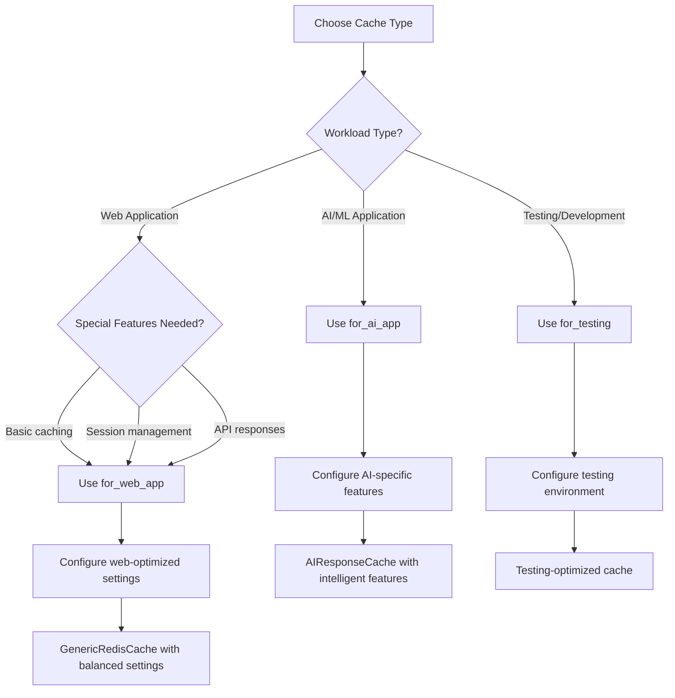

# Cache Infrastructure Usage Guide (Updated for Phase 4 Preset System)

A comprehensive guide to using the Phase 4 preset-based Cache Infrastructure Service that reduces configuration complexity from 28+ environment variables to 1-4 variables. This guide provides practical patterns for preset selection, configuration, optimization, and troubleshooting.

> **🚀 NEW in Phase 4**: The cache system now uses `CACHE_PRESET` for simplified configuration, reducing 28+ environment variables to 1-4 variables. This follows the successful pattern from the resilience system.

## Quick Start with Presets

### Simple Configuration (Recommended)
```bash
# NEW: Preset-based configuration (replaces 28+ CACHE_* variables)
CACHE_PRESET=development                    # Choose preset for your use case
CACHE_REDIS_URL=redis://localhost:6379     # Essential Redis connection override
ENABLE_AI_CACHE=true                        # AI features toggle

# Available presets:
# disabled, minimal, simple, development, production, ai-development, ai-production
```

### Preset Selection by Use Case
| Application Type | Development | Production | 
|------------------|-------------|------------|
| **Simple Web App** | `simple` or `development` | `production` |
| **AI Applications** | `ai-development` | `ai-production` |
| **Microservices** | `minimal` or `simple` | `production` |
| **Resource-Constrained** | `minimal` | `minimal` |
| **Testing/Debug** | `disabled` or `minimal` | N/A |

## Table of Contents

1. [Cache Selection Philosophy](#cache-selection-philosophy)
2. [Factory Methods Guide](#factory-methods-guide)
3. [Configuration Management](#configuration-management)
4. [Environment-Specific Setup](#environment-specific-setup)
5. [Application Type Patterns](#application-type-patterns)
6. [Performance Optimization](#performance-optimization)
7. [Multi-Worker Deployments](#multi-worker-deployments)
8. [Monitoring and Troubleshooting](#monitoring-and-troubleshooting)
9. [Real-World Examples](#real-world-examples)
10. [Best Practices](#best-practices)

## Cache Selection Philosophy

The cache infrastructure provides three main cache types, each optimized for specific use cases and architectural patterns.

### Core Cache Types

| Cache Type | Use Case | Architecture | Key Features |
|------------|----------|--------------|--------------|
| **for_web_app()** | Web applications, API responses, session data | GenericRedisCache | L1 memory cache, moderate TTLs, balanced performance |
| **for_ai_app()** | AI/ML applications, LLM responses, content processing | AIResponseCache | Text hashing, operation-specific TTLs, enhanced compression |
| **for_testing()** | Testing scenarios, development environments | Configurable | Short TTLs, isolated databases, optional memory-only mode |

### Decision Matrix



### When to Use Each Type

**Use `for_web_app()` when:**
- Building traditional web applications
- Caching API responses, session data, or user profiles
- Need balanced performance between speed and memory usage
- Working with structured data and standard web patterns
- Require moderate TTLs (30 minutes to 2 hours)

**Use `for_ai_app()` when:**
- Processing AI/ML workloads with LLM responses
- Handling large text content that benefits from intelligent hashing
- Need operation-specific TTL strategies (summarize vs. sentiment analysis)
- Require enhanced compression for large responses
- Working with text-heavy content that varies significantly in size

**Use `for_testing()` when:**
- Running automated tests that need cache isolation
- Developing locally with rapid iteration cycles
- Need predictable cache behavior with short TTLs
- Require memory-only mode for test consistency
- Testing cache failure scenarios

## Factory Methods Guide

The `CacheFactory` provides explicit methods for deterministic cache creation with environment-optimized defaults.

### Basic Factory Usage

```python
from app.infrastructure.cache.factory import CacheFactory

# Initialize factory
factory = CacheFactory()

# Create caches using explicit factory methods
web_cache = await factory.for_web_app()
ai_cache = await factory.for_ai_app()
test_cache = await factory.for_testing()
```

### for_web_app() - Web Application Cache

**Purpose**: Optimized for web applications with balanced performance and moderate resource usage.

```python
# Basic web application cache
web_cache = await factory.for_web_app(
    redis_url="redis://localhost:6379",
    default_ttl=1800,              # 30 minutes - good for session data
    enable_l1_cache=True,          # Enable fast memory tier
    l1_cache_size=200,             # 200 items in memory
    compression_threshold=2000,     # Compress responses > 2KB
    compression_level=6,           # Balanced compression
    fail_on_connection_error=False # Graceful degradation
)

# Production web cache with enhanced settings
production_web_cache = await factory.for_web_app(
    redis_url="redis://redis-cluster:6379",
    default_ttl=3600,              # 1 hour for production stability
    l1_cache_size=500,             # Larger memory cache
    compression_threshold=1000,     # More aggressive compression
    compression_level=7,           # Higher compression ratio
    fail_on_connection_error=True  # Strict error handling
)
```

**Web Cache Characteristics:**
- **Balanced TTL**: 30-60 minutes for session data freshness
- **Moderate L1 Cache**: 200-500 items for frequently accessed data
- **Conservative Compression**: 2KB threshold to avoid over-compression
- **Graceful Fallback**: Automatic InMemoryCache fallback on Redis failure

### for_ai_app() - AI Application Cache

**Purpose**: Specialized for AI workloads with text processing, operation-specific TTLs, and intelligent compression.

```python
# Basic AI application cache
ai_cache = await factory.for_ai_app(
    redis_url="redis://ai-redis:6379",
    default_ttl=3600,              # 1 hour base TTL
    l1_cache_size=100,             # Smaller L1 for AI responses
    compression_threshold=1000,     # Aggressive compression for large responses
    text_hash_threshold=500,       # Hash text over 500 characters
    operation_ttls={               # Operation-specific TTLs
        "summarize": 7200,         # 2 hours - summaries are stable
        "sentiment": 86400,        # 24 hours - sentiment rarely changes
        "key_points": 5400,        # 1.5 hours - moderately stable
        "questions": 3600,         # 1 hour - context-dependent
        "qa": 1800                 # 30 minutes - highly context-dependent
    },
    fail_on_connection_error=False
)

# High-performance AI cache
high_perf_ai_cache = await factory.for_ai_app(
    redis_url="redis://ai-production:6379",
    default_ttl=7200,              # 2 hours for production
    compression_threshold=500,      # Very aggressive compression
    compression_level=9,           # Maximum compression
    text_hash_threshold=200,       # Hash smaller text for efficiency
    memory_cache_size=150,         # Larger memory cache
    operation_ttls={
        "summarize": 14400,        # 4 hours for stable summaries
        "sentiment": 172800,       # 48 hours for very stable sentiment
        "translate": 86400,        # 24 hours for translations
        "extract": 10800           # 3 hours for data extraction
    }
)
```

**AI Cache Characteristics:**
- **Extended TTLs**: 1-48 hours based on operation stability
- **Intelligent Text Handling**: Automatic hashing for large text content
- **Operation-Specific TTLs**: Different expiration based on AI operation type
- **Enhanced Compression**: Lower threshold and higher compression for efficiency
- **Smart Key Generation**: Optimized cache keys for different text sizes

### for_testing() - Testing Environment Cache

**Purpose**: Optimized for testing scenarios with short TTLs, test isolation, and predictable behavior.

```python
# Memory-only test cache (completely isolated)
memory_test_cache = await factory.for_testing(
    use_memory_cache=True,         # Force memory-only mode
    default_ttl=60,                # 1 minute expiration
    l1_cache_size=50               # Small cache for testing
)

# Redis test cache with isolated database
redis_test_cache = await factory.for_testing(
    redis_url="redis://localhost:6379/15",  # Database 15 for tests
    default_ttl=60,                # 1 minute TTL
    enable_l1_cache=False,         # Disable L1 for predictable behavior
    compression_level=1,           # Fast compression for speed
    fail_on_connection_error=False # Allow fallback during tests
)

# Integration test cache with strict error handling
integration_test_cache = await factory.for_testing(
    redis_url="redis://test-redis:6379/14",
    default_ttl=120,               # 2 minutes for integration tests
    enable_l1_cache=True,          # Enable L1 for performance testing
    fail_on_connection_error=True  # Strict mode for integration tests
)
```

**Testing Cache Characteristics:**
- **Short TTLs**: 1-2 minutes for rapid test iteration
- **Test Database Isolation**: Uses Redis databases 14-15 for separation
- **Simplified Configuration**: Minimal features for predictable behavior
- **Fast Operations**: Low compression levels for test speed
- **Memory-Only Option**: Complete isolation with `use_memory_cache=True`

### Configuration-Based Creation

For maximum flexibility, use `create_cache_from_config()` with configuration dictionaries:

```python
# Web application configuration
web_config = {
    "redis_url": "redis://localhost:6379",
    "default_ttl": 1800,
    "enable_l1_cache": True,
    "l1_cache_size": 200,
    "compression_threshold": 2000,
    "compression_level": 6
}

web_cache = await factory.create_cache_from_config(
    config=web_config,
    fail_on_connection_error=False
)

# AI application configuration (automatically detected by AI parameters)
ai_config = {
    "redis_url": "redis://ai-cache:6379",
    "default_ttl": 3600,
    "compression_threshold": 1000,
    "text_hash_threshold": 500,    # Triggers AI cache creation
    "operation_ttls": {
        "summarize": 7200,
        "sentiment": 86400
    },
    "memory_cache_size": 100
}

ai_cache = await factory.create_cache_from_config(
    config=ai_config,
    fail_on_connection_error=False
)
```

## Configuration Management

### CacheConfigBuilder - Fluent Configuration

The `CacheConfigBuilder` provides a fluent interface for building comprehensive cache configurations:

```python
from app.infrastructure.cache.config import CacheConfigBuilder

# Development environment configuration
dev_config = (CacheConfigBuilder()
    .for_environment("development")
    .with_redis("redis://localhost:6379")
    .with_compression(threshold=2000, level=4)
    .with_memory_cache(size=50)
    .build())

# Production environment with AI features
prod_ai_config = (CacheConfigBuilder()
    .for_environment("production")
    .with_redis("redis://prod-redis:6379", use_tls=True)
    .with_security(
        tls_cert_path="/certs/redis-client.crt",
        tls_key_path="/certs/redis-client.key"
    )
    .with_compression(threshold=1000, level=6)
    .with_memory_cache(size=200)
    .with_ai_features(
        text_hash_threshold=1000,
        operation_ttls={
            "summarize": 14400,
            "sentiment": 86400,
            "translate": 43200
        },
        enable_smart_promotion=True,
        max_text_length=200000
    )
    .build())

# Testing environment configuration
test_config = (CacheConfigBuilder()
    .for_environment("testing")
    .with_redis("redis://localhost:6379/15")
    .with_compression(threshold=1000, level=1)
    .with_memory_cache(size=25)
    .build())
```

### Environment Variable Configuration

Load configuration from environment variables using the builder:

```python
# Load from environment variables automatically
env_config = (CacheConfigBuilder()
    .from_environment()
    .build())

# Combine environment loading with custom settings
hybrid_config = (CacheConfigBuilder()
    .from_environment()
    .with_compression(threshold=1500, level=7)  # Override compression
    .with_ai_features(text_hash_threshold=800)  # Add AI features
    .build())
```

**Preset-Based Configuration (Phase 4+):**
```bash
# Primary preset configuration (replaces 10+ individual variables above)
CACHE_PRESET=production                    # Choose: disabled, minimal, simple, development, production, ai-development, ai-production

# Essential overrides (only when needed)
CACHE_REDIS_URL=redis://localhost:6379     # Override Redis connection
ENABLE_AI_CACHE=true                        # Toggle AI features

# Advanced JSON overrides for complex scenarios
CACHE_CUSTOM_CONFIG='{
  "compression_threshold": 1000,
  "memory_cache_size": 100,
  "default_ttl": 3600,
  "use_tls": true
}'

# Legacy individual variables (deprecated, use presets instead)
# CACHE_DEFAULT_TTL=3600                    # ❌ Use CACHE_PRESET instead
# CACHE_COMPRESSION_THRESHOLD=1000          # ❌ Use CACHE_PRESET or CACHE_CUSTOM_CONFIG
# CACHE_MEMORY_SIZE=100                     # ❌ Use CACHE_PRESET or CACHE_CUSTOM_CONFIG

# ❌ Legacy individual AI variables (deprecated, use ai-development or ai-production presets instead)
# CACHE_ENABLE_AI_FEATURES=true            # Use CACHE_PRESET=ai-development
# CACHE_TEXT_HASH_THRESHOLD=1000           # Use CACHE_PRESET=ai-production  
# CACHE_HASH_ALGORITHM=sha256              # Use CACHE_PRESET=ai-production
# CACHE_ENABLE_SMART_PROMOTION=true        # Use CACHE_PRESET=ai-production
# CACHE_MAX_TEXT_LENGTH=100000             # Use CACHE_PRESET=ai-production
# CACHE_OPERATION_TTLS='{"summarize": 7200}' # Use CACHE_PRESET=ai-production
```

**Modern Preset Approach (Recommended):**
```bash
# For AI applications in development
CACHE_PRESET=ai-development
CACHE_REDIS_URL=redis://localhost:6379

# For AI applications in production  
CACHE_PRESET=ai-production
CACHE_REDIS_URL=redis://production:6379
```

### File-Based Configuration

Save and load configurations from JSON files:

```python
# Save configuration to file
config_builder = (CacheConfigBuilder()
    .for_environment("production")
    .with_redis("redis://prod:6379")
    .with_ai_features(text_hash_threshold=1000))

config_builder.save_to_file("/config/cache_config.json")

# Load configuration from file
loaded_config = (CacheConfigBuilder()
    .from_file("/config/cache_config.json")
    .build())

# Combine file loading with additional settings
enhanced_config = (CacheConfigBuilder()
    .from_file("/config/base_config.json")
    .with_compression(threshold=500, level=8)  # Override compression
    .build())
```

**Example Configuration File:**
```json
{
  "redis_url": "redis://production:6379",
  "default_ttl": 7200,
  "memory_cache_size": 200,
  "compression_threshold": 1000,
  "compression_level": 6,
  "environment": "production",
  "ai_config": {
    "text_hash_threshold": 1000,
    "hash_algorithm": "sha256",
    "operation_ttls": {
      "summarize": 14400,
      "sentiment": 86400,
      "translate": 43200
    },
    "enable_smart_promotion": true,
    "max_text_length": 200000
  }
}
```

## Environment-Specific Setup

### Development Environment

**Characteristics**: Fast iteration, debugging support, moderate resource usage

```python
# Development cache with debugging features
dev_cache = await factory.for_web_app(
    redis_url="redis://localhost:6379",
    default_ttl=900,               # 15 minutes for rapid testing
    l1_cache_size=50,              # Small memory footprint
    compression_threshold=5000,     # Less aggressive compression
    compression_level=3,           # Fast compression for development
    fail_on_connection_error=False # Continue without Redis
)

# Development AI cache with shorter TTLs
dev_ai_cache = await factory.for_ai_app(
    redis_url="redis://localhost:6379/1",
    default_ttl=600,               # 10 minutes for rapid iteration
    text_hash_threshold=200,       # Hash smaller text for debugging
    operation_ttls={
        "summarize": 900,          # 15 minutes
        "sentiment": 1800,         # 30 minutes
        "qa": 300                  # 5 minutes for rapid testing
    },
    compression_threshold=2000,
    l1_cache_size=25
)
```

### Testing Environment

**Characteristics**: Isolation, predictability, fast cleanup, minimal resource usage

```python
# Unit test cache (memory-only for isolation)
unit_test_cache = await factory.for_testing(
    use_memory_cache=True,
    default_ttl=60,
    l1_cache_size=25
)

# Integration test cache with Redis test database
integration_cache = await factory.for_testing(
    redis_url="redis://localhost:6379/15",
    default_ttl=120,
    enable_l1_cache=False,         # Disable for predictable behavior
    compression_level=1,           # Fast compression
    fail_on_connection_error=True  # Fail fast in tests
)

# Performance test cache with monitoring
perf_test_cache = await factory.for_testing(
    redis_url="redis://test-redis:6379/14",
    default_ttl=300,
    enable_l1_cache=True,
    compression_threshold=1000,
    fail_on_connection_error=True
)
```

### Production Environment

**Characteristics**: High performance, reliability, monitoring, security

```python
# Production web cache with high availability
prod_web_cache = await factory.for_web_app(
    redis_url="redis://redis-cluster:6379",
    default_ttl=3600,              # 1 hour for stability
    l1_cache_size=500,             # Large memory cache
    compression_threshold=1000,     # Aggressive compression
    compression_level=7,           # High compression ratio
    fail_on_connection_error=True  # Strict error handling
)

# Production AI cache with enhanced features
prod_ai_cache = await factory.for_ai_app(
    redis_url="redis://ai-redis-cluster:6379",
    default_ttl=7200,              # 2 hours base TTL
    compression_threshold=500,      # Very aggressive compression
    compression_level=8,           # Near-maximum compression
    text_hash_threshold=1000,
    memory_cache_size=200,
    operation_ttls={
        "summarize": 28800,        # 8 hours for stable summaries
        "sentiment": 172800,       # 48 hours for sentiment
        "translate": 86400,        # 24 hours for translations
        "extract": 14400,          # 4 hours for extraction
        "classify": 43200          # 12 hours for classification
    },
    fail_on_connection_error=True
)
```

### fail_on_connection_error Parameter Usage

The `fail_on_connection_error` parameter controls how the cache handles Redis connection failures:

**Set to `False` (Graceful Degradation):**
- Cache automatically falls back to InMemoryCache
- Application continues running with reduced performance
- Recommended for development and non-critical production services
- Logs warnings but doesn't raise exceptions

```python
# Graceful degradation - continues with InMemoryCache fallback
cache = await factory.for_web_app(
    redis_url="redis://unreliable-redis:6379",
    fail_on_connection_error=False  # Default behavior
)
# If Redis fails, returns InMemoryCache automatically
```

**Set to `True` (Strict Error Handling):**
- Raises InfrastructureError if Redis connection fails
- Forces explicit error handling in application code
- Recommended for production services where cache is critical
- Enables fail-fast behavior for monitoring and alerting

```python
# Strict error handling - raises exception on Redis failure
try:
    cache = await factory.for_web_app(
        redis_url="redis://critical-redis:6379",
        fail_on_connection_error=True
    )
except InfrastructureError as e:
    logger.error(f"Critical cache failure: {e}")
    # Implement fallback logic or fail the service
    raise
```

## Application Type Patterns

### Web Application Pattern

**Use Case**: Traditional web applications with session management, API response caching, and user data.

```python
from app.infrastructure.cache.factory import CacheFactory
from app.infrastructure.cache.dependencies import get_web_cache_service
from fastapi import Depends

# Dependency injection pattern
async def get_user_profile(
    user_id: int,
    cache: CacheInterface = Depends(get_web_cache_service)
):
    """Get user profile with web-optimized caching."""
    
    # Check cache first
    cache_key = f"user:profile:{user_id}"
    cached_profile = await cache.get(cache_key)
    
    if cached_profile:
        return {
            **cached_profile,
            "from_cache": True,
            "cache_type": "web_optimized"
        }
    
    # Load from database
    profile = await load_user_profile_from_db(user_id)
    
    # Cache for 30 minutes (web-optimized TTL)
    await cache.set(cache_key, profile, ttl=1800)
    
    return {
        **profile,
        "from_cache": False
    }

# Session management pattern
async def manage_user_session(
    session_id: str,
    cache: CacheInterface = Depends(get_web_cache_service)
):
    """Manage user sessions with web cache."""
    
    session_key = f"session:active:{session_id}"
    
    # Check if session exists
    session_data = await cache.get(session_key)
    if not session_data:
        return {"error": "Session expired or invalid"}
    
    # Extend session expiration
    await cache.set(session_key, session_data, ttl=3600)  # 1 hour extension
    
    return {
        "session_id": session_id,
        "user_id": session_data.get("user_id"),
        "expires_in": 3600
    }
```

### AI Application Pattern

**Use Case**: AI/ML applications with text processing, LLM responses, and content analysis.

```python
from app.infrastructure.cache.dependencies import get_ai_cache_service

async def process_ai_request(
    request: AIProcessRequest,
    ai_cache: CacheInterface = Depends(get_ai_cache_service)
):
    """Process AI request with AI-optimized caching."""
    
    # AI cache automatically handles intelligent key generation
    cached_result = await ai_cache.cache_response(
        text=request.text,
        operation=request.operation,
        options=request.options,
        response=None  # Check cache first
    )
    
    if cached_result:
        return {
            **cached_result,
            "from_cache": True,
            "cache_type": "ai_optimized",
            "text_size_tier": get_text_size_tier(request.text),
            "operation_ttl": get_operation_ttl(request.operation)
        }
    
    # Process with AI service
    ai_result = await ai_service.process(
        text=request.text,
        operation=request.operation,
        **request.options
    )
    
    # Cache the result (uses operation-specific TTL automatically)
    await ai_cache.cache_response(
        text=request.text,
        operation=request.operation,
        options=request.options,
        response=ai_result
    )
    
    return {
        **ai_result,
        "from_cache": False,
        "processing_time": ai_result.get("processing_time"),
        "text_length": len(request.text)
    }

# Batch AI processing with intelligent caching
async def batch_process_documents(
    documents: List[Document],
    operation: str,
    ai_cache: CacheInterface = Depends(get_ai_cache_service)
):
    """Process multiple documents with AI cache optimization."""
    
    results = []
    cache_hits = 0
    cache_misses = 0
    
    for doc in documents:
        # Check cache for each document
        cached_result = await ai_cache.get_cached_response(
            text=doc.content,
            operation=operation,
            options={"batch_mode": True}
        )
        
        if cached_result:
            results.append({
                **cached_result,
                "document_id": doc.id,
                "from_cache": True
            })
            cache_hits += 1
        else:
            # Process document
            result = await ai_service.process_document(doc, operation)
            
            # Cache result
            await ai_cache.cache_response(
                text=doc.content,
                operation=operation,
                options={"batch_mode": True},
                response=result
            )
            
            results.append({
                **result,
                "document_id": doc.id,
                "from_cache": False
            })
            cache_misses += 1
    
    return {
        "results": results,
        "cache_statistics": {
            "cache_hits": cache_hits,
            "cache_misses": cache_misses,
            "hit_ratio": cache_hits / len(documents) if documents else 0
        }
    }
```

### Hybrid Application Pattern

**Use Case**: Applications that need both web caching and AI caching for different components.

```python
from app.infrastructure.cache.dependencies import (
    get_web_cache_service, 
    get_ai_cache_service
)

async def hybrid_content_processing(
    content_request: ContentRequest,
    web_cache: CacheInterface = Depends(get_web_cache_service),
    ai_cache: CacheInterface = Depends(get_ai_cache_service)
):
    """Process content using both web and AI caches appropriately."""
    
    # Use web cache for user preferences and settings
    user_prefs_key = f"user:preferences:{content_request.user_id}"
    user_preferences = await web_cache.get(user_prefs_key)
    
    if not user_preferences:
        user_preferences = await load_user_preferences(content_request.user_id)
        await web_cache.set(user_prefs_key, user_preferences, ttl=3600)
    
    # Use AI cache for content processing
    processed_content = await ai_cache.cache_response(
        text=content_request.content,
        operation="analyze_content",
        options={
            "user_preferences": user_preferences,
            "analysis_type": content_request.analysis_type
        },
        response=None
    )
    
    if not processed_content:
        # Process content with AI
        processed_content = await ai_service.analyze_content(
            content=content_request.content,
            preferences=user_preferences,
            analysis_type=content_request.analysis_type
        )
        
        # Cache AI result
        await ai_cache.cache_response(
            text=content_request.content,
            operation="analyze_content",
            options={
                "user_preferences": user_preferences,
                "analysis_type": content_request.analysis_type
            },
            response=processed_content
        )
    
    # Use web cache for final result formatting
    format_key = f"format:template:{content_request.output_format}"
    format_template = await web_cache.get(format_key)
    
    if not format_template:
        format_template = await load_format_template(content_request.output_format)
        await web_cache.set(format_key, format_template, ttl=7200)  # Templates change rarely
    
    # Combine results
    final_result = apply_format_template(processed_content, format_template)
    
    return {
        "result": final_result,
        "cache_info": {
            "user_prefs_cached": bool(user_preferences),
            "content_analysis_cached": bool(processed_content),
            "format_template_cached": bool(format_template)
        }
    }
```

### Testing Scenarios

**Use Case**: Different testing patterns requiring cache isolation and predictable behavior.

```python
import pytest
from app.infrastructure.cache.dependencies import get_test_cache, get_test_redis_cache

# Unit test with memory-only cache
@pytest.fixture
async def memory_cache():
    """Isolated memory cache for unit tests."""
    cache = await get_test_cache()  # Always returns InMemoryCache
    yield cache
    # No cleanup needed - memory cache is isolated

async def test_basic_caching(memory_cache):
    """Test basic cache operations with isolated memory cache."""
    
    # Test set/get
    await memory_cache.set("test_key", {"data": "test_value"})
    result = await memory_cache.get("test_key")
    assert result == {"data": "test_value"}
    
    # Test TTL
    await memory_cache.set("ttl_key", "expires_soon", ttl=1)
    assert await memory_cache.get("ttl_key") == "expires_soon"
    
    # Wait for expiration
    await asyncio.sleep(2)
    assert await memory_cache.get("ttl_key") is None

# Integration test with Redis test database
@pytest.fixture
async def redis_test_cache():
    """Redis cache using test database for integration tests."""
    cache = await get_test_redis_cache()  # Uses Redis DB 15
    yield cache
    
    # Cleanup test data
    if hasattr(cache, 'redis_client') and cache.redis_client:
        await cache.redis_client.flushdb()  # Clear test database

@pytest.mark.integration
async def test_redis_integration(redis_test_cache):
    """Test Redis integration with test database isolation."""
    
    # Test Redis-specific features
    await redis_test_cache.set("redis_key", {"complex": "data", "numbers": [1, 2, 3]})
    result = await redis_test_cache.get("redis_key")
    assert result == {"complex": "data", "numbers": [1, 2, 3]}
    
    # Test compression (if enabled)
    large_data = {"content": "x" * 5000}  # Large enough to trigger compression
    await redis_test_cache.set("large_key", large_data)
    retrieved = await redis_test_cache.get("large_key")
    assert retrieved == large_data

# Performance test with monitoring
@pytest.fixture
async def monitored_test_cache():
    """Test cache with performance monitoring enabled."""
    factory = CacheFactory()
    cache = await factory.for_testing(
        redis_url="redis://localhost:6379/14",
        default_ttl=300,
        enable_l1_cache=True,
        compression_threshold=1000
    )
    yield cache

@pytest.mark.performance
async def test_cache_performance(monitored_test_cache):
    """Test cache performance characteristics."""
    
    import time
    
    # Test set performance
    start_time = time.time()
    for i in range(100):
        await monitored_test_cache.set(f"perf_key_{i}", f"value_{i}")
    set_time = time.time() - start_time
    
    # Test get performance
    start_time = time.time()
    for i in range(100):
        await monitored_test_cache.get(f"perf_key_{i}")
    get_time = time.time() - start_time
    
    # Assert performance characteristics
    assert set_time < 1.0  # 100 sets should take less than 1 second
    assert get_time < 0.5  # 100 gets should take less than 0.5 seconds
    
    # Test cache statistics if available
    if hasattr(monitored_test_cache, 'get_stats'):
        stats = await monitored_test_cache.get_stats()
        assert stats.get('total_operations', 0) >= 200
```

## Performance Optimization

### Memory Usage Optimization

**Understanding Memory Patterns:**

```python
# Memory-efficient configuration for constrained environments
efficient_cache = await factory.for_web_app(
    redis_url="redis://localhost:6379",
    l1_cache_size=50,              # Smaller L1 cache
    compression_threshold=500,      # Aggressive compression
    compression_level=8,           # High compression ratio
    default_ttl=1800               # Shorter TTL for faster turnover
)

# Memory usage monitoring
async def monitor_memory_usage(cache):
    """Monitor and optimize cache memory usage."""
    
    if hasattr(cache, 'get_stats'):
        stats = await cache.get_stats()
        
        memory_usage = stats.get('memory_usage_bytes', 0)
        entry_count = stats.get('entry_count', 0)
        hit_ratio = stats.get('hit_ratio', 0)
        
        # Calculate metrics
        avg_entry_size = memory_usage / entry_count if entry_count > 0 else 0
        memory_mb = memory_usage / (1024 * 1024)
        
        print(f"Memory Usage: {memory_mb:.2f} MB")
        print(f"Entry Count: {entry_count}")
        print(f"Average Entry Size: {avg_entry_size:.0f} bytes")
        print(f"Hit Ratio: {hit_ratio:.2%}")
        
        # Optimization recommendations
        if memory_mb > 100:
            print("⚠️  High memory usage - consider reducing L1 cache size")
        
        if hit_ratio < 0.7:
            print("⚠️  Low hit ratio - consider adjusting TTL or cache size")
        
        if avg_entry_size > 10000:
            print("💡 Large entries detected - consider aggressive compression")
```

### Connection Pooling and Resource Management

**Optimizing Redis Connections:**

```python
# Connection pool optimization
async def create_optimized_cache_pool():
    """Create cache with optimized connection pooling."""
    
    # For high-traffic applications
    high_traffic_cache = await factory.for_web_app(
        redis_url="redis://redis-cluster:6379",
        l1_cache_size=1000,           # Large L1 cache to reduce Redis calls
        compression_threshold=2000,    # Less compression to reduce CPU
        compression_level=4,          # Balanced compression
        default_ttl=7200             # Longer TTL for stability
    )
    
    return high_traffic_cache

# Resource cleanup pattern
async def cache_lifecycle_management():
    """Proper cache lifecycle management."""
    
    cache = None
    try:
        cache = await factory.for_web_app()
        
        # Use cache for operations
        await cache.set("key", "value")
        result = await cache.get("key")
        
        return result
        
    finally:
        # Ensure proper cleanup
        if cache and hasattr(cache, 'disconnect'):
            await cache.disconnect()
```

### Compression Optimization

**Tuning Compression Settings:**

```python
# Compression strategy by data type
async def configure_compression_by_use_case():
    """Configure compression based on data characteristics."""
    
    # For small, frequent data (sessions, preferences)
    small_data_cache = await factory.for_web_app(
        compression_threshold=5000,    # Higher threshold
        compression_level=3,          # Fast compression
        l1_cache_size=300            # Keep frequently accessed data in memory
    )
    
    # For large, infrequent data (reports, documents)
    large_data_cache = await factory.for_ai_app(
        compression_threshold=1000,    # Lower threshold
        compression_level=9,          # Maximum compression
        text_hash_threshold=500,      # Hash for efficient keys
        l1_cache_size=50             # Smaller L1 cache
    )
    
    # For mixed workloads
    balanced_cache = await factory.for_web_app(
        compression_threshold=2000,    # Balanced threshold
        compression_level=6,          # Balanced compression
        l1_cache_size=200            # Moderate L1 cache
    )
    
    return small_data_cache, large_data_cache, balanced_cache

# Compression efficiency monitoring
async def analyze_compression_efficiency(cache):
    """Analyze compression efficiency and optimize settings."""
    
    if hasattr(cache, 'get_performance_stats'):
        stats = await cache.get_performance_stats()
        
        compression_ratio = stats.get('avg_compression_ratio', 1.0)
        compression_time = stats.get('avg_compression_time_ms', 0)
        storage_saved = stats.get('total_bytes_saved', 0)
        
        print(f"Compression Ratio: {compression_ratio:.2f}")
        print(f"Average Compression Time: {compression_time:.2f}ms")
        print(f"Storage Saved: {storage_saved / (1024*1024):.2f}MB")
        
        # Optimization suggestions
        if compression_ratio < 0.7:
            print("💡 Consider higher compression level for better storage efficiency")
        
        if compression_time > 10:
            print("⚠️  High compression time - consider lower compression level")
        
        if storage_saved > 100 * 1024 * 1024:  # 100MB saved
            print("✅ Excellent compression performance!")
```

## Multi-Worker Deployments

### Per-Process Cache Registry

**Understanding Cache Registry Behavior:**

The cache infrastructure uses a per-process registry with weak references, which has important implications for multi-worker deployments:

```python
# Each worker process has its own cache registry
# This means cache instances are NOT shared between workers

# Worker Process 1: Creates its own cache instance
worker1_cache = await factory.for_web_app(redis_url="redis://shared:6379")

# Worker Process 2: Creates a separate cache instance
# (but connects to the same Redis server)
worker2_cache = await factory.for_web_app(redis_url="redis://shared:6379")

# The cache registry ensures each process reuses its own instances
# but workers don't share in-memory cache state
```

**Multi-Worker Configuration Patterns:**

```python
# Shared Redis configuration for multi-worker deployment
async def configure_multi_worker_cache():
    """Configure cache for multi-worker deployment."""
    
    # Shared Redis backend with process-specific L1 caches
    cache = await factory.for_web_app(
        redis_url="redis://shared-redis:6379",
        enable_l1_cache=True,          # Each worker has its own L1 cache
        l1_cache_size=200,             # Per-worker memory cache
        compression_threshold=1000,     # Shared compression settings
        default_ttl=3600               # Shared TTL policy
    )
    
    return cache

# Worker-specific cache isolation
async def create_worker_specific_cache(worker_id: int):
    """Create cache with worker-specific configuration."""
    
    cache = await factory.for_web_app(
        redis_url=f"redis://shared-redis:6379/{worker_id % 16}",  # Distribute across DBs
        l1_cache_size=100,             # Smaller per-worker L1 cache
        compression_threshold=2000,
        default_ttl=1800
    )
    
    return cache
```

### Memory Usage and Connection Pooling

**Per-Worker Memory Patterns:**

```python
# Calculate total memory usage across workers
def calculate_multi_worker_memory_usage(num_workers: int, l1_cache_size: int):
    """Calculate total memory usage across all workers."""
    
    # Each worker has its own L1 cache
    memory_per_worker_mb = (l1_cache_size * 200) / (1024 * 1024)  # ~200 bytes per entry
    total_memory_mb = memory_per_worker_mb * num_workers
    
    print(f"Memory per worker: {memory_per_worker_mb:.2f}MB")
    print(f"Total memory ({num_workers} workers): {total_memory_mb:.2f}MB")
    
    return total_memory_mb

# Example: 4 workers with 200-entry L1 caches each
total_memory = calculate_multi_worker_memory_usage(
    num_workers=4,
    l1_cache_size=200
)
# Output: ~160KB total across all workers

# Optimized multi-worker configuration
async def optimized_multi_worker_setup(worker_count: int):
    """Optimized cache setup for multiple workers."""
    
    # Adjust L1 cache size based on worker count
    l1_size_per_worker = max(50, 400 // worker_count)  # Total ~400 entries across workers
    
    cache = await factory.for_web_app(
        redis_url="redis://shared-redis:6379",
        l1_cache_size=l1_size_per_worker,
        compression_threshold=1000,
        compression_level=6,
        default_ttl=3600
    )
    
    return cache
```

**Connection Pool Management:**

```python
# Shared Redis connection pooling
import os

async def configure_connection_pooling():
    """Configure Redis connection pooling for multi-worker deployment."""
    
    # Redis URL with connection pool parameters
    redis_url = (
        "redis://shared-redis:6379"
        "?max_connections=20"          # Total connections per worker
        "&retry_on_timeout=true"
        "&socket_keepalive=true"
        "&socket_keepalive_options=1,3,5"
    )
    
    cache = await factory.for_web_app(
        redis_url=redis_url,
        l1_cache_size=100,
        compression_threshold=1000
    )
    
    return cache

# Monitor connection usage across workers
async def monitor_connection_usage(cache):
    """Monitor Redis connection usage."""
    
    if hasattr(cache, 'redis_client') and cache.redis_client:
        try:
            # Get Redis connection pool info
            pool_info = await cache.redis_client.connection_pool.get_stats()
            
            print(f"Active connections: {pool_info.get('in_use', 0)}")
            print(f"Available connections: {pool_info.get('available', 0)}")
            print(f"Created connections: {pool_info.get('created_connections', 0)}")
            
        except Exception as e:
            logger.warning(f"Could not get connection pool stats: {e}")
```

### Load Balancing and Cache Consistency

**Handling Cache Consistency Across Workers:**

```python
# Cache invalidation pattern for multi-worker consistency
async def invalidate_across_workers(cache, pattern: str):
    """Invalidate cache pattern across all workers."""
    
    # Only Redis-level invalidation affects all workers
    # L1 caches in each worker remain separate
    
    if hasattr(cache, 'invalidate_pattern'):
        # This affects Redis (shared across workers)
        redis_invalidated = await cache.invalidate_pattern(pattern)
        
        # L1 cache invalidation only affects current worker
        if hasattr(cache, '_l1_cache'):
            l1_invalidated = await cache._invalidate_l1_pattern(pattern)
        else:
            l1_invalidated = 0
        
        return {
            "redis_invalidated": redis_invalidated,
            "l1_invalidated_current_worker": l1_invalidated,
            "note": "L1 caches in other workers remain unaffected"
        }

# Session affinity pattern for consistent L1 cache hits
async def session_affinity_caching(user_id: int, num_workers: int, cache):
    """Use consistent hashing for session affinity."""
    
    # Route specific users to specific workers for L1 cache efficiency
    worker_assignment = hash(f"user_{user_id}") % num_workers
    cache_key_prefix = f"worker_{worker_assignment}:user_{user_id}"
    
    # This doesn't guarantee the same worker processes the request,
    # but provides consistent cache key patterns
    session_key = f"{cache_key_prefix}:session"
    
    return session_key

# Multi-worker cache warming strategy
async def warm_cache_across_workers(cache_factory, critical_data: dict):
    """Warm cache with critical data across workers."""
    
    cache = await cache_factory.for_web_app()
    
    # Warm Redis cache (affects all workers)
    for key, value in critical_data.items():
        await cache.set(f"critical:{key}", value, ttl=7200)
    
    # Each worker's L1 cache will warm up independently as data is accessed
    print(f"Warmed {len(critical_data)} critical cache entries in Redis")
    print("L1 caches in each worker will warm up on first access")
```

### Deployment Best Practices

**Docker/Kubernetes Multi-Worker Patterns:**

```python
# Environment-based worker configuration with presets
import os
from app.infrastructure.cache.dependencies import get_cache_config
from app.infrastructure.cache import CacheFactory

async def configure_for_container_deployment():
    """Configure cache for containerized multi-worker deployment using presets."""
    
    # Get worker information from environment
    worker_id = int(os.environ.get('WORKER_ID', '0'))
    total_workers = int(os.environ.get('TOTAL_WORKERS', '1'))
    
    # Use preset-based configuration
    # Environment should set: CACHE_PRESET=production, CACHE_REDIS_URL=redis://redis:6379
    config = get_cache_config()  # Loads from CACHE_PRESET
    
    # Optional: Adjust memory cache size based on worker count
    if total_workers > 1:
        l1_cache_size = max(25, 500 // total_workers)  # Distribute memory budget
        os.environ["CACHE_CUSTOM_CONFIG"] = f'{{"memory_cache_size": {l1_cache_size}}}'
        config = get_cache_config()  # Reload with custom config
    
    cache = CacheFactory.create_cache_from_config(config)
    
    logger.info(f"Worker {worker_id}/{total_workers} cache configured with L1 size: {l1_cache_size}")
    
    return cache

# Kubernetes deployment configuration example
kubernetes_cache_config = """
apiVersion: apps/v1
kind: Deployment
metadata:
  name: app-deployment
spec:
  replicas: 4
  template:
    spec:
      containers:
      - name: app
        env:
        - name: WORKER_ID
          valueFrom:
            fieldRef:
              fieldPath: metadata.name
        - name: TOTAL_WORKERS
          value: "4"
        - name: REDIS_URL
          value: "redis://redis-service:6379"
        - name: CACHE_L1_SIZE
          value: "50"  # 50 entries per worker = 200 total
        - name: CACHE_COMPRESSION_THRESHOLD
          value: "1000"
"""

# Health check pattern for multi-worker deployments
async def multi_worker_health_check(cache):
    """Health check that works across multiple workers."""
    
    worker_id = os.environ.get('WORKER_ID', 'unknown')
    
    try:
        # Test L1 cache (worker-specific)
        test_key = f"health:worker:{worker_id}"
        await cache.set(test_key, {"timestamp": time.time()}, ttl=60)
        l1_result = await cache.get(test_key)
        l1_healthy = l1_result is not None
        
        # Test Redis connection (shared)
        redis_healthy = True
        if hasattr(cache, 'ping'):
            redis_healthy = await cache.ping()
        
        return {
            "worker_id": worker_id,
            "l1_cache_healthy": l1_healthy,
            "redis_healthy": redis_healthy,
            "overall_healthy": l1_healthy and redis_healthy
        }
        
    except Exception as e:
        return {
            "worker_id": worker_id,
            "l1_cache_healthy": False,
            "redis_healthy": False,
            "overall_healthy": False,
            "error": str(e)
        }
```

## Monitoring and Troubleshooting

### Cache Health Monitoring

**Comprehensive Health Checks:**

```python
from app.infrastructure.cache.dependencies import get_cache_health_status

async def comprehensive_cache_health_check(cache):
    """Perform comprehensive cache health monitoring."""
    
    health_status = {
        "timestamp": datetime.utcnow().isoformat(),
        "cache_type": type(cache).__name__,
        "tests": {}
    }
    
    # Test 1: Basic connectivity
    try:
        if hasattr(cache, 'ping'):
            ping_success = await cache.ping()
            health_status["tests"]["connectivity"] = {
                "status": "pass" if ping_success else "fail",
                "ping_success": ping_success
            }
        else:
            health_status["tests"]["connectivity"] = {
                "status": "skip",
                "reason": "ping method not available"
            }
    except Exception as e:
        health_status["tests"]["connectivity"] = {
            "status": "fail",
            "error": str(e)
        }
    
    # Test 2: Read/Write operations
    try:
        test_key = f"health_check_{int(time.time())}"
        test_value = {"health_check": True, "timestamp": time.time()}
        
        # Test write
        await cache.set(test_key, test_value, ttl=60)
        
        # Test read
        retrieved = await cache.get(test_key)
        read_success = retrieved == test_value
        
        # Cleanup
        await cache.delete(test_key)
        
        health_status["tests"]["read_write"] = {
            "status": "pass" if read_success else "fail",
            "write_success": True,
            "read_success": read_success
        }
        
    except Exception as e:
        health_status["tests"]["read_write"] = {
            "status": "fail",
            "error": str(e)
        }
    
    # Test 3: Performance check
    try:
        start_time = time.time()
        
        # Perform multiple operations
        for i in range(10):
            await cache.set(f"perf_test_{i}", f"value_{i}", ttl=60)
        
        for i in range(10):
            await cache.get(f"perf_test_{i}")
        
        # Cleanup
        for i in range(10):
            await cache.delete(f"perf_test_{i}")
        
        total_time = time.time() - start_time
        avg_op_time = (total_time / 30) * 1000  # 30 operations, convert to ms
        
        health_status["tests"]["performance"] = {
            "status": "pass" if avg_op_time < 10 else "warn",
            "avg_operation_time_ms": round(avg_op_time, 2),
            "total_test_time_s": round(total_time, 3)
        }
        
    except Exception as e:
        health_status["tests"]["performance"] = {
            "status": "fail",
            "error": str(e)
        }
    
    # Test 4: Memory usage (if available)
    try:
        if hasattr(cache, 'get_stats'):
            stats = await cache.get_stats()
            memory_usage = stats.get('memory_usage_bytes', 0)
            entry_count = stats.get('entry_count', 0)
            
            health_status["tests"]["memory_usage"] = {
                "status": "pass",
                "memory_usage_mb": round(memory_usage / (1024*1024), 2),
                "entry_count": entry_count,
                "avg_entry_size_bytes": round(memory_usage / entry_count, 0) if entry_count > 0 else 0
            }
        else:
            health_status["tests"]["memory_usage"] = {
                "status": "skip",
                "reason": "statistics not available"
            }
    except Exception as e:
        health_status["tests"]["memory_usage"] = {
            "status": "fail",
            "error": str(e)
        }
    
    # Overall health determination
    test_statuses = [test["status"] for test in health_status["tests"].values()]
    if any(status == "fail" for status in test_statuses):
        health_status["overall_status"] = "unhealthy"
    elif any(status == "warn" for status in test_statuses):
        health_status["overall_status"] = "degraded"
    else:
        health_status["overall_status"] = "healthy"
    
    return health_status

# Automated health monitoring
async def start_health_monitoring(cache, check_interval: int = 60):
    """Start automated health monitoring with alerting."""
    
    while True:
        try:
            health = await comprehensive_cache_health_check(cache)
            
            # Log health status
            if health["overall_status"] == "healthy":
                logger.info(f"Cache health check passed: {health['overall_status']}")
            elif health["overall_status"] == "degraded":
                logger.warning(f"Cache health degraded: {health}")
            else:
                logger.error(f"Cache health check failed: {health}")
            
            # Send alerts for unhealthy state
            if health["overall_status"] == "unhealthy":
                await send_cache_alert(health)
            
        except Exception as e:
            logger.error(f"Health monitoring error: {e}")
        
        await asyncio.sleep(check_interval)
```

### Performance Monitoring

**Cache Performance Analytics:**

```python
async def analyze_cache_performance(cache, duration_minutes: int = 60):
    """Analyze cache performance over a time period."""
    
    if not hasattr(cache, 'get_performance_stats'):
        return {"error": "Performance monitoring not available"}
    
    # Get initial stats
    start_stats = await cache.get_performance_stats()
    start_time = time.time()
    
    # Wait for duration
    await asyncio.sleep(duration_minutes * 60)
    
    # Get final stats
    end_stats = await cache.get_performance_stats()
    end_time = time.time()
    
    # Calculate performance metrics
    duration_seconds = end_time - start_time
    
    operations_start = start_stats.get('total_operations', 0)
    operations_end = end_stats.get('total_operations', 0)
    operations_delta = operations_end - operations_start
    
    hits_start = start_stats.get('cache_hits', 0)
    hits_end = end_stats.get('cache_hits', 0)
    hits_delta = hits_end - hits_start
    
    # Calculate rates
    ops_per_second = operations_delta / duration_seconds
    hit_ratio = hits_delta / operations_delta if operations_delta > 0 else 0
    
    performance_report = {
        "analysis_duration_minutes": duration_minutes,
        "operations_per_second": round(ops_per_second, 2),
        "hit_ratio": round(hit_ratio, 3),
        "total_operations": operations_delta,
        "cache_hits": hits_delta,
        "cache_misses": operations_delta - hits_delta,
        "performance_rating": get_performance_rating(ops_per_second, hit_ratio)
    }
    
    # Add compression metrics if available
    if 'compression_ratio' in end_stats:
        performance_report["compression_efficiency"] = {
            "avg_compression_ratio": end_stats.get('compression_ratio', 1.0),
            "storage_saved_mb": round(end_stats.get('bytes_saved', 0) / (1024*1024), 2)
        }
    
    return performance_report

def get_performance_rating(ops_per_second: float, hit_ratio: float) -> str:
    """Rate cache performance based on metrics."""
    
    if ops_per_second > 1000 and hit_ratio > 0.8:
        return "excellent"
    elif ops_per_second > 500 and hit_ratio > 0.7:
        return "good"
    elif ops_per_second > 100 and hit_ratio > 0.5:
        return "acceptable"
    else:
        return "poor"

# Real-time performance monitoring
async def monitor_performance_real_time(cache, window_seconds: int = 60):
    """Monitor cache performance in real-time with sliding window."""
    
    performance_history = []
    
    while True:
        try:
            # Get current performance snapshot
            if hasattr(cache, 'get_stats'):
                stats = await cache.get_stats()
                
                snapshot = {
                    "timestamp": time.time(),
                    "operations": stats.get('total_operations', 0),
                    "hits": stats.get('cache_hits', 0),
                    "memory_usage": stats.get('memory_usage_bytes', 0)
                }
                
                performance_history.append(snapshot)
                
                # Keep only recent history
                cutoff_time = time.time() - window_seconds
                performance_history = [
                    s for s in performance_history 
                    if s["timestamp"] > cutoff_time
                ]
                
                # Calculate sliding window metrics
                if len(performance_history) >= 2:
                    first = performance_history[0]
                    last = performance_history[-1]
                    
                    time_delta = last["timestamp"] - first["timestamp"]
                    ops_delta = last["operations"] - first["operations"]
                    hits_delta = last["hits"] - first["hits"]
                    
                    if time_delta > 0:
                        current_ops_rate = ops_delta / time_delta
                        current_hit_ratio = hits_delta / ops_delta if ops_delta > 0 else 0
                        
                        print(f"Real-time: {current_ops_rate:.1f} ops/s, "
                              f"{current_hit_ratio:.2%} hit ratio, "
                              f"{last['memory_usage']/(1024*1024):.1f}MB memory")
            
        except Exception as e:
            logger.error(f"Real-time monitoring error: {e}")
        
        await asyncio.sleep(5)  # Update every 5 seconds
```

### Troubleshooting Common Issues

**Cache Not Working (Zero Hit Rate):**

```python
async def diagnose_zero_hit_rate(cache):
    """Diagnose why cache hit rate is zero."""
    
    diagnosis = {
        "issue": "zero_hit_rate",
        "tests": {},
        "recommendations": []
    }
    
    # Test 1: Basic functionality
    try:
        test_key = "diagnosis_test"
        test_value = {"test": "data", "timestamp": time.time()}
        
        await cache.set(test_key, test_value, ttl=300)
        retrieved = await cache.get(test_key)
        
        if retrieved != test_value:
            diagnosis["tests"]["basic_functionality"] = "FAIL - Data corruption"
            diagnosis["recommendations"].append("Check serialization/deserialization")
        else:
            diagnosis["tests"]["basic_functionality"] = "PASS"
        
        await cache.delete(test_key)
        
    except Exception as e:
        diagnosis["tests"]["basic_functionality"] = f"FAIL - {str(e)}"
        diagnosis["recommendations"].append("Check cache connectivity and configuration")
    
    # Test 2: Key consistency
    try:
        # Test multiple variations of the same logical key
        variations = [
            "user:123",
            "user: 123",  # Extra space
            "User:123",   # Different case
            "user:123 ",  # Trailing space
        ]
        
        for variation in variations:
            await cache.set(variation, f"value_for_{variation}", ttl=300)
        
        retrieved_values = {}
        for variation in variations:
            retrieved_values[variation] = await cache.get(variation)
        
        unique_keys = len(set(v for v in retrieved_values.values() if v is not None))
        
        if unique_keys == len(variations):
            diagnosis["tests"]["key_consistency"] = "WARN - Key variations create different entries"
            diagnosis["recommendations"].append("Implement key normalization")
        else:
            diagnosis["tests"]["key_consistency"] = "PASS"
        
        # Cleanup
        for variation in variations:
            await cache.delete(variation)
        
    except Exception as e:
        diagnosis["tests"]["key_consistency"] = f"FAIL - {str(e)}"
    
    # Test 3: TTL behavior
    try:
        ttl_key = "ttl_test"
        await cache.set(ttl_key, "ttl_value", ttl=2)
        
        # Immediate read
        immediate = await cache.get(ttl_key)
        
        # Wait and read again
        await asyncio.sleep(3)
        expired = await cache.get(ttl_key)
        
        if immediate and not expired:
            diagnosis["tests"]["ttl_behavior"] = "PASS"
        elif not immediate:
            diagnosis["tests"]["ttl_behavior"] = "FAIL - Immediate read failed"
            diagnosis["recommendations"].append("Check TTL configuration")
        elif expired:
            diagnosis["tests"]["ttl_behavior"] = "FAIL - TTL not working"
            diagnosis["recommendations"].append("Check TTL implementation")
        
    except Exception as e:
        diagnosis["tests"]["ttl_behavior"] = f"FAIL - {str(e)}"
    
    return diagnosis

# Connection issues diagnosis
async def diagnose_connection_issues(cache):
    """Diagnose Redis connection problems."""
    
    diagnosis = {
        "issue": "connection_problems",
        "tests": {},
        "recommendations": []
    }
    
    # Test Redis availability
    if hasattr(cache, 'redis_client') and cache.redis_client:
        try:
            # Test basic Redis command
            await cache.redis_client.ping()
            diagnosis["tests"]["redis_ping"] = "PASS"
            
            # Test Redis info
            info = await cache.redis_client.info()
            diagnosis["tests"]["redis_info"] = {
                "status": "PASS",
                "connected_clients": info.get('connected_clients', 0),
                "used_memory": info.get('used_memory_human', 'unknown'),
                "version": info.get('redis_version', 'unknown')
            }
            
        except Exception as e:
            diagnosis["tests"]["redis_connection"] = f"FAIL - {str(e)}"
            diagnosis["recommendations"].extend([
                "Check Redis server is running",
                "Verify Redis URL configuration",
                "Check network connectivity",
                "Verify authentication credentials"
            ])
    else:
        diagnosis["tests"]["redis_client"] = "FAIL - No Redis client available"
        diagnosis["recommendations"].append("Check cache initialization")
    
    # Test fallback behavior
    try:
        if hasattr(cache, '_fallback_to_memory'):
            diagnosis["tests"]["fallback_available"] = "PASS"
        else:
            diagnosis["tests"]["fallback_available"] = "UNKNOWN"
            diagnosis["recommendations"].append("Verify graceful degradation is configured")
            
    except Exception as e:
        diagnosis["tests"]["fallback_check"] = f"FAIL - {str(e)}"
    
    return diagnosis

# Performance issues diagnosis
async def diagnose_performance_issues(cache):
    """Diagnose cache performance problems."""
    
    diagnosis = {
        "issue": "performance_problems",
        "tests": {},
        "recommendations": []
    }
    
    # Test operation timing
    try:
        # Test set performance
        set_times = []
        for i in range(10):
            start = time.time()
            await cache.set(f"perf_test_{i}", f"value_{i}", ttl=300)
            set_times.append((time.time() - start) * 1000)  # Convert to ms
        
        avg_set_time = sum(set_times) / len(set_times)
        diagnosis["tests"]["set_performance"] = {
            "avg_time_ms": round(avg_set_time, 2),
            "max_time_ms": round(max(set_times), 2),
            "status": "PASS" if avg_set_time < 10 else "SLOW"
        }
        
        if avg_set_time > 10:
            diagnosis["recommendations"].append("Set operations are slow - check Redis latency")
        
        # Test get performance
        get_times = []
        for i in range(10):
            start = time.time()
            await cache.get(f"perf_test_{i}")
            get_times.append((time.time() - start) * 1000)
        
        avg_get_time = sum(get_times) / len(get_times)
        diagnosis["tests"]["get_performance"] = {
            "avg_time_ms": round(avg_get_time, 2),
            "max_time_ms": round(max(get_times), 2),
            "status": "PASS" if avg_get_time < 5 else "SLOW"
        }
        
        if avg_get_time > 5:
            diagnosis["recommendations"].append("Get operations are slow - check L1 cache configuration")
        
        # Cleanup
        for i in range(10):
            await cache.delete(f"perf_test_{i}")
        
    except Exception as e:
        diagnosis["tests"]["operation_timing"] = f"FAIL - {str(e)}"
    
    # Test memory efficiency
    try:
        if hasattr(cache, 'get_stats'):
            stats = await cache.get_stats()
            memory_usage = stats.get('memory_usage_bytes', 0)
            entry_count = stats.get('entry_count', 0)
            
            if entry_count > 0:
                avg_entry_size = memory_usage / entry_count
                diagnosis["tests"]["memory_efficiency"] = {
                    "avg_entry_size_bytes": round(avg_entry_size, 0),
                    "total_memory_mb": round(memory_usage / (1024*1024), 2),
                    "entry_count": entry_count,
                    "status": "PASS" if avg_entry_size < 10000 else "HIGH"
                }
                
                if avg_entry_size > 10000:
                    diagnosis["recommendations"].append("Large average entry size - consider compression")
            
    except Exception as e:
        diagnosis["tests"]["memory_efficiency"] = f"FAIL - {str(e)}"
    
    return diagnosis
```

### Alerting and Monitoring Integration

**Automated Alert System:**

```python
async def setup_cache_alerting(cache, alert_thresholds: dict):
    """Setup automated alerting for cache issues."""
    
    default_thresholds = {
        "hit_ratio_warning": 0.7,
        "hit_ratio_critical": 0.5,
        "memory_usage_warning_mb": 100,
        "memory_usage_critical_mb": 200,
        "avg_operation_time_warning_ms": 10,
        "avg_operation_time_critical_ms": 50
    }
    
    thresholds = {**default_thresholds, **alert_thresholds}
    
    async def check_and_alert():
        try:
            if hasattr(cache, 'get_stats'):
                stats = await cache.get_stats()
                
                # Check hit ratio
                hit_ratio = stats.get('hit_ratio', 0)
                if hit_ratio < thresholds["hit_ratio_critical"]:
                    await send_alert("CRITICAL", f"Cache hit ratio critical: {hit_ratio:.2%}")
                elif hit_ratio < thresholds["hit_ratio_warning"]:
                    await send_alert("WARNING", f"Cache hit ratio low: {hit_ratio:.2%}")
                
                # Check memory usage
                memory_mb = stats.get('memory_usage_bytes', 0) / (1024*1024)
                if memory_mb > thresholds["memory_usage_critical_mb"]:
                    await send_alert("CRITICAL", f"Cache memory usage critical: {memory_mb:.1f}MB")
                elif memory_mb > thresholds["memory_usage_warning_mb"]:
                    await send_alert("WARNING", f"Cache memory usage high: {memory_mb:.1f}MB")
                
                # Check operation timing
                avg_op_time = stats.get('avg_operation_time_ms', 0)
                if avg_op_time > thresholds["avg_operation_time_critical_ms"]:
                    await send_alert("CRITICAL", f"Cache operations very slow: {avg_op_time:.1f}ms")
                elif avg_op_time > thresholds["avg_operation_time_warning_ms"]:
                    await send_alert("WARNING", f"Cache operations slow: {avg_op_time:.1f}ms")
                
        except Exception as e:
            await send_alert("ERROR", f"Cache monitoring failed: {str(e)}")
    
    return check_and_alert

async def send_alert(level: str, message: str):
    """Send alert through configured channels."""
    
    alert_data = {
        "timestamp": datetime.utcnow().isoformat(),
        "level": level,
        "service": "cache_infrastructure",
        "message": message
    }
    
    # Log alert
    if level == "CRITICAL":
        logger.critical(f"CACHE ALERT: {message}")
    elif level == "WARNING":
        logger.warning(f"CACHE ALERT: {message}")
    else:
        logger.error(f"CACHE ALERT: {message}")
    
    # Send to external alerting system (implement based on your needs)
    # await send_to_slack(alert_data)
    # await send_to_pagerduty(alert_data)
    # await send_to_email(alert_data)
```

## Real-World Examples

### E-commerce Application

**Product Catalog Caching:**

```python
class EcommerceProductService:
    """E-commerce product service with intelligent caching."""
    
    def __init__(self):
        self.web_cache = None
        self.ai_cache = None
    
    async def initialize_caches(self):
        """Initialize optimized caches for e-commerce workload."""
        factory = CacheFactory()
        
        # Web cache for product data, prices, inventory
        self.web_cache = await factory.for_web_app(
            redis_url="redis://product-redis:6379",
            default_ttl=1800,              # 30 minutes for product data
            l1_cache_size=500,             # Large L1 for hot products
            compression_threshold=2000,     # Compress large product descriptions
            compression_level=6,
            fail_on_connection_error=True
        )
        
        # AI cache for product recommendations, reviews analysis
        self.ai_cache = await factory.for_ai_app(
            redis_url="redis://ai-redis:6379",
            default_ttl=3600,              # 1 hour for AI-generated content
            compression_threshold=1000,     # Aggressive compression for large results
            text_hash_threshold=500,       # Hash product descriptions efficiently
            operation_ttls={
                "recommend": 7200,          # 2 hours for recommendations
                "analyze_reviews": 14400,   # 4 hours for review analysis
                "categorize": 86400,        # 24 hours for product categorization
                "extract_features": 21600   # 6 hours for feature extraction
            },
            l1_cache_size=100,
            fail_on_connection_error=True
        )
    
    async def get_product(self, product_id: int, user_id: int = None):
        """Get product with personalized caching."""
        
        # Base product data (shared across users)
        base_key = f"product:base:{product_id}"
        product_data = await self.web_cache.get(base_key)
        
        if not product_data:
            product_data = await self._load_product_from_db(product_id)
            # Cache for 30 minutes
            await self.web_cache.set(base_key, product_data, ttl=1800)
        
        # User-specific pricing and availability
        if user_id:
            user_key = f"product:user:{product_id}:{user_id}"
            user_data = await self.web_cache.get(user_key)
            
            if not user_data:
                user_data = await self._get_user_specific_data(product_id, user_id)
                # Cache for 15 minutes (more dynamic)
                await self.web_cache.set(user_key, user_data, ttl=900)
            
            product_data = {**product_data, **user_data}
        
        return product_data
    
    async def get_product_recommendations(self, user_id: int, category: str = None):
        """Get AI-powered product recommendations."""
        
        # Use AI cache for recommendation engine
        user_profile = await self._get_user_profile(user_id)
        
        recommendations = await self.ai_cache.cache_response(
            text=f"User profile: {json.dumps(user_profile)}",
            operation="recommend",
            options={
                "category": category,
                "user_id": user_id,
                "recommendation_type": "personalized"
            },
            response=None  # Check cache first
        )
        
        if not recommendations:
            # Generate recommendations
            recommendations = await self._generate_recommendations(user_profile, category)
            
            # Cache the result
            await self.ai_cache.cache_response(
                text=f"User profile: {json.dumps(user_profile)}",
                operation="recommend",
                options={
                    "category": category,
                    "user_id": user_id,
                    "recommendation_type": "personalized"
                },
                response=recommendations
            )
        
        return recommendations
    
    async def analyze_product_reviews(self, product_id: int):
        """Analyze product reviews with AI caching."""
        
        # Get reviews text
        reviews = await self._get_product_reviews(product_id)
        reviews_text = "\n".join([r["text"] for r in reviews])
        
        # Use AI cache for sentiment analysis
        analysis = await self.ai_cache.cache_response(
            text=reviews_text,
            operation="analyze_reviews",
            options={
                "product_id": product_id,
                "analysis_types": ["sentiment", "themes", "summary"]
            },
            response=None
        )
        
        if not analysis:
            # Perform AI analysis
            analysis = await self._ai_analyze_reviews(reviews_text, product_id)
            
            # Cache for 4 hours (reviews don't change frequently)
            await self.ai_cache.cache_response(
                text=reviews_text,
                operation="analyze_reviews",
                options={
                    "product_id": product_id,
                    "analysis_types": ["sentiment", "themes", "summary"]
                },
                response=analysis
            )
        
        return analysis
    
    async def get_search_results(self, query: str, filters: dict = None):
        """Get search results with intelligent caching."""
        
        # Normalize query for consistent caching
        normalized_query = query.lower().strip()
        filter_key = hashlib.md5(json.dumps(filters or {}, sort_keys=True).encode()).hexdigest()[:8]
        
        search_key = f"search:{normalized_query}:{filter_key}"
        
        # Use web cache for search results
        results = await self.web_cache.get(search_key)
        
        if not results:
            results = await self._perform_search(normalized_query, filters)
            
            # Cache search results for 10 minutes
            await self.web_cache.set(search_key, results, ttl=600)
        
        return results
    
    async def invalidate_product_cache(self, product_id: int):
        """Invalidate all cache entries for a product."""
        
        # Invalidate base product data
        await self.web_cache.delete(f"product:base:{product_id}")
        
        # Invalidate user-specific data (pattern-based)
        if hasattr(self.web_cache, 'invalidate_pattern'):
            await self.web_cache.invalidate_pattern(f"product:user:{product_id}:*")
        
        # Invalidate AI-generated content for this product
        if hasattr(self.ai_cache, 'invalidate_by_operation'):
            await self.ai_cache.invalidate_by_operation("analyze_reviews")
```

### Content Management System

**Article and Media Caching:**

```python
class CMSContentService:
    """Content Management System with multi-tiered caching."""
    
    def __init__(self):
        self.web_cache = None
        self.ai_cache = None
    
    async def initialize_caches(self):
        """Initialize CMS-optimized caches."""
        factory = CacheFactory()
        
        # Web cache for articles, pages, navigation
        self.web_cache = await factory.for_web_app(
            redis_url="redis://cms-redis:6379",
            default_ttl=3600,              # 1 hour for content
            l1_cache_size=300,             # Cache frequently accessed content
            compression_threshold=1500,     # Compress large articles
            compression_level=6,
            fail_on_connection_error=False  # Graceful degradation for CMS
        )
        
        # AI cache for content generation, SEO, translations
        self.ai_cache = await factory.for_ai_app(
            redis_url="redis://cms-ai-redis:6379",
            default_ttl=7200,              # 2 hours for generated content
            compression_threshold=800,      # Aggressive compression for large content
            text_hash_threshold=300,       # Hash even smaller content for efficiency
            operation_ttls={
                "generate_summary": 21600,  # 6 hours
                "seo_optimize": 86400,      # 24 hours
                "translate": 172800,        # 48 hours (translations stable)
                "extract_tags": 43200,      # 12 hours
                "generate_title": 14400     # 4 hours
            },
            l1_cache_size=150,
            fail_on_connection_error=False
        )
    
    async def get_article(self, article_id: int, version: str = "published"):
        """Get article with version-aware caching."""
        
        article_key = f"article:{version}:{article_id}"
        
        # Check cache first
        article = await self.web_cache.get(article_key)
        
        if not article:
            # Load from database
            article = await self._load_article_from_db(article_id, version)
            
            if article:
                # Cache TTL based on version
                ttl = 3600 if version == "published" else 300  # 1 hour vs 5 minutes
                await self.web_cache.set(article_key, article, ttl=ttl)
        
        return article
    
    async def get_navigation_menu(self, site_id: int, language: str = "en"):
        """Get navigation menu with long-term caching."""
        
        nav_key = f"navigation:{site_id}:{language}"
        
        # Navigation changes rarely, cache for 4 hours
        navigation = await self.web_cache.get(nav_key)
        
        if not navigation:
            navigation = await self._build_navigation_menu(site_id, language)
            await self.web_cache.set(nav_key, navigation, ttl=14400)  # 4 hours
        
        return navigation
    
    async def generate_article_summary(self, article_id: int):
        """Generate AI-powered article summary."""
        
        # Get article content
        article = await self.get_article(article_id)
        if not article:
            return None
        
        # Use AI cache for summary generation
        summary = await self.ai_cache.cache_response(
            text=article["content"],
            operation="generate_summary",
            options={
                "article_id": article_id,
                "max_length": 200,
                "style": "engaging"
            },
            response=None
        )
        
        if not summary:
            # Generate summary with AI
            summary = await self._ai_generate_summary(article["content"])
            
            # Cache for 6 hours
            await self.ai_cache.cache_response(
                text=article["content"],
                operation="generate_summary",
                options={
                    "article_id": article_id,
                    "max_length": 200,
                    "style": "engaging"
                },
                response=summary
            )
        
        return summary
    
    async def translate_content(self, content: str, target_language: str):
        """Translate content with AI caching."""
        
        translation = await self.ai_cache.cache_response(
            text=content,
            operation="translate",
            options={
                "target_language": target_language,
                "preserve_formatting": True
            },
            response=None
        )
        
        if not translation:
            # Perform translation
            translation = await self._ai_translate_content(content, target_language)
            
            # Cache for 48 hours (translations are stable)
            await self.ai_cache.cache_response(
                text=content,
                operation="translate",
                options={
                    "target_language": target_language,
                    "preserve_formatting": True
                },
                response=translation
            )
        
        return translation
    
    async def get_related_articles(self, article_id: int, count: int = 5):
        """Get related articles using AI similarity."""
        
        # Get source article
        source_article = await self.get_article(article_id)
        if not source_article:
            return []
        
        # Use AI cache for related article discovery
        related = await self.ai_cache.cache_response(
            text=source_article["content"],
            operation="find_related",
            options={
                "article_id": article_id,
                "count": count,
                "similarity_threshold": 0.7
            },
            response=None
        )
        
        if not related:
            # Find related articles using AI
            related = await self._ai_find_related_articles(
                source_article["content"], 
                article_id, 
                count
            )
            
            # Cache for 4 hours
            await self.ai_cache.cache_response(
                text=source_article["content"],
                operation="find_related",
                options={
                    "article_id": article_id,
                    "count": count,
                    "similarity_threshold": 0.7
                },
                response=related
            )
        
        return related
    
    async def publish_article(self, article_id: int):
        """Publish article and invalidate relevant caches."""
        
        # Publish the article
        await self._publish_article_in_db(article_id)
        
        # Invalidate caches
        cache_keys_to_invalidate = [
            f"article:draft:{article_id}",
            f"article:published:{article_id}",
            f"article:preview:{article_id}"
        ]
        
        for key in cache_keys_to_invalidate:
            await self.web_cache.delete(key)
        
        # Invalidate navigation if article affects menu structure
        if hasattr(self.web_cache, 'invalidate_pattern'):
            await self.web_cache.invalidate_pattern("navigation:*")
        
        # Invalidate AI-generated content that might reference this article
        if hasattr(self.ai_cache, 'invalidate_by_operation'):
            await self.ai_cache.invalidate_by_operation("find_related")
```

### Document Processing Service

**Large Document AI Processing:**

```python
class DocumentProcessingService:
    """Document processing service with intelligent AI caching."""
    
    def __init__(self):
        self.ai_cache = None
        self.web_cache = None
    
    async def initialize_caches(self):
        """Initialize document processing caches."""
        factory = CacheFactory()
        
        # AI cache optimized for large documents
        self.ai_cache = await factory.for_ai_app(
            redis_url="redis://doc-ai-redis:6379",
            default_ttl=14400,             # 4 hours base TTL
            compression_threshold=500,      # Very aggressive compression
            compression_level=8,           # High compression for large docs
            text_hash_threshold=200,       # Hash even smaller text sections
            operation_ttls={
                "extract_text": 86400,     # 24 hours - OCR results stable
                "summarize": 21600,        # 6 hours - summaries fairly stable
                "classify": 43200,         # 12 hours - classification stable
                "extract_entities": 28800, # 8 hours - entities moderately stable
                "analyze_sentiment": 14400, # 4 hours - sentiment may change with context
                "generate_tags": 32400,    # 9 hours - tags fairly stable
                "translate": 172800        # 48 hours - translations very stable
            },
            memory_cache_size=75,          # Smaller L1 for large documents
            fail_on_connection_error=True
        )
        
        # Web cache for document metadata and user sessions
        self.web_cache = await factory.for_web_app(
            redis_url="redis://doc-web-redis:6379",
            default_ttl=1800,             # 30 minutes for metadata
            l1_cache_size=200,
            compression_threshold=2000,
            compression_level=6,
            fail_on_connection_error=False
        )
    
    async def process_uploaded_document(self, document_id: str, processing_options: dict):
        """Process uploaded document with comprehensive caching."""
        
        # Get document metadata (web cache)
        doc_metadata = await self._get_document_metadata(document_id)
        
        # Extract text if needed (AI cache with long TTL)
        if doc_metadata["type"] in ["pdf", "image", "scan"]:
            extracted_text = await self.ai_cache.cache_response(
                text=f"document_file:{document_id}",  # Use document ID as reference
                operation="extract_text",
                options={
                    "document_id": document_id,
                    "document_type": doc_metadata["type"],
                    "ocr_quality": processing_options.get("ocr_quality", "high")
                },
                response=None
            )
            
            if not extracted_text:
                # Perform OCR/text extraction
                extracted_text = await self._extract_text_from_document(
                    document_id, 
                    processing_options.get("ocr_quality", "high")
                )
                
                # Cache for 24 hours (OCR results don't change)
                await self.ai_cache.cache_response(
                    text=f"document_file:{document_id}",
                    operation="extract_text",
                    options={
                        "document_id": document_id,
                        "document_type": doc_metadata["type"],
                        "ocr_quality": processing_options.get("ocr_quality", "high")
                    },
                    response=extracted_text
                )
        else:
            # For text documents, read directly
            extracted_text = await self._read_text_document(document_id)
        
        # Process text based on requested operations
        results = {}
        
        # Document classification
        if "classify" in processing_options.get("operations", []):
            classification = await self.ai_cache.cache_response(
                text=extracted_text["content"],
                operation="classify",
                options={
                    "document_id": document_id,
                    "classification_model": processing_options.get("classification_model", "standard"),
                    "confidence_threshold": processing_options.get("confidence_threshold", 0.8)
                },
                response=None
            )
            
            if not classification:
                classification = await self._classify_document(
                    extracted_text["content"],
                    processing_options.get("classification_model", "standard")
                )
                
                await self.ai_cache.cache_response(
                    text=extracted_text["content"],
                    operation="classify",
                    options={
                        "document_id": document_id,
                        "classification_model": processing_options.get("classification_model", "standard"),
                        "confidence_threshold": processing_options.get("confidence_threshold", 0.8)
                    },
                    response=classification
                )
            
            results["classification"] = classification
        
        # Document summarization
        if "summarize" in processing_options.get("operations", []):
            summary = await self.ai_cache.cache_response(
                text=extracted_text["content"],
                operation="summarize",
                options={
                    "document_id": document_id,
                    "summary_length": processing_options.get("summary_length", "medium"),
                    "summary_style": processing_options.get("summary_style", "executive")
                },
                response=None
            )
            
            if not summary:
                summary = await self._summarize_document(
                    extracted_text["content"],
                    processing_options.get("summary_length", "medium"),
                    processing_options.get("summary_style", "executive")
                )
                
                await self.ai_cache.cache_response(
                    text=extracted_text["content"],
                    operation="summarize",
                    options={
                        "document_id": document_id,
                        "summary_length": processing_options.get("summary_length", "medium"),
                        "summary_style": processing_options.get("summary_style", "executive")
                    },
                    response=summary
                )
            
            results["summary"] = summary
        
        # Entity extraction
        if "extract_entities" in processing_options.get("operations", []):
            entities = await self.ai_cache.cache_response(
                text=extracted_text["content"],
                operation="extract_entities",
                options={
                    "document_id": document_id,
                    "entity_types": processing_options.get("entity_types", ["PERSON", "ORG", "DATE", "MONEY"]),
                    "confidence_threshold": processing_options.get("entity_confidence", 0.8)
                },
                response=None
            )
            
            if not entities:
                entities = await self._extract_entities(
                    extracted_text["content"],
                    processing_options.get("entity_types", ["PERSON", "ORG", "DATE", "MONEY"])
                )
                
                await self.ai_cache.cache_response(
                    text=extracted_text["content"],
                    operation="extract_entities",
                    options={
                        "document_id": document_id,
                        "entity_types": processing_options.get("entity_types", ["PERSON", "ORG", "DATE", "MONEY"]),
                        "confidence_threshold": processing_options.get("entity_confidence", 0.8)
                    },
                    response=entities
                )
            
            results["entities"] = entities
        
        # Cache final results summary in web cache
        processing_summary = {
            "document_id": document_id,
            "processed_at": datetime.utcnow().isoformat(),
            "operations_completed": list(results.keys()),
            "text_length": len(extracted_text["content"]),
            "processing_options": processing_options
        }
        
        await self.web_cache.set(
            f"processing:summary:{document_id}",
            processing_summary,
            ttl=3600  # 1 hour
        )
        
        return {
            "document_id": document_id,
            "extracted_text": extracted_text,
            "results": results,
            "processing_summary": processing_summary,
            "cache_info": {
                "operations_cached": len([op for op in results.keys()]),
                "total_operations": len(processing_options.get("operations", [])),
                "cache_efficiency": "optimized_for_large_documents"
            }
        }
    
    async def batch_process_documents(self, document_ids: List[str], processing_options: dict):
        """Batch process multiple documents with cache optimization."""
        
        results = []
        cache_hits = 0
        cache_misses = 0
        
        for doc_id in document_ids:
            # Check if we have cached processing summary
            cached_summary = await self.web_cache.get(f"processing:summary:{doc_id}")
            
            if cached_summary and self._options_match(cached_summary["processing_options"], processing_options):
                # We can potentially reuse cached results
                cached_results = await self._reconstruct_results_from_cache(doc_id, processing_options)
                
                if cached_results:
                    results.append({
                        "document_id": doc_id,
                        "results": cached_results,
                        "from_cache": True,
                        "cached_at": cached_summary["processed_at"]
                    })
                    cache_hits += 1
                    continue
            
            # Process document
            processing_result = await self.process_uploaded_document(doc_id, processing_options)
            results.append({
                **processing_result,
                "from_cache": False
            })
            cache_misses += 1
        
        return {
            "results": results,
            "batch_statistics": {
                "total_documents": len(document_ids),
                "cache_hits": cache_hits,
                "cache_misses": cache_misses,
                "hit_ratio": cache_hits / len(document_ids) if document_ids else 0,
                "processing_efficiency": "batch_optimized"
            }
        }
    
    def _options_match(self, cached_options: dict, new_options: dict) -> bool:
        """Check if processing options match for cache reuse."""
        
        # Compare relevant options
        relevant_fields = ["operations", "summary_length", "summary_style", "classification_model", "entity_types"]
        
        for field in relevant_fields:
            if cached_options.get(field) != new_options.get(field):
                return False
        
        return True
    
    async def _reconstruct_results_from_cache(self, document_id: str, processing_options: dict):
        """Reconstruct processing results from individual cached operations."""
        
        # This would attempt to get individual cached results for each operation
        # Implementation would depend on specific caching strategy
        pass
```

## Best Practices

### Cache Strategy Selection

**Decision Framework:**

1. **Assess Your Workload Characteristics:**
   ```python
   def assess_workload_for_cache_selection():
       """Assess workload to choose optimal cache strategy."""
       
       workload_assessment = {
           # Data characteristics
           "data_size_typical": "small|medium|large",  # <1KB, 1-100KB, >100KB
           "data_variability": "low|medium|high",      # How often data changes
           "data_complexity": "simple|structured|text_heavy",
           
           # Access patterns
           "read_write_ratio": "read_heavy|balanced|write_heavy",
           "access_pattern": "random|sequential|temporal",
           "concurrency_level": "low|medium|high",
           
           # Performance requirements
           "latency_sensitivity": "low|medium|high",
           "throughput_requirements": "low|medium|high",
           "consistency_requirements": "eventual|strong",
           
           # Resource constraints
           "memory_budget": "constrained|moderate|abundant",
           "network_bandwidth": "limited|adequate|high",
           "cpu_budget": "constrained|moderate|abundant"
       }
       
       # Decision matrix
       if workload_assessment["data_complexity"] == "text_heavy":
           return "for_ai_app"
       elif workload_assessment["access_pattern"] == "temporal" and workload_assessment["latency_sensitivity"] == "high":
           return "for_web_app"
       elif workload_assessment["consistency_requirements"] == "strong":
           return "for_testing"  # More predictable behavior
       else:
           return "for_web_app"  # Default for most web applications
   ```

2. **Performance vs. Resource Trade-offs:**
   ```python
   def optimize_cache_configuration(workload_type: str, resource_constraints: dict):
       """Optimize cache configuration based on constraints."""
       
       if workload_type == "memory_constrained":
           return {
               "l1_cache_size": 25,
               "compression_threshold": 500,
               "compression_level": 8,
               "default_ttl": 900  # Shorter TTL for faster turnover
           }
       elif workload_type == "latency_critical":
           return {
               "l1_cache_size": 500,
               "compression_threshold": 5000,  # Less compression
               "compression_level": 3,
               "default_ttl": 3600
           }
       elif workload_type == "storage_optimized":
           return {
               "l1_cache_size": 100,
               "compression_threshold": 1000,
               "compression_level": 9,  # Maximum compression
               "default_ttl": 7200
           }
       else:  # balanced
           return {
               "l1_cache_size": 200,
               "compression_threshold": 2000,
               "compression_level": 6,
               "default_ttl": 1800
           }
   ```

### Configuration Management Best Practices

**Environment-Specific Configuration Patterns:**

```python
# config/cache_config.py
class CacheConfigManager:
    """Centralized cache configuration management."""
    
    @staticmethod
    def get_environment_config(environment: str) -> dict:
        """Get cache configuration for specific environment."""
        
        base_config = {
            "compression_threshold": 1000,
            "compression_level": 6,
            "fail_on_connection_error": False
        }
        
        environment_configs = {
            "development": {
                **base_config,
                "redis_url": "redis://localhost:6379/1",
                "default_ttl": 600,  # 10 minutes
                "l1_cache_size": 50,
                "compression_level": 3,  # Fast compression
            },
            
            "testing": {
                **base_config,
                "redis_url": "redis://localhost:6379/15",
                "default_ttl": 60,   # 1 minute
                "l1_cache_size": 25,
                "compression_level": 1,  # Minimal compression
                "fail_on_connection_error": True
            },
            
            "staging": {
                **base_config,
                "redis_url": "redis://staging-redis:6379",
                "default_ttl": 1800,  # 30 minutes
                "l1_cache_size": 100,
                "compression_level": 6,
                "fail_on_connection_error": True
            },
            
            "production": {
                **base_config,
                "redis_url": "redis://prod-redis-cluster:6379",
                "default_ttl": 3600,  # 1 hour
                "l1_cache_size": 300,
                "compression_level": 7,  # Higher compression
                "fail_on_connection_error": True
            }
        }
        
        return environment_configs.get(environment, environment_configs["development"])
    
    @staticmethod
    def get_ai_config_overrides(workload_type: str) -> dict:
        """Get AI-specific configuration overrides."""
        
        ai_configs = {
            "text_processing": {
                "text_hash_threshold": 500,
                "operation_ttls": {
                    "summarize": 7200,
                    "sentiment": 14400,
                    "extract": 3600
                }
            },
            
            "document_analysis": {
                "text_hash_threshold": 200,
                "operation_ttls": {
                    "classify": 21600,
                    "extract_entities": 14400,
                    "translate": 86400
                }
            },
            
            "content_generation": {
                "text_hash_threshold": 1000,
                "operation_ttls": {
                    "generate": 3600,
                    "rewrite": 1800,
                    "optimize": 7200
                }
            }
        }
        
        return ai_configs.get(workload_type, ai_configs["text_processing"])
```

**Configuration Validation and Testing:**

```python
async def validate_cache_configuration(config: dict) -> dict:
    """Validate cache configuration before deployment."""
    
    validation_results = {
        "valid": True,
        "warnings": [],
        "errors": [],
        "recommendations": []
    }
    
    # Validate Redis URL
    if not config.get("redis_url"):
        validation_results["errors"].append("redis_url is required")
        validation_results["valid"] = False
    elif not config["redis_url"].startswith(("redis://", "rediss://")):
        validation_results["errors"].append("Invalid redis_url format")
        validation_results["valid"] = False
    
    # Validate TTL settings
    default_ttl = config.get("default_ttl", 0)
    if default_ttl <= 0:
        validation_results["errors"].append("default_ttl must be positive")
        validation_results["valid"] = False
    elif default_ttl < 60:
        validation_results["warnings"].append("Very short TTL may cause high cache churn")
    elif default_ttl > 86400:
        validation_results["warnings"].append("Very long TTL may cause stale data issues")
    
    # Validate memory settings
    l1_cache_size = config.get("l1_cache_size", 0)
    if l1_cache_size <= 0:
        validation_results["errors"].append("l1_cache_size must be positive")
        validation_results["valid"] = False
    elif l1_cache_size > 1000:
        validation_results["warnings"].append("Large L1 cache may consume significant memory")
    
    # Validate compression settings
    compression_level = config.get("compression_level", 6)
    if not 1 <= compression_level <= 9:
        validation_results["errors"].append("compression_level must be between 1 and 9")
        validation_results["valid"] = False
    elif compression_level > 7:
        validation_results["warnings"].append("High compression level may impact performance")
    
    # Performance recommendations
    if l1_cache_size < 50:
        validation_results["recommendations"].append("Consider increasing L1 cache size for better hit rates")
    
    if config.get("compression_threshold", 1000) > 5000:
        validation_results["recommendations"].append("High compression threshold may miss compression opportunities")
    
    return validation_results

# Configuration testing
async def test_cache_configuration(config: dict) -> dict:
    """Test cache configuration with real operations."""
    
    test_results = {
        "configuration_valid": True,
        "connection_successful": False,
        "operation_tests": {},
        "performance_metrics": {}
    }
    
    try:
        # Create cache with test configuration
        factory = CacheFactory()
        test_cache = await factory.create_cache_from_config(
            config=config,
            fail_on_connection_error=True
        )
        
        test_results["connection_successful"] = True
        
        # Test basic operations
        start_time = time.time()
        
        # Test set operation
        await test_cache.set("config_test_key", {"test": "data"}, ttl=60)
        test_results["operation_tests"]["set"] = "passed"
        
        # Test get operation
        retrieved = await test_cache.get("config_test_key")
        test_results["operation_tests"]["get"] = "passed" if retrieved else "failed"
        
        # Test delete operation
        await test_cache.delete("config_test_key")
        test_results["operation_tests"]["delete"] = "passed"
        
        # Performance test
        total_time = time.time() - start_time
        test_results["performance_metrics"]["basic_operations_time_ms"] = round(total_time * 1000, 2)
        
        # Cleanup
        if hasattr(test_cache, 'disconnect'):
            await test_cache.disconnect()
        
    except Exception as e:
        test_results["configuration_valid"] = False
        test_results["error"] = str(e)
    
    return test_results
```

### Monitoring and Observability Best Practices

**Comprehensive Monitoring Setup:**

```python
class CacheMonitoringService:
    """Comprehensive cache monitoring and alerting service."""
    
    def __init__(self, cache_instances: dict):
        self.caches = cache_instances  # {"web": web_cache, "ai": ai_cache}
        self.monitoring_interval = 30  # seconds
        self.alert_thresholds = {
            "hit_ratio_warning": 0.7,
            "hit_ratio_critical": 0.5,
            "memory_usage_warning_mb": 100,
            "memory_usage_critical_mb": 200,
            "operation_time_warning_ms": 10,
            "operation_time_critical_ms": 50
        }
    
    async def start_monitoring(self):
        """Start comprehensive cache monitoring."""
        
        monitoring_tasks = [
            self._monitor_performance(),
            self._monitor_health(),
            self._monitor_resource_usage(),
            self._monitor_error_rates()
        ]
        
        await asyncio.gather(*monitoring_tasks)
    
    async def _monitor_performance(self):
        """Monitor cache performance metrics."""
        
        while True:
            try:
                for cache_name, cache in self.caches.items():
                    if hasattr(cache, 'get_stats'):
                        stats = await cache.get_stats()
                        
                        # Calculate performance metrics
                        hit_ratio = stats.get('hit_ratio', 0)
                        avg_op_time = stats.get('avg_operation_time_ms', 0)
                        total_ops = stats.get('total_operations', 0)
                        
                        # Log metrics
                        logger.info(f"Cache {cache_name} performance: "
                                  f"hit_ratio={hit_ratio:.2%}, "
                                  f"avg_time={avg_op_time:.2f}ms, "
                                  f"total_ops={total_ops}")
                        
                        # Check thresholds
                        if hit_ratio < self.alert_thresholds["hit_ratio_critical"]:
                            await self._send_alert("CRITICAL", f"Cache {cache_name} hit ratio critical: {hit_ratio:.2%}")
                        elif hit_ratio < self.alert_thresholds["hit_ratio_warning"]:
                            await self._send_alert("WARNING", f"Cache {cache_name} hit ratio low: {hit_ratio:.2%}")
                        
                        if avg_op_time > self.alert_thresholds["operation_time_critical_ms"]:
                            await self._send_alert("CRITICAL", f"Cache {cache_name} operations very slow: {avg_op_time:.2f}ms")
                        elif avg_op_time > self.alert_thresholds["operation_time_warning_ms"]:
                            await self._send_alert("WARNING", f"Cache {cache_name} operations slow: {avg_op_time:.2f}ms")
                
            except Exception as e:
                logger.error(f"Performance monitoring error: {e}")
            
            await asyncio.sleep(self.monitoring_interval)
    
    async def _monitor_health(self):
        """Monitor cache health and connectivity."""
        
        while True:
            try:
                for cache_name, cache in self.caches.items():
                    # Test basic connectivity
                    health_status = "unknown"
                    
                    try:
                        if hasattr(cache, 'ping'):
                            ping_success = await cache.ping()
                            health_status = "healthy" if ping_success else "unhealthy"
                        else:
                            # Fallback test
                            test_key = f"health_check_{cache_name}_{int(time.time())}"
                            await cache.set(test_key, "health_check", ttl=60)
                            result = await cache.get(test_key)
                            await cache.delete(test_key)
                            health_status = "healthy" if result == "health_check" else "unhealthy"
                    
                    except Exception as e:
                        health_status = f"error: {str(e)}"
                    
                    logger.info(f"Cache {cache_name} health: {health_status}")
                    
                    if health_status.startswith("error") or health_status == "unhealthy":
                        await self._send_alert("CRITICAL", f"Cache {cache_name} health check failed: {health_status}")
                
            except Exception as e:
                logger.error(f"Health monitoring error: {e}")
            
            await asyncio.sleep(self.monitoring_interval)
    
    async def _monitor_resource_usage(self):
        """Monitor cache resource usage."""
        
        while True:
            try:
                for cache_name, cache in self.caches.items():
                    if hasattr(cache, 'get_stats'):
                        stats = await cache.get_stats()
                        
                        memory_usage = stats.get('memory_usage_bytes', 0)
                        memory_mb = memory_usage / (1024 * 1024)
                        entry_count = stats.get('entry_count', 0)
                        
                        logger.info(f"Cache {cache_name} resources: "
                                  f"memory={memory_mb:.1f}MB, "
                                  f"entries={entry_count}")
                        
                        # Check memory thresholds
                        if memory_mb > self.alert_thresholds["memory_usage_critical_mb"]:
                            await self._send_alert("CRITICAL", f"Cache {cache_name} memory usage critical: {memory_mb:.1f}MB")
                        elif memory_mb > self.alert_thresholds["memory_usage_warning_mb"]:
                            await self._send_alert("WARNING", f"Cache {cache_name} memory usage high: {memory_mb:.1f}MB")
                
            except Exception as e:
                logger.error(f"Resource monitoring error: {e}")
            
            await asyncio.sleep(self.monitoring_interval * 2)  # Less frequent
    
    async def _monitor_error_rates(self):
        """Monitor cache error rates and failure patterns."""
        
        error_counts = {cache_name: 0 for cache_name in self.caches.keys()}
        
        while True:
            try:
                for cache_name, cache in self.caches.items():
                    try:
                        # Simple operation to test for errors
                        test_key = f"error_test_{cache_name}"
                        await cache.set(test_key, "test", ttl=30)
                        await cache.get(test_key)
                        await cache.delete(test_key)
                        
                        # Reset error count on success
                        error_counts[cache_name] = 0
                        
                    except Exception as e:
                        error_counts[cache_name] += 1
                        logger.warning(f"Cache {cache_name} error #{error_counts[cache_name]}: {e}")
                        
                        # Alert on persistent errors
                        if error_counts[cache_name] >= 3:
                            await self._send_alert("CRITICAL", f"Cache {cache_name} persistent errors: {error_counts[cache_name]} consecutive failures")
                
            except Exception as e:
                logger.error(f"Error rate monitoring error: {e}")
            
            await asyncio.sleep(self.monitoring_interval)
    
    async def _send_alert(self, level: str, message: str):
        """Send alert through configured channels."""
        
        alert = {
            "timestamp": datetime.utcnow().isoformat(),
            "level": level,
            "service": "cache_infrastructure",
            "message": message
        }
        
        # Log alert
        if level == "CRITICAL":
            logger.critical(f"CACHE ALERT: {message}")
        else:
            logger.warning(f"CACHE ALERT: {message}")
        
        # Send to external systems (implement based on your alerting infrastructure)
        # await self._send_to_alerting_system(alert)
```

### Error Handling and Recovery Patterns

**Graceful Degradation Strategies:**

```python
class CacheResilienceHandler:
    """Handles cache failures with graceful degradation strategies."""
    
    def __init__(self, primary_cache, fallback_strategy: str = "memory"):
        self.primary_cache = primary_cache
        self.fallback_strategy = fallback_strategy
        self.circuit_breaker_state = "closed"  # closed, open, half-open
        self.failure_count = 0
        self.last_failure_time = None
        self.circuit_breaker_threshold = 5
        self.circuit_breaker_timeout = 60  # seconds
    
    async def get_with_resilience(self, key: str, default=None):
        """Get from cache with comprehensive resilience handling."""
        
        # Check circuit breaker
        if self._should_circuit_break():
            logger.warning(f"Circuit breaker open, skipping cache for key: {key}")
            return default
        
        try:
            # Try primary cache
            result = await self.primary_cache.get(key)
            
            # Reset failure count on success
            self._record_success()
            
            return result if result is not None else default
            
        except Exception as e:
            logger.warning(f"Primary cache failure for key {key}: {e}")
            self._record_failure()
            
            # Attempt fallback strategies
            return await self._handle_cache_failure(key, default, e)
    
    async def set_with_resilience(self, key: str, value, ttl: int = None):
        """Set in cache with resilience handling."""
        
        if self._should_circuit_break():
            logger.warning(f"Circuit breaker open, skipping cache set for key: {key}")
            return False
        
        try:
            await self.primary_cache.set(key, value, ttl=ttl)
            self._record_success()
            return True
            
        except Exception as e:
            logger.warning(f"Primary cache set failure for key {key}: {e}")
            self._record_failure()
            
            # Attempt fallback storage
            return await self._handle_set_failure(key, value, ttl, e)
    
    async def _handle_cache_failure(self, key: str, default, error: Exception):
        """Handle cache get failures with fallback strategies."""
        
        if self.fallback_strategy == "memory":
            # Use in-memory fallback
            return await self._get_from_memory_fallback(key, default)
        
        elif self.fallback_strategy == "database":
            # Fall back to database
            return await self._get_from_database_fallback(key, default)
        
        elif self.fallback_strategy == "compute":
            # Recompute value
            return await self._recompute_value_fallback(key, default)
        
        else:
            # No fallback, return default
            return default
    
    async def _handle_set_failure(self, key: str, value, ttl: int, error: Exception):
        """Handle cache set failures with fallback strategies."""
        
        if self.fallback_strategy == "memory":
            # Store in memory fallback
            return await self._set_in_memory_fallback(key, value, ttl)
        
        elif self.fallback_strategy == "database":
            # Store in database
            return await self._set_in_database_fallback(key, value, ttl)
        
        else:
            # Accept failure
            logger.warning(f"Cache set failed for key {key}, no fallback configured")
            return False
    
    def _should_circuit_break(self) -> bool:
        """Check if circuit breaker should be open."""
        
        if self.circuit_breaker_state == "closed":
            return False
        elif self.circuit_breaker_state == "open":
            # Check if timeout has passed
            if self.last_failure_time and (time.time() - self.last_failure_time) > self.circuit_breaker_timeout:
                self.circuit_breaker_state = "half-open"
                logger.info("Circuit breaker moving to half-open state")
                return False
            return True
        else:  # half-open
            return False
    
    def _record_success(self):
        """Record successful operation."""
        self.failure_count = 0
        if self.circuit_breaker_state == "half-open":
            self.circuit_breaker_state = "closed"
            logger.info("Circuit breaker closed after successful operation")
    
    def _record_failure(self):
        """Record failed operation."""
        self.failure_count += 1
        self.last_failure_time = time.time()
        
        if self.failure_count >= self.circuit_breaker_threshold:
            self.circuit_breaker_state = "open"
            logger.warning(f"Circuit breaker opened after {self.failure_count} failures")
    
    async def _get_from_memory_fallback(self, key: str, default):
        """Get from in-memory fallback cache."""
        # Implementation would use a local memory cache
        pass
    
    async def _set_in_memory_fallback(self, key: str, value, ttl: int):
        """Set in in-memory fallback cache."""
        # Implementation would use a local memory cache
        pass
    
    async def _get_from_database_fallback(self, key: str, default):
        """Get from database as fallback."""
        # Implementation would query database
        pass
    
    async def _recompute_value_fallback(self, key: str, default):
        """Recompute value as fallback."""
        # Implementation would recompute the cached value
        pass
```

This comprehensive cache usage guide provides developers with practical patterns for effectively using the cache infrastructure across different application types, environments, and scenarios. The guide emphasizes explicit cache selection, proper configuration management, and production-ready patterns for monitoring and troubleshooting.

The real-world examples demonstrate how to apply these patterns in common scenarios like e-commerce, content management, and document processing, while the best practices section provides actionable guidance for optimization and maintenance.