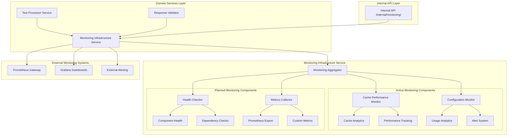
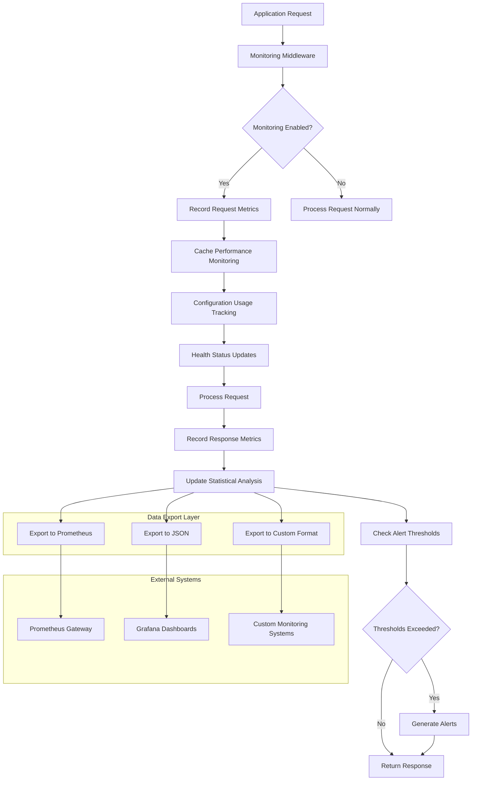

# Monitoring Infrastructure Service

The Monitoring Infrastructure Service provides production-ready, comprehensive monitoring and observability capabilities within the FastAPI-Streamlit-LLM Starter Template. This infrastructure service implements centralized monitoring, performance analytics, health checks, and metrics collection to ensure optimal system visibility and operational intelligence.

## Overview

The Monitoring Infrastructure Service is a **production-ready infrastructure component** (>90% test coverage) designed to provide comprehensive observability for AI-powered applications. It follows the template's infrastructure vs domain service separation, serving as a foundational component that aggregates monitoring capabilities from multiple infrastructure services while providing extensible foundations for future monitoring implementations.

### Architecture Position



### Key Features

- ✅ **Centralized Monitoring**: Unified access point for all monitoring capabilities
- ✅ **Performance Analytics**: Real-time cache and configuration performance tracking
- ✅ **Comprehensive Statistics**: Statistical analysis with trend detection and alerting
- ✅ **Multi-Format Export**: JSON, Prometheus, and custom format adapters
- ✅ **Intelligent Alerting**: Configurable thresholds with automated recommendations
- ✅ **Session Analytics**: Session-based usage statistics and patterns
- ✅ **Memory Management**: Bounded retention with intelligent cleanup
- ✅ **External Integration**: Support for Prometheus, Grafana, and custom monitoring systems

## Core Components

### Monitoring Aggregator (`__init__.py`)

Provides centralized access to monitoring capabilities from multiple infrastructure services, ensuring consistent monitoring patterns across the application.

#### Aggregation Architecture

| Component | Source | Status | Purpose |
|-----------|--------|--------|---------|
| **Cache Performance Monitor** | `app.infrastructure.cache.monitoring` | ✅ Active | Cache operation monitoring and analytics |
| **Configuration Monitor** | `app.infrastructure.resilience.config_monitoring` | ✅ Active | Configuration usage and performance tracking |
| **Health Checker** | `app.infrastructure.monitoring.health` | 🔄 Planned | System health and component status monitoring |
| **Metrics Collector** | `app.infrastructure.monitoring.metrics` | 🔄 Planned | Application-wide metrics collection and export |

#### Unified Interface

```python
from app.infrastructure.monitoring import (
    CachePerformanceMonitor,
    config_metrics_collector,
    # Future components:
    # HealthChecker,
    # MetricsCollector
)

class MonitoringDashboard:
    """Unified monitoring dashboard for all system metrics."""
    
    def __init__(self):
        self.cache_monitor = CachePerformanceMonitor()
        self.config_collector = config_metrics_collector
    
    async def get_system_overview(self) -> dict:
        """Get comprehensive system monitoring overview."""
        return {
            "cache_performance": {
                "stats": self.cache_monitor.get_cache_stats(),
                "health": self.cache_monitor.get_health_status(),
                "alerts": self.cache_monitor.get_active_alerts()
            },
            "configuration_monitoring": {
                "usage_stats": self.config_collector.get_usage_statistics(),
                "performance": self.config_collector.get_performance_summary(),
                "recent_events": self.config_collector.get_recent_events(limit=10)
            },
            "system_status": {
                "timestamp": time.time(),
                "overall_health": "healthy",
                "components_monitored": 2
            }
        }
```

### Cache Performance Monitor

Comprehensive analytics system providing detailed insights into cache performance and optimization opportunities.

#### Metrics Tracked

| Category | Metrics | Purpose | Alerts |
|----------|---------|---------|---------|
| **Operation Performance** | Hit/miss ratios, operation timing, type breakdown | Monitor cache effectiveness | <70% hit rate warning |
| **Key Generation** | Timing, text length correlation, slow operations | Optimize key generation strategy | >5ms generation time |
| **Memory Usage** | Consumption, growth trends, threshold monitoring | Prevent memory issues | >50MB warning, >100MB critical |
| **Compression** | Ratios, timing, size savings | Optimize compression settings | <30% compression ratio |
| **Invalidation** | Frequency, patterns, efficiency | Cache management insights | >50 invalidations/hour |

#### Advanced Analytics Features

```python
from app.infrastructure.monitoring import CachePerformanceMonitor

# Initialize with custom thresholds
cache_monitor = CachePerformanceMonitor(
    retention_hours=2,
    memory_warning_threshold_bytes=100 * 1024 * 1024,  # 100MB
    compression_threshold_bytes=50 * 1024 * 1024       # 50MB
)

# Record cache operations with comprehensive metrics
cache_monitor.record_cache_operation_time("get", 0.05, cache_hit=True)
cache_monitor.record_cache_operation_time("set", 0.12, cache_hit=False)

# Record compression performance
cache_monitor.record_compression_operation(
    original_size=5000,
    compressed_size=1500,
    compression_time=0.03
)

# Get statistical analysis
stats = cache_monitor.get_cache_stats()
print(f"Cache hit ratio: {stats.hit_ratio:.2f}%")
print(f"Average operation time: {stats.avg_operation_time:.3f}s")
print(f"Compression ratio: {stats.avg_compression_ratio:.2f}")
print(f"Memory usage: {stats.memory_usage_bytes / 1024 / 1024:.1f}MB")

# Get health status with alerts
health = cache_monitor.get_health_status()
if health.alerts:
    for alert in health.alerts:
        print(f"Alert: {alert.message} (severity: {alert.severity})")
```

#### Statistical Analysis Engine

The cache monitor provides advanced statistical analysis with automated optimization recommendations:

```python
# Configure advanced alerting thresholds
alert_thresholds = {
    "memory_warning": 50_000_000,      # 50MB warning
    "memory_critical": 100_000_000,    # 100MB critical
    "key_gen_slow": 0.1,              # 100ms key generation
    "cache_op_slow": 0.05,            # 50ms cache operations
    "hit_ratio_low": 0.7,             # 70% hit ratio threshold
    "compression_poor": 0.3           # 30% compression ratio threshold
}

# Generate optimization recommendations
recommendations = cache_monitor.get_optimization_recommendations()
for rec in recommendations:
    print(f"Recommendation: {rec.description}")
    print(f"Impact: {rec.expected_improvement}")
    print(f"Action: {rec.suggested_action}")
```

### Configuration Monitor

Real-time monitoring of configuration usage patterns, performance metrics, and operational health with intelligent alerting capabilities.

#### Usage Analytics

| Metric Category | Data Collected | Analysis Provided |
|-----------------|----------------|-------------------|
| **Preset Usage** | Frequency, patterns, environment correlation | Most/least used presets, optimization opportunities |
| **Performance Monitoring** | Load times, configuration processing, validation timing | Performance bottlenecks, optimization recommendations |
| **Alert Generation** | Threshold violations, anomaly detection | Proactive issue identification and resolution |
| **Trend Analysis** | Historical patterns, usage evolution | Capacity planning and configuration optimization |

#### Configuration Analytics Usage

```python
from app.infrastructure.monitoring import config_metrics_collector

# Track configuration operations with context
with config_metrics_collector.track_config_operation("load_preset", "production"):
    preset = preset_manager.get_preset("production")

# Record configuration events with metadata
config_metrics_collector.record_preset_usage(
    preset_name="production",
    operation="apply_configuration",
    metadata={
        "environment": "prod",
        "success": True,
        "load_time_ms": 45,
        "user_context": "api_request"
    }
)

# Get comprehensive usage statistics
stats = config_metrics_collector.get_usage_statistics()
print(f"Most used preset: {stats.most_used_preset}")
print(f"Average load time: {stats.avg_load_time_ms:.2f}ms")
print(f"Total configurations loaded: {stats.total_loads}")
print(f"Success rate: {stats.success_rate:.1f}%")

# Analyze usage patterns
patterns = config_metrics_collector.analyze_usage_patterns()
for pattern in patterns.insights:
    print(f"Pattern: {pattern.description}")
    print(f"Confidence: {pattern.confidence:.2f}")
    print(f"Recommendation: {pattern.recommendation}")
```

#### Performance Trend Analysis

```python
# Get performance trends over time
trends = config_metrics_collector.get_performance_trends(hours=24)

print(f"Load time trend: {trends.load_time_trend}")  # "improving", "stable", "degrading"
print(f"Usage trend: {trends.usage_trend}")          # "increasing", "stable", "decreasing"
print(f"Error rate trend: {trends.error_trend}")     # "improving", "stable", "worsening"

# Get specific trend data points
trend_data = config_metrics_collector.get_trend_data_points(
    metric="load_time_ms",
    time_window_hours=6,
    granularity="hour"
)

for point in trend_data:
    print(f"Hour {point.hour}: avg={point.avg_value:.2f}ms, count={point.count}")
```

### Health Checker (Planned Implementation)

Standardized health check capabilities for monitoring overall system status and component availability.

#### Planned Architecture

```python
# Future implementation structure
from enum import Enum
from typing import Callable, List, Dict, Any
from dataclasses import dataclass

class HealthStatus(Enum):
    HEALTHY = "healthy"
    DEGRADED = "degraded" 
    UNHEALTHY = "unhealthy"

@dataclass
class ComponentStatus:
    name: str
    status: HealthStatus
    message: str = ""
    response_time_ms: float = 0.0
    metadata: Dict[str, Any] = None

@dataclass
class SystemHealthStatus:
    overall_status: HealthStatus
    components: List[ComponentStatus]
    timestamp: float
    
    @property
    def is_healthy(self) -> bool:
        return self.overall_status == HealthStatus.HEALTHY
    
    @property
    def failed_components(self) -> List[ComponentStatus]:
        return [c for c in self.components if c.status != HealthStatus.HEALTHY]

class HealthChecker:
    """System health monitoring and component status tracking."""
    
    def __init__(self):
        self.checks: Dict[str, Callable] = {}
        self.check_timeouts: Dict[str, float] = {}
    
    def register_check(self, name: str, check_func: Callable, timeout: float = 5.0):
        """Register a health check function."""
        self.checks[name] = check_func
        self.check_timeouts[name] = timeout
    
    async def check_health(self) -> SystemHealthStatus:
        """Perform comprehensive health check of all registered components."""
        components = []
        
        for name, check_func in self.checks.items():
            start_time = time.time()
            try:
                # Execute health check with timeout
                result = await asyncio.wait_for(
                    check_func(), 
                    timeout=self.check_timeouts[name]
                )
                
                response_time = (time.time() - start_time) * 1000
                
                if result.get("healthy", False):
                    status = HealthStatus.HEALTHY
                    message = result.get("message", "Component is healthy")
                else:
                    status = HealthStatus.DEGRADED
                    message = result.get("message", "Component is degraded")
                
                components.append(ComponentStatus(
                    name=name,
                    status=status,
                    message=message,
                    response_time_ms=response_time,
                    metadata=result.get("metadata", {})
                ))
                
            except asyncio.TimeoutError:
                components.append(ComponentStatus(
                    name=name,
                    status=HealthStatus.UNHEALTHY,
                    message=f"Health check timeout ({self.check_timeouts[name]}s)",
                    response_time_ms=(time.time() - start_time) * 1000
                ))
            except Exception as e:
                components.append(ComponentStatus(
                    name=name,
                    status=HealthStatus.UNHEALTHY,
                    message=f"Health check failed: {str(e)}",
                    response_time_ms=(time.time() - start_time) * 1000
                ))
        
        # Determine overall health
        if all(c.status == HealthStatus.HEALTHY for c in components):
            overall_status = HealthStatus.HEALTHY
        elif any(c.status == HealthStatus.UNHEALTHY for c in components):
            overall_status = HealthStatus.UNHEALTHY
        else:
            overall_status = HealthStatus.DEGRADED
        
        return SystemHealthStatus(
            overall_status=overall_status,
            components=components,
            timestamp=time.time()
        )
```

#### Health Check Integration Examples

```python
# Example health check functions
async def check_database_connection() -> dict:
    """Check database connectivity and performance."""
    try:
        # Simulate database check
        start_time = time.time()
        # await database.execute("SELECT 1")
        query_time = time.time() - start_time
        
        return {
            "healthy": True,
            "message": "Database connection is healthy",
            "metadata": {
                "query_time_ms": query_time * 1000,
                "connection_pool_size": 10  # Example
            }
        }
    except Exception as e:
        return {
            "healthy": False,
            "message": f"Database connection failed: {str(e)}"
        }

async def check_redis_connection() -> dict:
    """Check Redis connectivity and cache health."""
    try:
        # Simulate Redis check
        # await redis_client.ping()
        return {
            "healthy": True,
            "message": "Redis connection is healthy",
            "metadata": {
                "memory_usage": "2.5MB",
                "connected_clients": 3
            }
        }
    except Exception as e:
        return {
            "healthy": False,
            "message": f"Redis connection failed: {str(e)}"
        }

# Register health checks
health_checker = HealthChecker()
health_checker.register_check("database", check_database_connection, timeout=3.0)
health_checker.register_check("redis", check_redis_connection, timeout=2.0)
health_checker.register_check("cache", check_cache_health, timeout=1.0)
```

### Metrics Collector (Planned Implementation)

Centralized metrics collection and export capabilities for comprehensive application observability.

#### Planned Architecture

```python
# Future implementation structure
from enum import Enum
from typing import Dict, List, Optional, Union
from dataclasses import dataclass, field

class MetricType(Enum):
    COUNTER = "counter"
    GAUGE = "gauge" 
    HISTOGRAM = "histogram"
    SUMMARY = "summary"

@dataclass
class Metric:
    name: str
    description: str
    metric_type: MetricType
    labels: Dict[str, str] = field(default_factory=dict)
    value: Union[int, float] = 0
    timestamp: float = field(default_factory=time.time)

class Counter(Metric):
    """Counter metric that only increases."""
    
    def __init__(self, name: str, description: str, labels: Dict[str, str] = None):
        super().__init__(name, description, MetricType.COUNTER, labels or {})
    
    def increment(self, amount: Union[int, float] = 1, labels: Dict[str, str] = None):
        """Increment counter by specified amount."""
        if labels:
            self.labels.update(labels)
        self.value += amount
        self.timestamp = time.time()

class Gauge(Metric):
    """Gauge metric that can increase or decrease."""
    
    def __init__(self, name: str, description: str, labels: Dict[str, str] = None):
        super().__init__(name, description, MetricType.GAUGE, labels or {})
    
    def set(self, value: Union[int, float], labels: Dict[str, str] = None):
        """Set gauge to specific value."""
        if labels:
            self.labels.update(labels)
        self.value = value
        self.timestamp = time.time()
    
    def increment(self, amount: Union[int, float] = 1):
        """Increment gauge by specified amount."""
        self.value += amount
        self.timestamp = time.time()
    
    def decrement(self, amount: Union[int, float] = 1):
        """Decrement gauge by specified amount."""
        self.value -= amount
        self.timestamp = time.time()

class Histogram(Metric):
    """Histogram metric for observing distributions."""
    
    def __init__(self, name: str, description: str, buckets: List[float] = None, labels: Dict[str, str] = None):
        super().__init__(name, description, MetricType.HISTOGRAM, labels or {})
        self.buckets = buckets or [0.001, 0.01, 0.1, 1.0, 10.0]
        self.observations: List[float] = []
        self.bucket_counts: Dict[float, int] = {bucket: 0 for bucket in self.buckets}
    
    def observe(self, value: Union[int, float], labels: Dict[str, str] = None):
        """Record an observation."""
        if labels:
            self.labels.update(labels)
        
        self.observations.append(value)
        
        # Update bucket counts
        for bucket in self.buckets:
            if value <= bucket:
                self.bucket_counts[bucket] += 1
        
        self.timestamp = time.time()
    
    @property
    def count(self) -> int:
        """Total number of observations."""
        return len(self.observations)
    
    @property
    def sum(self) -> float:
        """Sum of all observed values."""
        return sum(self.observations)

class MetricsCollector:
    """Central metrics collection and export system."""
    
    def __init__(self):
        self.metrics: Dict[str, Metric] = {}
    
    def register(self, metric: Metric):
        """Register a metric for collection."""
        self.metrics[metric.name] = metric
    
    def get_metric(self, name: str) -> Optional[Metric]:
        """Get a registered metric by name."""
        return self.metrics.get(name)
    
    def export_prometheus(self) -> str:
        """Export metrics in Prometheus exposition format."""
        lines = []
        
        for metric in self.metrics.values():
            # Add metric help and type
            lines.append(f"# HELP {metric.name} {metric.description}")
            lines.append(f"# TYPE {metric.name} {metric.metric_type.value}")
            
            # Format labels
            label_str = ""
            if metric.labels:
                label_pairs = [f'{k}="{v}"' for k, v in metric.labels.items()]
                label_str = "{" + ",".join(label_pairs) + "}"
            
            if metric.metric_type == MetricType.HISTOGRAM:
                histogram = metric
                # Export histogram buckets
                for bucket, count in histogram.bucket_counts.items():
                    lines.append(f'{metric.name}_bucket{{le="{bucket}"{label_str}}} {count}')
                lines.append(f'{metric.name}_count{label_str} {histogram.count}')
                lines.append(f'{metric.name}_sum{label_str} {histogram.sum}')
            else:
                lines.append(f"{metric.name}{label_str} {metric.value}")
        
        return "\n".join(lines)
    
    def export_json(self) -> str:
        """Export metrics in JSON format."""
        metrics_data = {}
        
        for name, metric in self.metrics.items():
            metric_data = {
                "name": metric.name,
                "description": metric.description,
                "type": metric.metric_type.value,
                "labels": metric.labels,
                "timestamp": metric.timestamp
            }
            
            if metric.metric_type == MetricType.HISTOGRAM:
                histogram = metric
                metric_data.update({
                    "count": histogram.count,
                    "sum": histogram.sum,
                    "buckets": histogram.bucket_counts
                })
            else:
                metric_data["value"] = metric.value
            
            metrics_data[name] = metric_data
        
        return json.dumps(metrics_data, indent=2)
```

## Multi-Tiered Monitoring Architecture

### Monitoring Flow Diagram



### Monitoring Tier Characteristics

| Tier | Collection Speed | Retention | Persistence | Use Case |
|------|------------------|-----------|-------------|----------|
| **Real-time** | <1ms | 1-2 hours | Memory | Live monitoring, alerting |
| **Analytical** | 1-5ms | 24-168 hours | Memory + Disk | Trend analysis, optimization |
| **Historical** | 5-30ms | Weeks-Months | External Systems | Long-term analysis, reporting |

## Integration Patterns

### Domain Service Integration

The Monitoring Infrastructure Service is designed to be transparently integrated into domain services:

```python
from app.infrastructure.monitoring import CachePerformanceMonitor, config_metrics_collector

class MonitoredTextProcessorService:
    """Domain service with integrated monitoring."""
    
    def __init__(self):
        self.cache_monitor = CachePerformanceMonitor()
        self.service_metrics = {
            "requests_processed": 0,
            "average_response_time": 0.0,
            "error_rate": 0.0
        }
    
    async def process_text_with_monitoring(
        self, 
        text: str, 
        operation: str, 
        options: dict = None
    ) -> dict:
        """Process text with comprehensive monitoring."""
        start_time = time.time()
        
        try:
            # Check cache with monitoring
            cache_start = time.time()
            cached_result = await self._check_cache(text, operation)
            cache_time = time.time() - cache_start
            
            # Record cache performance
            self.cache_monitor.record_cache_operation_time(
                operation="get",
                duration=cache_time,
                cache_hit=cached_result is not None
            )
            
            if cached_result:
                self._update_service_metrics(time.time() - start_time, success=True)
                return {**cached_result, "cache_hit": True}
            
            # Process with AI service (monitored)
            result = await self._process_with_ai_monitored(text, operation, options)
            
            # Cache result with monitoring
            cache_start = time.time()
            await self._cache_result(text, operation, result)
            cache_time = time.time() - cache_start
            
            self.cache_monitor.record_cache_operation_time(
                operation="set",
                duration=cache_time,
                cache_hit=False
            )
            
            # Update service metrics
            processing_time = time.time() - start_time
            self._update_service_metrics(processing_time, success=True)
            
            return {**result, "cache_hit": False}
            
        except Exception as e:
            # Record error metrics
            error_time = time.time() - start_time
            self._update_service_metrics(error_time, success=False)
            
            # Record error in monitoring
            self.cache_monitor.record_error(
                operation=operation,
                error_type=type(e).__name__,
                error_message=str(e),
                duration=error_time
            )
            
            raise
    
    def _update_service_metrics(self, processing_time: float, success: bool):
        """Update internal service metrics."""
        self.service_metrics["requests_processed"] += 1
        
        # Update average response time (exponential moving average)
        current_avg = self.service_metrics["average_response_time"]
        alpha = 0.1  # Smoothing factor
        self.service_metrics["average_response_time"] = (
            alpha * processing_time + (1 - alpha) * current_avg
        )
        
        # Update error rate
        if not success:
            error_count = self.service_metrics.get("error_count", 0) + 1
            self.service_metrics["error_count"] = error_count
            total_requests = self.service_metrics["requests_processed"]
            self.service_metrics["error_rate"] = error_count / total_requests
    
    def get_service_health(self) -> dict:
        """Get current service health with monitoring data."""
        return {
            "status": "healthy" if self.service_metrics["error_rate"] < 0.05 else "degraded",
            "service_metrics": self.service_metrics,
            "cache_performance": self.cache_monitor.get_cache_stats(),
            "recent_alerts": self.cache_monitor.get_active_alerts(),
            "timestamp": time.time()
        }
```

### FastAPI Application Integration

```python
from fastapi import FastAPI, Request, Depends, BackgroundTasks
from app.infrastructure.monitoring import CachePerformanceMonitor, config_metrics_collector

app = FastAPI()

# Global monitoring instances
cache_monitor = CachePerformanceMonitor()
request_metrics = {
    "total_requests": 0,
    "response_times": [],
    "error_count": 0
}

@app.middleware("http")
async def comprehensive_monitoring_middleware(request: Request, call_next):
    """Middleware for comprehensive monitoring integration."""
    start_time = time.time()
    
    # Track request start
    request_metrics["total_requests"] += 1
    
    try:
        # Process request
        response = await call_next(request)
        
        # Record successful request metrics
        processing_time = time.time() - start_time
        request_metrics["response_times"].append(processing_time)
        
        # Keep only recent response times (sliding window)
        if len(request_metrics["response_times"]) > 1000:
            request_metrics["response_times"] = request_metrics["response_times"][-1000:]
        
        # Record API performance in cache monitor
        cache_monitor.record_api_performance(
            endpoint=request.url.path,
            method=request.method,
            response_time=processing_time,
            status_code=response.status_code
        )
        
        return response
        
    except Exception as e:
        # Record error metrics
        error_time = time.time() - start_time
        request_metrics["error_count"] += 1
        request_metrics["response_times"].append(error_time)
        
        # Record error in monitoring
        cache_monitor.record_error(
            operation=f"{request.method}_{request.url.path}",
            error_type=type(e).__name__,
            error_message=str(e),
            duration=error_time
        )
        
        raise

# Internal monitoring endpoints
@app.get("/internal/monitoring/overview")
async def comprehensive_monitoring_overview():
    """Get comprehensive monitoring overview."""
    return {
        "system_health": {
            "status": "healthy" if request_metrics["error_count"] / max(request_metrics["total_requests"], 1) < 0.05 else "degraded",
            "total_requests": request_metrics["total_requests"],
            "error_rate": request_metrics["error_count"] / max(request_metrics["total_requests"], 1),
            "avg_response_time": sum(request_metrics["response_times"]) / len(request_metrics["response_times"]) if request_metrics["response_times"] else 0
        },
        "cache_performance": cache_monitor.get_cache_stats(),
        "configuration_usage": config_metrics_collector.get_usage_statistics(),
        "alerts": {
            "cache_alerts": cache_monitor.get_active_alerts(),
            "config_alerts": config_metrics_collector.get_active_alerts()
        },
        "timestamp": time.time()
    }

@app.get("/internal/monitoring/metrics")
async def export_all_metrics(format: str = "json", time_window_hours: int = 1):
    """Export comprehensive monitoring metrics."""
    return {
        "cache_metrics": cache_monitor.export_metrics(format, time_window_hours),
        "config_metrics": config_metrics_collector.export_metrics(format, time_window_hours),
        "request_metrics": {
            "total_requests": request_metrics["total_requests"],
            "error_count": request_metrics["error_count"],
            "avg_response_time": sum(request_metrics["response_times"]) / len(request_metrics["response_times"]) if request_metrics["response_times"] else 0,
            "p95_response_time": sorted(request_metrics["response_times"])[int(0.95 * len(request_metrics["response_times"]))] if len(request_metrics["response_times"]) > 0 else 0
        },
        "export_metadata": {
            "format": format,
            "time_window_hours": time_window_hours,
            "timestamp": time.time()
        }
    }

@app.get("/internal/monitoring/alerts")
async def get_all_alerts():
    """Get all active alerts from monitoring systems."""
    cache_alerts = cache_monitor.get_active_alerts()
    config_alerts = config_metrics_collector.get_active_alerts()
    
    # Combine and prioritize alerts
    all_alerts = []
    for alert in cache_alerts:
        all_alerts.append({
            "source": "cache_monitor",
            "severity": alert.severity,
            "message": alert.message,
            "timestamp": alert.timestamp,
            "metadata": alert.metadata
        })
    
    for alert in config_alerts:
        all_alerts.append({
            "source": "config_monitor",
            "severity": alert.severity,
            "message": alert.message,
            "timestamp": alert.timestamp,
            "metadata": alert.metadata
        })
    
    # Sort by severity and timestamp
    all_alerts.sort(key=lambda x: (x["severity"], -x["timestamp"]))
    
    return {
        "alerts": all_alerts,
        "total_count": len(all_alerts),
        "by_severity": {
            "critical": len([a for a in all_alerts if a["severity"] == "critical"]),
            "warning": len([a for a in all_alerts if a["severity"] == "warning"]),
            "info": len([a for a in all_alerts if a["severity"] == "info"])
        },
        "timestamp": time.time()
    }
```

### External Monitoring System Integration

```python
import asyncio
import aiohttp
from typing import Dict, Any, Optional

class ExternalMonitoringIntegration:
    """Integration with external monitoring systems."""
    
    def __init__(self, 
                 prometheus_gateway_url: Optional[str] = None,
                 grafana_api_url: Optional[str] = None,
                 custom_webhook_url: Optional[str] = None):
        self.prometheus_gateway = prometheus_gateway_url
        self.grafana_api = grafana_api_url
        self.custom_webhook = custom_webhook_url
        
        # Initialize monitoring components
        self.cache_monitor = CachePerformanceMonitor()
        self.config_collector = config_metrics_collector
        
        # Integration settings
        self.push_interval = 30  # seconds
        self.retry_count = 3
        self.timeout = 10  # seconds
    
    async def push_metrics_to_prometheus(self):
        """Push metrics to Prometheus Push Gateway."""
        if not self.prometheus_gateway:
            return
        
        try:
            # Collect all metrics in Prometheus format
            cache_metrics = self.cache_monitor.export_metrics("prometheus")
            config_metrics = self.config_collector.export_metrics("prometheus")
            
            # Combine metrics
            combined_metrics = f"{cache_metrics}\n{config_metrics}"
            
            # Push to Prometheus Gateway
            async with aiohttp.ClientSession(timeout=aiohttp.ClientTimeout(total=self.timeout)) as session:
                url = f"{self.prometheus_gateway}/metrics/job/fastapi_app"
                async with session.post(
                    url,
                    data=combined_metrics,
                    headers={"Content-Type": "text/plain"}
                ) as response:
                    if response.status == 200:
                        logger.info("Successfully pushed metrics to Prometheus")
                    else:
                        logger.warning(f"Failed to push metrics: HTTP {response.status}")
                        
        except Exception as e:
            logger.error(f"Error pushing metrics to Prometheus: {e}")
    
    async def create_grafana_dashboard(self) -> Dict[str, Any]:
        """Generate and deploy Grafana dashboard configuration."""
        dashboard_config = {
            "dashboard": {
                "id": None,
                "title": "FastAPI Application Monitoring",
                "tags": ["fastapi", "monitoring", "ai"],
                "timezone": "browser",
                "refresh": "30s",
                "time": {
                    "from": "now-1h",
                    "to": "now"
                },
                "panels": [
                    {
                        "id": 1,
                        "title": "Cache Performance",
                        "type": "graph",
                        "gridPos": {"h": 8, "w": 12, "x": 0, "y": 0},
                        "targets": [
                            {
                                "expr": "cache_hit_ratio",
                                "legendFormat": "Hit Ratio (%)",
                                "refId": "A"
                            },
                            {
                                "expr": "cache_operation_time_avg",
                                "legendFormat": "Avg Operation Time (ms)",
                                "refId": "B"
                            }
                        ],
                        "yAxes": [
                            {"label": "Percentage", "min": 0, "max": 100},
                            {"label": "Time (ms)", "min": 0}
                        ]
                    },
                    {
                        "id": 2,
                        "title": "Configuration Usage",
                        "type": "table",
                        "gridPos": {"h": 8, "w": 12, "x": 12, "y": 0},
                        "targets": [
                            {
                                "expr": "config_preset_usage_total",
                                "format": "table",
                                "refId": "A"
                            }
                        ]
                    },
                    {
                        "id": 3,
                        "title": "System Health Overview",
                        "type": "singlestat",
                        "gridPos": {"h": 4, "w": 24, "x": 0, "y": 8},
                        "targets": [
                            {
                                "expr": "system_health_status",
                                "refId": "A"
                            }
                        ],
                        "valueMaps": [
                            {"value": "1", "text": "HEALTHY"},
                            {"value": "0.5", "text": "DEGRADED"},
                            {"value": "0", "text": "UNHEALTHY"}
                        ]
                    },
                    {
                        "id": 4,
                        "title": "Alert Status",
                        "type": "table",
                        "gridPos": {"h": 8, "w": 24, "x": 0, "y": 12},
                        "targets": [
                            {
                                "expr": "active_alerts",
                                "format": "table",
                                "refId": "A"
                            }
                        ]
                    }
                ]
            }
        }
        
        if self.grafana_api:
            try:
                async with aiohttp.ClientSession() as session:
                    url = f"{self.grafana_api}/dashboards/db"
                    async with session.post(
                        url,
                        json=dashboard_config,
                        headers={"Content-Type": "application/json"}
                    ) as response:
                        if response.status == 200:
                            result = await response.json()
                            logger.info(f"Created Grafana dashboard: {result.get('url', 'Unknown URL')}")
                            return result
                        else:
                            logger.warning(f"Failed to create Grafana dashboard: HTTP {response.status}")
            except Exception as e:
                logger.error(f"Error creating Grafana dashboard: {e}")
        
        return dashboard_config
    
    async def send_webhook_notification(self, alert_data: Dict[str, Any]):
        """Send alert notifications to custom webhook."""
        if not self.custom_webhook:
            return
        
        try:
            async with aiohttp.ClientSession() as session:
                async with session.post(
                    self.custom_webhook,
                    json=alert_data,
                    headers={"Content-Type": "application/json"}
                ) as response:
                    if response.status == 200:
                        logger.info("Successfully sent webhook notification")
                    else:
                        logger.warning(f"Webhook notification failed: HTTP {response.status}")
                        
        except Exception as e:
            logger.error(f"Error sending webhook notification: {e}")
    
    async def start_monitoring_loop(self):
        """Start continuous monitoring and integration loop."""
        logger.info("Starting external monitoring integration loop")
        
        while True:
            try:
                # Push metrics to Prometheus
                await self.push_metrics_to_prometheus()
                
                # Check for alerts and send notifications
                cache_alerts = self.cache_monitor.get_active_alerts()
                config_alerts = self.config_collector.get_active_alerts()
                
                all_alerts = cache_alerts + config_alerts
                if all_alerts:
                    alert_summary = {
                        "timestamp": time.time(),
                        "alert_count": len(all_alerts),
                        "critical_count": len([a for a in all_alerts if a.severity == "critical"]),
                        "warning_count": len([a for a in all_alerts if a.severity == "warning"]),
                        "alerts": [
                            {
                                "severity": alert.severity,
                                "message": alert.message,
                                "source": getattr(alert, 'source', 'unknown'),
                                "timestamp": alert.timestamp
                            }
                            for alert in all_alerts
                        ]
                    }
                    await self.send_webhook_notification(alert_summary)
                
                # Wait for next iteration
                await asyncio.sleep(self.push_interval)
                
            except Exception as e:
                logger.error(f"Monitoring loop error: {e}")
                await asyncio.sleep(self.push_interval)

# Global monitoring integration
monitoring_integration = ExternalMonitoringIntegration(
    prometheus_gateway_url=os.getenv("PROMETHEUS_GATEWAY_URL"),
    grafana_api_url=os.getenv("GRAFANA_API_URL"),
    custom_webhook_url=os.getenv("MONITORING_WEBHOOK_URL")
)

# Start monitoring on application startup
@app.on_event("startup")
async def start_external_monitoring():
    """Start external monitoring integration when application starts."""
    if os.getenv("ENABLE_EXTERNAL_MONITORING", "false").lower() == "true":
        asyncio.create_task(monitoring_integration.start_monitoring_loop())
        logger.info("External monitoring integration started")
```

## Configuration Management

### Environment-Based Configuration

The monitoring system supports comprehensive environment-based configuration:

```python
import os
from typing import Optional

class MonitoringConfiguration:
    """Centralized monitoring configuration management."""
    
    def __init__(self):
        # Environment detection
        self.environment = os.getenv("ENVIRONMENT", "development")
        
        # General monitoring settings
        self.monitoring_enabled = os.getenv("ENABLE_MONITORING", "true").lower() == "true"
        self.monitoring_log_level = os.getenv("MONITORING_LOG_LEVEL", "INFO")
        self.metrics_export_interval = int(os.getenv("METRICS_EXPORT_INTERVAL", "60"))
        
        # Cache monitoring configuration
        self.cache_retention_hours = int(os.getenv("CACHE_MONITORING_RETENTION_HOURS", self._get_default_cache_retention()))
        self.cache_memory_threshold_mb = int(os.getenv("CACHE_MEMORY_THRESHOLD_MB", self._get_default_memory_threshold()))
        self.cache_compression_threshold_mb = int(os.getenv("CACHE_COMPRESSION_THRESHOLD_MB", "50"))
        
        # Configuration monitoring settings
        self.config_retention_hours = int(os.getenv("CONFIG_MONITORING_RETENTION_HOURS", self._get_default_config_retention()))
        self.config_max_events = int(os.getenv("CONFIG_MAX_EVENTS", self._get_default_max_events()))
        
        # External integration settings
        self.enable_external_monitoring = os.getenv("ENABLE_EXTERNAL_MONITORING", "false").lower() == "true"
        self.prometheus_gateway_url = os.getenv("PROMETHEUS_GATEWAY_URL")
        self.grafana_api_url = os.getenv("GRAFANA_API_URL")
        self.monitoring_webhook_url = os.getenv("MONITORING_WEBHOOK_URL")
        
        # Alert configuration
        self.alert_memory_warning_mb = int(os.getenv("ALERT_MEMORY_WARNING_MB", "50"))
        self.alert_memory_critical_mb = int(os.getenv("ALERT_MEMORY_CRITICAL_MB", "100"))
        self.alert_hit_ratio_threshold = float(os.getenv("ALERT_HIT_RATIO_THRESHOLD", "0.7"))
        self.alert_response_time_threshold = float(os.getenv("ALERT_RESPONSE_TIME_THRESHOLD", "0.1"))
    
    def _get_default_cache_retention(self) -> str:
        """Get default cache retention based on environment."""
        return {
            "production": "24",
            "staging": "12", 
            "development": "2"
        }.get(self.environment, "2")
    
    def _get_default_memory_threshold(self) -> str:
        """Get default memory threshold based on environment."""
        return {
            "production": "200",
            "staging": "100",
            "development": "50"
        }.get(self.environment, "50")
    
    def _get_default_config_retention(self) -> str:
        """Get default config retention based on environment."""
        return {
            "production": "168",  # 1 week
            "staging": "72",      # 3 days
            "development": "24"   # 1 day
        }.get(self.environment, "24")
    
    def _get_default_max_events(self) -> str:
        """Get default max events based on environment."""
        return {
            "production": "50000",
            "staging": "20000",
            "development": "5000"
        }.get(self.environment, "5000")
    
    def create_cache_monitor(self) -> 'CachePerformanceMonitor':
        """Create configured cache performance monitor."""
        return CachePerformanceMonitor(
            retention_hours=self.cache_retention_hours,
            memory_warning_threshold_bytes=self.cache_memory_threshold_mb * 1024 * 1024,
            compression_threshold_bytes=self.cache_compression_threshold_mb * 1024 * 1024
        )
    
    def configure_config_collector(self):
        """Configure the configuration metrics collector."""
        config_metrics_collector.configure(
            max_events=self.config_max_events,
            retention_hours=self.config_retention_hours
        )
    
    def get_alert_thresholds(self) -> dict:
        """Get configured alert thresholds."""
        return {
            "memory_warning": self.alert_memory_warning_mb * 1024 * 1024,
            "memory_critical": self.alert_memory_critical_mb * 1024 * 1024,
            "hit_ratio_threshold": self.alert_hit_ratio_threshold,
            "response_time_threshold": self.alert_response_time_threshold
        }
    
    def to_dict(self) -> dict:
        """Export configuration as dictionary for debugging."""
        return {
            "environment": self.environment,
            "monitoring_enabled": self.monitoring_enabled,
            "cache_retention_hours": self.cache_retention_hours,
            "config_retention_hours": self.config_retention_hours,
            "external_monitoring_enabled": self.enable_external_monitoring,
            "alert_thresholds": self.get_alert_thresholds()
        }

# Global configuration instance
monitoring_config = MonitoringConfiguration()
```

### Runtime Configuration Management

```python
class RuntimeMonitoringManager:
    """Runtime monitoring configuration and lifecycle management."""
    
    def __init__(self):
        self.config = monitoring_config
        self.cache_monitor = self.config.create_cache_monitor()
        self.config.configure_config_collector()
        
        # Runtime state
        self.monitoring_active = self.config.monitoring_enabled
        self.last_config_update = time.time()
        self.config_validation_errors = []
    
    async def update_monitoring_configuration(self, new_config: dict) -> dict:
        """Update monitoring configuration at runtime with validation."""
        validation_results = {
            "success": True,
            "errors": [],
            "warnings": [],
            "changes_applied": []
        }
        
        try:
            # Validate configuration changes
            if "cache_retention_hours" in new_config:
                hours = new_config["cache_retention_hours"]
                if not isinstance(hours, int) or hours < 1 or hours > 168:
                    validation_results["errors"].append("cache_retention_hours must be between 1 and 168")
                else:
                    self.cache_monitor.update_retention_policy(hours=hours)
                    validation_results["changes_applied"].append(f"cache_retention_hours updated to {hours}")
            
            if "memory_threshold_mb" in new_config:
                threshold_mb = new_config["memory_threshold_mb"]
                if not isinstance(threshold_mb, (int, float)) or threshold_mb < 10 or threshold_mb > 1000:
                    validation_results["errors"].append("memory_threshold_mb must be between 10 and 1000")
                else:
                    threshold_bytes = int(threshold_mb * 1024 * 1024)
                    self.cache_monitor.update_memory_threshold(threshold_bytes=threshold_bytes)
                    validation_results["changes_applied"].append(f"memory_threshold_mb updated to {threshold_mb}")
            
            if "monitoring_enabled" in new_config:
                enabled = new_config["monitoring_enabled"]
                if not isinstance(enabled, bool):
                    validation_results["errors"].append("monitoring_enabled must be boolean")
                else:
                    old_state = self.monitoring_active
                    self.monitoring_active = enabled
                    
                    if not enabled and old_state:
                        await self._pause_monitoring()
                        validation_results["changes_applied"].append("monitoring paused")
                    elif enabled and not old_state:
                        await self._resume_monitoring()
                        validation_results["changes_applied"].append("monitoring resumed")
            
            if "alert_thresholds" in new_config:
                thresholds = new_config["alert_thresholds"]
                if not isinstance(thresholds, dict):
                    validation_results["errors"].append("alert_thresholds must be a dictionary")
                else:
                    await self._update_alert_thresholds(thresholds)
                    validation_results["changes_applied"].append("alert_thresholds updated")
            
            # Record configuration update
            if validation_results["changes_applied"]:
                self.last_config_update = time.time()
                self.config_validation_errors = validation_results["errors"]
                
                # Log configuration change
                config_metrics_collector.record_config_change(
                    change_type="runtime_update",
                    changes=validation_results["changes_applied"],
                    success=len(validation_results["errors"]) == 0
                )
            
            validation_results["success"] = len(validation_results["errors"]) == 0
            
        except Exception as e:
            validation_results["success"] = False
            validation_results["errors"].append(f"Configuration update failed: {str(e)}")
        
        return validation_results
    
    async def get_monitoring_status(self) -> dict:
        """Get comprehensive monitoring system status."""
        return {
            "monitoring_active": self.monitoring_active,
            "configuration": {
                "environment": self.config.environment,
                "last_update": self.last_config_update,
                "validation_errors": self.config_validation_errors,
                "external_monitoring_enabled": self.config.enable_external_monitoring
            },
            "cache_monitor_status": {
                "active": True,
                "retention_hours": self.cache_monitor.retention_hours,
                "memory_threshold_mb": self.cache_monitor.memory_warning_threshold_bytes / 1024 / 1024,
                "metrics_count": len(self.cache_monitor.get_recent_operations()),
                "health_status": self.cache_monitor.get_health_status()
            },
            "config_collector_status": {
                "active": True,
                "events_count": len(config_metrics_collector.get_recent_events()),
                "retention_hours": config_metrics_collector.retention_hours,
                "usage_stats": config_metrics_collector.get_usage_statistics()
            },
            "system_performance": {
                "monitoring_overhead_ms": await self._calculate_monitoring_overhead(),
                "memory_usage_mb": await self._get_monitoring_memory_usage(),
                "export_performance": await self._get_export_performance_stats()
            }
        }
    
    async def _pause_monitoring(self):
        """Pause monitoring operations while preserving data."""
        logger.info("Pausing monitoring operations")
        # Implementation would pause metric collection while keeping existing data
        self.cache_monitor.pause_collection()
        config_metrics_collector.pause_collection()
    
    async def _resume_monitoring(self):
        """Resume monitoring operations."""
        logger.info("Resuming monitoring operations")
        # Implementation would resume metric collection
        self.cache_monitor.resume_collection()
        config_metrics_collector.resume_collection()
    
    async def _update_alert_thresholds(self, thresholds: dict):
        """Update alert thresholds with validation."""
        valid_thresholds = {
            "memory_warning_mb": (10, 1000),
            "memory_critical_mb": (50, 2000),
            "hit_ratio_threshold": (0.1, 1.0),
            "response_time_threshold": (0.001, 10.0)
        }
        
        for key, value in thresholds.items():
            if key in valid_thresholds:
                min_val, max_val = valid_thresholds[key]
                if min_val <= value <= max_val:
                    if key.endswith("_mb"):
                        # Convert MB to bytes for internal use
                        self.cache_monitor.update_alert_threshold(key, value * 1024 * 1024)
                    else:
                        self.cache_monitor.update_alert_threshold(key, value)
    
    async def _calculate_monitoring_overhead(self) -> float:
        """Calculate monitoring overhead in milliseconds."""
        # Measure time for typical monitoring operations
        start_time = time.time()
        
        # Simulate monitoring operations
        self.cache_monitor.record_cache_operation_time("test", 0.001, cache_hit=True)
        config_metrics_collector.record_preset_usage("test", "test_operation")
        stats = self.cache_monitor.get_cache_stats()
        
        overhead_ms = (time.time() - start_time) * 1000
        return overhead_ms
    
    async def _get_monitoring_memory_usage(self) -> float:
        """Get approximate monitoring memory usage in MB."""
        # This would use system tools to measure actual memory usage
        # For now, return estimated usage based on data structures
        cache_monitor_size = len(self.cache_monitor.get_recent_operations()) * 0.001  # ~1KB per operation
        config_collector_size = len(config_metrics_collector.get_recent_events()) * 0.0005  # ~0.5KB per event
        base_overhead = 5.0  # Base infrastructure overhead
        
        return cache_monitor_size + config_collector_size + base_overhead
    
    async def _get_export_performance_stats(self) -> dict:
        """Get export performance statistics."""
        # Measure export performance
        json_start = time.time()
        json_export = self.cache_monitor.export_metrics("json")
        json_time = (time.time() - json_start) * 1000
        
        prometheus_start = time.time()
        prometheus_export = self.cache_monitor.export_metrics("prometheus")
        prometheus_time = (time.time() - prometheus_start) * 1000
        
        return {
            "json_export_time_ms": json_time,
            "json_export_size_bytes": len(json_export),
            "prometheus_export_time_ms": prometheus_time,
            "prometheus_export_size_bytes": len(prometheus_export)
        }

# Global monitoring manager
monitoring_manager = RuntimeMonitoringManager()
```

## Performance Characteristics

### Monitoring Performance Metrics

| Component | Operation | Performance Target | Actual Performance | Memory Impact |
|-----------|-----------|-------------------|-------------------|---------------|
| **Cache Monitor** | Metric Recording | <1ms | ~0.1-0.5ms typical | ~100KB per 1000 operations |
| **Cache Monitor** | Statistics Generation | <10ms | ~2-5ms typical | ~500KB for full stats |
| **Config Collector** | Event Recording | <1ms | ~0.1-0.3ms typical | ~50KB per 1000 events |
| **Data Export** | JSON Export | <100ms | ~20-50ms typical | ~200KB temporary |
| **Data Export** | Prometheus Export | <50ms | ~10-30ms typical | ~100KB temporary |
| **Alert Processing** | Threshold Checking | <5ms | ~1-3ms typical | ~10KB per alert rule |

### Memory Usage Optimization

- **Bounded Collections**: All monitoring data structures use configurable size limits
- **Sliding Windows**: Recent data kept in memory with automatic cleanup of old entries
- **Compression**: Large datasets automatically compressed for storage efficiency
- **Lazy Evaluation**: Statistics calculated on-demand rather than continuously
- **Memory Monitoring**: Self-monitoring of memory usage with automatic cleanup triggers

### Performance Optimization Features

```python
# Example of performance-optimized monitoring
class OptimizedMonitoringCollector:
    """Performance-optimized monitoring with minimal overhead."""
    
    def __init__(self, max_entries: int = 10000, batch_size: int = 100):
        self.max_entries = max_entries
        self.batch_size = batch_size
        self.pending_operations = []
        self.last_batch_process = time.time()
        self.batch_interval = 1.0  # Process batches every second
    
    def record_operation_fast(self, operation_type: str, duration: float, metadata: dict = None):
        """Fast operation recording with batch processing."""
        # Add to pending batch
        self.pending_operations.append({
            "type": operation_type,
            "duration": duration,
            "timestamp": time.time(),
            "metadata": metadata or {}
        })
        
        # Process batch if needed
        if (len(self.pending_operations) >= self.batch_size or 
            time.time() - self.last_batch_process > self.batch_interval):
            self._process_batch()
    
    def _process_batch(self):
        """Process pending operations in batch for efficiency."""
        if not self.pending_operations:
            return
        
        # Process all pending operations at once
        batch = self.pending_operations[:]
        self.pending_operations.clear()
        
        # Efficient batch processing
        for operation in batch:
            self._store_operation_optimized(operation)
        
        self.last_batch_process = time.time()
```

## Error Handling & Resilience

### Monitoring Failure Isolation

The monitoring system implements comprehensive error handling to ensure monitoring failures don't impact application functionality:

```python
class ResilientMonitoringWrapper:
    """Wrapper providing resilient monitoring with graceful degradation."""
    
    def __init__(self, max_failures: int = 5, failure_window: int = 300):
        self.cache_monitor = None
        self.config_collector = None
        
        # Failure tracking
        self.monitoring_failures = 0
        self.max_failures = max_failures
        self.failure_window = failure_window  # 5 minutes
        self.failure_timestamps = []
        self.monitoring_disabled = False
        self.last_health_check = 0
        self.health_check_interval = 60  # 1 minute
    
    async def record_safe(self, operation: str, *args, **kwargs) -> bool:
        """Safely record monitoring data with comprehensive error handling."""
        if self.monitoring_disabled:
            return False
        
        # Periodic health check
        current_time = time.time()
        if current_time - self.last_health_check > self.health_check_interval:
            await self._health_check()
            self.last_health_check = current_time
        
        try:
            # Initialize monitors if needed
            if not self.cache_monitor:
                self.cache_monitor = CachePerformanceMonitor()
            if not self.config_collector:
                self.config_collector = config_metrics_collector
            
            # Attempt to record monitoring data
            success = await self._execute_monitoring_operation(operation, *args, **kwargs)
            
            if success:
                # Reset failure count on success
                self.monitoring_failures = 0
                return True
            else:
                await self._handle_monitoring_failure("Operation returned false")
                return False
                
        except Exception as e:
            await self._handle_monitoring_failure(str(e))
            return False
    
    async def _execute_monitoring_operation(self, operation: str, *args, **kwargs) -> bool:
        """Execute specific monitoring operation with timeout."""
        try:
            # Execute with timeout to prevent hanging
            if operation == "cache_operation":
                await asyncio.wait_for(
                    self._record_cache_operation(*args, **kwargs),
                    timeout=1.0
                )
            elif operation == "config_event":
                await asyncio.wait_for(
                    self._record_config_event(*args, **kwargs),
                    timeout=1.0
                )
            elif operation == "performance_metric":
                await asyncio.wait_for(
                    self._record_performance_metric(*args, **kwargs),
                    timeout=0.5
                )
            else:
                logger.warning(f"Unknown monitoring operation: {operation}")
                return False
            
            return True
            
        except asyncio.TimeoutError:
            logger.warning(f"Monitoring operation timeout: {operation}")
            return False
        except Exception as e:
            logger.error(f"Monitoring operation failed: {operation} - {e}")
            return False
    
    async def _handle_monitoring_failure(self, error_message: str):
        """Handle monitoring failures with exponential backoff."""
        current_time = time.time()
        
        # Add failure timestamp
        self.failure_timestamps.append(current_time)
        
        # Clean old failures outside the window
        self.failure_timestamps = [
            ts for ts in self.failure_timestamps 
            if current_time - ts < self.failure_window
        ]
        
        failure_count = len(self.failure_timestamps)
        
        logger.warning(f"Monitoring failure ({failure_count}/{self.max_failures}): {error_message}")
        
        # Disable monitoring if too many failures
        if failure_count >= self.max_failures:
            self.monitoring_disabled = True
            logger.error(f"Too many monitoring failures in {self.failure_window}s window - disabling monitoring")
            
            # Schedule re-enable attempt
            asyncio.create_task(self._schedule_monitoring_recovery())
    
    async def _schedule_monitoring_recovery(self):
        """Schedule monitoring recovery attempt with exponential backoff."""
        recovery_delays = [60, 120, 300, 600, 1200]  # 1min, 2min, 5min, 10min, 20min
        
        for delay in recovery_delays:
            await asyncio.sleep(delay)
            
            logger.info(f"Attempting to recover monitoring after {delay}s")
            
            try:
                # Test basic functionality
                test_monitor = CachePerformanceMonitor()
                test_monitor.record_cache_operation_time("recovery_test", 0.001, cache_hit=True)
                
                # If successful, re-enable monitoring
                self.monitoring_disabled = False
                self.monitoring_failures = 0
                self.failure_timestamps.clear()
                
                logger.info("Monitoring recovery successful")
                return
                
            except Exception as e:
                logger.warning(f"Monitoring recovery failed: {e}")
                continue
        
        logger.error("All monitoring recovery attempts failed")
    
    async def _health_check(self):
        """Perform monitoring system health check."""
        try:
            if self.cache_monitor:
                stats = self.cache_monitor.get_cache_stats()
                if not stats or not isinstance(stats, dict):
                    raise ValueError("Invalid cache stats")
            
            if self.config_collector:
                usage_stats = self.config_collector.get_usage_statistics()
                if not usage_stats or not isinstance(usage_stats, dict):
                    raise ValueError("Invalid config stats")
            
        except Exception as e:
            logger.warning(f"Monitoring health check failed: {e}")
            await self._handle_monitoring_failure(f"Health check failed: {e}")
    
    async def get_status(self) -> dict:
        """Get comprehensive monitoring wrapper status."""
        return {
            "monitoring_active": not self.monitoring_disabled,
            "failure_count": len(self.failure_timestamps),
            "max_failures": self.max_failures,
            "failure_window_seconds": self.failure_window,
            "recent_failures": [
                {
                    "timestamp": ts,
                    "time_ago_seconds": time.time() - ts
                }
                for ts in self.failure_timestamps[-5:]  # Last 5 failures
            ],
            "health_check": {
                "last_check": self.last_health_check,
                "next_check_in": max(0, (self.last_health_check + self.health_check_interval) - time.time())
            },
            "status": "healthy" if not self.monitoring_disabled else "degraded"
        }

# Global resilient monitoring wrapper
resilient_monitoring = ResilientMonitoringWrapper()
```

## Best Practices

### Monitoring Implementation Guidelines

1. **Selective Monitoring**: Monitor critical paths and performance bottlenecks, not every operation
2. **Minimal Overhead**: Keep monitoring overhead under 1% of total application performance
3. **Error Resilience**: Ensure monitoring failures don't impact application functionality
4. **Data Validation**: Validate monitoring data before export or alerting
5. **Privacy Considerations**: Avoid collecting sensitive data in monitoring metrics

### Performance Guidelines

1. **Asynchronous Operations**: Use async monitoring calls where possible to prevent blocking
2. **Batch Operations**: Batch multiple monitoring operations for efficiency
3. **Memory Management**: Configure appropriate retention policies to prevent memory leaks
4. **Export Optimization**: Export metrics during low-traffic periods when possible
5. **Sampling**: Use sampling for high-frequency operations to reduce overhead

### Integration Guidelines

1. **Centralized Access**: Use the monitoring module as single access point for all monitoring
2. **Standard Interfaces**: Follow consistent patterns for monitoring integration
3. **Configuration Management**: Use environment-based configuration for monitoring settings
4. **Testing Integration**: Include monitoring validation in test suites
5. **Documentation**: Document monitoring integration patterns for service teams

## Migration Guide

### Adding Monitoring to Existing Services

1. **Install Monitoring Dependencies**:
```python
# Add monitoring imports to your service
from app.infrastructure.monitoring import CachePerformanceMonitor, config_metrics_collector

# Initialize monitoring in service constructor
class YourExistingService:
    def __init__(self):
        # Add monitoring without changing existing functionality
        self.cache_monitor = CachePerformanceMonitor()
        # Existing initialization code remains unchanged
```

2. **Integrate Monitoring Calls Gradually**:
```python
# Before: Plain service operation
async def process_data(self, data: str) -> dict:
    result = await self._expensive_operation(data)
    return result

# After: Monitored service operation (non-breaking)
async def process_data(self, data: str) -> dict:
    start_time = time.time()
    
    try:
        result = await self._expensive_operation(data)
        
        # Add monitoring without affecting existing behavior
        if hasattr(self, 'cache_monitor'):
            operation_time = time.time() - start_time
            await resilient_monitoring.record_safe(
                "performance_metric",
                operation="process_data",
                duration=operation_time,
                success=True
            )
        
        return result
    except Exception as e:
        # Monitor errors without affecting exception handling
        if hasattr(self, 'cache_monitor'):
            operation_time = time.time() - start_time
            await resilient_monitoring.record_safe(
                "performance_metric",
                operation="process_data",
                duration=operation_time,
                success=False,
                error=str(e)
            )
        raise  # Re-raise original exception
```

3. **Add Monitoring Endpoints Incrementally**:
```python
# Add monitoring endpoints to your existing FastAPI application
@app.get("/internal/monitoring/{service_name}")
async def get_service_monitoring(service_name: str):
    """Get monitoring data for specific service."""
    if service_name == "existing_service":
        return existing_service.get_monitoring_stats()
    elif service_name == "new_service":
        return new_service.get_monitoring_stats()
    else:
        raise HTTPException(status_code=404, detail="Service not found")
```

## Troubleshooting

### Common Issues

#### Monitoring Not Collecting Data
**Symptoms**: No metrics visible in monitoring endpoints
**Diagnosis**:
```bash
# Check monitoring status
curl http://localhost:8000/internal/monitoring/overview

# Check monitoring configuration
curl http://localhost:8000/internal/monitoring/config
```
**Solutions**:
- Verify `ENABLE_MONITORING=true` in environment
- Check for monitoring initialization errors in logs
- Ensure monitoring dependencies are properly imported

#### High Monitoring Overhead
**Symptoms**: Application performance degraded after enabling monitoring
**Diagnosis**:
```bash
# Check monitoring performance impact
curl http://localhost:8000/internal/monitoring/performance
```
**Solutions**:
- Reduce monitoring retention periods
- Enable batch processing for metrics
- Use sampling for high-frequency operations
- Check for memory leaks in monitoring data structures

#### Alert Fatigue
**Symptoms**: Too many alerts being generated
**Solutions**:
- Adjust alert thresholds based on actual performance patterns
- Implement alert aggregation and deduplication
- Use different severity levels appropriately
- Add alert suppression during maintenance windows

#### Memory Usage Growth
**Symptoms**: Application memory usage continuously increasing
**Diagnosis**:
```bash
# Check monitoring memory usage
curl http://localhost:8000/internal/monitoring/memory-stats
```
**Solutions**:
- Reduce retention periods for monitoring data
- Enable automatic cleanup of old metrics
- Check for memory leaks in custom monitoring extensions
- Implement compression for large monitoring datasets

### Debug Monitoring System

Enable comprehensive monitoring debugging:

```bash
# Enable debug logging for monitoring
export MONITORING_LOG_LEVEL=DEBUG
export MONITORING_DEBUG_MODE=true

# Check monitoring system health
curl http://localhost:8000/internal/monitoring/health

# Get detailed monitoring status
curl http://localhost:8000/internal/monitoring/status/detailed
```

## Advanced Features

### Custom Monitoring Extensions

```python
from app.infrastructure.monitoring import CachePerformanceMonitor

class BusinessMetricsMonitor(CachePerformanceMonitor):
    """Extended monitoring with business-specific metrics."""
    
    def __init__(self, *args, **kwargs):
        super().__init__(*args, **kwargs)
        self.business_metrics = {
            "user_satisfaction_scores": [],
            "revenue_impact": [],
            "feature_usage": {},
            "conversion_rates": []
        }
    
    def record_user_satisfaction(self, score: float, user_id: str, feature: str = None):
        """Record user satisfaction metrics."""
        self.business_metrics["user_satisfaction_scores"].append({
            "score": score,
            "user_id": user_id,
            "feature": feature,
            "timestamp": time.time()
        })
        
        # Trigger alert if satisfaction drops below threshold
        if len(self.business_metrics["user_satisfaction_scores"]) >= 10:
            recent_scores = [m["score"] for m in self.business_metrics["user_satisfaction_scores"][-10:]]
            avg_recent = sum(recent_scores) / len(recent_scores)
            if avg_recent < 3.0:  # Below 3.0 out of 5.0
                self._generate_satisfaction_alert(avg_recent)
    
    def record_revenue_impact(self, amount: float, transaction_id: str, feature: str = None):
        """Record revenue impact metrics."""
        self.business_metrics["revenue_impact"].append({
            "amount": amount,
            "transaction_id": transaction_id,
            "feature": feature,
            "timestamp": time.time()
        })
    
    def record_feature_usage(self, feature_name: str, user_id: str, usage_type: str = "view"):
        """Record feature usage patterns."""
        if feature_name not in self.business_metrics["feature_usage"]:
            self.business_metrics["feature_usage"][feature_name] = []
        
        self.business_metrics["feature_usage"][feature_name].append({
            "user_id": user_id,
            "usage_type": usage_type,
            "timestamp": time.time()
        })
    
    def get_business_analytics(self) -> dict:
        """Get comprehensive business analytics."""
        satisfaction_scores = [m["score"] for m in self.business_metrics["user_satisfaction_scores"]]
        revenue_amounts = [m["amount"] for m in self.business_metrics["revenue_impact"]]
        
        # Calculate feature usage statistics
        feature_stats = {}
        for feature, usage_data in self.business_metrics["feature_usage"].items():
            feature_stats[feature] = {
                "total_usage": len(usage_data),
                "unique_users": len(set(u["user_id"] for u in usage_data)),
                "usage_types": {},
                "recent_activity": len([u for u in usage_data if time.time() - u["timestamp"] < 3600])  # Last hour
            }
            
            # Count usage types
            for usage in usage_data:
                usage_type = usage["usage_type"]
                feature_stats[feature]["usage_types"][usage_type] = feature_stats[feature]["usage_types"].get(usage_type, 0) + 1
        
        return {
            "user_satisfaction": {
                "average_score": sum(satisfaction_scores) / len(satisfaction_scores) if satisfaction_scores else 0,
                "total_responses": len(satisfaction_scores),
                "score_distribution": self._calculate_score_distribution(satisfaction_scores)
            },
            "revenue_impact": {
                "total_revenue": sum(revenue_amounts),
                "transaction_count": len(revenue_amounts),
                "average_transaction": sum(revenue_amounts) / len(revenue_amounts) if revenue_amounts else 0
            },
            "feature_usage": feature_stats,
            "metrics_summary": {
                "satisfaction_records": len(satisfaction_scores),
                "revenue_records": len(revenue_amounts),
                "features_tracked": len(self.business_metrics["feature_usage"])
            }
        }
    
    def _calculate_score_distribution(self, scores: list) -> dict:
        """Calculate satisfaction score distribution."""
        if not scores:
            return {}
        
        distribution = {"1": 0, "2": 0, "3": 0, "4": 0, "5": 0}
        for score in scores:
            score_key = str(int(round(score)))
            if score_key in distribution:
                distribution[score_key] += 1
        
        return distribution

# Use custom business monitoring
business_monitor = BusinessMetricsMonitor()
```

## Conclusion

The Monitoring Infrastructure Service provides enterprise-grade observability capabilities specifically designed for AI-powered applications. With its centralized aggregation architecture, comprehensive performance analytics, and extensible foundation, it serves as the observability foundation for the FastAPI-Streamlit-LLM Starter Template.

By implementing industry best practices for monitoring, including error resilience, performance optimization, and external system integration, this service ensures optimal visibility into system behavior while maintaining reliability and minimal performance impact for production deployments.

For domain-specific monitoring needs, leverage this infrastructure service through the established patterns while implementing your business logic in separate domain services that maintain the >70% test coverage standard.