# Resilience Infrastructure Service

The Resilience Infrastructure Service provides production-ready, comprehensive resilience patterns for AI service operations within the FastAPI-Streamlit-LLM Starter Template. This infrastructure service implements circuit breaker patterns, intelligent retry mechanisms, configuration presets, and performance monitoring to handle transient failures and ensure robust service operations.

## Overview

The Resilience Infrastructure Service is a **production-ready infrastructure component** (>90% test coverage) designed to provide comprehensive fault tolerance for AI-powered applications. It follows the template's infrastructure vs domain service separation, serving as a foundational component that domain services leverage for reliable operations under adverse conditions.

### Architecture Position


### Key Features

- ✅ **Layered Resilience Architecture**: Circuit breakers, retry logic, and orchestration working together
- ✅ **Preset-Based Configuration**: Simplified configuration reducing 47+ variables to single preset selection
- ✅ **Intelligent Exception Classification**: Automatic categorization of transient vs permanent failures
- ✅ **Strategy-Based Operations**: Multiple resilience strategies (aggressive, balanced, conservative, critical)
- ✅ **Comprehensive API**: 38 endpoints across 8 focused modules for complete management
- ✅ **Performance Monitoring**: Real-time metrics, benchmarking, and health monitoring
- ✅ **Environment Detection**: Automatic environment detection with intelligent preset recommendations
- ✅ **Graceful Degradation**: Fallback mechanisms and safe failure modes

## Core Components

### AI Service Resilience (`orchestrator.py`)

Main coordination layer that combines circuit breakers, retry logic, and configuration management into a unified resilience solution.

#### Key Features

| Feature | Description | Benefits |
|---------|-------------|----------|
| **Strategy Management** | Multiple resilience strategies with operation-specific overrides | Flexible fault tolerance based on operation criticality |
| **Decorator Interface** | Easy-to-use decorators for applying resilience patterns | Simple integration with existing code |
| **Fallback Support** | Configurable fallback functions for failed operations | Graceful degradation and user experience preservation |
| **Metrics Aggregation** | Centralized metrics collection and health monitoring | Comprehensive observability and diagnostics |
| **Configuration Hot-Reload** | Runtime configuration updates without restart | Dynamic tuning for optimal performance |

#### Global Decorators

```python
from app.infrastructure.resilience import (
    with_operation_resilience,
    with_aggressive_resilience,
    with_conservative_resilience,
    with_critical_resilience
)

# Operation-specific resilience with automatic strategy selection
@with_operation_resilience("ai_summarize")
async def summarize_text(text: str) -> str:
    """Summarize text with balanced resilience strategy."""
    return await ai_service.summarize(text)

# Fast-fail for development and testing
@with_aggressive_resilience("dev_sentiment", fallback=lambda x: {"sentiment": "neutral"})
async def analyze_sentiment_dev(text: str) -> dict:
    """Quick sentiment analysis with fallback for development."""
    return await ai_service.analyze_sentiment(text)

# High reliability for production critical operations
@with_critical_resilience("prod_qa")
async def answer_question_prod(question: str, context: str) -> str:
    """Production Q&A with maximum reliability."""
    return await ai_service.answer_question(question, context)
```

### Circuit Breaker (`circuit_breaker.py`)

Implements the Circuit Breaker pattern to prevent cascading failures by monitoring service calls and automatically opening circuits when failure rates exceed thresholds.

#### Request Flow Through Resilience System

```mermaid
graph TD
    START[Incoming Request] --> CHECK_CIRCUIT{Circuit Breaker<br/>State Check}
    
    CHECK_CIRCUIT -->|CLOSED<br/>Normal Operation| EXECUTE[Execute Request]
    CHECK_CIRCUIT -->|OPEN<br/>Fail Fast| CIRCUIT_FAIL[Circuit Breaker<br/>Exception]
    CHECK_CIRCUIT -->|HALF-OPEN<br/>Testing| LIMITED_EXECUTE[Limited Execution<br/>Testing Recovery]
    
    EXECUTE --> SUCCESS{Request<br/>Successful?}
    LIMITED_EXECUTE --> SUCCESS
    
    SUCCESS -->|Yes| RECORD_SUCCESS[Record Success<br/>Reset Failure Count]
    SUCCESS -->|No| CLASSIFY{Classify<br/>Exception}
    
    CLASSIFY -->|Transient Error<br/>Network timeout, Service unavailable| RETRY_LOGIC[Enter Retry Logic]
    CLASSIFY -->|Permanent Error<br/>Invalid API key, Bad request| PERMANENT_FAIL[Permanent Failure<br/>No Retry]
    CLASSIFY -->|Rate Limit Error| EXTENDED_RETRY[Extended Backoff<br/>Retry Logic]
    
    RETRY_LOGIC --> RETRY_CHECK{Retry Attempts<br/>Remaining?}
    EXTENDED_RETRY --> RETRY_CHECK
    
    RETRY_CHECK -->|Yes| BACKOFF[Exponential Backoff<br/>with Jitter]
    RETRY_CHECK -->|No| RECORD_FAILURE[Record Failure<br/>Update Circuit Breaker]
    
    BACKOFF --> WAIT[Wait Period<br/>1s → 2s → 4s → 8s]
    WAIT --> EXECUTE
    
    RECORD_SUCCESS --> RETURN_SUCCESS[Return Success<br/>Response]
    RECORD_FAILURE --> THRESHOLD_CHECK{Failure Count ≥<br/>Circuit Threshold?}
    PERMANENT_FAIL --> RETURN_ERROR[Return Error<br/>Response]
    CIRCUIT_FAIL --> FALLBACK{Fallback<br/>Available?}
    
    THRESHOLD_CHECK -->|Yes| OPEN_CIRCUIT[Open Circuit<br/>Start Recovery Timer]
    THRESHOLD_CHECK -->|No| RETURN_ERROR
    
    OPEN_CIRCUIT --> RETURN_ERROR
    
    FALLBACK -->|Yes| EXECUTE_FALLBACK[Execute Fallback<br/>Function]
    FALLBACK -->|No| RETURN_ERROR
    
    EXECUTE_FALLBACK --> RETURN_SUCCESS
    
    subgraph "Circuit Breaker States"
        CLOSED_STATE[CLOSED<br/>Normal Operation]
        OPEN_STATE[OPEN<br/>Fail Fast Mode]
        HALF_OPEN_STATE[HALF-OPEN<br/>Testing Recovery]
    end
    
    subgraph "Retry Strategies"
        AGGRESSIVE[Aggressive<br/>Fast failures, minimal delays]
        BALANCED[Balanced<br/>Moderate retries, reasonable delays]
        CONSERVATIVE[Conservative<br/>Maximum retries, longer delays]
        CRITICAL[Critical<br/>Extensive retries, highest reliability]
    end
```



#### Circuit States & Flow

```mermaid
graph LR
    CLOSED[CLOSED State<br/>Normal Operation] --> OPEN[OPEN State<br/>Fail Fast]
    OPEN --> HALF_OPEN[HALF-OPEN State<br/>Testing Recovery]
    HALF_OPEN --> CLOSED
    HALF_OPEN --> OPEN
    
    CLOSED --> |"Failure Count ≥ Threshold"| OPEN
    OPEN --> |"Recovery Timeout Elapsed"| HALF_OPEN
    HALF_OPEN --> |"Success"| CLOSED
    HALF_OPEN --> |"Failure"| OPEN
```



#### Configuration & Usage

```python
from app.infrastructure.resilience.circuit_breaker import (
    EnhancedCircuitBreaker,
    CircuitBreakerConfig
)

# Create circuit breaker with custom configuration
config = CircuitBreakerConfig(
    failure_threshold=5,      # Failures before opening circuit
    recovery_timeout=60,      # Seconds to wait before half-open state
    half_open_max_calls=1     # Max calls allowed in half-open state
)

circuit_breaker = EnhancedCircuitBreaker(
    failure_threshold=config.failure_threshold,
    recovery_timeout=config.recovery_timeout,
    name="ai_service_circuit_breaker"
)

# Use circuit breaker protection
try:
    result = circuit_breaker.call(ai_service_function, param1, param2)
    logger.info(f"Success rate: {circuit_breaker.metrics.success_rate}%")
except Exception as e:
    logger.error(f"Circuit breaker protected call failed: {e}")
```

#### Performance Characteristics

| Metric | Target | Typical Performance |
|--------|--------|-------------------|
| **Call Overhead** | <1ms | ~0.1-0.5ms |
| **State Check** | <0.1ms | ~0.01-0.05ms |
| **Metrics Update** | <0.5ms | ~0.1-0.3ms |
| **Memory Usage** | <1MB per breaker | ~100-500KB typical |

### Retry Logic (`retry.py`)

Intelligent retry logic with exception classification, exponential backoff, and jitter to handle transient failures effectively.

#### Exception Classification System

The retry system automatically classifies exceptions to determine retry eligibility:

> **📖 For detailed exception handling patterns**, see the **[Exception Handling Guide](../developer/EXCEPTION_HANDLING.md)** which provides:
> - Complete exception hierarchy and classification logic
> - Infrastructure vs Application error boundaries
> - Global exception handler integration
> - Testing patterns for exception classification
> - Best practices for resilience-aware exception handling

```python
from app.infrastructure.resilience.retry import (
    classify_exception,
    TransientAIError,
    PermanentAIError,
    RateLimitError,
    ServiceUnavailableError
)

# Automatic exception classification
try:
    result = await risky_ai_operation()
except Exception as e:
    if classify_exception(e):
        # Transient error - will be retried automatically
        logger.info(f"Transient error detected: {e}")
    else:
        # Permanent error - won't be retried
        logger.error(f"Permanent error detected: {e}")
        raise
```

#### Exception Hierarchy

| Exception Type | Retry Behavior | Use Cases |
|---------------|----------------|-----------|
| **TransientAIError** | Automatic retry with backoff | Network timeouts, temporary service issues |
| **PermanentAIError** | No retry | Invalid API keys, malformed requests |
| **RateLimitError** | Retry with extended backoff | API rate limiting |
| **ServiceUnavailableError** | Retry with circuit breaker coordination | Service maintenance, overload |

#### Retry Configuration

```python
from app.infrastructure.resilience.retry import RetryConfig

config = RetryConfig(
    max_attempts=3,              # Maximum retry attempts
    max_delay_seconds=60,        # Maximum delay between retries
    exponential_multiplier=1.0,  # Backoff multiplier
    exponential_min=2.0,         # Minimum delay
    exponential_max=10.0,        # Maximum delay
    jitter=True,                 # Add randomization
    jitter_max=2.0              # Maximum jitter
)
```

### Configuration Preset System (`config_presets.py`)

Predefined configuration templates and intelligent environment-based preset recommendations for different deployment scenarios.

#### Available Presets

| Preset | Best For | Retry Attempts | Circuit Breaker Threshold | Recovery Timeout | Default Strategy |
|--------|----------|----------------|---------------------------|------------------|------------------|
| **simple** | General use, testing, staging | 3 | 5 failures | 60 seconds | Balanced |
| **development** | Local development, fast feedback | 2 | 3 failures | 30 seconds | Aggressive |
| **production** | Production workloads, high reliability | 5 | 10 failures | 120 seconds | Conservative |

#### Resilience Strategies

Each preset employs different resilience strategies optimized for specific scenarios:

```python
from app.infrastructure.resilience.config_presets import ResilienceStrategy

# Available strategies with characteristics
strategies = {
    ResilienceStrategy.AGGRESSIVE: {
        "description": "Fast failures, minimal delays, quick recovery",
        "use_case": "Development, testing, fast feedback loops",
        "characteristics": ["Low latency", "Quick failure detection", "Minimal retry delays"]
    },
    ResilienceStrategy.BALANCED: {
        "description": "Moderate approach balancing speed and reliability",
        "use_case": "General production use, default choice",
        "characteristics": ["Balanced performance", "Good for most scenarios", "Reasonable fault tolerance"]
    },
    ResilienceStrategy.CONSERVATIVE: {
        "description": "Higher reliability with longer delays and more retries",
        "use_case": "Critical operations, high reliability requirements",
        "characteristics": ["Maximum fault tolerance", "Higher latency tolerance", "Comprehensive retry coverage"]
    },
    ResilienceStrategy.CRITICAL: {
        "description": "Maximum resilience for mission-critical operations",
        "use_case": "Business-critical operations, maximum uptime required",
        "characteristics": ["Highest reliability", "Extensive retry attempts", "Long recovery timeouts"]
    }
}
```

#### Environment Detection & Recommendations

```python
from app.infrastructure.resilience.config_presets import preset_manager

# Automatic environment detection with intelligent recommendations
recommendation = preset_manager.recommend_preset_with_details()
print(f"Detected Environment: {recommendation.environment_detected}")
print(f"Recommended Preset: {recommendation.preset_name}")
print(f"Confidence: {recommendation.confidence}")
print(f"Reasoning: {recommendation.reasoning}")

# Use recommended preset
preset = preset_manager.get_preset(recommendation.preset_name)
resilience_config = preset.to_resilience_config()
```

### Configuration Validation (`config_validator.py`)

Comprehensive JSON schema validation with security checks, rate limiting, and configuration templates for safe custom configurations.

#### Security Features

| Feature | Description | Protection |
|---------|-------------|-----------|
| **Content Size Limits** | 4KB maximum configuration size | Prevents resource exhaustion |
| **Pattern-Based Filtering** | Forbidden content detection | Blocks malicious patterns |
| **Unicode Character Filtering** | Control character removal | Prevents injection attacks |
| **Field Whitelisting** | Strict field validation | Ensures configuration integrity |
| **Rate Limiting** | 60 validations/minute per IP | Prevents abuse |

#### Validation Usage

```python
from app.infrastructure.resilience.config_validator import (
    ResilienceConfigValidator,
    ValidationResult
)

# Validate custom configuration
validator = ResilienceConfigValidator()
custom_config = {
    "retry_attempts": 7,
    "circuit_breaker_threshold": 12,
    "recovery_timeout": 180,
    "default_strategy": "conservative"
}

result: ValidationResult = validator.validate_custom_config(custom_config)

if result.is_valid:
    print("Configuration is valid")
    print(f"Warnings: {result.warnings}")
    print(f"Suggestions: {result.suggestions}")
else:
    print(f"Validation errors: {result.errors}")
```

### Performance Monitoring (`config_monitoring.py`)

Real-time monitoring of configuration usage patterns, performance metrics, and operational health with alerting capabilities.

#### Metrics Tracked

| Category | Metrics | Purpose |
|----------|---------|---------|
| **Usage Analytics** | Preset usage frequency, operation patterns | Optimize preset configurations |
| **Performance Monitoring** | Load times, configuration processing | Identify performance bottlenecks |
| **Alert System** | Threshold violations, anomaly detection | Proactive issue detection |
| **Trend Analysis** | Historical patterns, usage evolution | Capacity planning and optimization |

```python
from app.infrastructure.resilience.config_monitoring import ConfigurationMetricsCollector

# Set up comprehensive monitoring
collector = ConfigurationMetricsCollector(
    max_events=50000, 
    retention_hours=48
)

# Track configuration operations
with collector.track_config_operation("load_preset", "production"):
    preset = preset_manager.get_preset("production")

# Get usage statistics and insights
stats = collector.get_usage_statistics()
print(f"Most used preset: {stats.most_used_preset}")
print(f"Average load time: {stats.avg_load_time_ms:.2f}ms")
print(f"Current alerts: {len(stats.active_alerts)}")

# Export metrics for external monitoring
metrics_json = collector.export_metrics("json", time_window_hours=24)
```

## Comprehensive API Reference

The Resilience Infrastructure Service provides **38 endpoints** across **8 focused modules** through the Internal API (`/internal/resilience/`).

### Configuration Management API

#### Configuration Validation (`/internal/resilience/config/`)

**Validate Custom Configuration**:
```http
POST /internal/resilience/config/validate
Authorization: Bearer your-api-key
Content-Type: application/json

{
  "configuration": {
    "retry_attempts": 3,
    "circuit_breaker_threshold": 5,
    "timeout_seconds": 30
  }
}
```

**Enhanced Security Validation**:
```http
POST /internal/resilience/config/validate-secure
Authorization: Bearer your-api-key
Content-Type: application/json

{
  "configuration": {
    "retry_attempts": 5,
    "circuit_breaker_threshold": 8,
    "default_strategy": "conservative"
  }
}
```

**Response Example**:
```json
{
  "is_valid": true,
  "errors": [],
  "warnings": ["Consider adding exponential backoff configuration"],
  "suggestions": ["Add jitter_enabled: true for better load distribution"],
  "security_info": {
    "size_bytes": 128,
    "max_size_bytes": 4096,
    "field_count": 3,
    "validation_timestamp": "2024-01-15T10:30:00Z"
  }
}
```

#### Configuration Presets (`/internal/resilience/config/`)

**List All Presets**:
```http
GET /internal/resilience/config/presets
Authorization: Bearer your-api-key
```

**Get Preset Details**:
```http
GET /internal/resilience/config/presets/{preset_name}
Authorization: Bearer your-api-key
```

**Environment-Based Recommendation**:
```http
GET /internal/resilience/config/recommend-preset/{environment}
Authorization: Bearer your-api-key
```

**Auto-Detect Recommendation**:
```http
GET /internal/resilience/config/recommend-preset-auto
Authorization: Bearer your-api-key
```

**Response Example**:
```json
{
  "environment_detected": "production (auto-detected)",
  "recommended_preset": "production",
  "confidence": 0.95,
  "reasoning": "High-reliability requirements detected for production environment",
  "available_presets": ["simple", "development", "production"],
  "auto_detected": true
}
```

#### Configuration Templates (`/internal/resilience/config/`)

**List All Templates**:
```http
GET /internal/resilience/config/templates
Authorization: Bearer your-api-key
```

**Validate Template-Based Configuration**:
```http
POST /internal/resilience/config/validate-template
Authorization: Bearer your-api-key
Content-Type: application/json

{
  "template_name": "production",
  "overrides": {
    "retry_attempts": 5
  }
}
```

### Operations & Monitoring API

#### Health & Metrics (`/internal/resilience/`)

**Core Health Check**:
```http
GET /internal/resilience/health
Authorization: Bearer your-api-key
```

**Detailed Health Status**:
```http
GET /internal/resilience/health/detailed
Authorization: Bearer your-api-key
```

**Service Metrics**:
```http
GET /internal/resilience/metrics
Authorization: Bearer your-api-key
```

**Operation-Specific Metrics**:
```http
GET /internal/resilience/metrics/{operation_name}
Authorization: Bearer your-api-key
```

#### Circuit Breaker Management (`/internal/resilience/`)

**List Circuit Breakers**:
```http
GET /internal/resilience/circuit-breakers
Authorization: Bearer your-api-key
```

**Response Example**:
```json
{
  "circuit_breakers": {
    "text_processing": {
      "state": "closed",
      "failure_count": 2,
      "threshold": 5,
      "recovery_timeout": 60,
      "last_failure": "2024-01-15T10:25:00Z"
    }
  },
  "total_count": 1,
  "healthy_count": 1,
  "open_count": 0
}
```

**Reset Circuit Breaker**:
```http
POST /internal/resilience/circuit-breakers/{breaker_name}/reset
Authorization: Bearer your-api-key
```

#### Monitoring & Analytics (`/internal/resilience/monitoring/`)

**Usage Statistics**:
```http
GET /internal/resilience/monitoring/usage-statistics
Authorization: Bearer your-api-key
```

**Preset Trends**:
```http
GET /internal/resilience/monitoring/preset-trends/{preset_name}
Authorization: Bearer your-api-key
```

**Performance Metrics**:
```http
GET /internal/resilience/monitoring/performance-metrics
Authorization: Bearer your-api-key
```

**Alerts**:
```http
GET /internal/resilience/monitoring/alerts
Authorization: Bearer your-api-key
```

#### Performance Benchmarking (`/internal/resilience/performance/`)

**Run Performance Benchmark**:
```http
POST /internal/resilience/performance/benchmark
Authorization: Bearer your-api-key
Content-Type: application/json

{
  "operation_name": "text_processing",
  "iterations": 1000,
  "concurrency": 10
}
```

**Response Example**:
```json
{
  "benchmark_id": "bench_20240115_103000",
  "operation_name": "text_processing",
  "results": {
    "total_time": 45.2,
    "average_response_time": 0.045,
    "requests_per_second": 22.1,
    "success_rate": 0.998,
    "p95_response_time": 0.089
  },
  "timestamp": "2024-01-15T10:30:00Z"
}
```

## Integration Patterns

### Domain Service Integration

The Resilience Infrastructure Service is designed to be used by domain services:

```python
from app.infrastructure.resilience import ai_resilience

class AITextProcessingService:
    """Domain service using resilience infrastructure."""
    
    def __init__(self):
        # Resilience is automatically configured from environment/presets
        pass
    
    @ai_resilience.with_operation_resilience("text_summarization")
    async def summarize(self, text: str) -> str:
        """Summarize text with automatic resilience."""
        return await self._call_ai_service("summarize", text)
    
    @ai_resilience.with_operation_resilience("sentiment_analysis") 
    async def analyze_sentiment(self, text: str) -> dict:
        """Analyze sentiment with automatic resilience."""
        return await self._call_ai_service("sentiment", text)
    
    async def _call_ai_service(self, operation: str, text: str):
        # Your AI service implementation here
        pass
```

### FastAPI Dependency Injection

```python
from app.infrastructure.resilience import AIServiceResilience
from fastapi import Depends

async def get_resilience_service() -> AIServiceResilience:
    """Factory function for dependency injection."""
    return AIServiceResilience()

@app.post("/v1/text_processing/process")
async def process_text(
    request: ProcessRequest,
    resilience: AIServiceResilience = Depends(get_resilience_service)
):
    """Process text with resilience patterns."""
    
    @resilience.with_operation_resilience("api_text_processing")
    async def process():
        return await ai_service.process(request.text)
    
    return await process()
```

### Environment-Based Configuration

```python
import os
from app.infrastructure.resilience import preset_manager

# Automatic configuration based on environment
if os.getenv("RESILIENCE_PRESET"):
    # Use preset-based configuration (recommended)
    preset_name = os.getenv("RESILIENCE_PRESET", "simple")
    preset = preset_manager.get_preset(preset_name)
    resilience_config = preset.to_resilience_config()
elif os.getenv("RESILIENCE_CUSTOM_CONFIG"):
    # Use custom JSON configuration
    import json
    custom_config = json.loads(os.getenv("RESILIENCE_CUSTOM_CONFIG"))
    # Apply custom configuration
else:
    # Use automatic recommendation
    recommendation = preset_manager.recommend_preset_with_details()
    preset = preset_manager.get_preset(recommendation.preset_name)
    resilience_config = preset.to_resilience_config()
```

## Configuration Management

### Preset-Based Configuration (Recommended)

The resilience system uses a **preset-based configuration approach** that automatically detects environment and recommends appropriate settings:

```bash
# Set a single environment variable based on your deployment context
export RESILIENCE_PRESET=simple         # For general use, testing, staging
export RESILIENCE_PRESET=development    # For local development, fast feedback
export RESILIENCE_PRESET=production     # For production workloads, high reliability
```

### Environment Variables

| Variable | Default | Description | Options |
|----------|---------|-------------|---------|
| `RESILIENCE_PRESET` | `simple` | Resilience configuration preset | `simple`, `development`, `production` |
| `RESILIENCE_CUSTOM_CONFIG` | None | Custom JSON configuration | JSON string with custom settings |

### Custom Configuration Override

For advanced users who need fine-tuned control:

```bash
# Basic custom configuration
export RESILIENCE_CUSTOM_CONFIG='{
  "retry_attempts": 4,
  "circuit_breaker_threshold": 8,
  "recovery_timeout": 90,
  "default_strategy": "balanced"
}'

# Advanced custom configuration with operation-specific overrides
export RESILIENCE_CUSTOM_CONFIG='{
  "retry_attempts": 4,
  "circuit_breaker_threshold": 8,
  "recovery_timeout": 90,
  "default_strategy": "conservative",
  "operation_overrides": {
    "qa": "critical",
    "sentiment": "aggressive",
    "summarize": "balanced"
  },
  "exponential_multiplier": 1.5,
  "exponential_min": 2.0,
  "exponential_max": 30.0,
  "jitter_enabled": true,
  "jitter_max": 3.0
}'
```

### Configuration Schema

Valid configuration parameters:

| Parameter | Type | Range | Description |
|-----------|------|-------|-------------|
| `retry_attempts` | integer | 1-10 | Number of retry attempts |
| `circuit_breaker_threshold` | integer | 1-20 | Failures before circuit opens |
| `recovery_timeout` | integer | 10-300 | Circuit recovery time (seconds) |
| `default_strategy` | string | aggressive, balanced, conservative, critical | Default resilience strategy |
| `operation_overrides` | object | - | Strategy overrides per operation |
| `exponential_multiplier` | number | 0.1-5.0 | Exponential backoff multiplier |
| `exponential_min` | number | 0.5-10.0 | Minimum backoff delay |
| `exponential_max` | number | 5.0-120.0 | Maximum backoff delay |
| `jitter_enabled` | boolean | - | Enable jitter in delays |
| `jitter_max` | number | 0.1-10.0 | Maximum jitter value |

## Performance Characteristics

### Benchmarking System

The resilience infrastructure includes comprehensive performance benchmarking:

```python
from app.infrastructure.resilience.performance_benchmarks import (
    ConfigurationPerformanceBenchmark
)

# Run performance benchmarks
benchmark = ConfigurationPerformanceBenchmark()
suite = benchmark.run_comprehensive_benchmark()

print(f"Overall pass rate: {suite.pass_rate:.1f}%")
for result in suite.results:
    print(f"{result.operation}: {result.avg_duration_ms:.2f}ms avg")
```

### Performance Targets

| Component | Target Performance | Actual Performance | Complexity |
|-----------|-------------------|-------------------|------------|
| **Preset Loading** | <10ms | ~2-5ms typical | O(1) |
| **Configuration Loading** | <100ms | ~15-50ms typical | O(n) |
| **Service Initialization** | <200ms | ~50-150ms typical | O(n) |
| **Validation** | <50ms | ~10-30ms typical | O(n) |
| **Circuit Breaker Call** | <1ms overhead | ~0.1-0.5ms typical | O(1) |

### Memory Usage

- **Base Memory**: ~2-5MB for core resilience infrastructure
- **Per-Operation**: ~100-500KB additional memory per registered operation
- **Metrics Storage**: ~1-10MB depending on retention settings
- **Configuration Cache**: ~50-200KB per preset configuration

### Optimization Features

- **Pre-compiled Patterns**: Exception patterns compiled once for efficiency
- **Connection Pooling**: Efficient resource reuse
- **Batch Operations**: Multiple operations in single request
- **Intelligent Eviction**: LRU with access pattern optimization
- **Streaming Processing**: Memory-efficient processing for large configurations

## Error Handling & Resilience

### Exception Classification

The system provides comprehensive error handling with intelligent classification:

```python
from app.infrastructure.resilience.retry import classify_exception

try:
    result = await risky_ai_operation()
except Exception as e:
    if classify_exception(e):
        # Transient error - will be retried automatically
        logger.info(f"Transient error detected: {e}")
    else:
        # Permanent error - won't be retried
        logger.error(f"Permanent error detected: {e}")
        raise
```

### Graceful Degradation

```python
from app.infrastructure.resilience import with_operation_resilience

@with_operation_resilience("ai_processing", fallback=safe_fallback_function)
async def ai_processing_with_fallback(text: str) -> str:
    """AI processing with automatic fallback on failure."""
    return await ai_service.process(text)

def safe_fallback_function(text: str) -> str:
    """Safe fallback when AI service fails."""
    return f"Processing temporarily unavailable for: {text[:50]}..."
```

### Circuit Breaker Protection

```python
from app.infrastructure.resilience.circuit_breaker import EnhancedCircuitBreaker

# Create circuit breaker
cb = EnhancedCircuitBreaker(
    failure_threshold=5,
    recovery_timeout=60,
    name="ai_service_protection"
)

# Protected service call
try:
    result = cb.call(ai_service_function, param1, param2)
    logger.info(f"Success rate: {cb.metrics.success_rate}%")
except Exception as e:
    logger.error(f"Circuit breaker protected call failed: {e}")
    logger.info(f"Circuit breaker metrics: {cb.metrics.to_dict()}")
```

## Migration Guide

### From Legacy Environment Variables to Presets

1. **Analyze Current Configuration**:
```bash
# Use the Internal API to check current configuration
curl -H "X-API-Key: your-api-key" \
     http://localhost:8000/internal/resilience/config/presets

# Get environment-based recommendation
curl -H "X-API-Key: your-api-key" \
     http://localhost:8000/internal/resilience/config/recommend-preset-auto
```

2. **Update Configuration**:
```bash
# Set environment variable for preset-based configuration
export RESILIENCE_PRESET=production

# Remove legacy environment variables
unset RETRY_MAX_ATTEMPTS
unset CIRCUIT_BREAKER_FAILURE_THRESHOLD
unset CIRCUIT_BREAKER_RECOVERY_TIMEOUT
unset DEFAULT_RESILIENCE_STRATEGY
# ... remove other legacy variables
```

3. **Verify Migration**:
```bash
# Check current configuration via Internal API
curl -H "X-API-Key: your-api-key" \
     http://localhost:8000/internal/resilience/health/detailed
```

### Legacy Variable Mapping

| Legacy Variable | Preset Parameter | Notes |
|-----------------|------------------|-------|
| `RETRY_MAX_ATTEMPTS` | `retry_attempts` | Direct mapping |
| `CIRCUIT_BREAKER_FAILURE_THRESHOLD` | `circuit_breaker_threshold` | Direct mapping |
| `CIRCUIT_BREAKER_RECOVERY_TIMEOUT` | `recovery_timeout` | Direct mapping |
| `DEFAULT_RESILIENCE_STRATEGY` | `default_strategy` | Direct mapping |
| `SUMMARIZE_RESILIENCE_STRATEGY` | `operation_overrides.summarize` | Operation-specific |
| `SENTIMENT_RESILIENCE_STRATEGY` | `operation_overrides.sentiment` | Operation-specific |
| `QA_RESILIENCE_STRATEGY` | `operation_overrides.qa` | Operation-specific |

## Advanced Features

### Custom Strategy Definition

```python
from app.infrastructure.resilience.config_presets import ResiliencePreset, ResilienceStrategy

# Define custom preset
custom_preset = ResiliencePreset(
    name="HighThroughput",
    description="Optimized for high throughput scenarios",
    retry_attempts=2,
    circuit_breaker_threshold=20,
    recovery_timeout=30,
    default_strategy=ResilienceStrategy.AGGRESSIVE,
    operation_overrides={
        "batch_processing": ResilienceStrategy.BALANCED
    },
    environment_contexts=["production", "staging"]
)

# Register custom preset
preset_manager.presets["high_throughput"] = custom_preset
```

### Monitoring Integration

```python
from app.infrastructure.resilience.config_monitoring import (
    ConfigurationMetricsCollector,
    MetricType
)

# Set up monitoring
collector = ConfigurationMetricsCollector(
    max_events=50000, 
    retention_hours=48
)

# Custom metrics tracking
collector.record_preset_usage(
    preset_name="production",
    operation="batch_processing",
    metadata={"batch_size": 100, "processing_time_ms": 1500}
)

# Export metrics for external monitoring
metrics_json = collector.export_metrics("json", time_window_hours=24)
```

### Health Check Integration

```python
from app.infrastructure.resilience import ai_resilience

async def comprehensive_health_check():
    """System health check including resilience status."""
    health_status = ai_resilience.get_health_status()
    
    return {
        "status": "healthy" if health_status["overall_health"] else "unhealthy",
        "resilience": health_status,
        "metrics": ai_resilience.get_all_metrics(),
        "circuit_breakers": ai_resilience.get_circuit_breaker_states(),
        "configuration": ai_resilience.get_current_configuration()
    }
```

## Best Practices

### Configuration Guidelines

1. **Use Presets for Standard Deployments**: Leverage built-in presets for common deployment scenarios
2. **Environment Detection**: Use automatic environment detection for intelligent configuration
3. **Custom Configuration for Specific Needs**: Only use custom configuration when presets don't meet requirements
4. **Monitor Configuration Health**: Regularly check configuration health via Internal API
5. **Validate Custom Configurations**: Always validate custom configurations before deployment

### Performance Guidelines

1. **Monitor Success Rates**: Aim for >95% success rates across operations
2. **Track Circuit Breaker States**: Monitor circuit breaker health and recovery patterns  
3. **Optimize Retry Strategies**: Balance latency requirements with fault tolerance needs
4. **Use Operation-Specific Strategies**: Apply different strategies based on operation criticality
5. **Regular Performance Benchmarking**: Run benchmarks to validate configuration effectiveness

### Development Guidelines

1. **Environment-Specific Configuration**: Use appropriate presets for each environment
2. **Testing Strategy**: Include resilience testing in test suites
3. **Error Handling**: Implement proper exception handling for resilience failures
4. **Monitoring Integration**: Include resilience metrics in application monitoring
5. **Documentation**: Document custom configurations and operation strategies

## Troubleshooting

### Invalid Preset Name
**Error**: `Invalid preset 'prod'. Available: ['simple', 'development', 'production']`

**Solution**: Use the Internal API to check available presets:
```bash
curl -H "X-API-Key: your-api-key" \
     http://localhost:8000/internal/resilience/config/presets
export RESILIENCE_PRESET=production  # not 'prod'
```

### Configuration Validation Failures
**Error**: `retry_attempts must be between 1 and 10`

**Solution**: Use validation endpoints for detailed guidance:
```bash
curl -H "X-API-Key: your-api-key" \
     -H "Content-Type: application/json" \
     -d '{"configuration": {"retry_attempts": 15}}' \
     http://localhost:8000/internal/resilience/config/validate-secure
```

### Circuit Breaker Stuck Open
**Symptoms**: All requests failing immediately

**Diagnosis**:
```bash
# Check circuit breaker states
curl -H "X-API-Key: your-api-key" \
     http://localhost:8000/internal/resilience/circuit-breakers
```

**Solution**:
```bash
# Reset specific circuit breaker
curl -H "X-API-Key: your-api-key" \
     -X POST \
     http://localhost:8000/internal/resilience/circuit-breakers/ai_service/reset
```

### Performance Issues
**Symptoms**: High latency or low throughput

**Diagnosis**:
```bash
# Run performance benchmark
curl -H "X-API-Key: your-api-key" \
     -H "Content-Type: application/json" \
     -d '{"operation_name": "text_processing", "iterations": 100}' \
     -X POST \
     http://localhost:8000/internal/resilience/performance/benchmark
```

**Solutions**:
- Adjust retry attempts and timeouts
- Switch to more aggressive strategy for development
- Increase circuit breaker thresholds if appropriate

### Debug Configuration Loading

Enable debug logging to troubleshoot configuration issues:

```bash
export LOG_LEVEL=DEBUG
export SHOW_CONFIG_LOADING=true

# Check configuration loading in application logs
docker-compose logs backend | grep -i resilience
```

### Health Monitoring

Use the comprehensive health check endpoint for system diagnostics:

```bash
# Get detailed health status including resilience configuration
curl -H "X-API-Key: your-api-key" \
     http://localhost:8000/internal/resilience/health/detailed
```

## Conclusion

The Resilience Infrastructure Service provides enterprise-grade fault tolerance capabilities specifically designed for AI-powered applications. With its layered architecture, intelligent configuration management, and comprehensive monitoring, it serves as the reliability foundation for the FastAPI-Streamlit-LLM Starter Template.

By implementing industry-standard resilience patterns including circuit breakers, intelligent retry logic, and graceful degradation, this service ensures robust operations while maintaining the flexibility needed for different deployment environments and operational requirements.

For domain-specific resilience needs, leverage this infrastructure service through the established patterns while implementing your business logic in separate domain services that maintain the >70% test coverage standard.

## Related Documentation

### Prerequisites
- **[Infrastructure vs Domain Services](../../reference/key-concepts/INFRASTRUCTURE_VS_DOMAIN.md)**: Understanding the architectural separation that defines this infrastructure service
- **[Backend Guide](../BACKEND.md)**: Basic understanding of the backend architecture and resilience integration

### Related Topics
- **[Monitoring Infrastructure](./MONITORING.md)**: Comprehensive monitoring that includes resilience performance analytics
- **[Cache Infrastructure](./CACHE.md)**: Caching strategies that complement resilience patterns
- **[AI Infrastructure](./AI.md)**: AI service integration that benefits from resilience protection

### Next Steps
- **[Performance Optimization Guide](../operations/PERFORMANCE_OPTIMIZATION.md)**: Operational performance optimization procedures
- **[Troubleshooting Guide](../operations/TROUBLESHOOTING.md)**: Resilience-focused troubleshooting procedures
- **[Deployment Guide](../DEPLOYMENT.md)**: Production deployment considerations for resilience infrastructure
- **[API Documentation](../API.md)**: 38 resilience management endpoints available through the internal API
- **[Template Customization](../CUSTOMIZATION.md)**: How to leverage resilience infrastructure in your domain services