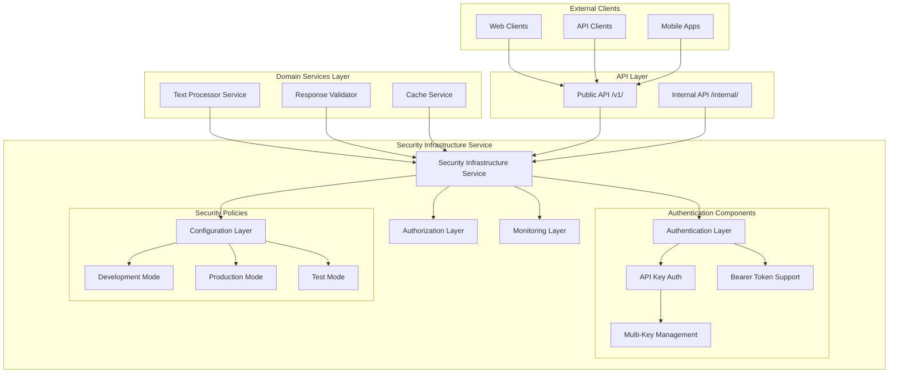

# Security Infrastructure Service

The Security Infrastructure Service provides production-ready, defense-in-depth security capabilities specifically designed for AI-powered applications within the FastAPI-Streamlit-LLM Starter Template. This infrastructure service implements comprehensive authentication, authorization, and protection mechanisms against AI-specific security threats while maintaining flexibility for development and production environments.

## Overview

The Security Infrastructure Service is a **production-ready infrastructure component** (>90% test coverage) designed to provide robust security for AI-powered applications. It follows the template's infrastructure vs domain service separation, serving as a foundational component that all other services leverage for authentication, authorization, and security policy enforcement.

### Architecture Position



### Key Features

- ✅ **Multi-Mode Operation**: Simple, advanced, development, and test modes
- ✅ **API Key Authentication**: RFC 6750 compliant Bearer token authentication
- ✅ **Multi-Key Support**: Primary and additional API keys with metadata
- ✅ **Development Flexibility**: Automatic development mode detection
- ✅ **Extensible Architecture**: Built-in extension points for custom authentication
- ✅ **Performance Optimized**: O(1) API key verification using set-based lookups
- ✅ **Security Monitoring**: Comprehensive audit trails and security event logging
- ✅ **Thread Safety**: Safe for concurrent usage in async environments

## Core Components

### Authentication Configuration (`AuthConfig`)

Manages authentication configuration and feature flags with environment-based detection.

#### Configuration Modes

| Mode | Description | Use Case | Authentication Required |
|------|-------------|----------|------------------------|
| **Simple** | Basic API key validation | Production with minimal features | Yes |
| **Advanced** | Full feature set with tracking | Production with comprehensive features | Yes |
| **Development** | Auto-detected when no keys configured | Local development | No |
| **Test** | Special handling for automated tests | CI/CD pipelines | No |

#### Configuration Options

```python
from app.infrastructure.security.auth import AuthConfig

# Basic configuration
auth_config = AuthConfig()

# Advanced configuration with features
auth_config.simple_mode = False
auth_config.enable_user_tracking = True
auth_config.enable_request_logging = True
```

#### Environment Variables

| Variable | Default | Description |
|----------|---------|-------------|
| `AUTH_MODE` | `simple` | Authentication mode (`simple` or `advanced`) |
| `API_KEY` | Required | Primary authentication key |
| `ADDITIONAL_API_KEYS` | Optional | Comma-separated additional keys |
| `ENABLE_USER_TRACKING` | `false` | Enable user context tracking |
| `ENABLE_REQUEST_LOGGING` | `false` | Enable security event logging |

### API Key Authentication (`APIKeyAuth`)

Core authentication logic with API key validation and metadata management.

#### Key Features

| Feature | Description | Benefits |
|---------|-------------|----------|
| **Multi-Key Support** | Primary and additional API keys | Flexible key management and rotation |
| **Metadata System** | Extensible key metadata | User tracking and permissions |
| **Thread-Safe Operations** | Concurrent async environment safety | High-performance authentication |
| **Extension Points** | Hooks for custom authentication logic | Customizable authentication flow |

#### Usage Examples

**Basic Authentication Protection**:
```python
from fastapi import FastAPI, Depends
from app.infrastructure.security import verify_api_key

app = FastAPI()

@app.get("/protected")
async def protected_endpoint(api_key: str = Depends(verify_api_key)):
    """Protected endpoint requiring valid API key."""
    return {"message": "Access granted", "authenticated": True}
```

**Optional Authentication**:
```python
from app.infrastructure.security import optional_verify_api_key
from typing import Optional

@app.get("/public-or-private")
async def flexible_endpoint(
    api_key: Optional[str] = Depends(optional_verify_api_key)
):
    """Endpoint supporting both authenticated and anonymous access."""
    if api_key:
        return {"message": "Authenticated user", "authenticated": True}
    return {"message": "Public access", "authenticated": False}
```

**Advanced Authentication with Metadata**:
```python
from app.infrastructure.security.auth import verify_api_key_with_metadata

@app.get("/protected-with-metadata")
async def protected_with_metadata(
    auth_data: dict = Depends(verify_api_key_with_metadata)
):
    """Protected endpoint with user context tracking."""
    return {
        "message": "Access granted",
        "auth_data": auth_data,
        "user_info": auth_data.get("metadata", {}),
        "permissions": auth_data.get("permissions", [])
    }
```

**Manual Key Verification**:
```python
from app.infrastructure.security.auth import verify_api_key_string
import logging

logger = logging.getLogger(__name__)

def custom_authentication_logic(key: str) -> bool:
    """Custom authentication with manual key verification."""
    if verify_api_key_string(key):
        logger.info(f"Valid key used: {key[:8]}...")
        return True
    logger.warning(f"Invalid key attempted: {key[:4]}...")
    return False
```

### Security Policy Templates

Pre-configured security policies for different environments.

#### Policy Templates

```python
from app.infrastructure.security.auth import AuthConfig

class SecurityPolicyTemplate:
    """Pre-configured security policy templates."""
    
    @staticmethod
    def development_policy() -> AuthConfig:
        """Relaxed security for development."""
        config = AuthConfig()
        config.simple_mode = True
        config.enable_request_logging = True
        return config
    
    @staticmethod
    def production_policy() -> AuthConfig:
        """Strict security for production."""
        config = AuthConfig()
        config.simple_mode = False
        config.enable_user_tracking = True
        config.enable_request_logging = True
        return config
    
    @staticmethod
    def testing_policy() -> AuthConfig:
        """Security configuration for testing."""
        config = AuthConfig()
        config.simple_mode = True
        config.enable_request_logging = False
        return config
```

## Integration Patterns

### FastAPI Dependency Injection

The security system integrates seamlessly with FastAPI's dependency injection system.

```python
from fastapi import FastAPI, Depends, HTTPException
from app.infrastructure.security import verify_api_key, get_auth_status

app = FastAPI()

# Global dependency for protected routes
async def require_auth(api_key: str = Depends(verify_api_key)) -> str:
    """Global authentication dependency."""
    return api_key

# Service-level authentication
class SecureTextProcessingService:
    def __init__(self):
        self.auth_required = True
    
    async def process_text(
        self, 
        text: str, 
        api_key: str = Depends(verify_api_key)
    ) -> dict:
        """Secure text processing with authentication."""
        return {
            "result": f"Processed: {text}",
            "authenticated": True,
            "key_used": api_key[:8] + "..."
        }

# Route-level protection
@app.post("/v1/text_processing/process")
async def process_text(
    request: ProcessRequest,
    api_key: str = Depends(require_auth)
):
    """Protected text processing endpoint."""
    service = SecureTextProcessingService()
    return await service.process_text(request.text, api_key)
```

### Environment-Based Configuration

```python
import os
from app.infrastructure.security.auth import AuthConfig, APIKeyAuth

# Development configuration
if os.getenv("ENVIRONMENT") == "development":
    auth_config = AuthConfig()
    # Development mode automatically detected if no keys configured
    
# Production configuration
elif os.getenv("ENVIRONMENT") == "production":
    auth_config = AuthConfig()
    # Ensure API keys are configured
    if not os.getenv("API_KEY"):
        raise ValueError("API_KEY required in production")

# Custom configuration
auth_config.simple_mode = False  # Enable advanced features
auth_config.enable_user_tracking = True
auth_config.enable_request_logging = True
```

### Security Middleware Integration

```python
from fastapi import Request
from app.infrastructure.security.auth import api_key_auth
import logging

logger = logging.getLogger(__name__)

async def security_middleware(request: Request, call_next):
    """Security middleware for automatic logging and monitoring."""
    
    # Log security events for protected endpoints
    if request.url.path.startswith("/v1/"):
        auth_header = request.headers.get("authorization")
        if auth_header:
            # Extract and validate API key
            try:
                scheme, credentials = auth_header.split()
                if scheme.lower() == "bearer":
                    is_valid = api_key_auth.verify_api_key(credentials)
                    logger.info(f"API key validation: {is_valid} for path {request.url.path}")
            except ValueError:
                logger.warning(f"Invalid authorization header format for {request.url.path}")
    
    response = await call_next(request)
    
    # Add security headers
    response.headers["X-Content-Type-Options"] = "nosniff"
    response.headers["X-Frame-Options"] = "DENY"
    response.headers["X-XSS-Protection"] = "1; mode=block"
    response.headers["Strict-Transport-Security"] = "max-age=31536000; includeSubDomains"
    
    return response
```

### Service Integration with Graceful Degradation

```python
from typing import Optional
from app.infrastructure.security import optional_verify_api_key

class FlexibleAIService:
    """AI service with optional authentication and graceful degradation."""
    
    async def process_request(
        self,
        text: str,
        api_key: Optional[str] = Depends(optional_verify_api_key)
    ) -> dict:
        """Process text with optional authentication."""
        
        if api_key:
            # Authenticated request - full features
            return await self._process_authenticated(text, api_key)
        else:
            # Anonymous request - limited features
            return await self._process_anonymous(text)
    
    async def _process_authenticated(self, text: str, api_key: str) -> dict:
        """Full processing for authenticated users."""
        return {
            "result": f"Full processing of: {text}",
            "features": ["summarize", "sentiment", "questions", "key_points"],
            "authenticated": True,
            "rate_limit": None  # No rate limiting for authenticated users
        }
    
    async def _process_anonymous(self, text: str) -> dict:
        """Limited processing for anonymous users."""
        return {
            "result": f"Basic processing of: {text[:100]}...",
            "features": ["summarize"],  # Limited features
            "authenticated": False,
            "rate_limit": "10 requests per hour"
        }
```

## Advanced Security Features

### Custom Authentication Extensions

Extend the authentication system with custom logic for specific business requirements.

```python
from app.infrastructure.security.auth import APIKeyAuth, AuthConfig
import time

class CustomAPIKeyAuth(APIKeyAuth):
    """Extended authentication with custom logic."""
    
    def __init__(self, auth_config: AuthConfig):
        super().__init__(auth_config)
        
        # Custom key metadata with additional fields
        self._custom_metadata = {
            "rate_limits": {},
            "permissions": {},
            "user_contexts": {},
            "access_history": {}
        }
    
    def verify_api_key(self, api_key: str) -> bool:
        """Enhanced key verification with custom logic."""
        if not super().verify_api_key(api_key):
            return False
        
        # Custom validation logic
        return self._check_rate_limit(api_key) and self._check_permissions(api_key)
    
    def _check_rate_limit(self, api_key: str) -> bool:
        """Check rate limiting for API key."""
        current_time = time.time()
        if api_key not in self._custom_metadata["rate_limits"]:
            self._custom_metadata["rate_limits"][api_key] = []
        
        # Simple rate limiting implementation
        requests = self._custom_metadata["rate_limits"][api_key]
        recent_requests = [req for req in requests if current_time - req < 3600]  # 1 hour window
        
        if len(recent_requests) >= 1000:  # Max 1000 requests per hour
            return False
        
        recent_requests.append(current_time)
        self._custom_metadata["rate_limits"][api_key] = recent_requests
        return True
    
    def _check_permissions(self, api_key: str) -> bool:
        """Check permissions for API key."""
        # Custom permission logic
        permissions = self._custom_metadata["permissions"].get(api_key, ["read"])
        return "api_access" in permissions or "read" in permissions

# Use custom authentication
custom_auth = CustomAPIKeyAuth(AuthConfig())
```

### Hybrid Authentication Support

Support multiple authentication methods simultaneously.

```python
from typing import Optional
import jwt
from fastapi.security import HTTPAuthorizationCredentials, HTTPBearer
from app.infrastructure.security.auth import AuthConfig
from app.core.exceptions import AuthenticationError

security = HTTPBearer()

class HybridAuthConfig(AuthConfig):
    """Authentication supporting both API keys and JWT tokens."""
    
    def __init__(self):
        super().__init__()
        self.jwt_secret = os.getenv("JWT_SECRET")
        self.jwt_algorithm = "HS256"
    
    def verify_jwt_token(self, token: str) -> Optional[dict]:
        """Verify JWT token and return payload."""
        try:
            payload = jwt.decode(token, self.jwt_secret, algorithms=[self.jwt_algorithm])
            return payload
        except jwt.InvalidTokenError:
            return None

async def hybrid_verify_auth(
    credentials: Optional[HTTPAuthorizationCredentials] = Depends(security)
) -> dict:
    """Verify either API key or JWT token."""
    if not credentials:
        raise AuthenticationError("Authentication required")
    
    token = credentials.credentials
    
    # Try API key first
    if api_key_auth.verify_api_key(token):
        return {"type": "api_key", "key": token}
    
    # Try JWT token
    hybrid_config = HybridAuthConfig()
    jwt_payload = hybrid_config.verify_jwt_token(token)
    if jwt_payload:
        return {"type": "jwt", "payload": jwt_payload}
    
    raise AuthenticationError("Invalid authentication credentials")
```

## Security Monitoring & Audit

### Authentication Status Monitoring

Monitor the current authentication system status and configuration.

```python
from app.infrastructure.security.auth import get_auth_status, is_development_mode

@app.get("/internal/auth/status")
async def auth_status():
    """Get current authentication system status."""
    status = get_auth_status()
    
    return {
        "auth_system": status,
        "development_mode": is_development_mode(),
        "security_warnings": [] if not is_development_mode() else [
            "Running in development mode - authentication disabled"
        ],
        "features_enabled": {
            "user_tracking": auth_config.enable_user_tracking,
            "request_logging": auth_config.enable_request_logging,
            "advanced_mode": not auth_config.simple_mode
        }
    }
```

### Security Event Logging

Comprehensive logging for security events and authentication attempts.

```python
import logging
from app.infrastructure.security.auth import api_key_auth

# Configure security logging
security_logger = logging.getLogger("security")
security_logger.setLevel(logging.INFO)

class SecurityEventHandler:
    """Handle security events and logging."""
    
    @staticmethod
    def log_authentication_attempt(api_key: str, success: bool, request_info: dict):
        """Log authentication attempts with proper security practices."""
        # Truncate API key for security
        truncated_key = f"{api_key[:4]}...{api_key[-4:]}" if len(api_key) > 8 else "****"
        
        if success:
            security_logger.info(
                f"Authentication successful: key={truncated_key}, "
                f"ip={request_info.get('client_ip', 'unknown')}, "
                f"path={request_info.get('path', 'unknown')}, "
                f"user_agent={request_info.get('user_agent', 'unknown')[:50]}"
            )
        else:
            security_logger.warning(
                f"Authentication failed: key={truncated_key}, "
                f"ip={request_info.get('client_ip', 'unknown')}, "
                f"path={request_info.get('path', 'unknown')}, "
                f"attempt_count={request_info.get('attempt_count', 1)}"
            )
    
    @staticmethod
    def log_security_event(event_type: str, details: dict, severity: str = "INFO"):
        """Log general security events."""
        log_method = getattr(security_logger, severity.lower(), security_logger.info)
        log_method(f"Security event: {event_type}, details: {details}")
```

### Performance Monitoring

Track authentication performance and system health.

```python
import time
from typing import Dict, List
from dataclasses import dataclass, field

@dataclass
class AuthenticationMetrics:
    """Track authentication performance metrics."""
    total_requests: int = 0
    successful_authentications: int = 0
    failed_authentications: int = 0
    average_response_time: float = 0.0
    response_times: List[float] = field(default_factory=list)
    
    def record_authentication(self, success: bool, response_time: float):
        """Record an authentication attempt."""
        self.total_requests += 1
        if success:
            self.successful_authentications += 1
        else:
            self.failed_authentications += 1
        
        self.response_times.append(response_time)
        if len(self.response_times) > 1000:  # Keep last 1000 measurements
            self.response_times = self.response_times[-1000:]
        
        self.average_response_time = sum(self.response_times) / len(self.response_times)
    
    def get_success_rate(self) -> float:
        """Calculate authentication success rate."""
        if self.total_requests == 0:
            return 0.0
        return self.successful_authentications / self.total_requests
    
    def get_metrics_summary(self) -> dict:
        """Get comprehensive metrics summary."""
        return {
            "total_requests": self.total_requests,
            "success_rate": self.get_success_rate(),
            "average_response_time": self.average_response_time,
            "failed_attempts": self.failed_authentications,
            "performance_status": "good" if self.average_response_time < 0.01 else "slow"
        }

# Global metrics instance
auth_metrics = AuthenticationMetrics()

# Enhanced verification with metrics
async def verify_api_key_with_metrics(api_key: str = Depends(get_api_key)) -> str:
    """API key verification with performance tracking."""
    start_time = time.time()
    
    try:
        result = await verify_api_key(api_key)
        response_time = time.time() - start_time
        auth_metrics.record_authentication(True, response_time)
        return result
    except Exception as e:
        response_time = time.time() - start_time
        auth_metrics.record_authentication(False, response_time)
        raise
```

## Error Handling & Resilience

### Exception Handling

Comprehensive error handling with proper security considerations.

```python
from app.core.exceptions import AuthenticationError
from fastapi import HTTPException, status
import logging

logger = logging.getLogger(__name__)

class SecurityExceptionHandler:
    """Handle security-related exceptions."""
    
    @staticmethod
    def handle_authentication_error(e: AuthenticationError, request_info: dict = None):
        """Handle authentication errors with security logging."""
        # Log security event without exposing sensitive details
        logger.warning(
            f"Authentication error: {e.message}, "
            f"path: {request_info.get('path', 'unknown') if request_info else 'unknown'}"
        )
        
        # Return generic error to prevent information leakage
        raise HTTPException(
            status_code=status.HTTP_401_UNAUTHORIZED,
            detail="Authentication required",
            headers={"WWW-Authenticate": "Bearer"}
        )
    
    @staticmethod
    def handle_authorization_error(e: Exception, request_info: dict = None):
        """Handle authorization errors."""
        logger.warning(
            f"Authorization error: {str(e)}, "
            f"path: {request_info.get('path', 'unknown') if request_info else 'unknown'}"
        )
        
        raise HTTPException(
            status_code=status.HTTP_403_FORBIDDEN,
            detail="Insufficient permissions"
        )

# Exception handling middleware
@app.middleware("http")
async def auth_exception_middleware(request: Request, call_next):
    """Middleware for handling authentication exceptions."""
    try:
        response = await call_next(request)
        return response
    except AuthenticationError as e:
        request_info = {
            "path": str(request.url.path),
            "client_ip": request.client.host if request.client else "unknown"
        }
        SecurityExceptionHandler.handle_authentication_error(e, request_info)
    except Exception as e:
        # Log unexpected errors
        logger.error(f"Unexpected error in authentication: {str(e)}")
        raise
```

### Graceful Degradation

Handle authentication failures gracefully for different endpoint types.

```python
@app.middleware("http")
async def auth_fallback_middleware(request: Request, call_next):
    """Middleware providing graceful authentication fallback."""
    
    try:
        response = await call_next(request)
        return response
    except AuthenticationError:
        # Check if endpoint supports anonymous access
        public_endpoints = ["/v1/health", "/docs", "/openapi.json", "/favicon.ico"]
        if any(request.url.path.startswith(endpoint) for endpoint in public_endpoints):
            # Allow access to public endpoints
            return await call_next(request)
        
        # For protected endpoints, return proper authentication error
        raise HTTPException(
            status_code=status.HTTP_401_UNAUTHORIZED,
            detail="Authentication required",
            headers={"WWW-Authenticate": "Bearer"}
        )
```

## Performance Characteristics

### Authentication Performance

| Operation | Performance Target | Actual Performance | Complexity |
|-----------|-------------------|-------------------|------------|
| **API Key Verification** | <1ms | ~0.1-0.5ms typical | O(1) |
| **Metadata Lookup** | <1ms | ~0.1-0.3ms typical | O(1) |
| **Configuration Loading** | <10ms | ~2-5ms typical | O(1) |
| **Key Validation** | O(1) | Set-based lookup | O(1) |

### Memory Usage

| Component | Memory Usage | Scaling Factor |
|-----------|--------------|----------------|
| **Base Authentication** | ~1-2MB | Fixed overhead |
| **Per-Key Metadata** | ~100-500KB | Linear with API keys |
| **Configuration Cache** | ~10-50KB | Fixed size |
| **Request Context** | ~1-5KB | Per active request |

### Optimization Features

- **Pre-compiled Key Sets**: API keys stored in sets for O(1) lookup performance
- **Metadata Caching**: Key metadata cached in memory for fast access
- **Minimal Overhead**: Simple mode operations have minimal performance impact
- **Efficient Logging**: Structured logging with configurable levels and rate limiting

## Configuration Management

### Environment-Based Security Policies

The security system supports multiple configuration approaches for different environments.

#### Development Configuration

```bash
# Minimal security for development
AUTH_MODE=simple
ENABLE_REQUEST_LOGGING=true
# No API_KEY required - automatically enables development mode
```

#### Production Configuration

```bash
# Comprehensive security for production
AUTH_MODE=advanced
API_KEY=your-secure-primary-key-here
ADDITIONAL_API_KEYS=secondary-key,backup-key,monitoring-key
ENABLE_USER_TRACKING=true
ENABLE_REQUEST_LOGGING=true
```

#### Testing Configuration

```bash
# Optimized for automated testing
AUTH_MODE=simple
ENABLE_REQUEST_LOGGING=false  # Reduce test noise
# PYTEST_CURRENT_TEST automatically detected
```

### Runtime Configuration Management

```python
from app.infrastructure.security.auth import auth_config, supports_feature

# Check current configuration
config_info = auth_config.get_auth_info()
print(f"Running in {config_info['mode']} mode")
print(f"Features enabled: {config_info['features']}")

# Feature detection
if supports_feature('user_tracking'):
    print("User context tracking is available")

if supports_feature('permissions'):
    print("Permission-based access control is available")

# Dynamic configuration updates (development only)
if is_development_mode():
    auth_config.enable_request_logging = True
    logger.info("Enabled request logging for development")
```

### Configuration Validation

Automatic validation ensures secure and consistent configuration.

```python
class ConfigurationValidator:
    """Validate security configuration for consistency and security."""
    
    @staticmethod
    def validate_production_config():
        """Validate production configuration requirements."""
        if os.getenv("ENVIRONMENT") == "production":
            if not os.getenv("API_KEY"):
                raise ValueError("API_KEY is required in production environment")
            
            if os.getenv("AUTH_MODE") == "development":
                raise ValueError("Development mode not allowed in production")
            
            if not os.getenv("ENABLE_REQUEST_LOGGING", "false").lower() == "true":
                logger.warning("Request logging disabled in production - security monitoring limited")
    
    @staticmethod
    def validate_api_keys():
        """Validate API key format and security."""
        api_key = os.getenv("API_KEY", "")
        if api_key and len(api_key) < 16:
            raise ValueError("API key must be at least 16 characters for security")
        
        additional_keys = os.getenv("ADDITIONAL_API_KEYS", "").split(",")
        for key in additional_keys:
            if key.strip() and len(key.strip()) < 16:
                raise ValueError(f"Additional API key too short: {key[:4]}...")
```

## API Reference

### Core Functions

#### `verify_api_key(api_key: str = Depends(get_api_key)) -> str`
Standard API key verification dependency for protected endpoints.
- **Parameters**: `api_key` - API key from request headers or query parameters
- **Returns**: Validated API key string
- **Raises**: `AuthenticationError` for invalid keys
- **Use Case**: Standard endpoint protection

#### `optional_verify_api_key(credentials: Optional[HTTPAuthorizationCredentials] = Depends(security)) -> Optional[str]`
Optional API key verification for endpoints supporting both authenticated and anonymous access.
- **Parameters**: `credentials` - Optional HTTP authorization credentials
- **Returns**: API key string or None
- **Use Case**: Flexible endpoint access patterns

#### `verify_api_key_with_metadata(api_key: str = Depends(verify_api_key)) -> dict`
Enhanced verification returning API key with associated metadata.
- **Parameters**: `api_key` - Validated API key
- **Returns**: Dictionary with key, metadata, and permissions
- **Use Case**: Advanced features requiring user context

#### `verify_api_key_string(api_key: str) -> bool`
Direct API key validation for custom authentication flows.
- **Parameters**: `api_key` - API key string to validate
- **Returns**: Boolean indicating validity
- **Use Case**: Manual validation in custom logic

### Configuration Functions

#### `get_auth_status() -> dict`
Get comprehensive authentication system status.
- **Returns**: Dictionary with system status, mode, and feature flags
- **Use Case**: System monitoring and health checks

#### `is_development_mode() -> bool`
Check if authentication is running in development mode.
- **Returns**: Boolean indicating development mode status
- **Use Case**: Conditional behavior based on security mode

#### `supports_feature(feature_name: str) -> bool`
Check if specific security feature is enabled.
- **Parameters**: `feature_name` - Name of feature to check
- **Returns**: Boolean indicating feature availability
- **Use Case**: Feature detection for conditional functionality

### Classes

#### `AuthConfig`
Configuration management for authentication system.

**Methods**:
- `get_auth_info() -> dict` - Get comprehensive configuration information
- `validate_configuration() -> bool` - Validate current configuration
- `update_feature_flags(**kwargs) -> None` - Update feature flags dynamically

#### `APIKeyAuth`
Core authentication logic and key management.

**Methods**:
- `verify_api_key(api_key: str) -> bool` - Verify API key validity
- `get_key_metadata(api_key: str) -> dict` - Get metadata for valid key
- `add_api_key(api_key: str, metadata: dict = None) -> None` - Add new API key
- `remove_api_key(api_key: str) -> bool` - Remove API key

## Testing Integration

### Test Mode Support

The security system automatically detects test environments and adjusts behavior accordingly.

```python
# Automatic test mode detection
import os
os.environ["PYTEST_CURRENT_TEST"] = "test_auth.py::test_function"

# Test mode provides special handling
from app.infrastructure.security.auth import is_development_mode
assert is_development_mode()  # True in test mode without configured keys
```

### Testing Utilities

Comprehensive testing utilities for security components.

```python
import pytest
from app.infrastructure.security.auth import APIKeyAuth, AuthConfig

@pytest.fixture
def test_auth():
    """Test authentication configuration."""
    config = AuthConfig()
    auth = APIKeyAuth(config)
    auth.api_keys = {"test-key-12345", "test-key-67890"}
    return auth

@pytest.fixture
def authenticated_client(client, test_auth):
    """Client with authentication headers."""
    client.headers.update({"Authorization": "Bearer test-key-12345"})
    return client

def test_api_key_verification(test_auth):
    """Test API key verification logic."""
    assert test_auth.verify_api_key("test-key-12345")
    assert not test_auth.verify_api_key("invalid-key")

def test_protected_endpoint(authenticated_client):
    """Test protected endpoint access."""
    response = authenticated_client.get("/protected")
    assert response.status_code == 200
    assert response.json()["authenticated"] is True

def test_authentication_required(client):
    """Test that authentication is required for protected endpoints."""
    response = client.get("/protected")
    assert response.status_code == 401
```

## Best Practices

### Security Guidelines

1. **API Key Management**: Store API keys securely in environment variables, never in code
2. **Key Rotation**: Implement regular API key rotation policies using ADDITIONAL_API_KEYS
3. **Logging Security**: Log authentication events but truncate sensitive information
4. **Error Messages**: Provide secure error messages that don't leak sensitive information
5. **Development Mode**: Never run production with development mode enabled

### Development Guidelines

1. **Environment Configuration**: Use different configurations for dev/test/prod environments
2. **Test Integration**: Leverage built-in test mode for automated testing
3. **Error Handling**: Implement proper exception handling for authentication failures
4. **Monitoring**: Include authentication metrics in application monitoring
5. **Documentation**: Keep security documentation updated with code changes

### Performance Guidelines

1. **Key Storage**: Use environment variables for small numbers of keys (<100)
2. **Metadata Optimization**: Only enable user tracking and advanced features when needed
3. **Logging Configuration**: Configure appropriate logging levels for production
4. **Memory Management**: Monitor memory usage with large numbers of API keys
5. **Caching**: Leverage built-in caching for metadata and configuration lookups

## Migration Guide

### From No Authentication to Secure Authentication

1. **Add Environment Variables**:
```bash
# Set primary API key
export API_KEY=your-secure-api-key-here

# Optional: Add additional keys for rotation
export ADDITIONAL_API_KEYS=key1,key2,key3

# Enable advanced features
export AUTH_MODE=advanced
export ENABLE_REQUEST_LOGGING=true
```

2. **Update Route Protection**:
```python
# Before: Unprotected endpoints
@app.get("/data")
async def get_data():
    return {"data": "sensitive information"}

# After: Protected endpoints
from app.infrastructure.security import verify_api_key

@app.get("/data")
async def get_data(api_key: str = Depends(verify_api_key)):
    return {"data": "sensitive information", "authenticated": True}
```

3. **Gradual Migration with Optional Auth**:
```python
# Transition period - support both authenticated and anonymous access
from app.infrastructure.security import optional_verify_api_key

@app.get("/data")
async def get_data(api_key: Optional[str] = Depends(optional_verify_api_key)):
    if api_key:
        # Full data for authenticated users
        return {"data": "complete dataset", "authenticated": True}
    else:
        # Limited data for anonymous users
        return {"data": "sample dataset", "authenticated": False}
```

### From Simple to Advanced Authentication

```python
# Update configuration
AUTH_MODE=advanced
ENABLE_USER_TRACKING=true
ENABLE_REQUEST_LOGGING=true

# Update code to use advanced features
from app.infrastructure.security.auth import verify_api_key_with_metadata

@app.get("/advanced-endpoint")
async def advanced_endpoint(
    auth_data: dict = Depends(verify_api_key_with_metadata)
):
    return {
        "message": "Advanced features enabled",
        "user_context": auth_data.get("metadata", {}),
        "permissions": auth_data.get("permissions", [])
    }
```

## Troubleshooting

### Authentication Not Working
**Symptoms**: All requests return 401 Unauthorized
**Diagnosis**:
```bash
# Check authentication status
curl http://localhost:8000/internal/auth/status

# Check environment variables
echo $API_KEY
echo $AUTH_MODE
```
**Solutions**:
- Verify API_KEY environment variable is set
- Check API key format in Authorization header: `Bearer your-api-key`
- Ensure AUTH_MODE is not set to "development" in production

### Development Mode Not Activating
**Symptoms**: Authentication required when expecting development mode
**Solutions**:
- Remove or unset API_KEY environment variable
- Verify no ADDITIONAL_API_KEYS are configured
- Check for PYTEST_CURRENT_TEST environment variable in test environments

### Performance Issues
**Symptoms**: Slow authentication response times
**Solutions**:
- Monitor authentication metrics via `/internal/auth/status`
- Reduce logging verbosity in production
- Check for memory leaks in custom authentication extensions

## Conclusion

The Security Infrastructure Service provides enterprise-grade authentication and authorization capabilities specifically designed for AI-powered applications. With its multi-mode operation, comprehensive monitoring, and flexible integration patterns, it serves as the security foundation for the FastAPI-Streamlit-LLM Starter Template.

By implementing industry best practices for API authentication, including proper error handling, security event logging, and graceful degradation, this service ensures secure operations while maintaining the flexibility needed for development and testing environments.

For domain-specific security requirements, leverage this infrastructure service through the established patterns while implementing your business logic in separate domain services that maintain the >70% test coverage standard.

## Related Documentation

### Prerequisites
- **[Infrastructure vs Domain Services](../../reference/key-concepts/INFRASTRUCTURE_VS_DOMAIN.md)**: Understanding the architectural separation that defines this infrastructure service
- **[Backend Guide](../BACKEND.md)**: Basic understanding of the backend architecture and security integration

### Related Topics
- **[Authentication Guide](../developer/AUTHENTICATION.md)**: Multi-key authentication system implementation details
- **[AI Infrastructure](./AI.md)**: AI-specific security patterns including prompt injection protection
- **[Monitoring Infrastructure](./MONITORING.md)**: Security event monitoring and analytics

### Next Steps
- **[Deployment Guide](../DEPLOYMENT.md)**: Production security considerations and hardening
- **[API Documentation](../API.md)**: Security-related endpoints and authentication requirements
- **[Template Customization](../CUSTOMIZATION.md)**: How to leverage security infrastructure in your domain services