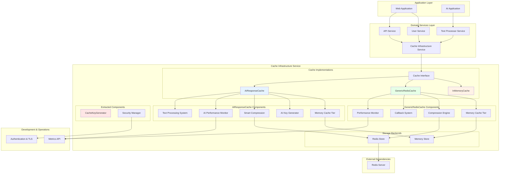
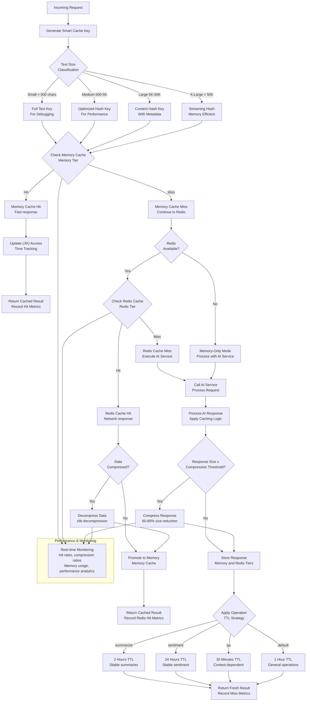

# Cache Infrastructure Service

The Cache Infrastructure Service provides production-ready, multi-tiered caching capabilities specifically optimized for AI response caching within the FastAPI-Streamlit-LLM Starter Template. This infrastructure service implements intelligent caching strategies, comprehensive monitoring, and graceful degradation to ensure optimal performance and reliability.

## Overview

The Cache Infrastructure Service is a **production-ready infrastructure component** (>90% test coverage) designed to dramatically improve response times and reduce AI service costs through intelligent caching. It follows the template's infrastructure vs domain service separation, serving as a foundational component that domain services leverage for performance optimization.

**Quick Start**: New to cache configuration? Start with the [Cache Usage Guide](./usage-guide.md) for step-by-step implementation examples.

## Security-First Architecture

### Built-In Security by Default

**Security is not optional - it's foundational and always enabled.**

All Redis cache implementations in this template follow a **security-first design philosophy**:

- ✅ **TLS Encryption Mandatory**: All Redis connections use encrypted `rediss://` protocol (port 6380)
- ✅ **Application-Layer Encryption**: All cached data encrypted at rest using Fernet (AES-128-CBC + HMAC)
- ✅ **Strong Authentication**: Password authentication required for all Redis connections
- ✅ **Fail-Fast Validation**: Application refuses to start in production without proper security
- ✅ **Environment-Aware Enforcement**: Security automatically adapts to deployment context

This eliminates configuration complexity, prevents accidental insecure deployments, and creates a robust foundation for production systems.

### Three-Layer Security Model

```
┌─────────────────────────────────────────────────────────┐
│  Layer 1: Startup Security Validation                  │
│  • Environment-aware enforcement                        │
│  • Fail-fast design with clear error messages          │
│  • Automatic security configuration validation         │
└────────────────┬────────────────────────────────────────┘
                 │
┌────────────────▼────────────────────────────────────────┐
│  Layer 2: TLS Transport Security                       │
│  • TLS 1.2+ (development) / TLS 1.3 (production)       │
│  • Certificate-based authentication (4096-bit RSA)      │
│  • Password authentication required                     │
│  • Protected mode and network isolation                │
└────────────────┬────────────────────────────────────────┘
                 │
┌────────────────▼────────────────────────────────────────┐
│  Layer 3: Application-Layer Encryption                 │
│  • Fernet encryption (AES-128 in CBC mode)             │
│  • Transparent encrypt/decrypt operations               │
│  • HMAC authentication for data integrity               │
│  • Mandatory encryption keys (never optional)           │
└─────────────────────────────────────────────────────────┘
```

### Quick Secure Setup

**One-Command Development Setup:**
```bash
# Generate TLS certificates, keys, and start secure Redis
./scripts/setup-secure-redis.sh

# Application automatically uses secure connection
export REDIS_URL="rediss://localhost:6380"
export REDIS_PASSWORD="<generated-password>"
export REDIS_ENCRYPTION_KEY="<generated-key>"
make run-backend
```

**Production Security Configuration:**
```bash
# Set production security environment
export NODE_ENV=production
export REDIS_URL="rediss://production-redis:6380"
export REDIS_PASSWORD="${SECURE_PASSWORD}"  # 48+ characters
export REDIS_ENCRYPTION_KEY="${GENERATED_KEY}"  # Fernet key
export REDIS_TLS_ENABLED=true
export REDIS_TLS_CERT_REQS=required
export REDIS_TLS_PROTOCOLS="TLSv1.3"

# Application validates security at startup
python -m app.main
# ✅ Production environment detected
# ✅ Secure Redis connection validated (TLS + Auth + Encryption)
# 🚀 Application started successfully
```

**📖 For comprehensive security documentation, see [Redis Cache Security Guide](./security.md).**

### Architecture Position

The cache infrastructure sits at the core of the application's performance optimization strategy, providing caching services to all domain services while maintaining clear architectural boundaries.



## Key Features

### Multi-Tiered Caching Architecture
- **Transparent Multi-Tier Caching**: Optimized performance with automatic tier management
- **Persistent Storage**: Cross-instance data sharing with Redis backend
- **Intelligent Placement**: Automatic tier selection based on access patterns
- **Graceful Degradation**: Memory-only fallback when Redis unavailable

### AI-Optimized Performance
- **Operation-Specific TTLs**: Different expiration strategies per AI operation type
- **Smart Key Generation**: Optimized cache keys for different text sizes and content
- **Text Tier Analysis**: Automatic categorization of text content for optimal caching
- **Response Pattern Recognition**: AI-specific caching patterns and invalidation strategies

### Advanced Compression & Storage
- **Intelligent Compression**: Automatic compression with configurable thresholds
- **Storage Optimization**: Significant reduction in storage requirements
- **Configurable Compression**: Support for multiple compression levels and strategies
- **Memory Efficiency**: Optimized compression for large responses

### Comprehensive Monitoring
- **Performance Analytics**: Detailed cache hit rates, operation timing, and optimization recommendations
- **Memory Usage Tracking**: Real-time monitoring with configurable alerting thresholds
- **Compression Analytics**: Storage savings analysis and compression ratio tracking
- **Pattern Analysis**: Cache invalidation patterns and effectiveness metrics

### Production-Ready Reliability
- **Circuit Breaker Integration**: Protection against cascading failures
- **Connection Pooling**: Efficient Redis connection management
- **Security Features**: Secure key generation without exposing sensitive content

## Core Components Overview

### Cache Interface
**File**: `backend/app/infrastructure/cache/base.py`

The abstract foundation ensuring consistent behavior across all cache implementations. Provides the common contract for `get`, `set`, `delete`, and other cache operations while enabling seamless switching between implementation types.

**Key Benefits**:
- Dependency injection compatibility
- Type safety with proper async patterns
- Consistent API across memory and Redis implementations
- Testing flexibility with mock implementations

### InMemoryCache
**File**: `backend/app/infrastructure/cache/memory.py`

Lightweight, fast in-memory caching perfect for development, testing, and Redis fallback scenarios. Features automatic TTL expiration, LRU eviction, and comprehensive statistics tracking.

**Best For**:
- Development environments
- Testing scenarios
- Redis fallback mode
- Small-scale deployments

### GenericRedisCache
**File**: `backend/app/infrastructure/cache/redis_generic.py`

A clean, production-ready Redis implementation suitable for general-purpose FastAPI applications. Provides memory cache tier, automatic compression, callback systems, and graceful degradation.

**Best For**:
- General web applications
- Session management
- API response caching
- Non-AI specific workloads

### AIResponseCache
**File**: `backend/app/infrastructure/cache/redis_ai.py`

Specialized caching system that **inherits from GenericRedisCache** while adding AI-specific optimizations including smart key generation, operation-specific TTLs, and enhanced monitoring for AI workloads.

**Best For**:
- AI/ML applications
- LLM response caching
- Text processing pipelines
- High-performance AI services

## Inheritance Architecture Benefits

The cache infrastructure uses a clean inheritance hierarchy that eliminates code duplication while maintaining specialization:

```
CacheInterface (Abstract Base)
├── InMemoryCache (Standalone Implementation)
└── GenericRedisCache (Base Redis Implementation)
    └── AIResponseCache (AI-Specialized Extension)
```

### Architecture Advantages

**Code Reuse**: AIResponseCache inherits all Redis operations, compression, and memory cache management from GenericRedisCache, avoiding duplication of core functionality.

**Clean Specialization**: AI-specific features (key generation, operation TTLs, text tier analysis) are cleanly added without affecting base functionality or duplicating common code.

**Performance Efficiency**: No inheritance overhead - method calls are direct and efficient with full type safety throughout the hierarchy.

**Maintainability**: Improvements to GenericRedisCache automatically benefit AIResponseCache, while AI enhancements don't affect general-purpose caching.

**Feature Inheritance**: AI cache gains all GenericRedisCache features (callbacks, security) plus AI-specific monitoring and analytics.

### Optimization Features

- **Pre-compiled Regex Patterns**: Efficient key generation and validation
- **Connection Pooling**: Efficient Redis connection reuse
- **Batch Operations**: Multiple cache operations in single Redis transaction
- **Streaming Compression**: Memory-efficient handling of large responses
- **Intelligent Eviction**: LRU with access pattern optimization

## Security Considerations

### Data Protection Measures

**Content Hashing**: Sensitive text content is hashed in cache keys using SHA256, ensuring personally identifiable information never appears in cache keys or Redis storage.

**Secure Key Generation**: Cryptographically secure hashing algorithms with consistent, collision-resistant key generation strategies.

**Access Control Integration**: Cache operations respect application authentication and authorization boundaries.

**Network Security**: Support for Redis AUTH, TLS encryption, and private network deployment patterns.

### Implementation Highlights

- Cache keys never expose PII or sensitive content
- Text content over configured thresholds is automatically hashed
- Debugging information preserved for small, non-sensitive text
- Comprehensive audit logging for cache operations
- Support for Redis ACLs and authentication mechanisms

## Quick Start Navigation

### Getting Started (Choose Your Path)

**🔒 Security Setup?** Start with [Redis Cache Security Guide](./security.md) for comprehensive security implementation with TLS, encryption, and authentication.

**📚 New to Caching?** Continue with [Cache Usage Guide](./usage-guide.md) for comprehensive examples and step-by-step implementation.

**⚡ Quick Setup?** Jump to [Cache Configuration Guide](./configuration.md) for rapid environment-based setup with security-first defaults.

**🔧 Advanced Troubleshooting?** Explore [Cache Troubleshooting Guide](./troubleshooting.md) for comprehensive problem-solving strategies including security troubleshooting.

### Implementation Guides

**🏗️ Integration Patterns**: [Cache Usage Guide](./usage-guide.md) provides detailed integration examples with domain services and FastAPI dependency injection.

**⚙️ Configuration Management**: [Configuration Guide](./configuration.md) covers all configuration options, presets, and environment-specific setup patterns.

**🧪 Testing & Development**: [Cache Testing Guide](./testing.md) explains comprehensive testing strategies for cached applications.

### Reference Documentation

**📖 API Reference**: [Cache API Reference](./api-reference.md) contains detailed method documentation and parameter specifications.

**🛠️ Troubleshooting**: [Troubleshooting Guide](./troubleshooting.md) covers development workflows, debugging, and comprehensive problem-solving strategies.

## Multi-Tiered Cache Flow

Understanding how requests flow through the cache tiers helps optimize performance and troubleshoot issues:



### Tier Selection Strategy

**Memory Cache Tier (Hot Data)**:
- Recently accessed responses
- Small to medium-sized responses (< 1MB)
- High-frequency access patterns
- Fast response times

**Redis Cache Tier (Persistent Storage)**:
- All cached responses for persistence
- Large responses with compression
- Cross-instance data sharing
- Network-based response times

**Fallback Behavior**:
- Automatic memory-only mode when Redis unavailable
- Graceful degradation with continued service
- Transparent failover with monitoring alerts

## Configuration Management

### Environment-Based Configuration

The cache infrastructure supports flexible configuration through environment variables and preset systems, leveraging the unified [Environment Detection Service](../../developer/ENVIRONMENT_DETECTION.md) for consistent environment classification:

```bash
# Quick Setup with Presets (Security-First)
CACHE_PRESET=ai-production           # Use AI-optimized production settings
CACHE_REDIS_URL=rediss://redis:6380  # Secure Redis URL (TLS encryption)
REDIS_PASSWORD=<secure-password>     # Redis authentication
REDIS_ENCRYPTION_KEY=<fernet-key>    # Data encryption key
ENABLE_AI_CACHE=true                 # Enable AI-specific features

# Custom Configuration
CACHE_CUSTOM_CONFIG='{"compression_threshold": 500, "memory_cache_size": 200}'
```

### Configuration Presets

| Preset | Use Case | Memory Cache | Compression | TTL Strategy |
|--------|----------|-------------|-------------|--------------|
| **development** | Local development | 50 entries | Minimal | Short TTLs |
| **production** | Production web apps | 100 entries | Balanced | Standard TTLs |
| **ai-production** | AI-heavy workloads | 200 entries | Aggressive | AI-optimized TTLs |
| **minimal** | Resource-constrained | 25 entries | High compression | Extended TTLs |

**Next Steps**:
- See [Redis Cache Security Guide](./security.md) for comprehensive security setup and configuration
- See [Cache Configuration Guide](./configuration.md) for detailed configuration examples and preset-specific guidance

## Cache Instantiation Patterns

### Architectural Decision: Factory vs Direct Instantiation

The cache infrastructure supports two instantiation approaches, each serving different architectural needs:

#### Factory Methods (Recommended Architecture)

**Factory methods provide production-ready defaults and comprehensive validation** for most application scenarios:

```python
from app.infrastructure.cache import CacheFactory

factory = CacheFactory()

# Environment-optimized cache creation
web_cache = await factory.for_web_app()      # Web applications
ai_cache = await factory.for_ai_app()        # AI/ML workloads
test_cache = await factory.for_testing()     # Testing scenarios
```

**Architectural Benefits:**
- **Separation of Concerns**: Configuration logic separated from application logic
- **Environment Consistency**: Standardized configurations across deployment environments
- **Security by Default**: Built-in security configuration and validation
- **Error Resilience**: Automatic fallback strategies and graceful degradation
- **Operational Excellence**: Comprehensive monitoring and performance analytics

#### Direct Instantiation (Specialized Architecture)

**Direct instantiation provides fine-grained control** for specialized architectural requirements:

```python
from app.infrastructure.cache import AIResponseCache, GenericRedisCache

# Custom cache implementation with specific architectural needs
cache = AIResponseCache(
    redis_url="redis://specialized-cluster:6380",
    custom_serialization_strategy=specialized_serializer,
    advanced_monitoring=custom_monitor,
    specialized_compression_algorithms=custom_compressor
)
```

**Architectural Use Cases:**
- **Custom Infrastructure Integration**: Specialized monitoring, security, or networking requirements
- **Performance-Critical Paths**: Optimized configurations for specific performance profiles
- **Framework Development**: Building reusable cache components or abstractions
- **System Integration**: Maintaining compatibility with existing infrastructure patterns

### Production Architecture Recommendations

**For Production Systems:**
1. **Use factory methods** for 90% of cache implementations
2. **Implement infrastructure-level configuration** through preset systems
3. **Reserve direct instantiation** for specialized architectural requirements
4. **Follow security-first principles** with built-in security configuration validation
5. **Design for observability** with comprehensive monitoring and metrics collection

**For Development and Testing:**
1. **Use factory testing methods** for consistent test environments
2. **Leverage preset configurations** for rapid development iteration
3. **Implement cache-aware testing patterns** for reliable test isolation

### Implementation Strategies

**Adopting Factory Patterns:**
- **Step 1**: Identify existing direct instantiation usage patterns
- **Step 2**: Map current configurations to appropriate factory methods
- **Step 3**: Implement factory-based instantiation with configuration validation
- **Step 4**: Retire direct instantiation for standard use cases

**📖 For detailed implementation patterns and comprehensive examples, see [Cache Usage Guide](./usage-guide.md).**

## Integration with Infrastructure Services

The Cache Infrastructure Service integrates seamlessly with other infrastructure components to provide comprehensive application support:

### Monitoring Integration
- **Cache Performance Monitoring**: Real-time metrics via [Monitoring Infrastructure](../MONITORING.md)
- **Health Checks**: Cache status monitoring and alerting
- **Performance Analytics**: Integration with system-wide monitoring dashboards

### Resilience Integration  
- **Circuit Breaker Support**: Automatic failure detection via [Resilience Infrastructure](../RESILIENCE.md)
- **Graceful Degradation**: Fallback patterns for cache failures
- **Retry Logic**: Intelligent retry strategies for transient failures

### Security Integration
- **Access Control**: Integration with authentication systems via [Security Infrastructure](../SECURITY.md)
- **Data Protection**: Secure key generation and PII handling
- **Network Security**: TLS and authentication support for Redis connections

## Best Practices & Guidelines

### Cache Strategy Guidelines

**TTL Configuration**:
- **Stable operations** (summarize, sentiment): 2+ hours for consistent results
- **Context-dependent operations** (Q&A, analysis): 30 minutes to 1 hour
- **Development environments**: 5-10 minutes for rapid iteration
- **Configuration data**: 10+ minutes depending on update frequency

**Memory Management**:
- **High-memory environments**: 200-500 memory cache entries
- **Standard environments**: 100-200 entries  
- **Memory-constrained**: 25-50 entries with aggressive compression
- **Monitor usage**: Set alerts at 50MB warning, 100MB critical

### Performance Optimization

**Target Metrics**:
- **Cache Hit Rate**: Aim for >70% (excellent: >80%)
- **Key Generation Time**: Efficient key processing
- **Memory Usage**: Monitor growth trends and set appropriate thresholds
- **Compression Efficiency**: Significant storage savings for cached responses

**Optimization Techniques**:
- Use consistent text preprocessing for better cache hits
- Configure compression thresholds based on response patterns
- Monitor and adjust TTL strategies based on content stability
- Implement proper error handling for cache failures

### Development Guidelines

**Environment Setup**:
- Use development presets for local work
- Enable memory-only mode for unit testing
- Configure short TTLs for rapid iteration
- Mock cache implementations for isolated testing

**Production Deployment**:
- Use production or ai-production presets
- Enable comprehensive monitoring and alerting
- Configure Redis clustering for high availability

## Troubleshooting Quick Reference

### Common Issues & Solutions

**Low Cache Hit Rates** (<50%):
- Verify text preprocessing consistency
- Review key generation patterns  
- Check TTL configuration appropriateness
- Monitor for cache invalidation patterns

**High Memory Usage**:
- Enable or increase compression thresholds
- Reduce memory cache size settings
- Implement more aggressive TTL policies
- Review response size patterns

**Redis Connection Issues**:
- Verify Redis URL configuration
- Check network connectivity and authentication
- Review Redis server logs for errors
- Confirm graceful degradation to memory-only mode

**Performance Issues**:
- Monitor key generation timing
- Review compression settings vs performance trade-offs
- Check for Redis connection pooling efficiency
- Analyze cache tier access patterns

**Next Steps**: For detailed troubleshooting procedures, see [Cache Troubleshooting Guide](./troubleshooting.md).

## Related Documentation

### Prerequisites
- **[Infrastructure vs Domain Services](../../reference/key-concepts/INFRASTRUCTURE_VS_DOMAIN.md)**: Understanding the architectural separation that defines this infrastructure service
- **[Dual API Architecture](../../reference/key-concepts/DUAL_API_ARCHITECTURE.md)**: How cache integrates with the dual API design pattern
- **[Backend Guide](../BACKEND.md)**: Basic understanding of the backend architecture and service integration

### Cache Documentation Suite
- **[Redis Cache Security Guide](./security.md)**: Security-first Redis architecture with TLS, encryption, and authentication
- **[Cache Usage Guide](./usage-guide.md)**: Comprehensive implementation examples and integration patterns
- **[Cache API Reference](./api-reference.md)**: Detailed method documentation and parameter specifications
- **[Cache Configuration Guide](./configuration.md)**: Configuration management, environment setup, and preset system with security defaults
- **[Cache Testing Guide](./testing.md)**: Testing strategies and development workflow guidance
- **[Cache Troubleshooting Guide](./troubleshooting.md)**: Development workflows, debugging, and security troubleshooting strategies

### Related Infrastructure Services
- **[AI Infrastructure](../AI.md)**: AI service integration that benefits from intelligent response caching
- **[Monitoring Infrastructure](../MONITORING.md)**: Comprehensive monitoring that includes cache performance analytics
- **[Resilience Infrastructure](../RESILIENCE.md)**: Fault tolerance patterns that complement cache reliability
- **[Security Infrastructure](../SECURITY.md)**: Security patterns that integrate with cache data protection

### Developer Resources
- **[Code Standards](../developer/CODE_STANDARDS.md)**: Standardized patterns and architectural guidelines for cache integration
- **[Authentication Guide](../developer/AUTHENTICATION.md)**: Authentication systems that integrate with cache access control
- **[Performance Optimization](../operations/PERFORMANCE_OPTIMIZATION.md)**: Cache optimization and tuning procedures
- **[Deployment Guide](../DEPLOYMENT.md)**: Production deployment considerations for caching infrastructure

### Template Customization
- **[Template Customization Guide](../CUSTOMIZATION.md)**: How to leverage cache infrastructure in your domain services
- **[API Documentation](../API.md)**: Cache management endpoints available through the internal API

---

**Next Steps**: Ready to implement caching in your application? Start with the [Cache Usage Guide](./usage-guide.md) for step-by-step examples, or jump to [Configuration Guide](./configuration.md) for quick setup.